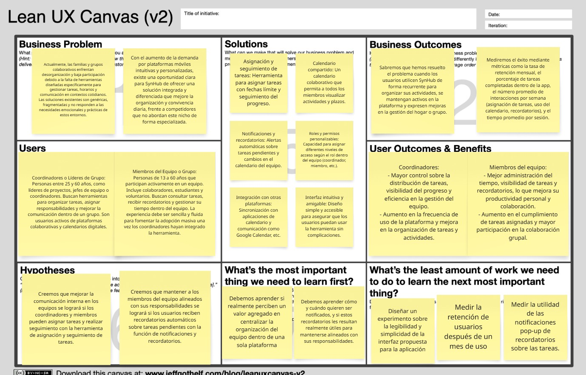
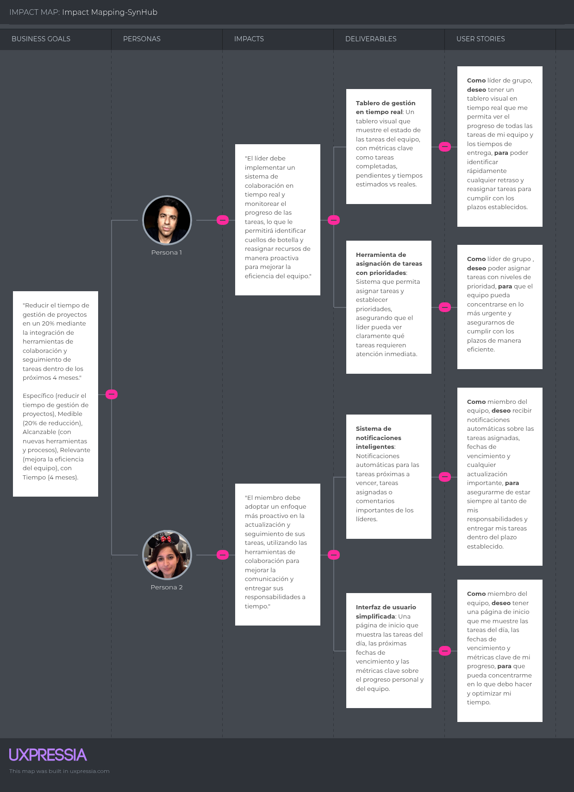
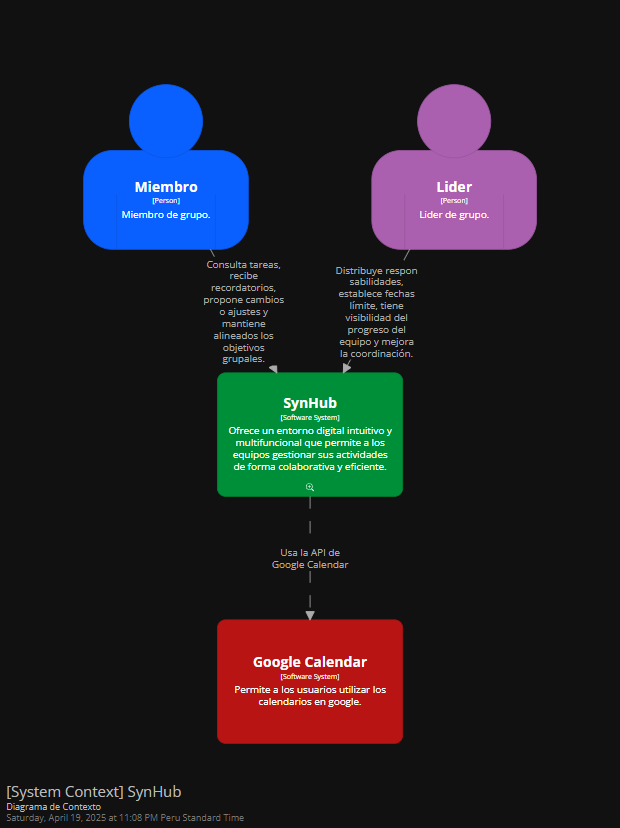
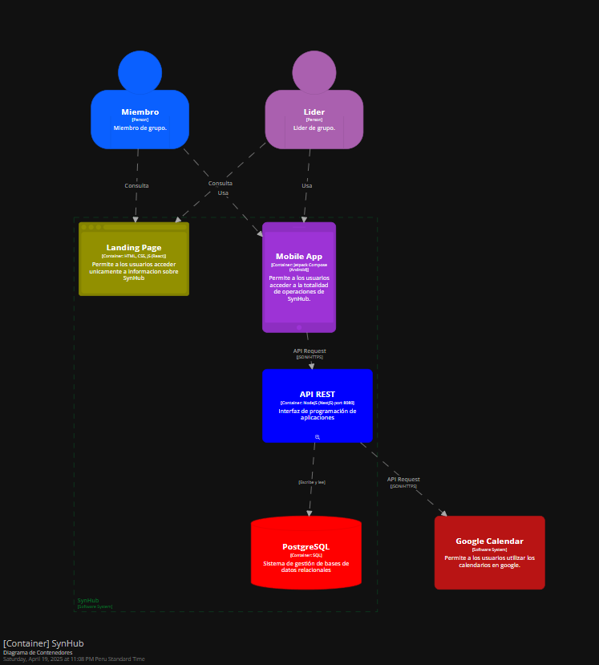
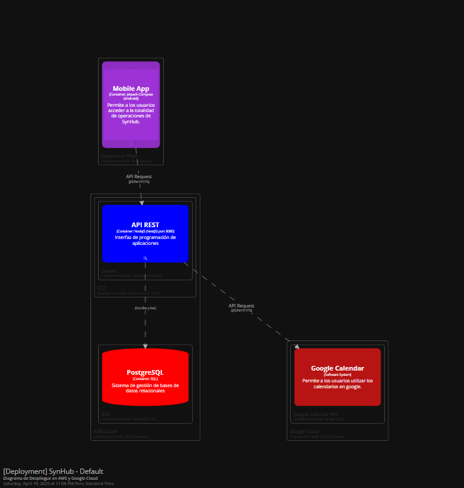
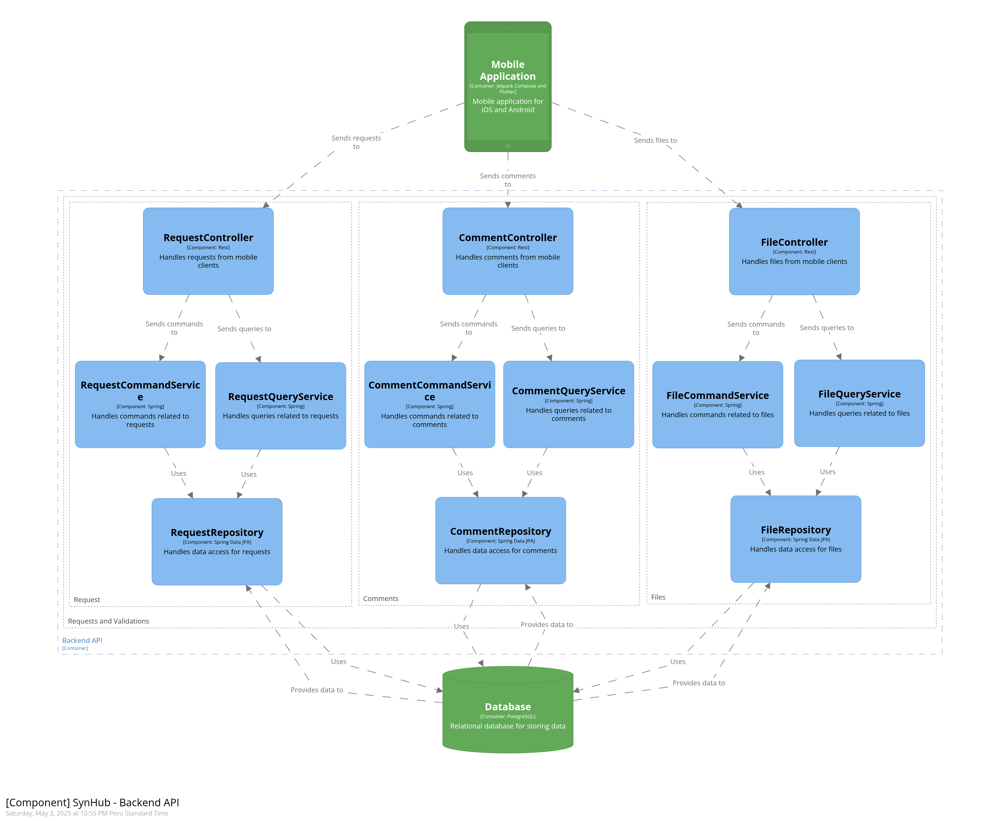

# Universidad Peruana de Ciencias Aplicadas

### **CURSO:** Aplicaciones para Dispositivos Moviles

### **NRC**: 358

### **Profesor:** Eduardo Martin Reyes Rodriguez

### **Ingeniería de software**

## Informe de Trabajo Final

### **Nombre del startup:** NRG4

### **Nombre del producto:** SynHome

## **Integrantes**

| **Nombre**                                | **Codigo** |
| ----------------------------------------- | ---------- |
| **Alejo Cardenas Jose Antonio**           | U202122484 |
| **Astonitas Díaz Juan Diego**            | U202110237 |
| **Casas Sanchez Gabriel Alexander**       | U202220033 |
| **Pacheco Astiguetta Sebastian**          | U202110291 |
| **Pasquale Barrenechea Gianluca Santino** | U202112078 |

**Abril 2025**

## Registro de Versiones del Informe

<table>
  <thead>
    <tr>
      <th>Versión</th>
      <th>Fecha</th>
      <th>Autor</th>
      <th>Descripción de modificación</th>
    </tr>
  </thead>
  <tbody>
    <tr>
      <td>0.1</td>
      <td>2025-04-02</td>
      <td>Casas Sanchez Gabriel Alexander, Astonitas Díaz Juan Diego y Pacheco Astiguetta Sebastian</td>
      <td>Desarrollo de los ítems: 1.1. Startup Profile, que incluye los subítems 1.1.1. Descripción de la Startup y 1.1.2. Perfiles de integrantes del equipo. Luego se presenta el 1.2. Solution Profile, que contiene los apartados 1.2.1. Antecedentes y problemática y 1.2.2. Lean UX Process, el cual se desglosa en 1.2.2.1. Lean UX Problem Statements, 1.2.2.2, 1.2.2.3 y 1.2.2.4. Finalmente, se desarrolla la sección 1.3. Lean UX Assumptions, que incluye los ítems Lean UX Hypothesis Statements, Lean UX Canvas y Segmentos objetivo.</td>
    </tr>
    <tr>
      <td>0.2</td>
      <td>2025-04-07</td>
      <td>Pasquale Barrenechea Gianluca Santino y Alejo Cardenas Jose Antonio</td>
      <td>Desarrollo de los ítems: La sección 2 del informe está compuesta por varios apartados clave, comenzando con el 2.1. Competidores, que abarca los subítems 2.1.1. Análisis competitivo y 2.1.2. Estrategias y tácticas frente a competidores. Luego se desarrolla el 2.2. Entrevistas, que incluye 2.2.1. Diseño de entrevistas, 2.2.2. Registro de entrevistas y 2.2.3. Análisis de entrevistas. A continuación, se presenta el 2.3. Needfinding, compuesto por 2.3.1. User Personas, 2.3.2. User Task Matrix, 2.3.3. User Journey Mapping, 2.3.4. Empathy Mapping y 2.3.5. As-is Scenario Mapping. Finalmente, se cierra esta parte del informe con el apartado 2.4. Ubiquitous Language.</td>
    </tr>
    <tr>
      <td>0.3</td>
      <td>2025-04-18</td>
      <td>Alejo Cardenas Jose Antonio, Astonitas Díaz Juan Diego</td>
      <td>Desarrollo de los ítems: 3.1. To-Be Scenario Mapping, 3.2. Avance de las User Stories, 3.3. Impact Mapping y 3.4. Avance del Product Backlog.</td>
    </tr>
    <tr>
      <td>0.4</td>
      <td>2025-04-21</td>
      <td>Casas Sanchez Gabriel Alexander, Alejo Cardenas Jose Antonio, Astonitas Díaz Juan Diego, Pasquale Barrenechea Gianluca Santino y Pacheco Astiguetta Sebastian</td>
      <td>Desarrollo de los ítems: 3.2. Finalizacion de las User Stories, 3.4. Finalizacion del Product Backlog, 4.1. Strategic-Level Domain-Driven Design y comprende los siguientes subítems: 4.1.1. EventStorming, que a su vez incluye 4.1.1.1. Candidate Context Discovery, 4.1.1.2, 4.1.1.3. Domain Message Flows Modeling y Bounded Context Canvases. También se desarrolla el apartado 4.1.2. Context Mapping y 4.1.3. Software Architecture, que contiene 4.1.3.1. Software Architecture Context Level Diagrams, 4.1.3.2. Software Architecture Container Level Diagrams y 4.1.3.3 Software Architecture Deployment Diagrams.  </td>
    </tr>
    <tr>
      <td>1.0</td>
      <td>2025-04-22</td>
      <td>Casas Sanchez Gabriel Alexander, Astonitas Díaz Juan Diego y Alejo Cardenas Jose Antonio</td>
      <td>Revisión completa hasta el capitulo 4, corrección ortográfica y coherencia global del reporte.</td>
    </tr>
  </tbody>
</table>

## Project Report Collaboration Insights

El enlace a github del reporte del proyecto es el siguiente: [https://github.com/NRG-4/report](https://github.com/NRG-4/report).

Entrega TB1 (23/04/2025):

Para esta primera entrega se desarollaron los cpaítulos del 1 al 4, en la captura adjuntada se evidencia del trabajo colaborativo de github. Todos los integrantes del grupo trabajaron en el proyecto.

Recapitulando los commits se dividieron de la siguiente manera:

* Alejo Cardenas Jose Antonio (Firtness): 30 commits
* Astonitas Díaz Juan Diego (NeoRise456): 13 commits
* Casas Sanchez Gabriel Alexander (Al3xiel): 31 commits
* Pacheco Astiguetta Sebastian (Pachieeee): 11 commits
* Pasquale Barrenechea Gianluca Santino (cwassointt): 10 commits

## Contenido

- [Student Outcome](#student-outcome)
- [Objetivos SMART](#objetivos-smart)
- [Capítulo I: Presentación](#capitulo-i-presentación)
  - [1.1. Startup Profile](#11-startup-profile)
    - [1.1.1. Descripción de la Startup](#111-descripción-de-la-startup)
    - [1.1.2. Perfiles de integrantes del equipo](#112-perfiles-de-integrantes-del-equipo)
  - [1.2. Solution Profile](#12-solution-profile)
    - [1.2.1. Antecedentes y problemática](#121-antecedentes-y-problemática)
    - [1.2.2. Lean UX Process](#122-lean-ux-process)
      - [1.2.2.1. Lean UX Problem Statements](#1221-lean-ux-problem-statements)
      - [1.2.2.2. Lean UX Assumptions](#1222-lean-ux-assumptions)
      - [1.2.2.3. Lean UX Hypothesis Statements](#1223-lean-ux-hypothesis-statements)
      - [1.2.2.4. Lean UX Canvas](#1224-lean-ux-canvas)
  - [1.3. Segmentos Objetivo](#13-segmentos-objetivo)
- [Capítulo II: Requirements Elicitation & Analysis](#capítulo-ii-requirements-elicitation--analysis)
  - [2.1. Competidores](#21-competidores)
    - [2.1.1. Análisis competitivo](#211-análisis-competitivo)
    - [2.1.2. Estrategias y tácticas frente a competidores](#212-estrategias-y-tácticas-frente-a-competidores)
  - [2.2. Entrevistas](#22-entrevistas)
    - [2.2.1. Diseño de entrevistas](#221-diseño-de-entrevistas)
    - [2.2.2. Registro de entrevistas](#222-registro-de-entrevistas)
    - [2.2.3. Análisis de entrevistas](#223-análisis-de-entrevistas)
  - [2.3. Needfinding](#23-needfinding)
    - [2.3.1. User Personas](#231-user-personas)
    - [2.3.2. User Task Matrix](#232-user-task-matrix)
    - [2.3.3. User Journey Mapping](#233-user-journey-mapping)
    - [2.3.4. Empathy Mapping](#234-empathy-mapping)
    - [2.3.5. As-is Scenario Mapping](#235-as-is-scenario-mapping)
  - [2.4. Ubiquitous Language](#24-ubiquitous-language)
- [Capítulo III: Requirements Specification](#capítulo-iii-requirements-specification)
  - [3.1. To-Be Scenario Mapping](#31-to-be-scenario-mapping)
  - [3.2. User Stories](#32-user-stories)
  - [3.3. Impact Mapping](#33-impact-mapping)
  - [3.4. Product Backlog](#34-product-backlog)
- [Capítulo IV: Solution Software Design](#capítulo-iv-solution-software-design)
  - [4.1. Strategic-Level Domain-Driven Design](#41-strategic-level-domain-driven-design)
    - [4.1.1. EventStorming](#411-eventstorming)
      - [4.1.1.1. Candidate Context Discovery](#4111-candidate-context-discovery)
      - [4.1.1.2. Domain Message Flows Modeling](#4112-domain-message-flows-modeling)
      - [4.1.1.3. Bounded Context Canvases](#4113-bounded-context-canvases)
    - [4.1.2. Context Mapping](#412-context-mapping)
    - [4.1.3. Software Architecture](#413-software-architecture)
      - [4.1.3.1. Software Architecture Context Level Diagrams](#4131-software-architecture-context-level-diagrams)
      - [4.1.3.2. Software Architecture Container Level Diagrams](#4132-software-architecture-container-level-diagrams)
      - [4.1.3.3. Software Architecture Deployment Diagrams](#4133-software-architecture-deployment-diagrams)
  - [4.2. Tactical-Level Domain-Driven Design](#42-tactical-level-domain-driven-design)
    - [4.2.1. Bounded Context](#421-bounded-context)
      - [4.2.1.1. Domain Layer](#4211-domain-layer)
      - [4.2.1.2. Interface Layer](#4212-interface-layer)
      - [4.2.1.3. Application Layer](#4213-application-layer)
      - [4.2.1.4. Infrastructure Layer](#4214-infrastructure-layer)
      - [4.2.1.5. Bounded Context Software Architecture Component Level Diagrams](#4215-bounded-context-software-architecture-component-level-diagrams)
      - [4.2.1.6. Bounded Context Software Architecture Code Level Diagrams](#4216-bounded-context-software-architecture-code-level-diagrams)
        - [4.2.1.6.1. Bounded Context Domain Layer Class Diagrams](#42161-bounded-context-domain-layer-class-diagrams)
        - [4.2.1.6.2. Bounded Context Database Design Diagram](#42162-bounded-context-database-design-diagram)
- [Capítulo V: Solution UI/UX Design](#capítulo-v-solution-uiux-design)
  - [5.1. Product Design](#51-product-design)
    - [5.1.1. Style Guidelines](#511-style-guidelines)
      - [5.1.1.1. General Style Guidelines](#5111-general-style-guidelines)
    - [5.1.2. Information Architecture](#512-information-architecture)
      - [5.1.2.1. Organization Systems](#5121-organization-systems)
      - [5.1.2.2. Labeling Systems](#5122-labeling-systems)
      - [5.1.2.3. SEO Tags and Meta Tags](#5123-seo-tags-and-meta-tags)
      - [5.1.2.4. Searching Systems](#5124-searching-systems)
      - [5.1.2.5. Navigation Systems](#5125-navigation-systems)
    - [5.1.3. Landing Page UI Design](#513-landing-page-ui-design)
      - [5.1.3.1. Landing Page Wireframe](#5131-landing-page-wireframe)
      - [5.1.3.2. Landing Page Mock-up](#5132-landing-page-mock-up)
    - [5.1.4. Mobile Applications UX/UI Design](#514-mobile-applications-uxui-design)
      - [5.1.4.1. Mobile Applications Wireframes](#5141-mobile-applications-wireframes)
      - [5.1.4.2. Mobile Applications Wireflow Diagrams](#5142-mobile-applications-wireflow-diagrams)
      - [5.1.4.3. Mobile Applications Mock-ups](#5143-mobile-applications-mock-ups)
      - [5.1.4.4. Mobile Applications User Flow Diagrams](#5144-mobile-applications-user-flow-diagrams)
      - [5.1.4.5. Mobile Applications Prototyping](#5145-mobile-applications-prototyping)
- [Capítulo VI: Product Implementation, Validation & Deployment](#capítulo-vi-product-implementation-validation--deployment)
  - [6.1. Software Configuration Management](#61-software-configuration-management)
    - [6.1.1. Software Development Environment Configuration](#611-software-development-environment-configuration)
    - [6.1.2. Source Code Management](#612-source-code-management)
    - [6.1.3. Source Code Style Guide \& Conventions](#613-source-code-style-guide--conventions)
    - [6.1.4. Software Deployment Configuration](#614-software-deployment-configuration)
  - [6.2. Landing Page \& Mobile Application Implementation](#62-landing-page--mobile-application-implementation)
    - [6.2.1. Sprint 1](#621-sprint-1)
      - [6.2.1.1. Sprint Planning 1](#6211-sprint-planning-1)
      - [6.2.1.2. Sprint Backlog 1](#6212-sprint-backlog-1)
      - [6.2.1.3. Development Evidence for Sprint Review](#6213-development-evidence-for-sprint-review)
      - [6.2.1.4. Testing Suite Evidence for Sprint Review](#6214-testing-suite-evidence-for-sprint-review)
      - [6.2.1.5. Execution Evidence for Sprint Review](#6215-execution-evidence-for-sprint-review)
      - [6.2.1.6. Services Documentation Evidence for Sprint Review](#6216-services-documentation-evidence-for-sprint-review)
      - [6.2.1.7. Software Deployment Evidence for Sprint Review](#6217-software-deployment-evidence-for-sprint-review)
      - [6.2.1.8. Team Collaboration Insights during Sprint](#6218-team-collaboration-insights-during-sprint)
  - [6.3. Validation Interviews](#63-validation-interviews)
    - [6.3.1. Diseño de entrevistas](#631-diseño-de-entrevistas)
    - [6.3.2. Registro de entrevistas](#632-registro-de-entrevistas)
    - [6.3.3. Evaluaciones según heurísticas](#633-evaluaciones-según-heurísticas)
  - [6.4. Video About-the-Product](#64-video-about-the-product)
- [Conclusiones](#conclusiones)
- [Bibliografía](#bibliografía)
- [Anexos](#anexos)

## Student Outcome

El curso contribuye al cumplimiento del Student Outcome ABET:

**ABET – EAC - Student Outcome 7**

Criterio: *La capacidad de adquirir y aplicar nuevos conocimientos según sea
necesario, utilizando estrategias deaprendizaje apropiadas.*

En el siguiente cuadro se describe las accionesrealizadas y enunciados de conclusiones
por parte del grupo, que permiten sustentar el haber alcanzado el logro del ABET –
EAC - Student Outcome 7.

<table>
  <thead>
    <tr>
      <th style="text-align: left;">Criterio específico</th>
      <th style="text-align: left;">Acciones realizadas</th>
      <th style="text-align: left;">Conclusiones</th>
    </tr>
  </thead>
  <tbody>
    <tr>
      <td>1. Actualiza conceptos y conocimientos necesarios para su desarrollo profesional y en especial para su proyecto en soluciones de software.</td>
      <td>
        Casas Sanchez Gabriel Alexander-TB1: Desarrollo de secciones clave como Startup Profile, Problem Statement, Business Canvas, Segmentos Objetivos y Solution Profile. Participó activamente en el modelado estratégico mediante Event Storming, desarrollando Candidate Context Discovery, Domain Message Flows Modeling, Bounded Context Canvases y Context Mapping.   Alejo Cardenas Jose Antonio-TB1: Encargado del Análisis Competitivo y la definición de Estrategias y Tácticas frente a Competidores. Elaboró artefactos de investigación y diseño como la User Task Matrix, el As-is Scenario Mapping y Ubiquitous Language. Participó en la proyección del producto con To-Be Scenario Mapping, Impact Mapping, Software Architecture, User Stories y el Diseño de Entrevistas.  Astonitas Díaz Juan Diego-TB1: Responsable de la redacción de los Antecedentes y Problemática. Contribuyó con la definición de User Stories, la elaboración y registro de Entrevistas, así como el diseño de la Base de Datos (Database Design).  Pasquale Barrenechea Gianluca Santino-TB1: Desarrolló herramientas clave de diseño centradas en el usuario como User Personas, User Journey Mapping y Empathy Mapping. También participó en la definición de User Stories, el armado del Product Backlog y la realización de Entrevistas.  Pacheco Astiguetta Sebastian-TB1: Encargado del análisis de Assumptions y la formulación de Hypothesis Statements. Además, colaboró en la definición de User Stories y en la ejecución de Entrevistas. 
      </td>
      <td>
        Durante el desarrollo del trabajo final, cada integrante del equipo actualizó y fortaleció sus conocimientos en metodologías ágiles, diseño centrado en el usuario, modelado estratégico y arquitectura de software. A través de la aplicación práctica de herramientas como Lean UX Canvas, Event Storming, Context Mapping y desarrollo de User Stories, logramos conectar la teoría con la ejecución de un proyecto real. Esta experiencia no solo nos permitió comprender mejor los conceptos aprendidos en clase, sino también integrarlos en la solución propuesta, elevando así nuestra preparación profesional y nuestra capacidad de enfrentar retos en el desarrollo de soluciones de software.
      </td>
    </tr>
    <tr>
      <td>2. Reconoce la necesidad del aprendizaje permanente para el desempeño profesional y el desarrollo de proyectos en soluciones de software.</td>
      <td>
        Casas Sanchez Gabriel Alexander-TB1: Desarrollo de secciones clave como Startup Profile, Problem Statement, Business Canvas, Segmentos Objetivos y Solution Profile. Participó activamente en el modelado estratégico mediante Event Storming, desarrollando Candidate Context Discovery, Domain Message Flows Modeling, Bounded Context Canvases y Context Mapping.   Alejo Cardenas Jose Antonio-TB1: Encargado del Análisis Competitivo y la definición de Estrategias y Tácticas frente a Competidores. Elaboró artefactos de investigación y diseño como la User Task Matrix, el As-is Scenario Mapping y Ubiquitous Language. Participó en la proyección del producto con To-Be Scenario Mapping, Impact Mapping, Software Architecture, User Stories y el Diseño de Entrevistas.  Astonitas Díaz Juan Diego-TB1: Responsable de la redacción de los Antecedentes y Problemática. Contribuyó con la definición de User Stories, la elaboración y registro de Entrevistas, así como el diseño de la Base de Datos (Database Design).  Pasquale Barrenechea Gianluca Santino-TB1: Desarrolló herramientas clave de diseño centradas en el usuario como User Personas, User Journey Mapping y Empathy Mapping. También participó en la definición de User Stories, el armado del Product Backlog y la realización de Entrevistas.  Pacheco Astiguetta Sebastian-TB1: Encargado del análisis de Assumptions y la formulación de Hypothesis Statements. Además, colaboró en la definición de User Stories y en la ejecución de Entrevistas. 
      </td>
      <td>
        El trabajo realizado evidenció la importancia del aprendizaje constante en el ámbito profesional. A lo largo del proyecto, nos enfrentamos a desafíos que requerían investigar nuevas herramientas, adoptar enfoques colaborativos y profundizar en técnicas no vistas previamente. Este proceso nos mostró que el conocimiento adquirido no es estático, sino que debe complementarse con una actitud activa hacia la mejora continua. Reconocemos que en un entorno tecnológico en constante evolución, solo mediante el aprendizaje permanente se puede ofrecer soluciones de calidad, adaptarse a las necesidades del usuario y desenvolverse de manera efectiva en el desarrollo profesional y de proyectos.
      </td>
    </tr>
  </tbody>
</table>

## Objetivos SMART

**Casas Sánchez Gabriel Alexander**

Objetivo 1:
Desarrollar competencias avanzadas en backend mediante la obtención de una certificación oficial en Node.js dentro de los primeros 12 meses posteriores a la graduación, con el fin de calificar para roles como desarrollador fullstack en empresas tecnológicas.

Objetivo 2:
Colaborar activamente en al menos dos proyectos open source en GitHub dentro del primer año después de egresar, para fortalecer habilidades técnicas, manejo de control de versiones y trabajo en equipo remoto.

**Alejo Cárdenas José Antonio**

Objetivo 1:
Finalizar un diplomado especializado en frontend con React y fundamentos de UX/UI dentro de los primeros 10 meses tras culminar la carrera, para postular a posiciones como frontend developer.

Objetivo 2:
Diseñar y lanzar un portafolio web personal con mínimo tres proyectos reales antes de los primeros seis meses de egresado, que evidencie mis conocimientos en interfaces modernas, accesibilidad y diseño adaptable.

**Astonitas Díaz Juan Diego**

Objetivo 1:
Aplicar a programas de prácticas preprofesionales o puestos junior como backend developer en empresas de tecnología dentro de los seis meses posteriores a mi egreso, aprovechando mis conocimientos en bases de datos y APIs.

Objetivo 2:
Crear un proyecto personal funcional basado en microservicios usando Spring Boot y Docker dentro de los primeros ocho meses después de egresar, que pueda integrar a mi portafolio como evidencia de competencias técnicas.

**Pasquale Barrenechea Gianluca Santino**

Objetivo 1:
Participar en un bootcamp intensivo de desarrollo fullstack MERN en los primeros seis meses luego de la graduación, con el objetivo de dominar tanto el frontend como el backend en JavaScript.

Objetivo 2:
Publicar dos artículos técnicos en plataformas como Medium o Dev.to en el primer año tras egresar, compartiendo aprendizajes sobre desarrollo de software y buenas prácticas en proyectos web.

**Pacheco Astiguetta Sebastián**

Objetivo 1:
Postular a programas de talento junior o trainee en desarrollo fullstack dentro de los primeros siete meses tras finalizar la carrera, con enfoque en empresas tecnológicas emergentes.

Objetivo 2:
Finalizar un curso especializado en testing automatizado con Jest o Cypress antes de cumplir un año de egresado, con el fin de asegurar la calidad del software en proyectos reales.

#z

#### 1.1.2. Perfiles de integrantes del equipo

<table>
  <tr>
    <th colspan="2"> Juan Diego Astonitas </th>
  </tr>
  <tr>
    <td>  </td>
    <td> Mi nombre es Juan Diego Astonitas Diaz, mi código de estudiante es u202110237 ,tengo 21 años, actualmente curso el 6to ciclo de la carrera de Ingeniería de Software, en la UPC en la sede San Miguel. Mis principales cualidades son el liderazgo y el dominio de NextJS. Haré todo lo que esté a mi alcance para respaldar al equipo en la finalización oportuna y efectiva de las tareas asignadas. </td>
  </tr>
  <tr>
    <th colspan="2"> Casas Sanchez Gabriel Alexander </th>
  </tr>
  <tr>
    <td>  </td>
    <td> Soy estudiante de Ingeniería de Software en sexto ciclo, con habilidades para dirigir y trabajar bien bajo presión. Aunque no disfruto mucho de los trabajos grupales, siempre asumo un rol destacado y sobresaliente en ellos, aprovechando mi capacidad académica y versatilidad. </td>
  </tr>
  <tr>
    <th colspan="2"> Gianluca Santino Pasquale Barrenechea </th>
  </tr>
  <tr>
    <td>  </td>
    <td> Me llamo Gianluca Santino Pasquale Barrenechea, estudiante de Ingeniería de Software (código u202112078). En nuestra Startup, me enfoco en el desarrollo frontend y backend, utilizando C++, C#, Python, Java, HTML y JavaScript. Mi objetivo es crear soluciones escalables y eficientes, mejorando la experiencia del usuario y optimizando la operación de la plataforma, siempre aplicando metodologías ágiles como Scrum. </td>
  </tr>
  <tr>
    <th colspan="2">Jose Antonio Alejo Cardenas</th>
  </tr>
  <tr>
    <td>  </td>
    <td> Soy José Alejo Cárdenas, estudiante de la carrera de Ingeniería de Software del sexto ciclo. Desde pequeño he sentido facinacion por la tecnologia en general sobretodo por el funcionamiento, desarrollo y proteccion del software en el ambito de ciberseguridad. He estudiado lenguajes de programacion (javascript, python y C++), bases de datos (Microsoft SQL Server y Mongo DB) y Sistemas Operativos (Kali Linux y Windows). Asi mismo, tengo experiencia con hardware a nivel de esamblamiento de equipos y funcionamiento del mismo con sus especificaciones tecnicas. Además, mi constante comunicacion y organizacion durante cualquier trabajo grupal aportara mucho dinamismo al proyecto. Mis principales hobbies son entrenar en el gimnasio, jugar videojuegos con mis amigos y salir a conversar con estos ultimos durante algun almuerzo o cena. Para el proyecto aportare organizacion, comunicacion e inspiracion durante todo el transcurso del mismo. </td>
  </tr>
  <tr>
    <th colspan="2">Sebastian Pacheco Astiguetta</th>
  </tr>
  <tr>
    <td>  </td>
    <td> Soy Sebastian Pacheco, tengo 22 años y soy alumno de Ingeniería de Software en la UPC. Me considero una persona trabajadora y activa, priorizando las responsabilidades ante todo, pero también destaco en trabajo en equipo, permitiendo a todos que participen. Tengo conocimiento de C++ y Python, los cuales pongo en práctica mediante proyectos personales. </td>
  </tr>
</table>

### 1.2. Solution Profile

**Problema identificado:** En el entorno actual, muchos equipos y grupos de trabajo, ya sean laborales, académicos o comunitarios, enfrentan dificultades para organizar sus actividades, distribuir responsabilidades de manera equitativa y mantener una comunicación clara entre sus integrantes. Esto puede provocar una sobrecarga en ciertos miembros del grupo, falta de coordinación, tareas duplicadas o abandonadas, y una caída general en la productividad y el bienestar del equipo. Aunque existen múltiples herramientas digitales, pocas han sido diseñadas específicamente para facilitar una gestión integral y colaborativa que se adapte a diferentes dinámicas grupales.

**Solución propuesta:**

La plataforma SynHub ofrece un entorno digital intuitivo y multifuncional que permite a los equipos gestionar sus actividades de forma colaborativa y eficiente:

- Desde el rol organizador o administrador: asignar tareas, crear calendarios grupales, definir horarios compartidos, establecer roles con diferentes niveles de acceso, hacer seguimiento del cumplimiento de responsabilidades y coordinar reuniones o encuentros virtuales.
- Desde el rol de integrante del equipo: consultar su calendario personal y grupal, recibir notificaciones y recordatorios, proponer ajustes en tareas u horarios, visualizar responsabilidades asignadas y conocer la disponibilidad de otros miembros.

Gracias a funcionalidades como la personalización de tareas, historial de cumplimiento, objetos o recursos compartidos, roles configurables, y una interfaz clara para visualizar la carga y horarios del equipo, la plataforma impulsa la organización eficiente, la corresponsabilidad y una comunicación más fluida dentro de cualquier tipo de grupo.

#### 1.2.1. Antecedentes y problemática

**What**

- ¿Cuál es el problema?

adica en la falta de herramientas digitales integrales y adaptables que permitan a los equipos organizarse de manera efectiva. Actualmente, muchas dinámicas grupales enfrentan desafíos como la distribución desigual de tareas, la escasa visibilidad del progreso, la comunicación desorganizada y la descoordinación entre miembros, lo que impacta negativamente en la productividad, genera tensiones internas y reduce el bienestar colectivo.

- ¿Cuál es la relación con la persona en cuestión?

La relación es facilitar a los miembros de equipos o grupos una herramienta diseñada específicamente para mejorar la organización, la distribución de tareas y la comunicación dentro de su grupo.

**When**

- ¿Cuándo sucede el problema?

El problema surge cuando los equipos y grupos deben coordinar actividades, repartir responsabilidades o mantener una comunicación constante para alcanzar objetivos comunes.

- ¿Cuándo utiliza el cliente el producto?

El cliente utiliza SynHub cuando necesita organizar, coordinar o participar en actividades grupales de manera eficiente, ya sea al inicio de un proyecto, durante la planificación de tareas, en la preparación de reuniones o en el seguimiento de responsabilidades.

**Where**

- ¿Dónde está el cliente cuando usa el producto?

El cliente utiliza SynHub desde cualquier lugar con acceso a Internet, ya sea en su hogar, en la oficina, en una sala de reuniones, en el aula o incluso mientras se traslada.

- ¿Dónde surge el problema?

El problema surge dentro de los propios entornos donde se desarrollan actividades grupales, como oficinas, instituciones educativas, organizaciones comunitarias o espacios colaborativos, en los que la coordinación efectiva es clave para lograr objetivos comunes.

**Who**

- ¿Quienes se ven involucrados en el problema?

Se ven involucrados tanto los organizadores o coordinadores de equipos (como líderes de proyecto, docentes, jefes de área o representantes comunitarios) como los integrantes de los grupos (estudiantes, colaboradores, voluntarios o participantes) que enfrentan dificultades para organizarse, distribuir responsabilidades y comunicarse eficazmente.
**Why**

- ¿Cuáles son las causas del problema?

Las causas del problema radican en la ausencia de herramientas centralizadas, flexibles y específicas para la gestión colaborativa de equipos con diferentes estructuras y necesidades. Muchas soluciones existentes no permiten una asignación clara de responsabilidades, ni contemplan la diversidad de roles, horarios o dinámicas de los grupos.

**How**

- ¿En qué condiciones los clientes usan nuestro producto?

Los clientes usan SynHub cuando forman parte de equipos o grupos que necesitan coordinar actividades de manera organizada y colaborativa, especialmente en contextos donde hay múltiples tareas, horarios variables y responsabilidades compartidas.

**How Much**

- ¿Cuál es la magnitud del problema?

La magnitud del problema de desorganización y comunicación ineficaz en equipos es considerable. Según el State of Teams Report de Atlassian (2021), solo el 17% de los equipos se consideran "saludables", mientras que el 54% son parcialmente saludables y el 29% directamente insalubres (p. 12). Además, el 57% de los participantes admitió que sus equipos no operan con la eficiencia necesaria, lo que genera retrasos y afecta la productividad (Atlassian, 2021, p. 18). Esto se agrava por la falta de conexión interpersonal: el 56% de los miembros reportó sentirse poco vinculado con sus compañeros, y el 37% mencionó que no puede expresar ideas libremente por falta de seguridad psicológica (Atlassian, 2021, p. 24).

#### 1.2.2. Lean UX Process

El lean UX process es un enfoque iterativo centrado en el usuario para el diseño de proyectos y productos. Este enfoque se base en ciclos rápidos (sprints) de investigación, diseño y pruebas para validar la propuesta o ideas planteadas por el equipo. Estas propuestas estarán siempre orientadas a satisfacer las necesidades de los usuarios.

##### 1.2.2.1. Lean UX Problem Statements

En el entorno actual, tanto en contextos familiares como laborales y comunitarios, los grupos enfrentan grandes desafíos para coordinar tareas, organizar horarios y mantener una comunicación fluida y estructurada entre sus miembros. Aunque existen herramientas digitales como aplicaciones de mensajería, calendarios o tableros de tareas, muchas de estas soluciones son fragmentadas, poco integradas o carecen de una lógica colaborativa adaptada al trabajo en equipo cotidiano.

Esta falta de soluciones centralizadas y personalizables genera desorganización, distribución desigual de responsabilidades, olvidos, retrasos y fricciones entre los integrantes de un grupo. Ya sea en un entorno familiar, una oficina, un equipo de voluntariado o un pequeño negocio, la necesidad de una herramienta unificada que facilite la colaboración, la planificación y el seguimiento de actividades es cada vez más evidente.

SynHub nace como una plataforma digital diseñada para cubrir esta brecha: una solución integral para la gestión de grupos que permite distribuir tareas, visualizar horarios compartidos, establecer roles con distintos niveles de permisos, recibir recordatorios y mejorar la eficiencia del trabajo en conjunto.

##### 1.2.2.2. Lean UX Assumptions

**User Assumptions (Suposiciones de Usuario)**

- ¿Quién es el usuario?: El usuario es alguien que busca una solución para organizar las tareas en un equipo y mejorar la comunicación entre los miembros.
- ¿Dónde encaja nuestro producto en su trabajo o vida?: Nuestro producto encaja en actividades grupales donde el usuario es partícipe junto a otros miembros, facilitando la gestión de tareas y responsabilidades dentro del equipo.
- ¿Qué problemas resuelve nuestro producto?: Nuestro producto resuelve problemas de desorganización y falta de comunicación dentro del equipo.
- ¿Cuándo y cómo se usa nuestro producto?: Nuestro producto se usa cuando hay necesidad de organización en actividades grupales, especialmente en momentos de planificación, seguimiento de tareas y coordinación entre miembros del equipo.
- ¿Qué características son importantes?: Las características importantes incluyen la asignación de tareas, la visualización de horarios del equipo, conocer la disponibilidad de los miembros y la posibilidad de personalizar roles y permisos.
- ¿Cómo debe verse y comportarse nuestro producto?: Nuestro producto debe tener una interfaz intuitiva y amigable, que permita a los usuarios navegar fácilmente entre las distintas funcionalidades.

**Business Assumptions (Suposiciones de Negocio)**

- Necesidades y problemas: Creemos que los equipos de trabajo tienen la necesidad de organizar sus tareas de manera eficiente y mejorar la comunicación entre sus miembros.
- Plataforma: Estas necesidades se pueden resolver a través de una aplicación móvil que ofrezca herramientas para la gestión de tareas y la comunicación, proporcionando una experiencia fluida y accesible.
- Segmentación: Los usuarios de la aplicación serán coordinadores de equipos e integrantes de esos equipos que buscan una forma accesible de organizar sus responsabilidades.
- Comportamientos: El valor principal que un usuario quiere obtener de nuestro servicio es la facilidad de uso y la mejora en la organización y comunicación dentro del equipo.
- Beneficios: Los usuarios obtendrán beneficios como una mejor organización personal, mayor claridad sobre sus responsabilidades dentro del equipo, y una sensación de logro al completar tareas.
- Captación de clientes: Adquiriremos la mayoría de nuestros usuarios a través de campañas de marketing digital y recomendaciones de usuarios actuales en el ámbito laboral y educativo.
- Modelo de ingresos: Generaremos ingresos a través de la clasificación de la aplicación como uno de pago.
- Competencia: Nuestra principal competencia en el mercado serán aplicaciones similares que ofrecen funciones de organización y gestión de tareas.
- Ventaja competitiva: Superaremos a la competencia gracias a nuestro enfoque en la personalización, la facilidad de uso y la integración de funciones específicas para la gestión de equipos.

**Technical Assumptions (Suposiciones Técnicas)**

- Tecnología utilizada: Podemos utilizar tecnologías móviles actuales para desarrollar la aplicación.
- Integraciones: La aplicación se integrará con otras plataformas de calendario y comunicación.
- Escalabilidad: La aplicación podrá escalar para soportar un número creciente de usuarios y datos.

**Market Assumptions (Suposiciones de Mercado)**

- Tamaño del mercado: Existe un mercado significativo de equipos que buscan soluciones para la organización y coordinación.
- Competencia: Las aplicaciones similares son los principales competidores.
- Tendencias: El mercado de aplicaciones de organización y productividad está en crecimiento, impulsado por la necesidad de soluciones digitales en entornos laborales y educativos.

**Design Assumptions (Suposiciones de Diseño)**

- Interacción del usuario: Los usuarios interactuarán con la aplicación con mayor facilidad si implementamos un calendario compartido del equipo, recordatorios automáticos y asignación de tareas.
- Experiencia del usuario: Los usuarios valorarán una experiencia de organización simple, flexible, colaborativa y motivadora.
- Colores y la tipografía: Los usuarios prefieren una paleta de colores pastel y una tipografía moderna y legible.
- Preferencias visuales: Los usuarios consideran atractivo un diseño simple con íconos intuitivos.
- Prototipos y pruebas: Necesitamos validar la facilidad de uso y la efectividad del diseño a través de pruebas de usabilidad.

##### 1.2.2.3. Lean UX Hypothesis Statements

**Hypothesis Statement 01:**

- Creemos que el usuario es alguien que busca una solución para organizar las tareas en un equipo y mejorar la comunicación entre los miembros.
- Sabremos que estamos en lo correcto cuando veamos comentarios positivos de los usuarios sobre la efectividad de la aplicación y un aumento de usuarios registrados.

**Hypothesis Stamenent 02:**

- Creemos que el producto encaja en actividades grupales donde el usuario es partícipe junto a otros miembros, facilitando la gestión de tareas y responsabilidades dentro del equipo.
- Sabremos que estamos en lo correcto cuando veamos comentarios positivos sobre la facilidad de uso y la integración del producto en la dinámica de equipo.

**Hypothesis Stamenent 03:**

- Creemos que el producto resuelve problemas de desorganización y falta de comunicación dentro del equipo.
- Sabremos que estamos en lo correcto cuando los usuarios reporten una mejora en la organización y coordinación de su equipo mediante encuestas o reseñas.

**Hypothesis Stamenent 04:**

- Creemos que el producto se usa cuando hay necesidad de organización en actividades grupales, especialmente en momentos de planificación, seguimiento de tareas y coordinación.
- Sabremos que estamos en lo correcto cuando veamos un aumento en la frecuencia de uso de la aplicación.

**Hypothesis Stamenent 05:**

- Creemos que las características importantes incluyen la asignación de tareas, la visualización de horarios del equipo, conocer la disponibilidad de los miembros y la posibilidad de personalizar roles y permisos.
- Sabremos que estamos en lo correcto cuando veamos comentarios positivos de los usuarios sobre estas características y un aumento en la satisfacción del usuario.

**Hypothesis Stamenent 06:**

- Creemos que el producto debe tener una interfaz intuitiva y amigable, que permita a los usuarios navegar fácilmente entre las distintas funcionalidades.
- Sabremos que estamos en lo correcto cuando los usuarios reporten una experiencia de navegación fluida y fácil en pruebas de usabilidad y comentarios.

**Hypothesis Stamenent 07:**

- Creemos que los equipos de trabajo tienen la necesidad de organizar sus tareas de manera eficiente y mejorar la comunicación entre sus miembros.
- Sabremos que estamos en lo correcto cuando veamos un aumento en la adopción del producto por parte de equipos y comentarios positivos sobre su utilidad.

**Hypothesis Stamenent 08:**

- Creemos que estas necesidades se pueden resolver a través de una aplicación móvil que ofrezca herramientas para la gestión de tareas y la comunicación, proporcionando una experiencia fluida y accesible.
- Sabremos que estamos en lo correcto cuando la aplicación tenga una alta tasa de retención y satisfacción del usuario.

**Hypothesis Stamenent 09:**

- Creemos que los usuarios serán coordinadores de equipos e integrantes que buscan una forma accesible de organizar sus responsabilidades.
- Sabremos que estamos en lo correcto cuando la mayoría de los registros y perfiles de usuario coincidan con estos perfiles y necesidades.

**Hypothesis Stamenent 10:**

- Creemos que el valor principal que un usuario quiere obtener de nuestro servicio es la facilidad de uso y la mejora en la organización y comunicación dentro del equipo.
- Sabremos que estamos en lo correcto cuando veamos comentarios positivos sobre la facilidad de uso y la efectividad de la aplicación en la organización de tareas.

**Hypothesis Stamenent 11:**

- Creemos que los usuarios obtendrán beneficios como una mejor organización personal, mayor claridad sobre sus responsabilidades dentro del equipo, y una sensación de logro al completar tareas.
- Sabremos que estamos en lo correcto cuando veamos comentarios positivos sobre los beneficios percibidos y un aumento en la satisfacción del usuario.

**Hypothesis Stamenent 12:**

- Creemos que adquiriremos la mayoría de nuestros usuarios a través de campañas de marketing digital y recomendaciones de usuarios actuales en el ámbito laboral y educativo.
- Sabremos que estamos en lo correcto cuando veamos un aumento en la adquisición de usuarios a través de estos canales y un crecimiento en la base de usuarios.

**Hypothesis Stamenent 13:**

- Creemos que generaremos ingresos a través de la clasificación de la aplicación como uno de pago.
- Sabremos que estamos en lo correcto cuando veamos un aumento de ingresos provenientes de la compra de la aplicación.

**Hypothesis Stamenent 14:**

- Creemos que nuestra principal competencia en el mercado serán aplicaciones similares que ofrecen funciones de organización y gestión de tareas.
- Sabremos que estamos en lo correcto cuando veamos un análisis competitivo que confirme esta suposición.

**Hypothesis Stamenent 15:**

- Creemos que superaremos a la competencia gracias a nuestro enfoque en la personalización, la facilidad de uso y la integración de funciones específicas para la gestión de equipos.
- Sabremos que estamos en lo correcto cuando veamos comentarios positivos sobre estos aspectos y un aumento en la adopción de la aplicación en comparación con la competencia.

**Hypothesis Stamenent 16:**

- Creemos que podemos utilizar tecnologías móviles actuales para desarrollar la aplicación.
- Sabremos que estamos en lo correcto cuando veamos que la aplicación funciona sin problemas en dispositivos móviles y cumple con los estándares de rendimiento.

**Hypothesis Stamenent 17:**

- Creemos que la aplicación se integrará con otras plataformas de calendario y comunicación.
- Sabremos que estamos en lo correcto cuando veamos que la integración funciona sin problemas y los usuarios pueden sincronizar sus calendarios y comunicaciones de manera efectiva.

**Hypothesis Stamenent 18:**

- Creemos que la aplicación podrá escalar para soportar un número creciente de usuarios y datos.
- Sabremos que estamos en lo correcto cuando veamos que la aplicación maneja un aumento en la carga de usuarios y datos sin problemas de rendimiento.

**Hypothesis Stamenent 19:**

- Creemos que existe un mercado significativo de equipos que buscan soluciones para la organización y coordinación.
- Sabremos que estamos en lo correcto cuando veamos un aumento en la adopción de la aplicación y un crecimiento en la base de usuarios.

**Hypothesis Stamenent 20:**

- Creemos que las aplicaciones similares son los principales competidores.
- Sabremos que estamos en lo correcto cuando veamos un análisis competitivo que confirme esta suposición y un aumento en la adopción de nuestra aplicación en comparación con la competencia.

**Hypothesis Stamenent 21:**

- Creemos que el mercado de aplicaciones de organización y productividad está en crecimiento, impulsado por la necesidad de soluciones digitales en entornos laborales y educativos.
- Sabremos que estamos en lo correcto cuando las estadísticas del sector y las tendencias de adopción confirmen este crecimiento.

**Hypothesis Stamenent 22:**

- Creemos que los usuarios interactuarán con la aplicación con mayor facilidad si implementamos un calendario compartido del equipo, recordatorios automáticos y asignación de tareas.
- Sabremos que estamos en lo correcto cuando veamos comentarios positivos sobre la facilidad de uso y la efectividad de estas características en la organización de tareas.

**Hypothesis Stamenent 23:**

- Creemos que los usuarios valorarán una experiencia de organización simple, flexible, colaborativa y motivadora.
- Sabremos que estamos en lo correcto cuando veamos comentarios positivos sobre la experiencia de usuario y un aumento en la satisfacción del usuario.

**Hypothesis Stamenent 24:**

- Creemos que los usuarios prefieren una paleta de colores pastel y una tipografía moderna y legible.
- Sabremos que estamos en lo correcto cuando veamos comentarios positivos sobre la estética de la aplicación y un aumento en la satisfacción del usuario.

**Hypothesis Stamenent 25:**

- Creemos que los usuarios consideran atractivo un diseño simple con iconos intuitivos.
- Sabremos que estamos en lo correcto cuando veamos comentarios positivos sobre la usabilidad y la estética de la aplicación.

**Hypothesis Stamenent 26:**

- Creemos que necesitamos validar la facilidad de uso y la efectividad del diseño a través de pruebas de usabilidad.
- Sabremos que estamos en lo correcto cuando veamos resultados positivos en las pruebas de usabilidad y comentarios constructivos de los usuarios.

##### 1.2.2.4. Lean UX Canvas

### 1.3. Segmentos Objetivo

**Segmento Objetivo #1: Coordinadores o Líderes de Grupo**

Este grupo incluye a personas que asumen la responsabilidad de organizar y gestionar las actividades dentro de un equipo o grupo. Pueden ser líderes de proyectos, responsables de logística en voluntariados, administradores de espacios compartidos, docentes coordinadores o encargados de comunidades (vecinales, académicas o laborales). Estas personas buscan una herramienta que les permita distribuir tareas, planificar actividades, hacer seguimiento del cumplimiento y facilitar la comunicación interna.
Características clave:

- Edad: 25 a 60 años
  - Género: Ambos
  - Contexto: Trabajo en equipo (laboral, educativo, comunitario o institucional)
  - Ocupación: Líderes de proyectos, jefes de equipo, coordinadores, docentes, voluntarios, emprendedores
  - Uso de tecnología: Usuarios activos de plataformas colaborativas, calendarios digitales, herramientas de gestión (como Trello, Google Calendar, Slack, etc.)
  - Necesidades: Distribuir responsabilidades, establecer fechas límite, tener visibilidad del progreso del equipo, mejorar la coordinación y reducir fricciones en la organización diaria.

**Segmento Objetivo #2: Miembros del Equipo o Grupo**

Corresponde a las personas que forman parte activa de un grupo con tareas y roles específicos, pero que no necesariamente tienen funciones administrativas. Incluye desde colaboradores de un proyecto, estudiantes de un curso, miembros de una comunidad, hasta empleados de una pequeña empresa. Este grupo busca mantenerse al tanto de sus responsabilidades, recibir recordatorios, y colaborar de forma clara y organizada con los demás.
Características clave:

- Edad: 13 a 60 años
  - Género: Ambos
  - Contexto: Participación activa en un grupo organizado (laboral, educativo, social, comunitario, voluntariado, etc.)
  - Ocupación: Colaboradores, estudiantes, asistentes, voluntarios, trabajadores, participantes de redes de apoyo
  - Uso de tecnología: Habitualmente usan apps móviles, redes sociales, herramientas de trabajo remoto o colaboración básica
  - Necesidades: Consultar tareas, recibir recordatorios, gestionar su tiempo dentro del equipo, proponer cambios o ajustes, y mantenerse alineados con los objetivos grupales.

## Capítulo II: Requirements Elicitation & Analysis

### 2.1. Competidores

En esta sección, se presenta un análisis de los principales competidores de nuestra startup, centrado en aquellos que operan con modelos de negocio digitales similares o que, aunque no sean idénticos, ofrecen productos o servicios que se superponen parcialmente con los de SynHome. Evaluamos tanto competidores directos, que se encuentran en el mismo segmento de mercado, como competidores indirectos, que abordan áreas relacionadas como el uso de calendarios, horarios, sistemas de recompensas,etc .

**1. Asana**

**Descripción:**

Asana es una herramienta de gestión de proyectos que permite a los equipos organizar tareas, asignar responsabilidades y seguir el progreso de los proyectos.**Ofrece múltiples vistas, como listas, tableros Kanban y calendarios, facilitando la personalización según las necesidades del equipo.

**Características principales:**

* **Proyectos y tareas** organizados en listas, tableros Kanban, calendarios y cronogramas.
* **Subtareas y dependencias** para definir pasos y secuencias de trabajo.
* **Colaboración**: asignación de tareas, comentarios, archivos adjuntos.
* **Notificaciones y recordatorios** por correo y en app.
* **Informes y seguimiento** de progreso (gráficas, porcentaje completado).
* **Integraciones** con Slack, Google Drive, Microsoft Teams, etc.
* **App móvil** intuitiva, con acceso a tareas, calendario y colaboración.

---

**2. FamilyWall**

**Descripción:**

FamilyWall es una plataforma familiar digital que integra varias funciones en un solo espacio. Su diseño visual y amigable la hace ideal para familias con hijos de diferentes edades.

**Principales características:**

* **Calendario familiar compartido** y sincronización con Google/Outlook.
* **Ubicación en tiempo real** (ideal para saber dónde están los hijos).
* **Listas de tareas y compras** colaborativas.
* **Mensajería privada o grupal**.
* **Galería multimedia compartida** (fotos y videos familiares).

---

**3. ClickUp**

**Descripción:**

ClickUp es una plataforma todo-en-uno que ofrece funciones de gestión de tareas, documentos, objetivos y más.**Es conocida por su alta personalización y adaptabilidad a diferentes flujos de trabajo.

**Características principales:**

* **Jerarquía flexible**: espacios, carpetas, listas, tareas y subtareas.
* **Vistas múltiples**: lista, tablero, calendario, Gantt, cronología, workload.
* **Seguimiento de tiempo** incluido (sin integraciones externas).
* **Docs internos**, notas y wikis colaborativos.
* **Gestión de metas y OKRs** (objectives and key results).
* **Automatizaciones personalizadas**.
* **Comentarios con menciones**, edición colaborativa.
* **Plantillas reutilizables** para tareas o proyectos.
* **App móvil** potente, aunque puede ser compleja para usuarios nuevos.

---

**4. Monday.com**

**Descripción:**

Monday.com proporciona una interfaz visual para planificar, rastrear y colaborar en proyectos.**Ofrece integraciones con diversas herramientas y es apreciada por su facilidad de uso y escalabilidad.

**Características principales:**

* **Tablas visuales** personalizables para tareas, flujos, y procesos.
* **Elementos configurables**: estado, fecha, texto, números, personas, etiquetas.
* **Automatizaciones fáciles** (si sucede X, entonces haz Y).
* **Vistas de calendario, cronograma, Kanban y workload**.
* **Colaboración por columnas** con comentarios y archivos.
* **Integraciones** con Gmail, Outlook, Zoom, Google Drive, etc.
* **Búsqueda y filtros** potentes.
* **App móvil** clara, amigable y funcional.

#### 2.1.1. Análisis competitivo<table>

<table> 
  <tr>
    <th colspan="6"> Competitive Analysis Landscape </th>
  </tr>
  <tr>
    <td colspan="2" rowspan="2">¿Por qué llevar acabo este análisis? </td>
    <td colspan="4"> Pregunta </td>
  </tr>
  <tr>
    <td colspan="4"> Deberiamos llevar a cabo este analisis para conocer el entorno, la competencia, tomar decisiones de desarrollo  y construir nuestra propuesta de valor.  </td>
  </tr>
  <tr>
    <td colspan="2"> Productos </td>
    <td style="text-align: center;">  
SynHub
   </td>
    <td style="text-align: center;"> 
Asana
   </td>
    <td style="text-align: center;"> 
FamilyWall
   </td>
    <td style="text-align: center;"> 
ClickUp
   </td>
  </tr>
  <tr>
    <td rowspan="2">Perfil</td>
    <td>Overview</td>
    <td> SynHub es una plataforma digital colaborativa diseñada para facilitar la organización y gestión de actividades de grupos o equipos de trabajo de cualquier tipo: laborales, académicos, sociales. </td>
    <td> Plataforma de gestión de proyectos y tareas diseñada para ayudar a los equipos a organizar, rastrear y gestionar su trabajo. Ofrece diversas vistas como listas, tableros Kanban y calendarios para facilitar la planificación y el seguimiento de proyectos.</td>
    <td> FamilyWall plataforma de gestión familiar diseñada para ayudar a las familias a organizar su vida diaria. Ofrece funciones para coordinar calendarios, tareas, mensajes, fotos y más. </td>
    <td> ClickUp es una plataforma todo-en-uno que ofrece herramientas para la gestión de tareas, documentos, objetivos y más, con un alto grado de personalización para adaptarse a diferentes flujos de trabajo. </td>
  </tr>
  <tr>
    <td>Ventaja competitiva ¿Qué valor ofrece a los clientes? </td>
    <td> Potencia la corresponsabilidad con funciones como seguimiento de cumplimiento, historial de tareas y visualización de carga de trabajo. </td>
    <td> Asana destaca por su interfaz intuitiva y facilidad de uso, permitiendo a los equipos adaptarse rápidamente a la plataforma. Su capacidad para integrarse con numerosas herramientas de terceros amplía su funcionalidad y la hace versátil para diferentes tipos de equipos. </td>
    <td> Ayuda a mejorar la comunicación familiar mediante el chat y las actualizaciones compartidas. </td>
    <td> Su capacidad de personalización y la amplia variedad de funciones integradas en una sola plataforma la hacen atractiva para equipos que buscan consolidar múltiples herramientas en una. </td>
  </tr>
  <tr>
    <td rowspan="2">Perfil de Marketing</td>
    <td> Mercado Objetivo </td>
    <td> Grupos académicos o universitarios (estudiantes, equipos de proyecto, docentes), familias que buscan distribuir y asignar tareas del hogar y equipos que buscan una herramienta flexible, económica y con curva de aprendizaje baja. </td>
    <td> Empresas de todos los tamaños que buscan una solución eficiente para la gestión de proyectos y tareas, desde startups hasta grandes corporaciones. </td>
    <td> Familias que buscan una plataforma unificada para coordinar actividades y compartir momentos. </td>
    <td> Equipos y empresas de diversos tamaños que buscan una solución integral para la gestión de proyectos y tareas, especialmente aquellos que requieren alta personalización. </td>
  </tr>
  <tr>
    <td> Estrategias de Marketing </td>
    <td> Pruebas gratuitas y versiones premium: Ofrecer una versión gratuita básica y luego incentivar la migración a la versión premium con funciones avanzadas. </td>
    <td> Asana utiliza contenido educativo, como guías y webinars, para atraer y educar a su audiencia. Además, ofrece una versión gratuita con funcionalidades básicas para captar usuarios que luego pueden optar por planes premium. </td>
    <td> Ofrecen pruebas gratuitas para fomentar la adopción. </td>
    <td> ClickUp se centra en destacar su versatilidad y capacidad todo-en-uno. Utiliza contenido educativo, testimonios de clientes y comparativas con otras herramientas para demostrar su valor. </td>
  </tr>
<td rowspan="3">Perfil de Producto</td>
    <td> Productos & Servicios </td>
    <td> Gestión de tareas familiares(responsabilidades a cada miembro del hogar), horario y calendario compartido (visible para todos los miembros), sistema de recompensas (motivación para los miembros más jóvenes de la familia). </td>
    <td> Gestión de tareas y proyectos, Vistas personalizadas: lista, tablero, calendario, Integraciones con herramientas como Slack, Google Drive y Microsoft Teams, Informes y seguimiento del progreso. </td>
    <td> Calendario compartido, listas de compras y tareas, mensajería privada, compartición de fotosy planificación de eventos familiares. </td>
    <td> Gestión de tareas y proyectos con múltiples vistas, Documentos y wikis colaborativos, Seguimiento del tiempo integrado y Automatizaciones personalizadas. </td>
  </tr>
  <tr>
    <td> Precios & Costos</td>
    <td> Plan Gratuito y Plan Premium – $6.99/usuario/mes </td>
    <td> Gratis: Funciones básicas para equipos pequeños y Premium: Mensual $13.49 y Anual $10.99 c/m . </td>
    <td> Premium por $4.99/mes o $29.99/año con características avanzadas. </td>
    <td> Gratis: Funciones básicas para equipos pequeños y Unlimited: Mensual $9 y Anual $10.99 c/m . </td>
  </tr>
  <tr>
    <td> Canales de distribución </td>
    <td> App móvil (Android / iOS) </td>
    <td> Disponible en plataforma web y aplicaciones móviles para iOS y Android. </td>
    <td> App Store y Google Play Store. </td>
    <td> Disponible en plataforma web y aplicaciones móviles para iOS y Android. </td>
  </tr>
<td rowspan="5">Análisis SWOT</td>
<tr>
    <td> Fortalezas </td>
    <td> Versatilidad para distintos tipos de equipos y contextos. </td>
    <td> Interfaz intuitiva y fácil de usar. </td>
    <td> Funciones completas para gestionar la familia en un solo lugar. </td>
    <td> Alta personalización y flexibilidad en flujos de trabajo. </td>
  </tr>
<tr>
    <td> Debilidades</td>
    <td> Marca nueva: carece de reconocimiento y reputación. </td>
    <td> Limitaciones en la personalización de flujos de trabajo complejos. </td>
    <td> La versión gratuita tiene restricciones significativas. </td>
    <td> Curva de aprendizaje pronunciada debido a la cantidad de funciones. </td>
  </tr>
<tr>
    <td> Oportunidades</td>
    <td> Penetrar en mercados que no están siendo bien servidos por soluciones complejas. </td>
    <td> Expansión en mercados internacionales emergentes. </td>
    <td> Expansión en la gestión de actividades educativas. </td>
    <td> Expansión en sectores específicos que requieren soluciones personalizadas. </td>
  </tr>
<tr>
    <td> Amenazas</td>
    <td> Grandes plataformas podrían lanzar versiones más económicas para captar a este nicho. </td>
    <td> Competencia creciente en el sector de herramientas de gestión de proyectos. </td>
    <td> La falta de integraciones con otras plataformas populares como Google Calendar. </td>
    <td> Competencia con herramientas especializadas que pueden ofrecer soluciones más simples. </td>
  </tr>
</table>

#### 2.1.2. Estrategias y tácticas frente a competidores

**1. Estrategia de Diferenciación por Simplicidad y Usabilidad**

**Objetivo:** Posicionar a SynHub como la opción más intuitiva, fácil de usar y accesible para todo tipo de grupos (no solo empresas).

**Tácticas:**

* Diseñar una **interfaz limpia y visual**, con navegación amigable incluso para usuarios sin experiencia en apps de gestión.
* Implementar un **proceso de onboarding rápido** (menos de 2 minutos para crear un grupo y asignar tareas).
* Ofrecer **tutoriales interactivos**, ayuda contextual y videos cortos integrados en la app.
* En comparación con Asana y ClickUp, enfatizar: *“No necesitas ser experto para organizarte bien”*.

**2. Estrategia de Enfoque en Nichos Desatendidos**

**Objetivo:** Atacar segmentos específicos como equipos académicos, voluntarios, universitarios, comunidades o grupos familiares avanzados.

**Tácticas:**

* Crear plantillas y funciones específicas para grupos no empresariales (ej: calendario de clases, tareas compartidas, roles para miembros del hogar, etc.).
* FamilyWall cubre familias, pero SynHub puede expandirse hacia **"equipos híbridos": familia + trabajo + estudio**.

**3. Estrategia de Humanización y Cercanía de Marca**

**Objetivo:** Ganarse la confianza de usuarios por medio de comunicación cercana, soporte cálido y experiencia de usuario emocionalmente positiva.

**Tácticas:**

* Ofrecer un **soporte al cliente rápido y empático**, especialmente en etapas iniciales.
* Utilizar un **lenguaje humano y accesible** en toda la plataforma (evitar tecnicismos).
* A diferencia de Asana y ClickUp, donde la marca es más corporativa, **SynHub puede mostrarse como una plataforma "hecha por y para personas reales"**.

**4. Estrategia de Precio Accesible y Transparente**

**Objetivo:** Atraer a usuarios que buscan funcionalidades potentes sin pagar precios empresariales.

**Tácticas:**

* Diseñar una estructura de precios clara, con un **plan gratuito funcional** y un **plan premium económico** (más barato que ClickUp o Asana).
* Ofrecer descuentos especiales para grupos educativos o sin fines de lucro.
* Incluir funcionalidades importantes sin obligar al usuario a escalar de plan por todo.

### 2.2. Entrevistas

En esta sección del informe se realizará el diseño, registro y análisis de las entrevistas de nuestros segmentos objetivos.

#### 2.2.1. Diseño de entrevistas

**1. Entrevista para el Coordinador o Líder de Grupo**

* Preguntas principales:

1.¿Podrías contarme un poco sobre ti? (edad, ocupación, lugar de residencia, estado civil)

2.¿A qué tipo de grupo o equipos perteneces o lideras actualmente?

3.¿Cuál es tu rol dentro de ese grupo?

* -Preguntas complementarias:

4.¿Con qué frecuencia se reúnen o interactúan?

5.Cuántas personas conforman el grupo o equipo que lideras?

6.¿Qué herramientas o plataformas digitales utilizas para coordinar al equipo?

7.¿Sueles tener problemas con la puntualidad, comunicación o cumplimiento?

8.¿Qué dispositivos usas más frecuentemente para organizarte (móvil, laptop, tablet)?

9.¿Usas redes sociales, apps colaborativas o agendas digitales?

10.¿Qué valoras más en una herramienta para organizar a tu equipo?

**2. Entrevista para el Miembro del Equipo o Grupo**

* Preguntas principales:

1.¿Podrías contarme un poco sobre ti? (edad, ocupación, lugar de residencia, estado civil)

2.¿A qué tipo de grupo o equipo perteneces actualmente?

3.¿Cuál es tu rol dentro del grupo? (por ejemplo: participante, colaborador, voluntario)

* Preguntas complementarias:

4.¿Qué tipo de tareas realizas habitualmente?

5.¿Qué herramientas o plataformas digitales utilizas para conocer tus actividades en el equipo?

6.¿Cómo te enteras de tus responsabilidades dentro del grupo?

7.¿Qué cosas te molestan o dificultan al trabajar en grupo?

8.¿Qué tipo de apps o plataformas te gustan más? (Ej: fáciles de usar, visuales, rápidas)

9.¿Usas más el celular o la computadora para tus tareas diarias?

10.¿Qué tipo de apps o plataformas te gustan más? (Ej: fáciles de usar, visuales, rápidas)

#### 2.2.2. Registro de entrevistas

En esta sección registramos los puntos e ideas más importantes de las entrevistas realizadas a los coordinadores y miembros de grupo. Los detalles completos de las entrevistas, incluyendo las grabaciones, se encuentran disponibles en el siguiente enlace: [Needfinsing Interviews NRG4](https://upcedupe-my.sharepoint.com/:v:/g/personal/u202110237_upc_edu_pe/EVU0t5OwgeJCvWwCDOpMJoEBHecwn4GeX7zRlS2j9zSbzw?e=d9LT27)

A continuación se presentan los detalles clave de las entrevistas realizadas a los coordinadores de grupo:

<table cellpadding="8" cellspacing="0">
  <tbody>
    <tr>
      <td>Entrevista 1</td>
      <td>  </td>
    </tr>
    <tr>
      <td>Nombre Entrevistado</td>
      <td>Luis Alejo Cardenas</td>
    </tr>
    <tr>
      <td>Edad</td>
      <td>25</td>
    </tr>
    <tr>
      <td>Distrito</td>
      <td>San Martin de Porres</td>
    </tr>
    <tr>
      <td>Ocupacion</td>
      <td>Project Manager</td>
    </tr>
    <tr>
      <td>Duración Entrevista</td>
      <td>03:15 </td>
    </tr>
    <tr>
      <td>Minuto de Inicio</td>
      <td>00:00 - 03:15</td>
    </tr>
  </tbody>
</table>

<table cellpadding="8" cellspacing="0">
  <tbody>
    <tr>
      <td>Entrevista 2</td>
      <td>  </td>
    </tr>
    <tr>
      <td>Nombre Entrevistado</td>
      <td>Sebastian Real</td>
    </tr>
    <tr>
      <td>Edad</td>
      <td>20</td>
    </tr>
    <tr>
      <td>Distrito</td>
      <td>la Perla</td>
    </tr>
    <tr>
      <td>Ocupacion</td>
      <td>Estudiante</td>
    </tr>
    <tr>
      <td>Duración Entrevista</td>
      <td> 02:09 </td>
    </tr>
    <tr>
      <td>Minuto de Inicio</td>
      <td>03:16 - 05:23</td>
    </tr>
  </tbody>
</table>

<table cellpadding="8" cellspacing="0">
  <tbody>
    <tr>
      <td>Entrevista 3</td>
      <td>  </td>
    </tr>
    <tr>
      <td>Nombre Entrevistado</td>
      <td>Aldo Alexander Vazques Sotomayor</td>
    </tr>
    <tr>
      <td>Edad</td>
      <td>21</td>
    </tr>
    <tr>
      <td>Distrito</td>
      <td>Breña</td>
    </tr>
    <tr>
      <td>Ocupacion</td>
      <td>Estudiante</td>
    </tr>
    <tr>
      <td>Duración Entrevista</td>
      <td>02:37 </td>
    </tr>
    <tr>
      <td>Minuto de Inicio</td>
      <td>05:24 - 7:58</td>
    </tr>
  </tbody>
</table>

A continuación se presentan los detalles clave de las entrevistas realizadas a los miembros de grupo:

<table cellpadding="8" cellspacing="0">
  <tbody>
    <tr>
      <td>Entrevista 4</td>
      <td>  </td>
    </tr>
    <tr>
      <td>Nombre Entrevistado</td>
      <td>Elvia Marcela Rodríguez Villa</td>
    </tr>
    <tr>
      <td>Edad</td>
      <td>23</td>
    </tr>
    <tr>
      <td>Distrito</td>
      <td>Comas</td>
    </tr>
    <tr>
      <td>Ocupacion</td>
      <td>Practicante Machine Learning</td>
    </tr>
    <tr>
      <td>Duración Entrevista</td>
      <td>04:22 </td>
    </tr>
    <tr>
      <td>Minuto de Inicio</td>
      <td>07:59 - 12:20</td>
    </tr>
  </tbody>
</table>

<table cellpadding="8" cellspacing="0">
  <tbody>
    <tr>
      <td>Entrevista 5</td>
      <td>  </td>
    </tr>
    <tr>
      <td>Nombre Entrevistado</td>
      <td>David Rivas</td>
    </tr>
    <tr>
      <td>Edad</td>
      <td>21</td>
    </tr>
    <tr>
      <td>Distrito</td>
      <td>Jesus Maria</td>
    </tr>
    <tr>
      <td>Ocupacion</td>
      <td>Estudiante</td>
    </tr>
    <tr>
      <td>Duración Entrevista</td>
      <td>06:01 </td>
    </tr>
    <tr>
      <td>Minuto de Inicio</td>
      <td>12:20 - 18:21</td>
    </tr>
  </tbody>
</table>

<table cellpadding="8" cellspacing="0">
  <tbody>
    <tr>
      <td>Entrevista 6</td>
      <td>  </td>
    </tr>
    <tr>
      <td>Nombre Entrevistado</td>
      <td>Camila Palacios</td>
    </tr>
    <tr>
      <td>Edad</td>
      <td>22</td>
    </tr>
    <tr>
      <td>Distrito</td>
      <td>Pueblo Libre</td>
    </tr>
    <tr>
      <td>Ocupacion</td>
      <td>Practicante de Psicologia</td>
    </tr>
    <tr>
      <td>Duración Entrevista</td>
      <td>06:41 </td>
    </tr>
    <tr>
      <td>Minuto de Inicio</td>
      <td>18:21 - 25:01</td>
    </tr>
  </tbody>
</table>

#### 2.2.3. Análisis de entrevistas

**Segmento Objetivo 1: Coordinadores o Líderes de Grupo**

* **Demografía:** La edad promedio de los coordinadores entrevistados es de 25 años, con todos los participantes trabajando en campos relacionados con la tecnología. Esto indica un perfil demográfico juvenil en roles de liderazgo dentro de entornos tecnológicos.
* **Tamaño del equipo:** Los coordinadores gestionan equipos de tamaños variados, habiendo un líder que supervisa un equipo de seis miembros. Esto sugiere una preferencia por equipos de tamaño pequeño a mediano para una gestión efectiva.
* **Frecuencia de comunicación:** Todos los coordinadores reportaron participar en reuniones o interacciones diarias, lo que destaca un enfoque estructurado de comunicación que fomenta la alineación del equipo. Esta comunicación constante es crucial para el éxito del proyecto.
* **Frecuencia de comunicación:** Todos los coordinadores reportaron participar en reuniones o interacciones diarias, lo que destaca un enfoque estructurado de comunicación que fomenta la alineación del equipo. Esta comunicación constante es crucial para el éxito del proyecto.

**Segmento Objetivo 2: Miembros del Equipo o Grupo**

* **Preferencias de comunicación:** El 67 % de los miembros del equipo prefiere una combinación de comunicación presencial y digital, con un fuerte énfasis en interacciones en tiempo real para la resolución de problemas. Esto refleja la necesidad de flexibilidad en los métodos de comunicación.
* **Estrategias de compromiso:** El 67 % de los miembros del equipo mencionó el uso de materiales creativos, como infografías y presentaciones, para mejorar el compromiso y la comprensión dentro del equipo. Esto sugiere que se valoran los métodos de comunicación innovadores.
* **Herramientas de gestión de tareas:** Todos los miembros del equipo informaron utilizar herramientas que les permiten seguir sus tareas de forma visual, lo que indica una preferencia universal por ayudas visuales para monitorear el progreso y mantener la motivación.

### 2.3. Needfinding

#### 2.3.1. User Personas

En esta sección, mostraremos los perfiles de los usuarios que hemos definido para nuestro producto. Estos perfiles nos ayudaran a entender mejor las necesidades y expectativas de nuestros usuarios.

**1. User Persona: Coordinador de equipos**

**2. User Persona: Miembro de equipo**

#### 2.3.2. User Task Matrix

**1. Segmento 1: Coordinadores o Líderes de Grupo**

<table cellpadding="8" cellspacing="0">
  <thead>
    <tr>
      <th colspan="3">Coordinador o Líder de Grupo</th>
    </tr>
    <tr>
      <th>Tarea</th>
      <th>Frecuencia</th>
      <th>Severidad</th>
    </tr>
  </thead>
  <tbody>
    <tr>
      <td>Seleccion de miembros y objetivo</td>
      <td>Alta</td>
      <td>Medio</td>
    </tr>
    <tr>
      <td>Creacion de grupos y horarios</td>
      <td>Baja</td>
      <td>Alta</td>
    </tr>
    <tr>
      <td>Coordina reuniones por distintos medios</td>
      <td>Media</td>
      <td>Media</td>
    </tr>
    <tr>
      <td>Asigna tareas a los miembros del grupo</td>
      <td>Alta</td>
      <td>Alta</td>
    </tr>
    <tr>
      <td>Supervisar y actualizar avances de los miembros</td>
      <td>Alta</td>
      <td>Alta</td>
    </tr>
    <tr>
      <td>Recolectar informacion dispersa de todos los miembros</td>
      <td>Alta</td>
      <td>Alta</td>
    </tr>
    <tr>
      <td>Identificar mejoras apartir de las concluciones finales</td>
      <td>Media</td>
      <td>Baja</td>
    </tr>
  </tbody>
</table>

**2. Segmento 2: Miembros del Equipo o Grupo**

<table cellpadding="8" cellspacing="0">
  <thead>
    <tr>
      <th colspan="3">Miembro del Equipo o Grupo</th>
    </tr>
    <tr>
      <th>Tarea</th>
      <th>Frecuencia</th>
      <th>Severidad</th>
    </tr>
  </thead>
  <tbody>
    <tr>
      <td>Revisar los miembros y objetivo del grupo</td>
      <td>Baja</td>
      <td>Media</td>
    </tr>
    <tr>
      <td>Revisar horarios y organización del grupo</td>
      <td>Alta</td>
      <td>Alta</td>
    </tr>
    <tr>
      <td>Asistir a reuniones coordinadas por el líder</td>
      <td>Media</td>
      <td>Alta</td>
    </tr>
    <tr>
      <td>Realizar tareas asignadas según cronograma</td>
      <td>Alta</td>
      <td>Alta</td>
    </tr>
    <tr>
      <td>Actualizar al líder sobre el avance de sus tareas</td>
      <td>Alta</td>
      <td>Alta</td>
    </tr>
    <tr>
      <td>Compartir información y hallazgos con el lider</td>
      <td>Media</td>
      <td>Media</td>
    </tr>
    <tr>
      <td>Reflexionar sobre mejoras personales o del grupo</td>
      <td>Baja</td>
      <td>Media</td>
    </tr>
  </tbody>
</table>

#### 2.3.3. User Journey Mapping

En esta sección, se presenta el mapa de viaje del usuario, que ilustra las etapas y experiencias de los usuarios al interactuar con nuestro producto. Este mapa nos ayudará a identificar oportunidades de mejora y a comprender mejor las necesidades de nuestros usuarios.

**1. User Journey: Coordinador de equipos**

**2. User Journey: Miembro de equipo**

#### 2.3.4. Empathy Mapping

En esta sección, se presenta el mapa de empatía, que nos ayudará a comprender mejor las emociones, pensamientos y necesidades de nuestros usuarios. Este mapa es una herramienta valiosa para identificar oportunidades de mejora en la experiencia del usuario.

**1. Empathy Map: Coordinador de equipos**

**2. Empathy Map: Miembro de equipo**

#### 2.3.5. As-is Scenario Mapping

**1. Segmento 1: Coordinadores o Líderes de Grupo**

**2. Segmento 2: Miembros del Equipo o Grupo**

### 2.4. Ubiquitous Language

<table cellpadding="8" cellspacing="0">
  <tr>
    <th colspan="3">📘 Ubiquitous Language</th>
  </tr>
  <tr>
    <th style="text-align: left;">Término (en inglés)</th>
    <th style="text-align: left;">Término (en español)</th>
    <th style="text-align: left;">Definición (en español)</th>
  </tr>
  <tr>
    <td>Task</td>
    <td>Tarea</td>
    <td>Acción específica asignada a un miembro del grupo para ser completada en un periodo.</td>
  </tr>
  <tr>
    <td>Group</td>
    <td>Grupo</td>
    <td>Conjunto de personas que colaboran en actividades comunes dentro de SynHub.</td>
  </tr>
  <tr>
    <td>Responsibility</td>
    <td>Responsabilidad</td>
    <td>Obligación asumida por un miembro del grupo respecto a una o varias tareas asignadas.</td>
  </tr>
  <tr>
    <td>Task History</td>
    <td>Historial de tareas</td>
    <td>Registro cronológico de tareas realizadas, canceladas o pendientes.</td>
  </tr>
  <tr>
    <td>Shared Calendar</td>
    <td>Calendario compartido</td>
    <td>Herramienta visual que muestra los eventos, plazos y tareas de todos los miembros.</td>
  </tr>
  <tr>
    <td>Workload View</td>
    <td>Visualización de carga</td>
    <td>Representación gráfica del volumen de tareas por miembro, útil para balancear el trabajo.</td>
  </tr>
  <tr>
    <td>Reward System</td>
    <td>Sistema de recompensas</td>
    <td>Mecanismo para motivar el cumplimiento de tareas mediante premios o reconocimientos.</td>
  </tr>
  <tr>
    <td>Notification</td>
    <td>Notificación</td>
    <td>Aviso que informa a los usuarios sobre actualizaciones, nuevas tareas o recordatorios.</td>
  </tr>
  <tr>
    <td>Role</td>
    <td>Rol</td>
    <td>Función asignada dentro del grupo (como líder, miembro, colaborador).</td>
  </tr>
  <tr>
    <td>Subtask</td>
    <td>Subtarea</td>
    <td>Tarea secundaria dentro de una tarea principal que ayuda a dividir el trabajo.</td>
  </tr>
  <tr>
    <td>Task Status</td>
    <td>Estado de tarea</td>
    <td>Situación actual de una tarea (ej. pendiente, en progreso, completada, cancelada).</td>
  </tr>
  <tr>
    <td>Member</td>
    <td>Miembro</td>
    <td>Usuario que forma parte de un grupo dentro de la aplicación SynHub.</td>
  </tr>
</table>

## Capítulo III: Requirements specification

### 3.1. To-Be Scenario Mapping

**1. Segmento 1: Coordinadores o Líderes de Grupo**

**2. Segmento 2: Miembros del Equipo o Grupo**

### 3.2. User Stories

**Epics:**

<table >
  <thead>
    <tr>
      <th>Epic ID</th>
      <th>Título</th>
      <th>Descripción</th>
    </tr>
  </thead>
  <tbody>
    <tr>
      <td>EP-001</td>
      <td>Gestión de Grupos y Roles</td>
      <td>Esta épica abarca todas las funcionalidades relacionadas con la creación de grupos, selección de integrantes y visualización de roles. Busca facilitar al líder del grupo la conformación del equipo de trabajo y ofrecer a los miembros claridad sobre su estructura organizacional.</td>
    </tr>
    <tr>
      <td>EP-002</td>
      <td>Visualización y Organización del Trabajo</td>
      <td>Esta épica se enfoca en brindar al usuario una vista organizada de sus tareas diarias y del progreso general del equipo. Incluye tableros visuales y páginas personalizadas que ayudan a optimizar el tiempo y a mantener el enfoque en las responsabilidades asignadas.</td>
    </tr>
    <tr>
      <td>EP-003</td>
      <td>Gestión y Asignación de Tareas</td>
      <td>Reúne las funcionalidades que permiten al líder asignar tareas, establecer prioridades y realizar seguimiento al estado de estas. También incluye la posibilidad de que los miembros clasifiquen el progreso de sus actividades, promoviendo una gestión más dinámica y ordenada.</td>
    </tr>
    <tr>
      <td>EP-004</td>
      <td>Comunicación y Seguimiento</td>
      <td>Esta épica contempla las herramientas de comunicación interna entre los miembros y el envío de notificaciones automáticas. Está pensada para mejorar la coordinación, resolver dudas rápidamente y asegurar que todos estén informados sobre cambios importantes o fechas clave.</td>
    </tr>
    <tr>
      <td>EP-005</td>
      <td>Personalización y Disponibilidad del Usuario</td>
      <td>Agrupa funcionalidades que permiten a los miembros adaptar su experiencia según su disponibilidad semanal y sus horarios. Esto ayuda al líder a asignar tareas de forma eficiente y promueve una distribución de carga de trabajo más equilibrada.</td>
    </tr>
    <tr>
      <td>EP-007</td>
      <td>Análisis y Reportes de Productividad</td>
      <td>Esta épica permite a líderes y miembros visualizar métricas clave de desempeño grupal e individual, generando reportes automáticos y dashboards interactivos. Su objetivo es optimizar la distribución de tareas y medir el progreso.</td>
    </tr>
    <tr>
      <td>EP-008</td>
      <td>Gestión de Recursos Compartidos</td>
      <td>Agrupa las funcionalidades para administrar recursos materiales, documentos y espacios físicos compartidos por el grupo dentro de SynHub, incluyendo reservas, préstamos y seguimiento de disponibilidad.</td>
    </tr>
    <tr>
      <td>EP-009</td>
      <td>Motivación y Reconocimiento</td>
      <td>Funcionalidades para fomentar la participación activa, reconocer contribuciones destacadas y mantener altos niveles de engagement dentro de los equipos.</td>
    </tr>
  </tbody>
</table>

**User Stories:**

<table>
  <thead>
    <tr>
      <th>User Storie ID</th>
      <th>Título</th>
      <th>Descripción</th>
      <th>Criterios de Aceptación</th>
      <th>Relacionado con (Epic ID)</th>
    </tr>
  </thead>
<tbody>
<tr>
<td>US-001</td>
<td>Seleccion de los miembros del grupo</td>
<td>Como lider de grupo, deseo poder selecionar los miembros, para conocer al equipo de trabajo y sus habilidades.</td>
    <td>
    <b>Escenario 1: Asignación de miembros</b> 
    Given que el líder tiene acceso a la funcionalidad de gestión del grupo, 
    When selecciona miembros desde una lista disponible, 
    Then los integrantes seleccionados se asignan al grupo.
     
    <b>Escenario 2: Visualización de perfil de miembros</b> 
    Given que ya hay miembros asignados al grupo, 
    When el líder revisa el grupo, 
    Then puede visualizar los perfiles y habilidades de cada integrante.
     
    <b>Escenario 3: Asignación de miembro ya existente</b> 
    Given el líder tiene acceso a la funcionalidad de gestión del grupo, 
    When intenta seleccionar un miembro que ya está asignado, 
    Then la aplicación deberia mostrar un mensaje de error indicando que el miembro ya pertenece al grupo.
    </td>
    <td>EP-001</td>
</tr>
<tr>
    <td>US-002</td>
    <td>Visualizacion de integrantes y lider</td>
    <td>Como miembro de grupo, deseo poder visualizar los integrantes de mi grupo, para saber quienes son mis compañeros y lider.</td>
    <td>
    <b>Escenario 1: Visualizar integrantes del grupo</b> 
    Given que el usuario forma parte de un grupo, 
    When accede a la sección de su grupo, 
    Then puede ver una lista de los miembros y del líder del grupo.
     
    <b>Escenario 2: Visualizar modificaciones del grupo</b> 
    Given que hay cambios en el grupo, 
    When el usuario visualiza la información actualizada, 
    Then esta refleja los cambios de integrantes y liderazgo.
     
    <b>Escenario 3: Error al cargar información del grupo</b> 
    Given el usuario forma parte de un grupo, 
    When accede a la sección de su grupo 
    And la información de un miembro no carga apropiadamente, 
    Then la aplicación debería mostrar un mensaje informativo indicando que la información no pudo cargar.
    </td>
    <td>EP-001</td>
</tr>
<tr>
    <td>US-003</td>
    <td>Creacion del grupo</td>
    <td>Como lider de grupo, deseo poder definir grupo junto con su objetivo, para que todos los integrantes conozcan la meta o asunto.</td>
    <td>
    <b>Escenario 1: Creación exitosa del grupo</b> 
    Given que el líder no tiene aún un grupo creado, 
    When define un nuevo grupo con un nombre y objetivo, 
    Then el grupo queda registrado en el sistema.
     
    <b>Escenario 2: Notificación del objetivo</b> 
    Given que se ha creado un grupo, 
    When los miembros se asignan, 
    Then estos reciben el objetivo del grupo como referencia común.
     
    <b>Escenario 3: Intento de creación de un grupo con el mismo nombre</b> 
    Given el líder tiene un grupo con cierto nombre, 
    When intenta definir un nuevo grupo con el mismo nombre que uno de sus grupos, 
    Then la aplicación debería mostrar un mensaje de error indicando que el nombre del grupo ya existe en su lista.
    </td>
    <td>EP-001</td>
</tr>
<tr>
    <td>US-004</td>
    <td>Página de inicio personalizada con tareas y horarios</td>
    <td>Como miembro del equipo, deseo tener una página de inicio que me muestre las tareas del día, las fechas de vencimiento y horarios disponibles, para que pueda concentrarme en lo que debo hacer y optimizar mi tiempo.</td>
    <td>
    <b>Escenario 1: Visualización de tareas del día</b> 
    Given que el usuario accede al sistema, 
    When entra a su página de inicio, 
    Then visualiza las tareas programadas para el día y su vencimiento.
     
    <b>Escenario 2: Distribución horaria de las tareas</b> 
    Given que el usuario tiene tareas en diferentes horarios, 
    When consulta su página principal, 
    Then puede ver cómo están distribuidas a lo largo del día.
     
    <b>Escenario 3: Tareas no programadas</b> 
    Given el usuario accede al sistema, 
    When no tiene tareas programadas para el día, 
    Then la aplicación debería mostrar un mensaje informativo indicando que no hay tareas pendientes.
    </td>
    <td>EP-002</td>
</tr>
<tr>
    <td>US-005</td>
    <td>Asignacion de niveles de prioridad</td>
    <td>Como líder de grupo, deseo poder asignar tareas con niveles de prioridad, para que el equipo pueda concentrarse en lo más urgente y asegurarnos de cumplir con los plazos de manera eficiente.</td>
    <td>
    <b>Escenario 1: Asignación exitosa de prioridad a la tarea</b> 
    Given que el líder asigna una tarea, 
    When define su nivel de prioridad, 
    Then el sistema guarda esa prioridad junto con la tarea.
     
    <b>Escenario 2: Visualización de la prioridad</b> 
    Given que un miembro consulta sus tareas, 
    When revisa la información de una tarea, 
    Then puede ver el nivel de prioridad asignado.
     
    <b>Escenario 3: Omisión de la asignación</b> 
    Given que el líder asigna una tarea, 
    When no selecciona un nivel de prioridad de las opciones disponibles 
    And intenta guardar la tarea, 
    Then la aplicación debería mostrar un mensaje de advertencia indicando que la prioridad es obligatoria.
    </td>
    <td>EP-003</td>
</tr>
<tr>
    <td>US-006</td>
    <td>Notificaciones automáticas sobre tareas y fechas clave</td>
    <td>Como miembro del equipo, deseo recibir notificaciones automáticas sobre las tareas asignadas, fechas de vencimiento y cualquier actualización importante, para asegurarme de estar siempre al tanto de mis responsabilidades y entregar mis tareas dentro del plazo establecido.</td>
    <td>
    <b>Escenario 1: Notificación de nueva tarea</b> 
    Given que se asigna una nueva tarea, 
    When esta se registra en el sistema, 
    Then el miembro del equipo recibe una notificación automática.
     
    <b>Escenario 2: Alerta de vencimiento próximo</b> 
    Given que una tarea está próxima a vencer, 
    When falta menos de 24 horas para su vencimiento, 
    Then el usuario recibe una alerta recordatoria.
     
    <b>Escenario 3: Fallo en la entrega</b> 
    Given que el miembro del equipo tiene una tarea asignada, 
    When el tiempo de la entrega finaliza 
    And no hay alguna actividad entregada o confirmación de que haya cumplido, 
    Then la actividad se marca como no finalizada 
    And la aplicación enviará al miembro una alerta.
    </td>
    <td>EP-004</td>
</tr>
<tr>
    <td>US-007</td>
    <td>Asignacion de tareas a los miembros</td>
    <td>Como lider de grupo, deseo asignar tareas a miembros, para distribuir los pendientes facilmente dependiente de los roles.</td>
    <td>
    <b>Escenario 1: Asignación exitosa de tarea a un miembro</b> 
    Given que el líder tiene un grupo formado, 
    When el líder asigna una tarea a un integrante, 
    Then la aplicación vincula la tarea al perfil del miembro seleccionado.
     
    <b>Escenario 2: Visualización de detalles de la tarea asignada</b> 
    Given que un usuario tiene una tarea asignada, 
    When el usuario accede a su lista de tareas, 
    Then la aplicación mostrará al usuario el detalle de lo que debe hacer.
     
    <b>Escenario 3: Intento de asignar una tarea sin seleccionar un miembro</b> 
    Given que el líder tiene un grupo formado, 
    When el líder intenta guardar una tarea sin haber seleccionado ningún miembro, 
    Then la aplicación debería avisar al líder que debe seleccionar al menos un miembro para asignar la tarea
    </td>
    <td>EP-003</td>
</tr>
<tr>
    <td>US-008</td>
    <td>Clasificacion de tareas</td>
    <td>Como miembro del grupo, deseo poder marcas como tareas como completa, en proceso, en revision, por hacer, para mantener a otros integrantes y al lider actualizados.</td>
    <td>
    <b>Escenario 1: Actualización del estado de una tarea</b> 
    Given que un usuario accede a su lista de tareas, 
    When marca una tarea como "en proceso", 
    Then los demás pueden ver su nuevo estado actualizado.
     
    <b>Escenario 2: Marcado de una tarea como completada</b> 
    Given que el usuario ha completado una tarea, 
    When el usuario marca la tarea como "completa", 
    Then la aplicación actualiza el estado 
    And permitirá la visualización para el líder.
     
    <b>Escenario 3: Intento de marcar una tarea sin confirmación</b> 
    Given que un usuario accede a su lista de tareas, 
    When intenta marcar una tarea como completado 
    And no se presenta evidencia o entregable de haber finalizado 
    And el usuario no es el líder, 
    Then la aplicación no permite la actualización de la tarea.
    </td>
    <td>EP-003</td>
</tr>
<tr>
    <td>US-009</td>
    <td>Visualizacion del tablero de tareas</td>
    <td>Como líder de grupo, deseo tener un tablero visual en tiempo real que me permita ver el progreso de todas las tareas de mi equipo y los tiempos de entrega, para poder identificar rápidamente cualquier retraso.</td>
    <td>
    <b>Escenario 1: Visualización en tiempo real del estado de las tareas</b> 
    Given que el líder accede a la vista de tablero, 
    When observa las tareas del equipo, 
    Then el sistema muestra el estado y el avance de cada una en tiempo real.
     
    <b>Escenario 2: Identificación visual de tareas atrasadas</b> 
    Given que hay tareas atrasadas, 
    When el líder revisa el tablero, 
    Then la aplicación muestra un indicador de atraso para identificarlos con facilidad.
     
    <b>Escenario 3: Fallo en la carga de datos del tablero</b> 
    Given que el líder accede a la vista del tablero de tareas del grupo, 
    When el sistema no puede cargar la información de las tareas, 
    Then la aplicación debería mostar un mensaje de error informativo.
    </td>
    <td>EP-002</td>
</tr>
<tr>
    <td>US-010</td>
    <td>Solicitud de ayuda o comentarios</td>
    <td>Como miembro del grupo, deseo poder solicitar ayuda o comentarios sobre una tarea específica, para resolver dudas y mejorar la calidad del trabajo entregado.</td>
    <td>
    <b>Escenario 1: Envío exitoso de solicitud de ayuda</b> 
    Given que el usuario tiene dificultades con una tarea, 
    When el miembro solicita ayuda, 
    Then el sistema permite registrar y enviar esa solicitud al grupo o líder.
     
    <b>Escenario 2: Visualización de respuestas y comentarios</b> 
    Given que el usuario recibe una respuesta, 
    When consulta el historial de la tarea, 
    Then el sistema muestra los comentarios recibidos para resolver su duda.
     
    <b>Escenario 3: Intento de enviar una solicitud de ayuda sin contenido</b> 
    Given que el usuario tiene dificultades con una tarea específica, 
    When el miembro intenta enviar una solicitud de ayuda o comentarios sin ingresar ningún texto o descripción de su problema o duda, 
    Then la aplicación no permite el registro de la solicitud 
    And avisa al usuario de la falta de contenido de la solicitud.
    </td>
    <td>EP-004</td>
</tr>
<tr>
    <td>US-011</td>
    <td>Actualizar tareas de los miembros</td>
    <td>Como lider de grupo, deseo poder actualizar el progreso o dificultad de una tarea, para mantener al encargado de la misma informado sobre su trabajo. </td>
    <td>
    <b>Escenario 1: Modificación exitosa del estado o dificultad de la tarea</b> 
    Given que el líder revisa el estado de una tarea, 
    When detecta que hay retrasos o complicaciones, 
    Then puede modificar el estado o dificultad de la tarea.
     
    <b>Escenario 2: Visualización de la actualización de la tarea por el miembro</b> 
    Given que el cambio ha sido realizado, 
    When el miembro accede a la tarea, 
    Then puede ver los nuevos detalles o nivel de dificultad.
     
    <b>Escenario 3:Intento de modificar una tarea como miembro de equipo</b> 
    Given que el usuario intenta actualizar la información de una tarea, 
    When el usuario intenta modificar una tarea, 
    And el usuario no tiene el rol de líder 
    Then el sistema deberá negar la modificación, avisando que debe ser líder para realizar cambios.
    </td>
<td>EP-003</td>
</tr>
<tr>
    <td>US-012</td>
    <td>Gestión de disponibilidad</td>
    <td>Como miembro del grupo, deseo poder registrar mis horarios disponibles durante la semana, para que el líder pueda asignarme tareas según mi disponibilidad.</td>
    <td>
    <b>Escenario 1: Registro exitoso de la disponibilidad del miembro</b> 
    Given que un miembro desea registrar su disponibilidad, 
    When indica los días y horas que puede trabajar, 
    Then el sistema almacena esta información.
     
    <b>Escenario 2: Visualización de la disponibilidad al asignar tareas</b> 
    Given que el líder asigna tareas, 
    When consulta la disponibilidad de un miembro, 
    Then el sistema muestra el horario de disponibilidad 
    And el líder puede tomar decisiones basadas en esa información.
     
    <b>Escenario 3: Intento de registrar horarios no válidos</b> 
    Given que un miembro desea registrar su disponibilidad, 
    When el miembro intenta ingresar horarios que no son válidos (horario pasado, por ejemplo) 
    Then el sistema debería mostrar un mensaje de error indicando el formato erróneo.
    </td>
    <td>EP-005</td>
</tr>
<tr>
  <td>US-013</td>
  <td>Dashboard de progreso grupal</td>
  <td>Como líder, deseo ver un panel con el avance de objetivos, tareas completadas vs pendientes y carga de trabajo por miembro, para tomar decisiones informadas.</td>
  <td>
    <b>Escenario 1: Visualización del progreso de tareas por miembro</b> 
    Given que el líder accede al dashboard, 
    When selecciona un período específico, 
    Then el sistema muestra gráficos actualizados de tareas completadas y pendientes por cada miembro.
     
    <b>Escenario 2: Identificación de miembros con sobrecarga de trabajo</b> 
    Given que existe una carga de trabajo desigual, 
    When el líder revisa el mapa de distribución, 
    Then el sistema muestra alertas destacadas en miembros con sobrecarga.
     
    <b>Escenario 3: Fallo en la carga de datos del dashboard</b> 
    Given que el líder accede al dashboard de progreso del grupo, 
    When el sistema experimenta un error al intentar recuperar los datos necesarios, 
    Then la aplicación debería mostrar un mensaje de error indicando que los datos no cargaron correctamente.
  </td>
  <td>EP-007</td>
</tr>
<tr>
  <td>US-014</td>
  <td>Histórico de cumplimiento de plazos</td>
  <td>Como miembro, quiero revisar mi historial de tareas completadas a tiempo vs retrasadas, para autoevaluar mi productividad.</td>
  <td>
    <b>Escenario 1: Visualización de la línea de tiempo de tareas</b> 
    Given que un miembro accede a su perfil, 
    When navega a la sección "Mi rendimiento", 
    Then el sistema muestra una línea de tiempo con todas sus tareas marcadas como "cumplidas" o "retrasadas".
     
    <b>Escenario 2: Comparativa de rendimiento mensual con el grupo</b> 
    Given que hay variaciones en la productividad, 
    When el miembro filtra por mes, 
    Then el sistema muestra un comparativo gráfico entre sus resultados y el promedio del grupo.
     
    <b>Escenario 3: No hay historial de tareas completadas</b> 
    Given que un miembro nuevo accede a la sección "Mi rendimiento"
    And el miembro aún no ha completado ninguna tarea, 
    When navega a la sección "Mi rendimiento", 
    Then el sistema debería mostrar un mensaje indicando que debe realizar alguna tarea antes de acceder a "Mi rendimiento".
  </td>
  <td>EP-007</td>
</tr>
<tr>
  <td>US-015</td>
  <td>Balance de carga de trabajo</td>
  <td>Como líder, necesito visualizar un mapa de calor con la distribución horaria de tareas por miembro, para equilibrar asignaciones.</td>
  <td>
    <b>Escenario 1: Visualización del mapa de calor de carga laboral</b> 
    Given que el líder abre la vista de carga laboral, 
    When selecciona un rango de fechas, 
    Then el sistema despliega un mapa de calor con horas asignadas por día/miembro.
     
    <b>Escenario 2: Alerta visual de sobrecarga laboral</b> 
    Given que un miembro tiene una carga laboral excesiva, 
    When el líder revisa el dashboard, 
    Then el sistema marca la celda correspondiente con una alerta visual.
     
    <b>Escenario 3: No hay tareas asignadas en el rango de fechas seleccionado</b> 
    Given que el líder abre la vista de carga laboral y selecciona un rango de fechas en el que no hay ninguna tarea asignada a ningún miembro del equipo, 
    When el líder intenta generar el mapa de calor, 
    Then el sistema debería no proceder con la generación del mapa de calor 
    And debería mostrar un mensaje informativo indicando la falta de datos.
  </td>
  <td>EP-007</td>
</tr>
<tr>
  <td>US-016</td>
  <td>Reporte de contribuciones individuales</td>
  <td>Como miembro, deseo generar un reporte mensual con mis tareas completadas, horas invertidas y reconocimientos recibidos, para mi portafolio personal.</td>
  <td>
    <b>Escenario 1: Generación exitosa del reporte mensual</b> 
    Given que un miembro quiere exportar su reporte, 
    When hace clic en "Generar reporte mensual", 
    Then la aplicación muestra un PDF con tareas completadas, horas registradas y contribuciones grupales.
     
    <b>Escenario 2: Compartir el reporte con el líder</b> 
    Given que el reporte está generado, 
    When el miembro selecciona "Compartir con líder", 
    Then el sistema envía una notificación al líder con el archivo adjunto.
     
    <b>Escenario 3: Error al generar el reporte</b> 
    Given que un miembro quiere exportar su reporte mensual, 
    When hace clic en "Generar reporte mensual" 
    And el sistema no procesa adecuadamente la información, 
    Then el sistema debería mostrar un mensaje de error indicando que debe intentar más tarde.
  </td>
  <td>EP-007</td>
</tr>
<tr>
  <td>US-017</td>
  <td>Predicción de tiempos de entrega</td>
  <td>Como líder, quiero que el sistema sugiera fechas límite realistas para nuevas tareas, basado en el historial de productividad del equipo.</td>
  <td>
    <b>Escenario 1: Sugerencia de fecha límite</b> 
    Given que el líder crea una nueva tarea, 
    When ingresa la descripción y complejidad, 
    Then el sistema muestra una fecha sugerida basada en el historial del asignado.
     
    <b>Escenario 2 Ajuste manual del plazo:</b> 
    Given que la fecha sugerida no es adecuada, 
    When el líder ajusta manualmente el plazo, 
    Then el sistema registra la variación para futuras predicciones.
     
    <b>Escenario 3: Historial insuficiente del miembro</b> 
    Given el líder crea una tarea 
    And la asigna a un miembro nuevo o con poco historial, 
    When el sistema intenta sugerir una fecha límite, 
    Then el sistema debería indicar que no hay suficiente información histórica disponible para ese miembro 
    And ofrece una fecha límite predeterminada.
  </td>
  <td>EP-007</td>
</tr>
<tr>
  <td>US-018</td>
  <td>Reporte de dependencias críticas</td>
  <td>Como líder, necesito identificar tareas bloqueadas por dependencias no resueltas, para priorizar recursos.</td>
  <td>
    <b>Escenario 1: Visualización de dependencias</b> 
    Given que una tarea tiene dependencias pendientes, 
    When el líder accede al reporte de bloqueos, 
    Then el sistema muestra un diagrama de flujo con las relaciones entre tareas.
     
    <b>Escenario 2: Alerta de bloqueo persistente</b> 
    Given que un bloqueo persiste, 
    When el líder revisa el reporte, 
    Then recibe una alerta urgente con sugerencias de reasignación.
     
    <b>Escenario 3: No hay dependencias bloqueando tareas</b> 
    Given no existen tareas bloqueadas por dependencias incompletas, 
    When el líder accede al reporte de bloqueos, 
    Then el sistema debería mostrar un mensaje indicando que no hay dependencias críticas o tareas bloqueadas en este momento.
  </td>
  <td>EP-007</td>
</tr>
<tr>
  <td>US-019</td>
  <td>Análisis de tendencias de comunicación</td>
  <td>Como líder, deseo ver métricas de frecuencia y canales de comunicación usados, para optimizar flujos colaborativos.</td>
  <td>
    <b>Escenario 1: Visualización de tendencias de chat</b> 
    Given que el líder quiere analizar la comunicación, 
    When selecciona "Tendencias de chat", 
    Then el sistema muestra un gráfico de barras con interacciones por día y hora.
     
    <b>Escenario 2: Recomendación sobre canales</b> 
    Given que existen canales poco utilizados, 
    When el líder revisa el reporte de canales, 
    Then el sistema recomienda consolidar o eliminar canales inactivos.
     
    <b>Escenario 3: No hay datos de comunicación disponibles</b> 
    Given no se ha registrado actividad de comunicación en el periodo analizado, 
    When el líder accede a los reportes de tendencias, 
    Then el sistema mostrará un mensaje indicando que no hay datos de comunicación disponibles para el período seleccionado.
  </td>
  <td>EP-007</td>
</tr>
<tr>
  <td>US-020</td>
  <td>Registro de tiempo invertido por tarea</td>
  <td>Como miembro, quiero registrar y categorizar el tiempo dedicado a cada actividad, para mejorar mi gestión personal.</td>
  <td>
    <b>Escenario 1: Registro automático de tiempo</b> 
    Given que un miembro inicia una tarea, 
    When activa el temporizador integrado, 
    Then el sistema registra automáticamente el tiempo al marcarla como completada.
     
    <b>Escenario 2: Registro manual de tiempo</b> 
    Given que el miembro olvidó activar el timer, 
    When edita manualmente la tarea completada, 
    Then puede ingresar las horas invertidas con etiquetas predefinidas.
     
    <b>Escenario 3: Intento de registrar tiempo no válido</b> 
    Given un miembro edita el tiempo de una tarea, 
    When intenta ingresar un formato de tiempo incorrecto, 
    Then el sistema debería mostrar un error indicando formato inválido.
  </td>
  <td>EP-007</td>
</tr>
<tr>
  <td>US-021</td>
  <td>Reporte de salud del equipo</td>
  <td>Como líder, necesito un indicador global que mida equilibrio carga-tiempo, clima colaborativo y cumplimiento de metas, para prevenir burnout.</td>
  <td>
    <b>Escenario 1: Visualización del indicador de salud</b> 
    Given que el líder abre el reporte de salud, 
    When revisa el semáforo (verde/ámbar/rojo), 
    Then puede hacer clic para ver factores detallados como horas extras o conflictos no resueltos.
     
    <b>Escenario 2: Recomendaciones por indicador rojo</b> 
    Given que el indicador está en rojo, 
    When el líder consulta las recomendaciones, 
    Then el sistema propone acciones específicas como redistribuir tareas o programar días de descanso.
     
    <b>Escenario 3: Insuficiencia de datos para el reporte</b> 
    Given el equipo es nuevo o no hay suficientes datos registrados, 
    When el líder accede al reporte de salud, 
    Then el sistema debería mostrar un mensaje indicando que no hay suficientes datos.
  </td>
  <td>EP-007</td>
</tr>
    <tr>
        <td>US-022</td>
        <td>
            Visualización de tareas grupales 
        </td>
        <td>
            Como miembro de un equipo en SynHub, deseo acceder a una vista 
            consolidada de todas las tareas activas de un grupo específico, incluyendo su estado, 
            responsables y fechas clave,para que pueda coordinar acciones, identificar cuellos de 
            botella y garantizar el avance colectivo hacia los objetivos comunes.
        </td>
        <td>
            <b>Escenario 1: Listado detallado de tareas grupales</b> 
            Given que el usuario pertenece a un grupo con tareas activas, 
            When accede a la sección del grupo en SynHub, 
            Then el sistema muestra una lista de todas las tareas del grupo, ordenadas por fecha de vencimiento
            , el nombre de cada tarea, una descripción breve y el responsable asignado
            y el estado actual de cada tarea (ej: "pendiente", "en progreso", "completado").
             
            <b>Escenario 2: Visibilidad de fechas clave y progreso</b> 
            Given que el usuario visualiza las tareas del grupo, 
            When revisa la información de una tarea específica, 
            Then el sistema muestra La fecha de vencimiento, el porcentaje de progreso y
            alertas visuales para tareas con menos de 24 horas restantes.
             
            <b>Escenario 3: Sincronización en tiempo real de actualizaciones</b> 
            Given que el usuario está en la sección de tareas grupales, 
            When otro miembro modifica el estado, responsable o fecha de una tarea, 
            Then el sistema muestra La fecha de vencimiento, el porcentaje de progreso 
            And los cambios se reflejan automáticamente en la vista del usuario.
             
            <b>Escenario 4: Filtrado básico para gestión de prioridades</b> 
            Given que el usuario está en la sección de tareas grupales, 
            When selecciona un filtro por estado (ej: "pendiente", "en progreso", "completado"), 
            Then el sistema muestra solo las tareas que cumplen con ese criterio.
             
            <b>Escenario 5: Grupo sin tareas activas</b> 
            Given el usuario pertenece a un grupo sin tareas activas, 
            When accede a la sección del grupo en SynHub, 
            Then el sistema debería mostrar un mensaje indicando que no hay tareas activas para este grupo.
        </td>
        <td>
            EP-002
        </td>
    </tr>
    <tr>
        <td>
            US-023
        </td>
        <td>
            Visualización detallada de una tarea específica
        </td>
        <td>
            Como miembro de un equipo en SynHub, deseo acceder a una vista detallada de una tarea específica 
            que muestre toda la información relevante, para que pueda comprender su contexto, 
            verificar su estado actual y colaborar de manera informada con otros miembros del equipo.
        </td>
        <td>
            <b>Escenario 1: Acceso a la información completa de la tarea</b> 
            Given que el usuario está en la lista de tareas (individuales o grupales), 
            When selecciona una tarea específica, 
            Then el sistema despliega una vista detallada con Título de la tarea, descripción de la tarea ,
            Fecha de creación, fecha de vencimiento y prioridad asignada, Estado actual de la tarea, 
            participantes involucrados y comentarios asociados.
             
            <b>Escenario 2: Error al cargar los detalles de la tarea</b> 
            Given el usuario está en la lista de tareas (individuales o grupales), 
            When selecciona una tarea específica 
            And el sistema experimenta un error al intentar cargar la información, 
            Then el sistema debería mostrar un mensaje de error indicando que no se pudieron cargar los detalles.
        </td>
        <td>
            EP-002
        </td>
    </tr>
    <tr>
        <td>
            US-024
        </td>
        <td>
            Visualización integrada del horario personal
        </td>
        <td>
            Como miembro de un equipo en SynHub, deseo acceder a una vista clara de mi horario personal que 
            muestre mis tareas programadas, reuniones y bloques de tiempo disponibles, para que pueda gestionar 
            mi agenda diaria, evitar sobrecargas y equilibrar mis responsabilidades 
            individuales y grupales.
        </td>
        <td>
            <b>Escenario 1: Visualización cronológica de actividades diarias</b> 
            Given que el usuario está en la lista de tareas (individuales o grupales), 
            When accede a la sección "Mi Horario" en SynHub, 
            Then el sistema muestra un calendario horario y tareas ubicadas en sus bloques
            de tiempo correspondientes.
             
            <b>Escenario 2: Superposición de tareas y reuniones</b> 
            Given el usuario tiene tareas programadas y reuniones agendadas para el mismo bloque de tiempo, 
            When accede a la sección "Mi Horario" en SynHub,
            Then el sistema debería mostrar visualmente la superposición de estas actividades de manera clara e informar al usuario que tiene reuniones que colisionan.
        </td>
        <td>
            EP-002
        </td>
    </tr>
    <tr>
        <td>
            US-025
        </td>
        <td>
            Visualización de grupos miembros
        </td>
        <td>
            Como miembro de múltiples equipos en SynHub, deseo acceder a una lista organizada de 
            todos los grupos a los que pertenezco, junto con información clave de cada uno, para que
            pueda navegar rápidamente entre ellos, mantener un seguimiento de sus actividades y participar 
            activamente en las responsabilidades colectivas.
        </td>
        <td>
            <b>Escenario 1: Listado completo de grupos miembros</b> 
            Given que el usuario está registrado en SynHub y pertenece a uno o más grupos, 
            When accede a la sección "Mis Grupos", 
            Then el sistema muestra una lista de todos los grupos a los que pertenece, con la informacion
            de cada uno, incluyendo el nombre del grupo , descripción breve del grupo y cantidad de miembros
             
            <b>Escenario 2: Usuario sin grupos asignados</b> 
            Given que el usuario está registrado en SynHub pero aún no ha sido añadido a ningún grupo, 
            When accede a la sección "Mis Grupos", 
            Then el sistema debería mostrar un mensaje informativo indicando que el usuario no pertenece a ningún grupo 
        </td>
        <td>
            EP-002
        </td>
    </tr>
      <tr>
      <td>US-026</td>
      <td>Subir documentos compartidos</td>
      <td>Como miembro, quiero subir documentos al repositorio grupal en SynHub, para centralizar la información clave del equipo.</td>
      <td>
        <b>Escenario 1: Subida exitosa de documento</b> 
        Given que el usuario accede a "Documentos", 
        When el usuario selecciona "Subir" 
        And elege archivos locales 
        And asigna las categorías, 
        Then el sistema almacena los archivos para el usuario.
         
        <b>Escenario 2: Búsqueda exitosa de documento subido</b> 
        Given que el archivo se subió, 
        When otro miembro busca el archivo, 
        Then el sistema muestra los resultados con metadatos básicos.
         
        <b>Escenario 3: Intento de subir un archivo con formato no permitido</b> 
        Given el usuario accede a la sección "Documentos"
        And selecciona "Subir", 
        When el usuario intenta cargar un archivo con un formato que no está permitido por el sistema, 
        Then el sistema debería mostrar un mensaje de error indicando que el formato del archivo no es compatible.
      </td>
      <td>EP-008</td>
    </tr>
    <tr>
      <td>US-027</td>
      <td>Control de versiones documentales</td>
      <td>Como coordinador, necesito ver historial de versiones cuando se modifican documentos compartidos, para rastrear cambios importantes.</td>
      <td>
        <b>Escenario 1: Visualización del historial de versiones</b> 
        Given que un documento tiene versiones previas, 
        When el usuario hace clic en "Historial", 
        Then muestra lista con fecha/autor de cada cambio.
         
        <b>Escenario 2: Comparación de versiones</b> 
        Given que se selecciona versión antigua, 
        When hace clic en "Comparar", 
        Then la aplicación resalta diferencias con versión actual.
         
        <b>Escenario 3: Intento de acceder al historial de un documento sin versiones previas</b> 
        Given un documento compartido no ha sido modificado desde su creación, 
        When el coordinador hace clic en el botón "Historial" para ver las versiones anteriores, 
        Then el sistema debería mostrar un mensaje indicando que no hay versiones previas disponibles para este documento.
      </td>
      <td>EP-008</td>
    </tr>
    <tr>
      <td>US-028</td>
      <td>Sistema de logros/badges</td>
      <td>Como miembro, quiero ganar insignias al completar metas grupales, para sentirme reconocido por mis contribuciones.</td>
      <td>
        <b>Escenario 1: Obtención de badge por completar tareas</b> 
        Given que el usuario completa tareas asignadas, 
        When actualiza perfil, 
        Then recibe un badge correspondiente.
         
        <b>Escenario 2: Visualización de badges en el perfil</b> 
        Dado que hay badges disponibles, Cuando otros ven mi perfil, Entonces muestran mis logros con descripción.
         
        <b>Escenario 3: Error al asignar el badge</b> 
        Given que el usuario completa las tareas requeridas para un badge, 
        When el sistema intenta asignar el badge al perfil del usuario sin éxito, 
        Then el sistema registra el error para revisión 
        And avisará al usuario de que más tarde se intentará asignar el badge nuevamente.
      </td>
      <td>EP-009</td>
    </tr>
    <tr>
      <td>US-029</td>
      <td>Tablero de reconocimiento grupal</td>
      <td>Como líder, deseo destacar públicamente contribuciones excepcionales, para motivar al equipo.</td>
      <td>
        <b>Escenario 1: Publicación de reconocimiento</b> 
        Given que un miembro sobresale, 
        When líder selecciona "Reconocer" 
        And selecciona el miembro sobresaliente 
        Then el sistema muestra su logro en el tablero público.
         
        <b>Escenario 2: Visualización de reconocimientos</b> 
        Given que hay reconocimientos, 
        When el equipo accede al tablero, 
        Then el sistema muestra los últimos reconocimientos con fotos.
         
        <b>Escenario 3: Intento de reconocer sin seleccionar un miembro</b> 
        Given el líder desea destacar una contribución, 
        When el líder no selecciona a ningún miembro del equipo para otorgar el reconocimiento 
        And selecciona la opción "Reconocer", 
        Then el sistema debería mostrar un mensaje de error indicando que debe seleccionar al menos un miembro.
      </td>
      <td>EP-009</td>
    </tr>
    <tr>
      <td>US-030</td>
      <td>Búsqueda inteligente en contenido grupal</td>
      <td>Como usuario, quiero buscar simultáneamente en tareas, documentos y conversaciones, para encontrar información rápidamente.</td>
      <td>
        <b>Escenario 1: Búsqueda con resultados categorizados</b> 
        Given que el usuario escribe en la barra de búsqueda, 
        When el usuario presiona Enter, 
        Then el sistema muestra resultados categorizados (tareas/docs/chats).
         
        <b>Escenario 2: Refinamiento de la búsqueda con filtros</b> 
        Given que hay múltiples resultados, 
        When el usuario aplica filtros, 
        Then el sistema refina búsqueda por fecha/tipo/autor.
         
        <b>Escenario 3: Búsqueda sin resultados</b> 
        Given el usuario escribe un término en la barra de búsqueda, 
        When presiona Enter 
        And no se encuentran coincidencias para ese término en ninguna de las secciones de tareas, documentos o conversaciones del grupo, 
        Then el sistema debería mostrar un mensaje indicando que no se encontraron resultados para la búsqueda realizada.
      </td>
      <td>EP-002</td>
    </tr>
    <tr>
      <td>US-031</td>
      <td>Plantillas de grupos recurrentes</td>
      <td>Como administrador, necesito crear plantillas de grupos con tareas/roles predefinidos, para acelerar la creación de proyectos similares.</td>
      <td>
        <b>Escenario 1: Creación de plantilla de grupo</b> 
        Given que el líder crea una plantilla, 
        When se define la estructura base, 
        Then el sistema lo guarda como modelo reusable.
         
        <b>Escenario 2: Uso de plantilla al crear un grupo</b> 
        Given que existe una plantilla en el sistema, 
        When el líder crea un nuevo grupo, 
        Then el sistema ofrece opción de iniciar desde plantilla.
         
        <b>Escenario 3: Intento de crear plantilla sin nombre</b> 
        Given el líder intenta crear una nueva plantilla de grupo, 
        When define la estructura base pero intenta guardar la plantilla sin asignarle un nombre, 
        Then el sistema debería mostrar un mensaje de error indicando que el nombre de la plantilla es obligatorio.
      </td>
      <td>EP-001</td>
    </tr>
    <tr>
      <td>US-032</td>
      <td>Modo "Focus" para tareas individuales</td>
      <td>Como miembro, deseo activar un modo sin distracciones al trabajar en tareas complejas, para mejorar mi concentración.</td>
      <td>
        <b>Escenario 1: Activación del Modo Focus</b> 
        Given que el usuario abre una tarea, 
        When activa "Modo Focus", 
        Then oculta elementos de UI no esenciales.
         
        <b>Escenario 2: Posponer notificaciones en Modo Focus</b> 
        Given que el modo Focus está activo, 
        When el usuario recibe una notificación, 
        Then el sistema pospondrá la notificación hasta que el usuario desactive el modo Focus.
         
        <b>Escenario 3: Error al activar el Modo Focus</b> 
        Given el usuario abre una tarea y desea activar el "Modo Focus", 
        When el usuario intenta activar el "Modo Focus"
        And ocurre un error en el sistema que impide su activación,
        Then la aplicación debería mostrar un mensaje de error indicando que no se pudo activar el "Modo Focus".
      </td>
      <td>EP-002</td>
    </tr>
    <tr>
      <td>US-033</td>
      <td>Solicitud de aprobación para recursos</td>
      <td>Como miembro, quiero solicitar uso de recursos restringidos que requieren aprobación del líder, para cumplir con políticas de control.</td>
      <td>
        <b>Escenario 1: Formulario de solicitud de recurso</b> 
        Given que el usuario selecciona un recurso restringido, 
        When hace clic en "Solicitar", 
        Then la aplicación debería pedir al usuario completar un formulario con justificación y fecha requerida.
         
        <b>Escenario 2: Aprobación de solicitud y notificación</b> 
        Given que se envía la solicitud al líder, 
        When el líder la aprueba, 
        Then el sistema actualiza el estado 
        And notifica al solicitante.
         
        <b>Escenario 3: Negación de solicitud y notificación</b> 
        Given que se envía la solicitud al líder, 
        When el líder lo deniega, 
        Then el sistema actualiza el estado 
        And notifica al solicitante.
      </td>
      <td>EP-008</td>
    </tr>
    <tr>
      <td>US-034</td>
      <td>Alertas de vencimiento de préstamos</td>
      <td>Como sistema, debo notificar cuando un recurso prestado está por vencer o se pasa de fecha, para prevenir conflictos de disponibilidad.</td>
      <td>
        <b>Escenario 1: Recordatorio de devolución próxima</b> 
        Given que un préstamo está activo, 
        When se acerca la fecha de devolución, 
        Then el sistema envía un recordatorio al usuario.
         
        <b>Escenario 2: Notificación por devolución tardía</b> 
        Given que el préstamo venció, 
        When no se registra devolución, 
        Then el sistema notifica al administrador y al siguiente en la lista de espera.
      </td>
      <td>EP-008</td>
    </tr>
    <tr>
      <td>US-035</td>
      <td>Visualización de recursos asignados a tareas</td>
      <td>Como miembro, deseo ver qué recursos están vinculados a una tarea específica, para prepararme adecuadamente antes de comenzar.</td>
      <td>
        <b>Escenario 1: Ver lista de recursos de la tarea</b> 
        Given que el usuario abre una tarea, 
        When revisa la sección "Recursos", 
        Then el sistema muestra una lista de ítems necesarios con su estado actual (disponible/reservado).
         
        <b>Escenario 2: Sugerencia de recursos alternativos</b> 
        Given que falta un recurso, 
        When hace clic en "Solicitar", 
        Then el sistema sugiere alternativas disponibles similares.
      </td>
      <td>EP-008</td>
    </tr>
    <tr>
      <td>US-036</td>
      <td>Sistema de logros y badges</td>
      <td>Como miembro, quiero ganar insignias al completar metas grupales, para sentirme reconocido por mis contribuciones.</td>
      <td>
        <b>Escenario 1: Asignación de badge al completar tareas</b> 
        Given que el usuario completa tareas asignadas, 
        When actualiza su perfil, 
        Then el sistema registra al usuario elo badge correspondiente.
         
        <b>Escenario 2: Visualización de badges en perfiles de usuario</b> 
        Given que hay badges disponibles, 
        When otros ven mi perfil, 
        Then el sistema muestra mis logros con descripción.
         
        <b>Escenario 3: Revocación de badge</b> 
        Given un usuario ha obtenido un badge, 
        When el usuario ya no cumple con los criterios originales o el líder revoca el badge manualmente 
        Then el sistema debería revocar el badge del perfil del usuario.
      </td>
      <td>EP-009</td>
    </tr>
    <tr>
      <td>US-037</td>
      <td>Tablero de reconocimiento grupal</td>
      <td>Como líder, deseo destacar públicamente contribuciones excepcionales, para motivar al equipo.</td>
      <td>
        <b>Escenario 1: Publicación de un reconocimiento</b> 
        Given que un miembro sobresale, 
        When el líder selecciona "Reconocer", 
        Then el sistema expone su logro en el tablero público.
         
        <b>Escenario 2: Visualización de reconocimientos en el tablero</b> 
        Given que hay reconocimientos, 
        When el equipo accede al tablero, 
        Then el sistema muestra los últimos reconocimientos con fotos.
         
        <b>Escenario 3: Intento de publicar un reconocimiento sin descripción</b> 
        Given el líder selecciona a un miembro para reconocer su contribución, 
        When el líder intenta publicar el reconocimiento sin ingresar una descripción, 
        Then el sistema debería mostrar un mensaje de error indicando que la descripción del reconocimiento es obligatoria.
      </td>
      <td>EP-009</td>
    </tr>
    <tr>
      <td>US-038</td>
      <td>Rutas de aprendizaje grupales</td>
      <td>Como líder, deseo asignar rutas de capacitación al equipo con recursos y metas de progreso, para desarrollar habilidades.</td>
      <td>
        <b>Escenario 1: Visualización del progreso de la ruta</b> 
        Given que el líder crea una ruta, 
        When agrega módulos, 
        Then el sistema muestra a los miembros el progreso como porcentaje completado en la consulta.
         
        <b>Escenario 2: Aprobación de evidencia de módulo completado</b> 
        Given que el usuario completa un módulo, 
        When sube evidencia, 
        Then el sistema notificará al líder sobre la aprobación o petición de revisiones.
         
        <b>Escenario 3: Intento de acceder a una ruta no asignada</b> 
        Given el líder ha creado rutas de aprendizaje en el sistema, 
        When un miembro intenta acceder a una ruta de aprendizaje que no le ha sido asignada por el líder, 
        Then el sistema debería impedir el acceso a esa ruta 
        And notificará al usuario de la falta de permisos.
      </td>
      <td>EP-009</td>
    </tr>
    <tr>
      <td>US-039</td>
      <td>Checklist de preparación para recursos</td>
      <td>Como administrador, deseo crear checklists personalizados para cada recurso, para que los usuarios vengan preparados.</td>
      <td>
        <b>Escenario 1: Adición de checklist a un recurso</b> 
        Given que el administrador edita un recurso, 
        When agrega un checklist, 
        Then el sistema muestra al usuario el checklist editado durante el proceso de reserva.
         
        <b>Escenario 2: Obligatoriedad del checklist durante la reserva</b> 
        Given que hay un checklist, 
        When el usuario hace una reserva, 
        Then el sistema debe pedir al usuario marcar cada ítem como "entendido" antes de confirmar.
         
        <b>Escenario 3: Intento de reservar sin completar el checklist</b> 
        Given un recurso tiene un checklist de preparación obligatorio, 
        When un usuario intenta completar la reserva del recurso sin haber marcado todos los ítems del checklist como entendidos, 
        Then el sistema impide la confirmación de la reserva indicando que debe marcar todos los elementos del checklist antes de poder reservar el recurso.
      </td>
      <td>EP-008</td>
    </tr>
    <tr>
      <td>US-040</td>
      <td>Fotos/documentos asociados a recursos</td>
      <td>Como administrador, quiero subir fotos/documentos técnicos de recursos complejos, para que los usuarios sepan exactamente qué esperar.</td>
      <td>
        <b>Escenario 1: Carga de imágenes y documentos a un recurso</b> 
        Given que el administrador desea agregar un recurso, 
        When sube imágenes/documentos, 
        Then el sistema los muestra en la ficha técnica del recurso.
         
        <b>Escenario 2: Descarga de documentos técnicos por el usuario</b> 
        Given que el usuario consulta un recurso, 
        When expande "Detalles", 
        Then el sistema permite descargar manuales o especificaciones técnicas.
         
        <b>Escenario 3: Intento de subir un tipo de archivo no permitido</b> 
        Given el administrador desea agregar un recurso, 
        When intenta subir un archivo con un tipo de formato no permitido por el sistema, 
        Then el sistema debería mostrar un mensaje de error indicando que el tipo de archivo no es compatible
      </td>
      <td>EP-008</td>
    </tr>
    <tr>
      <td>US-041</td>
      <td>Previsualización de archivos adjuntos</td>
      <td>Como usuario, deseo ver miniaturas/previews de archivos adjuntos a tareas sin descargarlos, para ahorrar tiempo.</td>
      <td>
        <b>Escenario 1: Previsualización al pasar el cursor</b> 
        Given que la tarea tiene un archivo adjunto, 
        When pasa el cursor encima, 
        Then el sistema muestra un preview con contenido relevante.
         
        <b>Escenario 2: Expansión de previsualización de imágenes</b> 
        Given que la tarea tiene una imagen adjunta, 
        When el usuario hace clic en thumbnail, 
        Then el sistema expande la vista previa en lightbox.
         
        <b>Escenario 3: Error con la previsualización</b> 
        Given que la tarea tiene un archivo adjunto, 
        When pasa el cursor encima 
        And la previsualización falla, 
        Then el sistema debe mostrar un mensaje que indique que la vista previa no está disponible.
      </td>
      <td>EP-008</td>
    </tr>
    <tr>
        <td>US-042</td>
        <td>Ajuste de Disponibilidad Temporal</td>
        <td>Como miembro, deseo poder ajustar mi disponibilidad estimada para un día específico, para que el líder considere mi tiempo al asignar tareas.</td>
        <td>
            <b>Escenario 1: Ajuste de disponibilidad en un día</b> 
            Given que un miembro desea modificar su disponibilidad para un día específico, 
            When el miembro selecciona el nuevo horario de disponibilidad para un día específico 
            And ingresa el motivo de modificación, 
            Then el sistema sobreescribe la disponibilidad para la fecha y horario especificado.
             
            <b>Escenario 2: Eliminación de la modificación de disponibilidad</b> 
            Given que un miembro modificó su disponibilidad anteriormente para un día específico 
            And desea eliminar la modificación 
            When el miembro visualiza su horario 
            And selecciona el cambio realizado sobre ese día 
            And confirma su eliminación 
            Then el sistema elimina el cambio realizado del horario.
        </td>
        <td>EP-005</td>
    </tr>
    <tr>
        <td>US-042</td>
        <td>Notificación de ajuste de disponibilidad significativo</td>
        <td>Como líder, deseo recibir notificaciones automáticas cuando un miembro actualiza significativamente su disponibilidad</td>
        <td>
            <b>Escenario 1: Notificación de cambio significativo</b> 
            Given un miembro actualiza su disponibilidad, 
            When la disponibilidad recibe un cambio mayor a cinco horas por defecto, 
            Then el sistema notifica al líder sobre el cambio del usuario.
             
            <b>Escenario 2: Configuración de la notificación</b> 
            Given el líder desea cambiar el límite del cambio de disponibilidad para la notificación, 
            When el líder ingresa el nuevo límite, 
            Then el sistema actualiza el límite para las notificaciones.
             
            <b>Escenario 3: Valores del límite no permitidos</b> 
            Given el líder desea cambiar el límite del cambio de disponibilidad para la notificación, 
            When el líder ingresa el nuevo límite 
            And el límite supera lo establecido en el sistema, 
            Then el sistema muestra un mensaje de error indicando que el límite establecido no está permitido.
        </td>
        <td>EP-005</td>
    </tr>
  </tbody>
</table>

### 3.3. Impact Mapping

### 3.4. Product Backlog

<body>
    <table>
        <thead>
            <tr>
                <th>Prioridad</th>
                <th>Story ID</th>
                <th>Título</th>
                <th>Descripción</th>
                <th>SP</th>
            </tr>
        </thead>
          <tbody>
            <tr><td>1</td><td>US-001</td><td>Selección de los miembros del grupo</td><td>Como líder de grupo, deseo poder seleccionar los miembros...</td><td>5</td></tr>
            <tr><td>2</td><td>US-003</td><td>Creación del grupo</td><td>Como líder de grupo, deseo poder definir grupo junto con su objetivo...</td><td>5</td></tr>
            <tr><td>3</td><td>US-007</td><td>Asignación de tareas a los miembros</td><td>Como líder de grupo, deseo asignar tareas a miembros...</td><td>5</td></tr>
            <tr><td>4</td><td>US-004</td><td>Página de inicio personalizada con tareas y horarios</td><td>Como miembro del equipo, deseo tener una página de inicio...</td><td>5</td></tr>
            <tr><td>5</td><td>US-005</td><td>Asignación de niveles de prioridad</td><td>Como líder de grupo, deseo poder asignar tareas con niveles de prioridad...</td><td>3</td></tr>
            <tr><td>6</td><td>US-006</td><td>Notificaciones automáticas sobre tareas y fechas clave</td><td>Como miembro del equipo, deseo recibir notificaciones automáticas...</td><td>3</td></tr>
            <tr><td>7</td><td>US-009</td><td>Visualización del tablero de tareas</td><td>Como líder de grupo, deseo tener un tablero visual en tiempo real...</td><td>3</td></tr>
            <tr><td>8</td><td>US-013</td><td>Dashboard de progreso grupal</td><td>Como líder, deseo ver un panel con el avance de objetivos...</td><td>3</td></tr>
            <tr><td>9</td><td>US-022</td><td>Visualización de tareas grupales</td><td>Como miembro de un equipo en SynHub, deseo acceder a una vista consolidada...</td><td>3</td></tr>
            <tr><td>10</td><td>US-002</td><td>Visualización de integrantes y líder</td><td>Como miembro de grupo, deseo poder visualizar los integrantes de mi grupo...</td><td>3</td></tr>
            <tr><td>11</td><td>US-010</td><td>Edición de tareas</td><td>Como miembro del equipo, deseo poder editar las tareas asignadas...</td><td>3</td></tr>
            <tr><td>12</td><td>US-011</td><td>Eliminación de tareas</td><td>Como líder de grupo, deseo poder eliminar tareas obsoletas o incorrectas...</td><td>3</td></tr>
            <tr><td>13</td><td>US-012</td><td>Filtro de tareas por prioridad y fecha</td><td>Como miembro del equipo, deseo filtrar tareas por prioridad o fecha límite...</td><td>3</td></tr>
            <tr><td>14</td><td>US-014</td><td>Comentarios en tareas</td><td>Como miembro del grupo, deseo poder dejar comentarios en tareas específicas...</td><td>3</td></tr>
            <tr><td>15</td><td>US-015</td><td>Historial de cambios en tareas</td><td>Como líder, deseo ver el historial de cambios en las tareas...</td><td>3</td></tr>
            <tr><td>16</td><td>US-016</td><td>Asignación múltiple de tareas</td><td>Como líder de grupo, deseo poder asignar una tarea a varios miembros...</td><td>3</td></tr>
            <tr><td>17</td><td>US-017</td><td>Buscador de tareas</td><td>Como miembro, deseo buscar tareas por palabra clave...</td><td>3</td></tr>
            <tr><td>18</td><td>US-018</td><td>Visualización por calendario</td><td>Como miembro, deseo ver las tareas en una vista de calendario...</td><td>3</td></tr>
            <tr><td>19</td><td>US-019</td><td>Exportar tareas a PDF</td><td>Como miembro, deseo exportar mis tareas a un archivo PDF...</td><td>2</td></tr>
            <tr><td>20</td><td>US-020</td><td>Integración con Google Calendar</td><td>Como miembro, deseo integrar mis tareas con Google Calendar...</td><td>2</td></tr>
            <tr><td>21</td><td>US-021</td><td>Recordatorios por correo</td><td>Como miembro, deseo recibir recordatorios por correo...</td><td>2</td></tr>
            <tr><td>22</td><td>US-023</td><td>Reordenar tareas manualmente</td><td>Como usuario, deseo arrastrar y soltar tareas para reorganizarlas manualmente...</td><td>2</td></tr>
            <tr><td>23</td><td>US-024</td><td>Colores por estado</td><td>Como usuario, deseo que las tareas cambien de color según su estado...</td><td>2</td></tr>
            <tr><td>24</td><td>US-025</td><td>Perfil de usuario</td><td>Como usuario, deseo tener un perfil donde pueda cambiar mi foto, nombre y rol...</td><td>2</td></tr>
            <tr><td>25</td><td>US-026</td><td>Roles de usuario</td><td>Como administrador, deseo poder asignar roles a los usuarios...</td><td>2</td></tr>
            <tr><td>26</td><td>US-027</td><td>Confirmación de lectura</td><td>Como líder, deseo saber quién ha visto una tarea asignada...</td><td>2</td></tr>
            <tr><td>27</td><td>US-028</td><td>Reasignar tareas</td><td>Como líder, deseo poder reasignar tareas de un miembro a otro...</td><td>2</td></tr>
            <tr><td>28</td><td>US-029</td><td>Chat grupal</td><td>Como usuario, deseo tener un chat para comunicarme con mi grupo...</td><td>2</td></tr>
            <tr><td>29</td><td>US-030</td><td>Reacciones en comentarios</td><td>Como usuario, deseo poder reaccionar a comentarios con emojis...</td><td>2</td></tr>
            <tr><td>30</td><td>US-031</td><td>Soporte técnico</td><td>Como usuario, deseo contactar al soporte técnico desde la plataforma...</td><td>2</td></tr>
            <tr><td>31</td><td>US-032</td><td>Indicador de actividad</td><td>Como líder, deseo ver quién está activo en la plataforma...</td><td>2</td></tr>
            <tr><td>32</td><td>US-033</td><td>Recuperación de contraseña</td><td>Como usuario, deseo poder recuperar mi contraseña si la olvido...</td><td>2</td></tr>
            <tr><td>33</td><td>US-034</td><td>Confirmación al eliminar tarea</td><td>Como usuario, deseo recibir una alerta de confirmación antes de eliminar una tarea...</td><td>1</td></tr>
            <tr><td>34</td><td>US-035</td><td>Instrucciones de uso</td><td>Como nuevo usuario, deseo acceder a un tutorial o guía rápida...</td><td>1</td></tr>
            <tr><td>35</td><td>US-036</td><td>Modo oscuro</td><td>Como usuario, deseo activar un modo oscuro...</td><td>1</td></tr>
            <tr><td>36</td><td>US-037</td><td>Estadísticas de uso</td><td>Como administrador, deseo ver estadísticas generales del uso de la plataforma...</td><td>1</td></tr>
            <tr><td>37</td><td>US-038</td><td>Control de versiones</td><td>Como desarrollador, deseo mantener un control de versiones del sistema...</td><td>1</td></tr>
            <tr><td>38</td><td>US-039</td><td>Soporte móvil</td><td>Como usuario, deseo acceder desde mi celular sin perder funcionalidad...</td><td>1</td></tr>
            <tr><td>39</td><td>US-040</td><td>Etiquetas personalizadas</td><td>Como usuario, deseo agregar etiquetas personalizadas a mis tareas...</td><td>1</td></tr>
            <tr><td>40</td><td>US-041</td><td>Integración con herramientas externas</td><td>Como usuario avanzado, deseo integrar la plataforma con otras herramientas...</td><td>1</td></tr>
            <tr><td>41</td><td>US-008</td><td>Asignación de fechas límite</td><td>Como líder de grupo, deseo establecer fechas límite en las tareas...</td><td>3</td></tr>
            <tr><td>40</td><td>US-042</td><td>Ajuste de disponibilidad temporal</td><td>Como miembro, deseo poder ajustar mi disponibilidad estimada para un día específico...</td><td>1</td></tr>
            <tr><td>40</td><td>US-043</td><td>Notificación de ajuste de disponibilidad significativo</td><td>Como líder, deseo recibir notificaciones automáticas cuando un miembro actualiza...</td><td>2</td></tr>
        </tbody>
    </table>
</body>

## Capítulo IV: Solution Software Design

### 4.1. Strategic-Level Domain-Driven Design

En esta sección se presenta el enfoque adoptado para tomar decisiones estratégicas en el desarrollo del sistema, aplicando los principios del Domain-Driven Design (DDD). El objetivo principal fue identificar y establecer los límites naturales del dominio, descomponiendo la solución en Bounded Contexts.

Para lograr esta descomposición, el equipo empleó herramientas colaborativas clave como Event Storming, que permitió mapear y visualizar de forma dinámica los flujos de eventos, comandos y actores dentro del dominio; y el Bounded Context Canvas, utilizado para definir los elementos esenciales de cada contexto, incluyendo objetivos, modelos, responsabilidades y relaciones con otros contextos.

Este proceso estratégico permitió no solo estructurar el sistema de manera más coherente, sino también alinear las decisiones técnicas con los objetivos de negocio, facilitando la comunicación entre los distintos actores involucrados en el desarrollo del proyecto.

#### 4.1.1. EventStorming

En esta sección se expone y fundamenta el proceso de **EventStorming** llevado a cabo por el equipo, con el propósito de construir una primera aproximación al modelado general del dominio del problema. Esta técnica, centrada en la identificación de eventos relevantes dentro del sistema, permite capturar el conocimiento colectivo de los participantes y detonar conversaciones clave sobre el comportamiento esperado del sistema en distintos escenarios.

La sesión fue organizada estratégicamente con una duración de entre una a dos horas. Durante esta actividad, se emplearon post-its digitales para representar eventos y comandos lo que facilitó una exploración visual e iterativa del flujo de trabajo.

##### 4.1.1.1. Candidate Context Discovery

Una vez finalizada la sesión de Event Storming, se realizó un análisis exhaustivo de los eventos identificados, con el objetivo de descubrir los contextos candidatos que podrían ser relevantes para el dominio del problema. Este proceso implicó la identificación de patrones y relaciones entre los eventos, así como la evaluación de su impacto en el sistema.
Gracias a esto se establecieron listados de eventos que formaban parte de un mismo proceso de acción para la aplicación.

A continuación se muestra con detalle las líneas de acción creadas:

**Creación de grupo**

**Asignación de tareas**

**Modificación de tareas**

**Cumplimiento de tareas**

**Incumplimiento de tareas**

Una vez creadas las líneas de acción se buscó encontrar los "pain points", solo se tuvo que modificar la línea de acción de creación de grupo.
**Creación de grupo**

Una vez terminadas las líneas de acción se buscó encontrar los "pivotal point", los cuales son eventos que pueden cambiar el flujo de la aplicación.
Los pivotal point encontrados fueron:

- La creación de un grupo
- La creación de una tarea
- La modificación de una tarea
- La asignación de una tarea
- Acciones que requieran enviar notificaciones
- El cumplimiento de tareas
- El incumplimiento de tareas

Gracias a encontrar los pivotal points se pudo identificar como los distintos eventos formaban parte de distintos contextos, los cuales son:

- Gestión de grupos
- Notificaciones
- Gestión de tareas
- Análitica y reportes
- Solicitudes y Validaciones

Finalmente se dividio cada evento en comandos, eventos, agregados, vistas y entidades, los cuales son los siguientes:
**Gestión de grupos**

**Notificaciones**

**Gestión de tareas**

**Análitica y reportes**

**Solicitudes y Validaciones**

##### 4.1.1.2. Domain Message Flows Modeling

Como siguiente paso se buscó interconectar los bounded contexts encontrados en la sección anterior, para esto se buscó encontrar los eventos que se comunican entre los distintos contextos.

**Gestión de grupos y notificaciones:** Al generar una invitación de grupo se envía una notificación al usuario invitado, y al aceptar la invitación se envía una notificación al creador del grupo.

**Gestión de tareas y notificaciones:** Al crear una tarea se envía una notificación al usuario asignado, y al cumplir la tarea se envía una notificación al creador de la tarea.

**Notificaciones y Solicitudes y Validaciones:** Al crear una solicitud de validación se envía una notificación al usuario asignado, y al aceptar la solicitud se envía una notificación al creador de la solicitud.

**Solicitudes y Validadciones y Análitica y reportes:** Al validarse si se completó o no una tarea se crean o modifican las estadísticas de progreso grupal.

**Solicitudes y Validadciones y Notificaciones:** Al momento de marcarse tareas como completadas o no completadas se envía una notificación al coordinador. Al asignar reprogramar tareas se enviará notificaciones al usuario antiguo y al nuevo usuario al que pertenece la tarea. Al modificar(actualizar, reprogramar o eliminar) tareas se enviará una notificación a todos los involucrados (coordinadores e integrantes).

Finalmente se muestra una captura global de la arquitectura del sistema, donde se puede ver la interacción entre los distintos componentes y como se comunican entre ellos.

Enlace del Miro board sobre el que se trabajo: https://miro.com/app/board/uXjVIAKXzls=/?share_link_id=902923638078

##### 4.1.1.3. Bounded Context Canvases

En esta sección se desarrolla la descomposición estratégica del dominio mediante la elaboración de los Bounded Context Canvases, con el objetivo de identificar y delimitar áreas funcionales coherentes dentro del sistema. Esta práctica forma parte esencial del enfoque de Domain-Driven Design (DDD), ya que permite clarificar los límites semánticos y técnicos entre distintas partes del sistema, minimizando la complejidad y facilitando una evolución independiente de cada componente.

El equipo ha definido previamente un conjunto de Bounded Contexts candidatos, ordenados según su importancia funcional y estratégica. A partir de esta priorización, se procede con el diseño iterativo de los Bounded Context Canvases. Cada canvas incluye los siguientes elementos clave:

- Context Overview Definition: para entender el propósito y alcance del contexto.
- Business Rules Distillation & Ubiquitous Language Capture: para identificar reglas de negocio clave y establecer un lenguaje común entre stakeholders y desarrolladores.
- Capability Analysis y Capability Layering: para comprender las capacidades funcionales ofrecidas por el contexto y, de ser necesario, organizarlas en capas.
- Dependencies Capture: para reconocer relaciones con otros contextos y sus posibles implicancias.
- Design Critique: para revisar y refinar el diseño propuesto con una mirada crítica y colaborativa.

**Gestión de grupos**

**Gestión de tareas**

**Solicitudes y Validaciones**

**Notificaciones**

**Análitica y reportes**

#### 4.1.2. Context Mapping

El Context Mapping es una técnica clave dentro del enfoque de Domain-Driven Design (DDD) a nivel estratégico, que permite visualizar y comprender cómo interactúan los distintos Bounded Contexts dentro de un sistema complejo. A través de esta herramienta, se identifican las relaciones, dependencias y límites de comunicación entre contextos, definiendo claramente los flujos de información, los tipos de colaboración (como Customer/Supplier, Conformist, Partnership o Anticorruption Layer), y el uso de patrones como Open Host Service.

El propósito del Context Mapping es facilitar una arquitectura de software más modular, mantenible y alineada con el dominio del negocio, permitiendo que cada contexto evolucione de forma autónoma sin generar acoplamientos innecesarios. Esta representación también apoya la toma de decisiones sobre integraciones, responsabilidades y coordinación entre equipos.

| Destino (Downstream)       | Origen (Upstream)           | Tipo de Relación | ¿OHS? | Comentario                                                              |
| -------------------------- | --------------------------- | ----------------- | ------ | ----------------------------------------------------------------------- |
| Analítica y Reportes      | Gestión de Grupos          | Customer/Supplier | No     | Expone info grupal                                                      |
| Solicitudes y Validaciones | Gestión de Grupos          | Customer/Supplier | Si     | Se nutre de los datos de los integrantres                               |
| Gestión de Tareas         | Gestión de Grupos          | Customer/Supplier | No     | Obtiene información de los integrantes de grupo                        |
| Gestión de Tareas         | Solicitudes y Validaciones  | Partnership       | No     | Comparte información entre sí de las tareas                           |
| Analítica y Reportes      | Gestión de Tareas          | Customer/Supplier | Si     | Se nutre de la información de las tareas para elaborar reportes        |
| Analítica y Reportes      | Solicitudes y Validaciones  | Customer/Supplier | No     | Otiene la infomración de actualización de cmabios y solicitudes       |
| Notificaciones             | Grupos, solicitudes, tareas | Partnership       | No     | Emite notificaciones según instrucciones de los demás bounded context |

#### 4.1.3. Software Architecture

La arquitectura del sistema se estructura en tres niveles: el Context Diagram define las interacciones externas entre SynHub (núcleo del sistema), sus usuarios (Miembro, Líder) y servicios externos (Google Calendar); el Container Diagram descompone SynHub en módulos clave (Mobile App, API REST, PostgreSQL y Landing Page), detallando sus responsabilidades y comunicación interna; y el Deployment Diagram especifica el despliegue físico/cloud de estos componentes, incluyendo servidores, dispositivos móviles y conexiones con APIs externas. Juntos, garantizan un diseño escalable, integrado y bien organizado.

##### 4.1.3.1. Software Architecture Context Level Diagrams

El Context Diagram muestra a SynHub (el sistema central) interactuando con sus usuarios principales —el Miembro y el Líder— quienes utilizan la aplicación para gestionar actividades, mientras que SynHub se integra con Google Calendar para sincronizar eventos externos. Este diagrama enfatiza las relaciones externas del sistema, sin detallar componentes internos, destacando cómo los actores clave (usuarios y servicios externos) se conectan con la plataforma principal para intercambiar información.

##### 4.1.3.2. Software Architecture Container Level Diagrams

El Container Diagram describe la arquitectura del sistema, donde los usuarios (Miembro y Líder) interactúan con la Landing Page (web) y la Mobile App, las cuales se conectan a una API REST (backend) que gestiona la lógica de negocio. Esta API se comunica con una base de datos PostgreSQL para almacenar datos y con Google Calendar (mediante su API) para sincronizar eventos. Cada componente (frontend, backend, base de datos y servicio externo) opera en contenedores o entornos independientes, conectados a través de APIs RESTful (HTTPS/JSON) y protocolos como JDBC (PostgreSQL) y OAuth 2.0 (Google).

##### 4.1.3.3. Software Architecture Deployment Diagrams

El diagrama de despliegue representa un sistema donde una aplicación móvil se comunica con una API REST mediante HTTP/HTTPS; esta API gestiona la lógica de negocio, interactúa con una base de datos PostgreSQL para almacenar datos y se integra con Google Calendar a través de su API  para sincronizar eventos. Los componentes clave incluyen: la app (frontend), el servidor de la API (backend), la base de datos (almacenamiento) y el servicio externo de Google , conectados mediante protocolos como RESTful APIs (JSON).

### 4.2. Tactical-Level Domain-Driven Design

#### 4.2.X. Bounded Context:

##### 4.2.X.1. Domain Layer

##### 4.2.X.2. Interface Layer

##### 4.2.X.3. Application Layer

##### 4.2.X.4. Infrastructure Layer

##### 4.2.X.5. Bounded Context Software Architecture Component Level Diagrams

##### 4.2.X.6. Bounded Context Software Architecture Code Level Diagrams

###### 4.2.X.6.1. Bounded Context Domain Layer Class Diagrams

###### 4.2.1.6.2. Bounded Context Database Design Diagram

#### 4.2.1. Bounded Context: Analítica y Reportes

##### 4.2.1.1. Domain Layer

En el Domain Layer del contexto de <strong>Analítica y Reportes</strong>, los agregados principales son <code>ActivityLog</code>, <code>Report</code> y <code>Metric</code>. Estos representan los componentes clave del sistema de análisis de comportamiento y productividad dentro de grupos colaborativos en la plataforma SynHub.

Los registros de actividad (<code>ActivityLog</code>) permiten capturar eventos relevantes generados por los usuarios durante el uso del sistema (como completar tareas, integrarse a un grupo o modificar horarios). Con base en estos registros, los reportes (<code>Report</code>) se generan para ofrecer métricas de uso, rendimiento y participación. Las métricas (<code>Metric</code>) encapsulan información cuantitativa puntual que puede ser evaluada y comparada a lo largo del tiempo.

<h3>Justificación:</h3>

Este enfoque permite encapsular de manera clara los datos recolectados y procesados en estructuras especializadas, garantizando una separación de responsabilidades entre la recolección (logs), el análisis (reportes) y la medición (métricas). Así se facilita el seguimiento de indicadores clave y se apoya la toma de decisiones basada en datos.

<h3>Aggregate: <code>ActivityLog</code></h3>

<strong>Descripción:</strong> Representa un registro de actividad generado por un usuario en el sistema.

<table>
  <thead>
    <tr><th>Atributos</th><th>Tipo de dato</th><th>Visibilidad</th><th>Descripción</th></tr>
  </thead>
  <tbody>
    <tr><td>id</td><td>Long</td><td>Private</td><td>Identificador único del log.</td></tr>
    <tr><td>userId</td><td>Long</td><td>Private</td><td>ID del usuario que generó la actividad.</td></tr>
    <tr><td>actionType</td><td>String</td><td>Private</td><td>Tipo de acción realizada (ej. "task_completed", "group_joined").</td></tr>
    <tr><td>timestamp</td><td>LocalDateTime</td><td>Private</td><td>Fecha y hora de la acción.</td></tr>
    <tr><td>metadata</td><td>String</td><td>Private</td><td>Información adicional contextual (ej. ID de tarea, grupo, etc).</td></tr>
  </tbody>
</table>

<table>
  <thead>
    <tr><th>Métodos</th><th>Tipo de retorno</th><th>Visibilidad</th><th>Descripción</th></tr>
  </thead>
  <tbody>
    <tr><td>createLog()</td><td>void</td><td>Public</td><td>Crea un nuevo registro de actividad.</td></tr>
    <tr><td>getSummary()</td><td>String</td><td>Public</td><td>Devuelve un resumen legible del log.</td></tr>
  </tbody>
</table>

<h3>Aggregate: <code>Report</code></h3>

<strong>Descripción:</strong> Representa un informe generado a partir de múltiples registros de actividad.

<table>
  <thead>
    <tr><th>Atributos</th><th>Tipo de dato</th><th>Visibilidad</th><th>Descripción</th></tr>
  </thead>
  <tbody>
    <tr><td>id</td><td>Long</td><td>Private</td><td>Identificador único del reporte.</td></tr>
    <tr><td>name</td><td>String</td><td>Private</td><td>Nombre o título del reporte.</td></tr>
    <tr><td>generatedAt</td><td>LocalDateTime</td><td>Private</td><td>Fecha y hora de generación del reporte.</td></tr>
    <tr><td>data</td><td>List<Metric></td><td>Private</td><td>Lista de métricas que componen el reporte.</td></tr>
  </tbody>
</table>

<table>
  <thead>
    <tr><th>Métodos</th><th>Tipo de retorno</th><th>Visibilidad</th><th>Descripción</th></tr>
  </thead>
  <tbody>
    <tr><td>generateFromLogs()</td><td>void</td><td>Public</td><td>Genera el reporte a partir de logs.</td></tr>
    <tr><td>exportToCSV()</td><td>String</td><td>Public</td><td>Exporta el reporte en formato CSV.</td></tr>
    <tr><td>exportToPDF()</td><td>byte[]</td><td>Public</td><td>Exporta el reporte como archivo PDF.</td></tr>
  </tbody>
</table>

<h3>Value Object: <code>Metric</code></h3>

<strong>Descripción:</strong> Representa una métrica cuantitativa específica del comportamiento o rendimiento del usuario/grupo.

<table>
  <thead>
    <tr><th>Atributos</th><th>Tipo de dato</th><th>Visibilidad</th><th>Descripción</th></tr>
  </thead>
  <tbody>
    <tr><td>name</td><td>String</td><td>Private</td><td>Nombre de la métrica (ej. "Tareas completadas").</td></tr>
    <tr><td>value</td><td>Double</td><td>Private</td><td>Valor numérico de la métrica.</td></tr>
    <tr><td>context</td><td>String</td><td>Private</td><td>Contexto asociado (ej. ID de grupo, período de tiempo).</td></tr>
  </tbody>
</table>

<table>
  <thead>
    <tr><th>Métodos</th><th>Tipo de retorno</th><th>Visibilidad</th><th>Descripción</th></tr>
  </thead>
  <tbody>
    <tr><td>calculate()</td><td>Double</td><td>Public</td><td>Calcula o actualiza el valor de la métrica.</td></tr>
    <tr><td>toString()</td><td>String</td><td>Public</td><td>Devuelve la métrica en formato legible.</td></tr>
  </tbody>
</table>

##### 4.2.1.2. Interface Layer

El Interface Layer para el contexto de <strong>Analítica y Reportes</strong> está conformado por el <code>ReportController</code>, que expone las operaciones necesarias para que los usuarios puedan visualizar, generar y exportar reportes a partir de los registros de actividad del sistema. Este controlador representa el punto de entrada para las funcionalidades clave relacionadas a métricas de uso y productividad, tanto a nivel individual como grupal.

<h3>Justificación:</h3>

El Interface Layer es fundamental para desacoplar la lógica de presentación de la lógica de negocio. Al utilizar un controlador especializado, se mantiene una separación clara entre las solicitudes de la interfaz de usuario (UI) y las operaciones internas de generación de reportes, cálculos de métricas y exportación de datos. Esto permite una mejor escalabilidad del sistema y facilita el mantenimiento futuro de la plataforma.

<h3>Controller: <code>ReportController</code></h3>

<strong>Descripción:</strong> Controlador para la gestión de reportes y métricas analíticas dentro de la plataforma SynHub.

<h4>Atributos</h4>
<table>
  <thead>
    <tr><th>Tipo de dato</th><th>Nombre</th><th>Visibilidad</th><th>Descripción</th></tr>
  </thead>
  <tbody>
    <tr><td>ReportQueryService</td><td>reportQueryService</td><td>Private</td><td>Servicio para consultas de reportes existentes.</td></tr>
    <tr><td>ReportCommandService</td><td>reportCommandService</td><td>Private</td><td>Servicio para generar y exportar nuevos reportes.</td></tr>
  </tbody>
</table>

<h4>Métodos</h4>
<table>
  <thead>
    <tr><th>Método</th><th>Tipo de retorno</th><th>Visibilidad</th><th>Descripción</th></tr>
  </thead>
  <tbody>
    <tr>
      <td>getUserReports(userId: Long)</td>
      <td>List<Report></td>
      <td>Public</td>
      <td>Obtiene todos los reportes generados por un usuario.</td>
    </tr>
    <tr>
      <td>generateReport(userId: Long)</td>
      <td>Report</td>
      <td>Public</td>
      <td>Genera un nuevo reporte para el usuario en base a su actividad reciente.</td>
    </tr>
    <tr>
      <td>exportReportToPDF(reportId: Long)</td>
      <td>byte[]</td>
      <td>Public</td>
      <td>Exporta un reporte en formato PDF.</td>
    </tr>
    <tr>
      <td>exportReportToCSV(reportId: Long)</td>
      <td>String</td>
      <td>Public</td>
      <td>Exporta un reporte en formato CSV.</td>
    </tr>
  </tbody>
</table>

##### 4.2.1.3. Application Layer

En el Application Layer del contexto de <strong>Analítica y Reportes</strong>, se definen los servicios encargados de orquestar la lógica de aplicación relacionada con la generación, recuperación y exportación de reportes, así como con el manejo de eventos relevantes del sistema.

El <code>ReportQueryService</code> maneja la lógica de recuperación de reportes y métricas existentes, mientras que el <code>ReportCommandService</code> gestiona la generación de nuevos reportes a partir de registros de actividad. A su vez, se definen <code>Command Handlers</code> y <code>Event Handlers</code> para ejecutar operaciones específicas basadas en acciones del usuario o eventos del sistema.

<h3>Justificación:</h3>

Separar los flujos de consultas (queries) y comandos (commands) en servicios especializados permite mantener el sistema modular, coherente y escalable. De esta forma, se asegura que las reglas de negocio para cada operación estén centralizadas y que cualquier modificación futura no afecte otros componentes. Además, esta estructura facilita la incorporación de nuevas funcionalidades analíticas o lógicas de negocio más complejas.

<h3>Service: <code>ReportQueryService</code></h3>

<strong>Descripción:</strong> Servicio para consultar reportes y métricas existentes.

<h4>Atributos</h4>
<table>
  <thead>
    <tr><th>Tipo de dato</th><th>Nombre</th><th>Visibilidad</th><th>Descripción</th></tr>
  </thead>
  <tbody>
    <tr>
      <td>ReportRepository</td>
      <td>reportRepository</td>
      <td>Private</td>
      <td>Repositorio que permite acceder a reportes almacenados.</td>
    </tr>
  </tbody>
</table>

<h4>Métodos</h4>
<table>
  <thead>
    <tr><th>Método</th><th>Tipo de retorno</th><th>Visibilidad</th><th>Descripción</th></tr>
  </thead>
  <tbody>
    <tr>
      <td>existsById(reportId: Long)</td>
      <td>Boolean</td>
      <td>Public</td>
      <td>Verifica si un reporte existe por su ID.</td>
    </tr>
    <tr>
      <td>findByUserId(userId: Long)</td>
      <td>List<Report></td>
      <td>Public</td>
      <td>Devuelve los reportes asociados a un usuario.</td>
    </tr>
  </tbody>
</table>

<h3>Service: <code>ReportCommandService</code></h3>

<strong>Descripción:</strong> Servicio encargado de generar, construir y exportar reportes desde registros de actividad.

<h4>Atributos</h4>
<table>
  <thead>
    <tr><th>Tipo de dato</th><th>Nombre</th><th>Visibilidad</th><th>Descripción</th></tr>
  </thead>
  <tbody>
    <tr>
      <td>ActivityLogRepository</td>
      <td>activityLogRepository</td>
      <td>Private</td>
      <td>Repositorio de logs de actividad.</td>
    </tr>
    <tr>
      <td>ReportFactory</td>
      <td>reportFactory</td>
      <td>Private</td>
      <td>Fábrica para la creación de nuevos reportes.</td>
    </tr>
  </tbody>
</table>

<h4>Métodos</h4>
<table>
  <thead>
    <tr><th>Método</th><th>Tipo de retorno</th><th>Visibilidad</th><th>Descripción</th></tr>
  </thead>
  <tbody>
    <tr>
      <td>generateReport(userId: Long)</td>
      <td>Report</td>
      <td>Public</td>
      <td>Genera un reporte basado en las actividades recientes del usuario.</td>
    </tr>
    <tr>
      <td>exportToCSV(reportId: Long)</td>
      <td>String</td>
      <td>Public</td>
      <td>Exporta un reporte en formato CSV.</td>
    </tr>
    <tr>
      <td>exportToPDF(reportId: Long)</td>
      <td>byte[]</td>
      <td>Public</td>
      <td>Exporta un reporte como archivo PDF.</td>
    </tr>
  </tbody>
</table>

<h3>Command Handlers</h3>

<ul>
  <li><strong>GenerateReportCommandHandler:</strong> Invocado cuando el usuario solicita la creación de un nuevo reporte. Ejecuta la lógica de <code>ReportCommandService.generateReport()</code>.</li>
</ul>

<h3>Event Handlers</h3>

<ul>
  <li><strong>TaskCompletedEventHandler:</strong> Registra un nuevo <code>ActivityLog</code> cuando se completa una tarea.</li>
  <li><strong>GroupJoinedEventHandler:</strong> Registra actividad cuando un usuario se une a un grupo.</li>
</ul>

##### 4.2.1.4. Infrastructure Layer

En el <strong>Infrastructure Layer</strong> del contexto de <strong>Analítica y Reportes</strong>, se encuentran las clases responsables de interactuar con la base de datos y servicios externos necesarios para la persistencia y recuperación de información clave, como los registros de actividad y los reportes generados. Este layer implementa las interfaces definidas en el <em>Domain Layer</em> para los repositorios de <code>ActivityLog</code> y <code>Report</code>.

<h3>Justificación:</h3>

El uso de repositorios implementados en esta capa permite desacoplar la lógica de negocio de los detalles técnicos de acceso a datos. De este modo, cualquier cambio en la tecnología de almacenamiento o proveedor de servicios externos (por ejemplo, base de datos SQL vs NoSQL, o cambio de servicio de exportación) no afectará la lógica central del sistema. Esto asegura una arquitectura flexible, mantenible y alineada con principios de separación de responsabilidades.

<h3>Repository: <code>ActivityLogRepositoryImpl</code></h3>

<strong>Descripción:</strong> Repositorio que implementa la persistencia de registros de actividad de los usuarios.

<table>
  <thead>
    <tr><th>Método</th><th>Tipo de retorno</th><th>Visibilidad</th><th>Descripción</th></tr>
  </thead>
  <tbody>
    <tr>
      <td>findByUserId(userId: Long)</td>
      <td>List<ActivityLog></td>
      <td>Public</td>
      <td>Obtiene los registros de actividad de un usuario.</td>
    </tr>
    <tr>
      <td>save(log: ActivityLog)</td>
      <td>void</td>
      <td>Public</td>
      <td>Guarda un nuevo registro de actividad.</td>
    </tr>
  </tbody>
</table>

<h3>Repository: <code>ReportRepositoryImpl</code></h3>

<strong>Descripción:</strong> Repositorio que permite almacenar y recuperar reportes generados por los usuarios.

<table>
  <thead>
    <tr><th>Método</th><th>Tipo de retorno</th><th>Visibilidad</th><th>Descripción</th></tr>
  </thead>
  <tbody>
    <tr>
      <td>findById(reportId: Long)</td>
      <td>Report</td>
      <td>Public</td>
      <td>Obtiene un reporte por su identificador único.</td>
    </tr>
    <tr>
      <td>findByUserId(userId: Long)</td>
      <td>List<Report></td>
      <td>Public</td>
      <td>Obtiene todos los reportes asociados a un usuario.</td>
    </tr>
    <tr>
      <td>save(report: Report)</td>
      <td>void</td>
      <td>Public</td>
      <td>Guarda un nuevo reporte en la base de datos.</td>
    </tr>
  </tbody>
</table>

<h3>Service: <code>ExportService</code></h3>

<strong>Descripción:</strong> Servicio externo que permite convertir reportes en formatos PDF y CSV para su descarga.

<table>
  <thead>
    <tr><th>Método</th><th>Tipo de retorno</th><th>Visibilidad</th><th>Descripción</th></tr>
  </thead>
  <tbody>
    <tr>
      <td>generatePDF(report: Report)</td>
      <td>byte[]</td>
      <td>Public</td>
      <td>Convierte un reporte en un archivo PDF.</td>
    </tr>
    <tr>
      <td>generateCSV(report: Report)</td>
      <td>String</td>
      <td>Public</td>
      <td>Convierte un reporte en texto CSV.</td>
    </tr>
  </tbody>
</table>

##### 4.2.1.5. Bounded Context Software Architecture Component Level Diagrams

Este diagrama de componentes representa un sistema monolítico que gestiona datos analíticos y reportes dentro de la plataforma SynHub. Una <strong>Single-Page Application (SPA)</strong>, implementada con Angular, interactúa con una <strong>Web API Application</strong> desarrollada en Spring Boot mediante llamadas HTTP (REST).

La SPA realiza peticiones al <code>ReportController</code> para generar, visualizar o exportar reportes. Este controlador delega la lógica correspondiente en dos componentes principales: el <code>ReportQueryService</code> para operaciones de lectura y recuperación de datos analíticos, y el <code>ReportCommandService</code> para la generación y exportación de reportes.

Ambos servicios se comunican con sus respectivos repositorios (<code>ActivityLogRepository</code> y <code>ReportRepository</code>) que abstraen el acceso a la base de datos. Para la exportación de reportes, se emplea un servicio adicional (<code>ExportService</code>) que convierte los datos en formatos PDF y CSV. Los repositorios utilizan JPA para realizar operaciones de lectura y escritura en una base de datos relacional (MySQL).

##### 4.2.1.6. Bounded Context Software Architecture Code Level Diagrams

##### 4.2.1.6.1. Bounded Context Domain Layer Class Diagrams

El siguiente diagrama de clases representa el bounded context <strong>Analítica y Reportes</strong> y muestra tres agregados principales: <code>ActivityLog</code>, <code>Report</code> y <code>Metric</code>. Además, se incluye el servicio de dominio <code>ReportFactory</code> y las interfaces de repositorio <code>ActivityLogRepository</code> y <code>ReportRepository</code>.

El agregado <code>ActivityLog</code> tiene atributos como <code>id: Long</code>, <code>userId: Long</code>, <code>actionType: String</code>, <code>timestamp: LocalDateTime</code> y <code>metadata: String</code>, y representa una acción significativa realizada por un usuario dentro del sistema. Estos logs son la fuente principal para la generación de reportes.

El agregado <code>Report</code> está compuesto por una lista de métricas (<code>List<Metric></code>) y atributos como <code>id: Long</code>, <code>name: String</code>, <code>generatedAt: LocalDateTime</code>, y encapsula los datos procesados derivados de los logs. Posee métodos para generar reportes, así como para exportarlos en distintos formatos.

La clase <code>Metric</code> es un objeto de valor que contiene los atributos <code>name: String</code>, <code>value: Double</code> y <code>context: String</code>. Esta clase representa datos cuantificables incluidos en los reportes, como tareas completadas o participación en reuniones.

El servicio de dominio <code>ReportFactory</code> permite construir instancias del agregado <code>Report</code> a partir de un conjunto de <code>ActivityLog</code>, encapsulando la lógica de transformación. Además, se definen las interfaces <code>ActivityLogRepository</code> y <code>ReportRepository</code>, las cuales abstraen el acceso a los datos persistidos en la base de datos.

Las relaciones representadas en el diagrama incluyen composición entre <code>Report</code> y <code>Metric</code> (un reporte contiene muchas métricas), y asociaciones entre los servicios y sus respectivas entidades o interfaces.

#### 4.2.2. Bounded Context: Notificaciones

##### 4.2.2.1. Domain Layer

En el Domain Layer del contexto de <strong>Notificaciones</strong>, los agregados principales son <code>Notification</code> y <code>User</code>. Estos representan los componentes clave para la gestión de mensajes dentro de la plataforma SynHub, permitiendo alertar, informar o recordar a los usuarios sobre eventos relevantes del sistema.

Las notificaciones (<code>Notification</code>) encapsulan toda la información necesaria para ser entregadas de manera eficiente, incluyendo su tipo, estado de lectura y contenido. Las preferencias del usuario (<code>User</code>) permiten personalizar la forma en que estas son recibidas. La lógica de negocio para el envío y validación de notificaciones se concentra en el servicio de dominio <code>NotificationService</code>.

<h3>Justificación:</h3>

Este enfoque permite separar claramente la lógica de creación, personalización y entrega de mensajes del resto del sistema, facilitando su reutilización y garantizando una experiencia de usuario consistente. Al utilizar un servicio de dominio, se asegura que las notificaciones se envíen conforme a las reglas definidas por el sistema y las preferencias del usuario.

<h3>Aggregate: <code>Notification</code></h3>

<strong>Descripción:</strong> Representa una notificación generada por el sistema para un usuario específico.

<table>
  <thead>
    <tr><th>Atributos</th><th>Tipo de dato</th><th>Visibilidad</th><th>Descripción</th></tr>
  </thead>
  <tbody>
    <tr><td>id</td><td>Long</td><td>Private</td><td>Identificador único de la notificación.</td></tr>
    <tr><td>userId</td><td>Long</td><td>Private</td><td>ID del usuario destinatario.</td></tr>
    <tr><td>title</td><td>String</td><td>Private</td><td>Título de la notificación.</td></tr>
    <tr><td>message</td><td>String</td><td>Private</td><td>Contenido principal del mensaje.</td></tr>
    <tr><td>type</td><td>NotificationType</td><td>Private</td><td>Tipo de notificación (informativa, recordatorio, alerta, etc.).</td></tr>
    <tr><td>status</td><td>String</td><td>Private</td><td>Estado de la notificación (leída/no leída).</td></tr>
    <tr><td>timestamp</td><td>LocalDateTime</td><td>Private</td><td>Fecha y hora en la que se creó la notificación.</td></tr>
  </tbody>
</table>

<table>
  <thead>
    <tr><th>Métodos</th><th>Tipo de retorno</th><th>Visibilidad</th><th>Descripción</th></tr>
  </thead>
  <tbody>
    <tr><td>send()</td><td>void</td><td>Public</td><td>Inicia el envío de la notificación según el canal configurado.</td></tr>
    <tr><td>markAsRead()</td><td>void</td><td>Public</td><td>Marca la notificación como leída por el usuario.</td></tr>
    <tr><td>isRead()</td><td>Boolean</td><td>Public</td><td>Verifica si la notificación ya ha sido leída.</td></tr>
  </tbody>
</table>

<h3>Aggregate: <code>User</code></h3>

<strong>Descripción:</strong> Representa al usuario destinatario de las notificaciones, incluyendo sus preferencias de recepción.

<table>
  <thead>
    <tr><th>Atributos</th><th>Tipo de dato</th><th>Visibilidad</th><th>Descripción</th></tr>
  </thead>
  <tbody>
    <tr><td>id</td><td>Long</td><td>Private</td><td>Identificador único del usuario.</td></tr>
    <tr><td>email</td><td>String</td><td>Private</td><td>Correo electrónico del usuario.</td></tr>
    <tr><td>preferences</td><td>UserPreferences</td><td>Private</td><td>Preferencias del usuario para recibir notificaciones.</td></tr>
  </tbody>
</table>

<table>
  <thead>
    <tr><th>Métodos</th><th>Tipo de retorno</th><th>Visibilidad</th><th>Descripción</th></tr>
  </thead>
  <tbody>
    <tr><td>getPreferences()</td><td>UserPreferences</td><td>Public</td><td>Devuelve las preferencias de notificación del usuario.</td></tr>
    <tr><td>updatePreferences()</td><td>void</td><td>Public</td><td>Actualiza la configuración de notificaciones del usuario.</td></tr>
  </tbody>
</table>

<h3>Value Object: <code>NotificationType</code></h3>

<strong>Descripción:</strong> Representa el tipo de notificación enviada.

<table>
  <thead>
    <tr><th>Nombre</th><th>Descripción</th></tr>
  </thead>
  <tbody>
    <tr><td>INFO</td><td>Notificación informativa general.</td></tr>
    <tr><td>TASK</td><td>Relacionado con tareas asignadas o completadas.</td></tr>
    <tr><td>REMINDER</td><td>Recordatorio de eventos o plazos próximos.</td></tr>
    <tr><td>ALERT</td><td>Mensaje de advertencia o situación importante.</td></tr>
  </tbody>
</table>

<h3>Domain Service: <code>NotificationService</code></h3>

<strong>Descripción:</strong> Encapsula la lógica de negocio central para validar y enviar notificaciones, así como determinar los canales de entrega según las preferencias del usuario.

<table>
  <thead>
    <tr><th>Método</th><th>Tipo de retorno</th><th>Descripción</th></tr>
  </thead>
  <tbody>
    <tr><td>sendNotification(Notification notification)</td><td>void</td><td>Envía una notificación según el tipo y configuración del usuario.</td></tr>
    <tr><td>validateType(Notification notification)</td><td>Boolean</td><td>Verifica si el tipo de notificación es válido y permitido.</td></tr>
  </tbody>
</table>

##### 4.2.2.2. Interface Layer

En el Interface Layer del bounded context <strong>Notificaciones</strong>, se expone la clase <code>NotificationController</code> que proporciona endpoints para listar notificaciones, marcarlas como leídas y crear nuevas. Estos endpoints son utilizados por la interfaz web y otros servicios de la plataforma.

<h3>Justificación:</h3>

La capa de presentación permite desacoplar la lógica de negocio del acceso a la plataforma, proporcionando una interfaz RESTful clara y segura. Permite integrar fácilmente funcionalidades como notificaciones emergentes, resúmenes diarios o recordatorios.

<h3>Controller: <code>NotificationController</code></h3>

<h4>Atributos</h4>
<table>
  <thead>
    <tr><th>Tipo de dato</th><th>Nombre</th><th>Visibilidad</th><th>Descripción</th></tr>
  </thead>
  <tbody>
    <tr><td>NotificationQueryService</td><td>notificationQueryService</td><td>Private</td><td>Servicio para obtener notificaciones.</td></tr>
    <tr><td>NotificationCommandService</td><td>notificationCommandService</td><td>Private</td><td>Servicio para enviar o modificar notificaciones.</td></tr>
  </tbody>
</table>

<h4>Métodos</h4>
<table>
  <thead>
    <tr><th>Método</th><th>Tipo de retorno</th><th>Visibilidad</th><th>Descripción</th></tr>
  </thead>
  <tbody>
    <tr><td>getUserNotifications(userId)</td><td>List<Notification></td><td>Public</td><td>Retorna las notificaciones del usuario.</td></tr>
    <tr><td>markAsRead(notificationId)</td><td>void</td><td>Public</td><td>Marca la notificación como leída.</td></tr>
    <tr><td>sendNotification(request)</td><td>void</td><td>Public</td><td>Envía una nueva notificación a un usuario o grupo.</td></tr>
  </tbody>
</table>

##### 4.2.2.3. Application Layer

En el Application Layer del contexto de <strong>Notificaciones</strong>, se definen los servicios encargados de coordinar la lógica de aplicación relacionada con el envío, recuperación y actualización del estado de las notificaciones, así como el manejo de eventos relevantes del sistema (como asignaciones de tareas o incorporaciones a grupos).

El <code>NotificationQueryService</code> permite obtener todas las notificaciones asociadas a un usuario y filtrar por estado, mientras que el <code>NotificationCommandService</code> gestiona el proceso de envío de nuevas notificaciones y el cambio de estado. Asimismo, se emplean <code>Command Handlers</code> y <code>Event Handlers</code> para automatizar acciones de notificación según flujos del sistema.

<h3>Justificación:</h3>

Separar los servicios por tipo de operación (consultas y comandos) mejora la organización y legibilidad del código, y facilita la extensión del sistema para admitir nuevas reglas o condiciones. Además, utilizar handlers para eventos del dominio permite mantener una arquitectura reactiva, con bajo acoplamiento entre módulos del sistema.

<h3>Service: <code>NotificationQueryService</code></h3>

<strong>Descripción:</strong> Servicio para consultar notificaciones existentes de un usuario.

<h4>Atributos</h4>
<table>
  <thead>
    <tr><th>Tipo de dato</th><th>Nombre</th><th>Visibilidad</th><th>Descripción</th></tr>
  </thead>
  <tbody>
    <tr>
      <td>NotificationRepository</td>
      <td>notificationRepository</td>
      <td>Private</td>
      <td>Repositorio que permite acceder a notificaciones almacenadas.</td>
    </tr>
  </tbody>
</table>

<h4>Métodos</h4>
<table>
  <thead>
    <tr><th>Método</th><th>Tipo de retorno</th><th>Visibilidad</th><th>Descripción</th></tr>
  </thead>
  <tbody>
    <tr>
      <td>findByUserId(userId: Long)</td>
      <td>List<Notification></td>
      <td>Public</td>
      <td>Devuelve las notificaciones dirigidas a un usuario.</td>
    </tr>
    <tr>
      <td>findUnreadByUserId(userId: Long)</td>
      <td>List<Notification></td>
      <td>Public</td>
      <td>Devuelve solo las notificaciones no leídas de un usuario.</td>
    </tr>
  </tbody>
</table>

<h3>Service: <code>NotificationCommandService</code></h3>

<strong>Descripción:</strong> Servicio encargado de enviar nuevas notificaciones y actualizar su estado.

<h4>Atributos</h4>
<table>
  <thead>
    <tr><th>Tipo de dato</th><th>Nombre</th><th>Visibilidad</th><th>Descripción</th></tr>
  </thead>
  <tbody>
    <tr>
      <td>NotificationRepository</td>
      <td>notificationRepository</td>
      <td>Private</td>
      <td>Repositorio de persistencia de notificaciones.</td>
    </tr>
    <tr>
      <td>NotificationService</td>
      <td>notificationService</td>
      <td>Private</td>
      <td>Servicio de dominio que contiene las reglas de envío y validación.</td>
    </tr>
  </tbody>
</table>

<h4>Métodos</h4>
<table>
  <thead>
    <tr><th>Método</th><th>Tipo de retorno</th><th>Visibilidad</th><th>Descripción</th></tr>
  </thead>
  <tbody>
    <tr>
      <td>send(notification: Notification)</td>
      <td>void</td>
      <td>Public</td>
      <td>Envía una notificación al usuario correspondiente.</td>
    </tr>
    <tr>
      <td>markAsRead(notificationId: Long)</td>
      <td>void</td>
      <td>Public</td>
      <td>Actualiza el estado de una notificación a "leída".</td>
    </tr>
  </tbody>
</table>

<h3>Command Handlers</h3>

<ul>
  <li><strong>SendNotificationCommandHandler:</strong> Ejecuta la lógica de <code>NotificationCommandService.send()</code> al recibir una orden explícita de enviar una notificación.</li>
  <li><strong>MarkNotificationAsReadCommandHandler:</strong> Marca como leída una notificación específica.</li>
</ul>

<h3>Event Handlers</h3>

<ul>
  <li><strong>TaskAssignedEventHandler:</strong> Envía una notificación al usuario asignado cuando se le designa una nueva tarea.</li>
  <li><strong>GroupJoinedEventHandler:</strong> Notifica al grupo o coordinador cuando un nuevo usuario se une a un equipo.</li>
</ul>

##### 4.2.2.4. Infrastructure Layer

En el <strong>Infrastructure Layer</strong> del contexto de <strong>Notificaciones</strong>, se encuentran las clases responsables de persistir las notificaciones y consultar las preferencias de los usuarios. Además, esta capa implementa adaptadores para el envío real de notificaciones a través de servicios externos como correos electrónicos o notificaciones push.

Este layer implementa las interfaces definidas en el <em>Domain Layer</em> para los repositorios <code>NotificationRepository</code> y <code>UserPreferencesRepository</code>, y contiene los adaptadores necesarios para integrar el sistema con servicios externos como Firebase o EmailJS.

<h3>Justificación:</h3>

El uso de repositorios y adaptadores en esta capa permite mantener la lógica del dominio independiente de las tecnologías de mensajería o almacenamiento utilizadas. Esto facilita la evolución del sistema, ya que cualquier cambio en los proveedores externos o motores de persistencia no afecta las reglas de negocio. La infraestructura se vuelve reemplazable, modular y fácil de testear.

<h3>Repository: <code>NotificationRepositoryImpl</code></h3>

<strong>Descripción:</strong> Repositorio que implementa el acceso y almacenamiento de notificaciones en la base de datos.

<table>
  <thead>
    <tr><th>Método</th><th>Tipo de retorno</th><th>Visibilidad</th><th>Descripción</th></tr>
  </thead>
  <tbody>
    <tr>
      <td>findByUserId(userId: Long)</td>
      <td>List<Notification></td>
      <td>Public</td>
      <td>Obtiene todas las notificaciones asociadas a un usuario.</td>
    </tr>
    <tr>
      <td>findUnreadByUserId(userId: Long)</td>
      <td>List<Notification></td>
      <td>Public</td>
      <td>Devuelve solo las notificaciones no leídas.</td>
    </tr>
    <tr>
      <td>save(notification: Notification)</td>
      <td>void</td>
      <td>Public</td>
      <td>Guarda una nueva notificación en la base de datos.</td>
    </tr>
  </tbody>
</table>

<h3>Repository: <code>UserPreferencesRepositoryImpl</code></h3>

<strong>Descripción:</strong> Repositorio que permite acceder a las preferencias de notificación configuradas por el usuario.

<table>
  <thead>
    <tr><th>Método</th><th>Tipo de retorno</th><th>Visibilidad</th><th>Descripción</th></tr>
  </thead>
  <tbody>
    <tr>
      <td>findByUserId(userId: Long)</td>
      <td>UserPreferences</td>
      <td>Public</td>
      <td>Obtiene las preferencias de notificación del usuario.</td>
    </tr>
    <tr>
      <td>update(userId: Long, preferences: UserPreferences)</td>
      <td>void</td>
      <td>Public</td>
      <td>Actualiza las preferencias de notificación de un usuario.</td>
    </tr>
  </tbody>
</table>

<h3>Service: <code>FirebasePushAdapter</code></h3>

<strong>Descripción:</strong> Adaptador que utiliza Firebase para enviar notificaciones push a dispositivos móviles o navegadores web.

<table>
  <thead>
    <tr><th>Método</th><th>Tipo de retorno</th><th>Visibilidad</th><th>Descripción</th></tr>
  </thead>
  <tbody>
    <tr>
      <td>sendPush(notification: Notification)</td>
      <td>void</td>
      <td>Public</td>
      <td>Envía una notificación push utilizando Firebase Cloud Messaging (FCM).</td>
    </tr>
  </tbody>
</table>

<h3>Service: <code>EmailJSAdapter</code></h3>

<strong>Descripción:</strong> Adaptador que utiliza la API de EmailJS para enviar notificaciones por correo electrónico.

<table>
  <thead>
    <tr><th>Método</th><th>Tipo de retorno</th><th>Visibilidad</th><th>Descripción</th></tr>
  </thead>
  <tbody>
    <tr>
      <td>sendEmail(notification: Notification)</td>
      <td>void</td>
      <td>Public</td>
      <td>Envía una notificación por correo electrónico al destinatario indicado.</td>
    </tr>
  </tbody>
</table>

##### 4.2.2.5. Bounded Context Software Architecture Component Level Diagrams

Este diagrama de componentes representa un sistema monolítico que gestiona notificaciones dentro de la plataforma SynHub. Una <strong>Single-Page Application (SPA)</strong>, implementada con Angular, interactúa con una <strong>Web API Application</strong> desarrollada en Spring Boot mediante llamadas HTTP (REST).

La SPA realiza peticiones al <code>NotificationController</code> para consultar, marcar como leídas o generar nuevas notificaciones. Este controlador delega la lógica correspondiente a dos servicios principales: <code>NotificationQueryService</code> para recuperar notificaciones y <code>NotificationCommandService</code> para enviarlas o actualizar su estado.

Ambos servicios se comunican con los repositorios correspondientes (<code>NotificationRepository</code> y <code>UserPreferencesRepository</code>) para acceder a los datos persistidos y las preferencias del usuario. Además, <code>NotificationCommandService</code> utiliza adaptadores externos como <code>FirebasePushAdapter</code> y <code>EmailJSAdapter</code> para el envío efectivo de notificaciones mediante canales push o correo electrónico. Los repositorios emplean JPA para realizar operaciones de lectura y escritura en una base de datos MySQL.

##### 4.2.2.6. Bounded Context Software Architecture Code Level Diagrams

##### 4.2.2.6.1. Bounded Context Domain Layer Class Diagrams

El siguiente diagrama de clases representa el bounded context <strong>Notificaciones</strong> y muestra dos agregados principales: <code>Notification</code> y <code>User</code>. Además, se incluye el servicio de dominio <code>NotificationService</code> y la enumeración <code>NotificationType</code>.

El agregado <code>Notification</code> tiene atributos como <code>id: Long</code>, <code>userId: Long</code>, <code>title: String</code>, <code>message: String</code>, <code>type: NotificationType</code>, <code>status: String</code>, y <code>timestamp: LocalDateTime</code>. Representa una notificación generada por el sistema para un usuario específico. Incluye métodos como <code>send()</code> para iniciar el envío de la notificación, <code>markAsRead()</code> para marcar la notificación como leída, y <code>isRead()</code> para verificar su estado.

El agregado <code>User</code> representa al destinatario de las notificaciones, con atributos como <code>id: Long</code>, <code>email: String</code>. Este agregado permite conocer la dirección de correo del usuario. Los métodos del agregado incluyen <code>getPreferences()</code>, que devuelve las preferencias de notificación del usuario, y <code>updatePreferences()</code>, que actualiza estas preferencias.

La enumeración <code>NotificationType</code> define los posibles tipos de notificación, como <code>INFO</code>, <code>TASK</code>, <code>REMINDER</code>, y <code>ALERT</code>, que se usan para clasificar las notificaciones generadas por el sistema.

El servicio de dominio <code>NotificationService</code> encapsula la lógica de negocio central para validar las notificaciones. Este servicio incluye el método <code>validateType()</code>, que valida si el tipo de notificación es permitido.

Las relaciones entre las clases incluyen una asociación entre <code>Notification</code> y <code>User</code> (una notificación tiene un único destinatario), y una dependencia del servicio <code>NotificationService</code> hacia el agregado <code>Notification</code>.

#### 4.2.3. Bounded Context: Gestión de grupos

##### 4.2.3.1. Domain Layer

<h3>Aggregate: <code>Group</code></h3>

<strong>Descripción:</strong> Representa un grupo en el sistema, con usuarios miembros y un propietario.

<table>
  <thead>
    <tr><th>Atributos</th><th>Tipo de dato</th><th>Visibilidad</th><th>Descripción</th></tr>
  </thead>
  <tbody>
    <tr><td>id</td><td>Long</td><td>Private</td><td>Identificador único del grupo.</td></tr>
    <tr><td>name</td><td>String</td><td>Private</td><td>Nombre del grupo.</td></tr>
    <tr><td>imgUrl</td><td>String</td><td>Private</td><td>Url de la imagen del grupo.</td></tr>
    <tr><td>count</td><td>Short</td><td>Private</td><td>Cantidad de miembros (puede derivarse de memberIds).</td></tr>
    <tr><td>createdAt</td><td>Timestamp</td><td>Private</td><td>Fecha de creación del grupo.</td></tr>
    <tr><td>updatedAt</td><td>Timestamp</td><td>Private</td><td>Fecha de última actualización.</td></tr>
    <tr><td>ownerId</td><td>Long</td><td>Private</td><td>ID del usuario propietario.</td></tr>
    <tr><td>members</td><td>List<User></td><td>Private</td><td>Lista de usuarios miembros.</td></tr>
  </tbody>
</table>

<table>
  <thead>
    <tr><th>Métodos</th><th>Tipo de retorno</th><th>Visibilidad</th><th>Descripción</th></tr>
  </thead>
  <tbody>
    <tr><td>getId()</td><td>Long</td><td>Public</td><td>Devuelve el ID del grupo.</td></tr>
    <tr><td>getName()</td><td>String</td><td>Public</td><td>Devuelve el nombre del grupo.</td></tr>
    <tr><td>getImgUrl()</td><td>String</td><td>Public</td><td>Devuelve la url de la imagen.</td></tr>
    <tr><td>getCount()</td><td>Short</td><td>Public</td><td>Devuelve la cantidad de miembros.</td></tr>
    <tr><td>getCreatedAt()</td><td>Timestamp</td><td>Public</td><td>Devuelve la fecha de creación.</td></tr>
    <tr><td>getUpdatedAt()</td><td>Timestamp</td><td>Public</td><td>Devuelve la fecha de última actualización.</td></tr>
    <tr><td>getOwnerId()</td><td>Long</td><td>Public</td><td>Devuelve el ID del propietario.</td></tr>
    <tr><td>getMembers()</td><td>List<User></td><td>Public</td><td>Devuelve la lista de miembros.</td></tr>
  </tbody>
</table>

##### 4.2.3.2. Interface Layer

<h3>Controlador: <code>GroupController</code></h3>

<table>
  <tr>
    <th>Título</th>
    <td>GroupController</td>
  </tr>
  <tr>
    <th>Descripción</th>
    <td>Controlador REST que maneja las operaciones CRUD para grupos y gestión de miembros</td>
  </tr>
</table>

<table>
  <thead>
    <tr>
      <th>Método</th>
      <th>Ruta</th>
      <th>Descripción</th>
    </tr>
  </thead>
  <tbody>
    <tr>
      <td>getGroupByID</td>
      <td>GET /api/v1/group/{id}</td>
      <td>Obtiene los detalles de un grupo específico por su ID</td>
    </tr>
    <tr>
      <td>getAllUserGroups</td>
      <td>GET /api/v1/group/user/{userId}</td>
      <td>Obtiene todos los grupos a los que pertenece un usuario</td>
    </tr>
    <tr>
      <td>registerGroup</td>
      <td>POST /api/v1/group</td>
      <td>Crea un nuevo grupo en el sistema</td>
    </tr>
    <tr>
      <td>AddMemberToGroup</td>
      <td>POST /api/v1/group/{groupId}/member/{userId}</td>
      <td>Añade un usuario como miembro a un grupo existente</td>
    </tr>
    <tr>
      <td>updateGroup</td>
      <td>PUT /api/v1/group/{id}</td>
      <td>Actualiza la información de un grupo existente</td>
    </tr>
    <tr>
      <td>DeleteGroup</td>
      <td>DELETE /api/v1/group/{id}</td>
      <td>Elimina un grupo del sistema</td>
    </tr>
  </tbody>
</table>

<h4>Dependencias:</h4>

<table>
  <thead>
    <tr>
      <th>Dependencia</th>
      <th>Descripción</th>
    </tr>
  </thead>
  <tbody>
    <tr>
      <td>GroupQueryService</td>
      <td>Servicio para consultas y recuperación de datos de grupos</td>
    </tr>
    <tr>
      <td>GroupCommandService</td>
      <td>Servicio para ejecutar comandos de modificación sobre grupos</td>
    </tr>
    <tr>
      <td>CreateGroupCommandFromResourceAssembler</td>
      <td>Convierte recursos REST en comandos de creación de grupos</td>
    </tr>
    <tr>
      <td>UpdateGroupCommandFromResourceAssembler</td>
      <td>Convierte recursos REST en comandos de actualización de grupos</td>
    </tr>
    <tr>
      <td>DeleteGroupCommandFromResourceAssembler</td>
      <td>Convierte recursos REST en comandos de eliminación de grupos</td>
    </tr>
    <tr>
      <td>GroupResourceFromEntityAssembler</td>
      <td>Convierte entidades de grupo en recursos REST para la respuesta</td>
    </tr>
  </tbody>
</table>

##### 4.2.3.3. Application Layer

<h3>Clase: <code>GroupQueryServiceImpl</code></h3>

<table>
  <tr>
    <th>Título</th>
    <td>GroupQueryServiceImpl</td>
  </tr>
  <tr>
    <th>Descripción</th>
    <td>Implementación del servicio de consultas para operaciones de lectura relacionadas con grupos</td>
  </tr>
</table>

<table>
  <thead>
    <tr>
      <th>Método</th>
      <th>Descripción</th>
    </tr>
  </thead>
  <tbody>
    <tr>
      <td>handle(GetGroupByIdQuery)</td>
      <td>Obtiene los detalles completos de un grupo por su ID</td>
    </tr>
    <tr>
      <td>handle(GetUserMembershipQuery)</td>
      <td>Verifica si un usuario pertenece a un grupo específico</td>
    </tr>
    <tr>
      <td>handle(ListGroupMembersQuery)</td>
      <td>Devuelve todos los miembros activos de un grupo</td>
    </tr>
    <tr>
      <td>handle(CheckGroupInvitationStatusQuery)</td>
      <td>Verifica el estado de una invitación a un grupo</td>
    </tr>
    <tr>
      <td>handle(GetGroupPermissionsQuery)</td>
      <td>Obtiene los permisos asociados a un rol específico en el grupo</td>
    </tr>
    <tr>
      <td>handle(ListUserGroupsQuery)</td>
      <td>Lista todos los grupos a los que pertenece un usuario</td>
    </tr>
    <tr>
      <td>handle(ValidateGroupOwnershipQuery)</td>
      <td>Verifica si un usuario es coordinador del grupo</td>
    </tr>
    <tr>
      <td>handle(GetGroupConfigurationQuery)</td>
      <td>Recupera las preferencias/configuración del grupo</td>
    </tr>
    <tr>
      <td>handle(ListPendingInvitationsQuery)</td>
      <td>Obtiene las invitaciones pendientes de un grupo</td>
    </tr>
    <tr>
      <td>handle(CheckGroupAvailabilityQuery)</td>
      <td>Valida la disponibilidad del nombre del grupo</td>
    </tr>
  </tbody>
</table>

<h4>Dependencias:</h4>

<table>
  <thead>
    <tr>
      <th>Dependencia</th>
      <th>Descripción</th>
    </tr>
  </thead>
  <tbody>
    <tr>
      <td>GroupRepository</td>
      <td>Repositorio para acceso a datos de grupos</td>
    </tr>
    <tr>
      <td>UserExternalService</td>
      <td>Servicio externo para validación de usuarios</td>
    </tr>
    <tr>
      <td>GetGroupByIdQuery</td>
      <td>Query para obtener detalles de grupo por ID</td>
    </tr>
    <tr>
      <td>GetUserMembershipQuery</td>
      <td>Query para verificar membresía de usuario</td>
    </tr>
    <tr>
      <td>ListGroupMembersQuery</td>
      <td>Query para listar miembros del grupo</td>
    </tr>
    <tr>
      <td>CheckGroupInvitationStatusQuery</td>
      <td>Query para estado de invitaciones</td>
    </tr>
    <tr>
      <td>GetGroupPermissionsQuery</td>
      <td>Query para obtener permisos de rol</td>
    </tr>
    <tr>
      <td>ListUserGroupsQuery</td>
      <td>Query para grupos de un usuario</td>
    </tr>
    <tr>
      <td>ValidateGroupOwnershipQuery</td>
      <td>Query para validar coordinadores</td>
    </tr>
    <tr>
      <td>GetGroupConfigurationQuery</td>
      <td>Query para configuración del grupo</td>
    </tr>
    <tr>
      <td>ListPendingInvitationsQuery</td>
      <td>Query para invitaciones pendientes</td>
    </tr>
    <tr>
      <td>CheckGroupAvailabilityQuery</td>
      <td>Query para validar nombre de grupo</td>
    </tr>
  </tbody>
</table>

<h3>Clase: <code>GroupCommandServiceImpl</code></h3>

<table>
  <tr>
    <th>Título</th>
    <td>GroupCommandServiceImpl</td>
  </tr>
  <tr>
    <th>Descripción</th>
    <td>Implementación del servicio de comandos para operaciones de escritura relacionadas con grupos</td>
  </tr>
</table>

<table>
  <thead>
    <tr>
      <th>Método</th>
      <th>Descripción</th>
    </tr>
  </thead>
  <tbody>
    <tr>
      <td>handle(CreateGroupCommand)</td>
      <td>Crea un nuevo grupo con la configuración inicial</td>
    </tr>
    <tr>
      <td>handle(UpdateGroupCommand)</td>
      <td>Actualiza la información básica del grupo (nombre, descripción, imagen)</td>
    </tr>
    <tr>
      <td>handle(DeleteGroupCommand)</td>
      <td>Elimina un grupo existente del sistema</td>
    </tr>
    <tr>
      <td>handle(AddMemberCommand)</td>
      <td>Añade un nuevo miembro al grupo</td>
    </tr>
    <tr>
      <td>handle(RemoveMemberCommand)</td>
      <td>Elimina un miembro existente del grupo</td>
    </tr>
    <tr>
      <td>handle(SendInvitationCommand)</td>
      <td>Envía una invitación a un usuario para unirse al grupo</td>
    </tr>
    <tr>
      <td>handle(UpdateGroupSettingsCommand)</td>
      <td>Actualiza las preferencias y configuración del grupo</td>
    </tr>
    <tr>
      <td>handle(UpdateMemberRoleCommand)</td>
      <td>Modifica los permisos/rol de un miembro en el grupo</td>
    </tr>
    <tr>
      <td>handle(ProcessInvitationResponseCommand)</td>
      <td>Procesa la aceptación/rechazo de una invitación</td>
    </tr>
    <tr>
      <td>handle(TransferOwnershipCommand)</td>
      <td>Transfiere la propiedad/coordinación del grupo a otro miembro</td>
    </tr>
  </tbody>
</table>

<h4>Dependencias:</h4>

<table>
  <thead>
    <tr>
      <th>Dependencia</th>
      <th>Descripción</th>
    </tr>
  </thead>
  <tbody>
    <tr>
      <td>GroupRepository</td>
      <td>Repositorio para acceso a datos de grupos</td>
    </tr>
    <tr>
      <td>UserExternalService</td>
      <td>Servicio externo para validación de usuarios</td>
    </tr>
    <tr>
      <td>NotificationService</td>
      <td>Servicio para enviar notificaciones sobre cambios</td>
    </tr>
    <tr>
      <td>CreateGroupCommand</td>
      <td>Comando para creación de nuevos grupos</td>
    </tr>
    <tr>
      <td>UpdateGroupCommand</td>
      <td>Comando para actualización de grupos</td>
    </tr>
    <tr>
      <td>DeleteGroupCommand</td>
      <td>Comando para eliminación de grupos</td>
    </tr>
    <tr>
      <td>AddMemberCommand</td>
      <td>Comando para añadir miembros</td>
    </tr>
    <tr>
      <td>RemoveMemberCommand</td>
      <td>Comando para remover miembros</td>
    </tr>
    <tr>
      <td>SendInvitationCommand</td>
      <td>Comando para enviar invitaciones</td>
    </tr>
    <tr>
      <td>UpdateGroupSettingsCommand</td>
      <td>Comando para actualizar configuraciones</td>
    </tr>
    <tr>
      <td>UpdateMemberRoleCommand</td>
      <td>Comando para modificar roles</td>
    </tr>
    <tr>
      <td>ProcessInvitationResponseCommand</td>
      <td>Comando para procesar respuestas a invitaciones</td>
    </tr>
    <tr>
      <td>TransferOwnershipCommand</td>
      <td>Comando para transferir propiedad</td>
    </tr>
  </tbody>
</table>

<h3>Clase: <code>GroupCommandServiceImpl</code></h3>

<table>
  <tr>
    <th>Título</th>
    <td>GroupCommandServiceImpl</td>
  </tr>
  <tr>
    <th>Descripción</th>
    <td>Implementación del servicio de comandos para operaciones de escritura relacionadas con grupos</td>
  </tr>
</table>

<table>
  <thead>
    <tr>
      <th>Método</th>
      <th>Descripción</th>
    </tr>
  </thead>
  <tbody>
    <tr>
      <td>handle(CreateGroupCommand)</td>
      <td>Crea un nuevo grupo con la configuración inicial</td>
    </tr>
    <tr>
      <td>handle(UpdateGroupCommand)</td>
      <td>Actualiza la información básica del grupo (nombre, descripción, imagen)</td>
    </tr>
    <tr>
      <td>handle(DeleteGroupCommand)</td>
      <td>Elimina un grupo existente del sistema</td>
    </tr>
    <tr>
      <td>handle(AddMemberCommand)</td>
      <td>Añade un nuevo miembro al grupo</td>
    </tr>
    <tr>
      <td>handle(RemoveMemberCommand)</td>
      <td>Elimina un miembro existente del grupo</td>
    </tr>
    <tr>
      <td>handle(SendInvitationCommand)</td>
      <td>Envía una invitación a un usuario para unirse al grupo</td>
    </tr>
    <tr>
      <td>handle(UpdateGroupSettingsCommand)</td>
      <td>Actualiza las preferencias y configuración del grupo</td>
    </tr>
    <tr>
      <td>handle(UpdateMemberRoleCommand)</td>
      <td>Modifica los permisos/rol de un miembro en el grupo</td>
    </tr>
    <tr>
      <td>handle(ProcessInvitationResponseCommand)</td>
      <td>Procesa la aceptación/rechazo de una invitación</td>
    </tr>
    <tr>
      <td>handle(TransferOwnershipCommand)</td>
      <td>Transfiere la propiedad/coordinación del grupo a otro miembro</td>
    </tr>
  </tbody>
</table>

<h4>Dependencias:</h4>

<table>
  <thead>
    <tr>
      <th>Dependencia</th>
      <th>Descripción</th>
    </tr>
  </thead>
  <tbody>
    <tr>
      <td>GroupRepository</td>
      <td>Repositorio para acceso a datos de grupos</td>
    </tr>
    <tr>
      <td>UserExternalService</td>
      <td>Servicio externo para validación de usuarios</td>
    </tr>
    <tr>
      <td>NotificationService</td>
      <td>Servicio para enviar notificaciones sobre cambios</td>
    </tr>
    <tr>
      <td>CreateGroupCommand</td>
      <td>Comando para creación de nuevos grupos</td>
    </tr>
    <tr>
      <td>UpdateGroupCommand</td>
      <td>Comando para actualización de grupos</td>
    </tr>
    <tr>
      <td>DeleteGroupCommand</td>
      <td>Comando para eliminación de grupos</td>
    </tr>
    <tr>
      <td>AddMemberCommand</td>
      <td>Comando para añadir miembros</td>
    </tr>
    <tr>
      <td>RemoveMemberCommand</td>
      <td>Comando para remover miembros</td>
    </tr>
    <tr>
      <td>SendInvitationCommand</td>
      <td>Comando para enviar invitaciones</td>
    </tr>
    <tr>
      <td>UpdateGroupSettingsCommand</td>
      <td>Comando para actualizar configuraciones</td>
    </tr>
    <tr>
      <td>UpdateMemberRoleCommand</td>
      <td>Comando para modificar roles</td>
    </tr>
    <tr>
      <td>ProcessInvitationResponseCommand</td>
      <td>Comando para procesar respuestas a invitaciones</td>
    </tr>
    <tr>
      <td>TransferOwnershipCommand</td>
      <td>Comando para transferir propiedad</td>
    </tr>
  </tbody>
</table>

##### 4.2.3.4. Infrastructure Layer

<h3>Clase: <code>GroupRepository</code></h3>

<table>
  <tr>
    <th>Título</th>
    <td>GroupRepository</td>
  </tr>
  <tr>
    <th>Descripción</th>
    <td>Interfaz de persistencia para operaciones CRUD y consultas específicas de grupos</td>
  </tr>
</table>

<table>
  <thead>
    <tr>
      <th>Método</th>
      <th>Descripción</th>
    </tr>
  </thead>
  <tbody>
    <tr>
      <td>save(GroupEntity)</td>
      <td>Persiste un nuevo grupo o actualiza uno existente</td>
    </tr>
    <tr>
      <td>deleteById(Long)</td>
      <td>Elimina un grupo por su ID</td>
    </tr>
    <tr>
      <td>findById(Long)</td>
      <td>Recupera un grupo completo por su ID</td>
    </tr>
    <tr>
      <td>existsById(Long)</td>
      <td>Verifica existencia de un grupo</td>
    </tr>
    <tr>
      <td>findByOwnerId(Long, Pageable)</td>
      <td>Busca grupos por ID de propietario con paginación</td>
    </tr>
    <tr>
      <td>findMembersByGroupId(Long)</td>
      <td>Obtiene todos los miembros de un grupo</td>
    </tr>
    <tr>
      <td>findInvitationById(Long)</td>
      <td>Recupera el estado de una invitación específica</td>
    </tr>
    <tr>
      <td>findGroupConfig(Long)</td>
      <td>Obtiene configuración específica del grupo</td>
    </tr>
     <tr>
      <td>addMember(Long, Long)</td>
      <td>Añade un usuario a la lista de miembros</td>
    </tr>
    <tr>
      <td>removeMember(Long, Long)</td>
      <td>Elimina un usuario de los miembros</td>
    </tr>
    <tr>
      <td>saveInvitation(GroupInvitationEntity)</td>
      <td>Persiste una nueva invitación</td>
    </tr>
    <tr>
      <td>updateGroupVisibility(Long, String)</td>
      <td>Actualiza visibilidad del grupo</td>
    </tr>
    <tr>
      <td>updateMemberRole(Long, Long, String)</td>
      <td>Modifica el rol de un miembro</td>
    </tr>
     <tr>
      <td>existsMemberInGroup(Long, Long)</td>
      <td>Verifica si usuario ya es miembro</td>
    </tr>
    <tr>
      <td>countMembers(Long)</td>
      <td>Cuenta miembros activos en grupo</td>
    </tr>
    <tr>
      <td>findActiveInvitations(UUID)</td>
      <td>Obtiene invitaciones pendientes</td>
    </tr>
  </tbody>
</table>

<h4>Dependencias:</h4>

<table>
  <thead>
    <tr>
      <th>Dependencia</th>
      <th>Propósito</th>
    </tr>
  </thead>
  <tbody>
    <tr>
      <td>User</td>
      <td> Clase que representa al usuario en el sistema.   </td>
    </tr>
    <tr>
      <td>Grupo </td>
      <td> Clase que representa a un grupo en el sistema. </td>
    </tr>
  </tbody>
</table>

##### 4.2.3.5. Bounded Context Software Architecture Component Level Diagrams

##### 4.2.3.6. Bounded Context Software Architecture Code Level Diagrams

###### 4.2.3.6.1. Bounded Context Domain Layer Class Diagrams

###### 4.2.3.6.2. Bounded Context Database Design Diagram

#### 4.2.4. Bounded Context: Solicitudes y Validaciones

##### 4.2.4.1. Domain Layer

En el Domain Layer correspondiente al contexto de Solicitudes y Validaciones, la capa presenta como agregado principal a **Request**, el encargado de presentar una solicitud para la aprobación de ciertas acciones que un miembro desea realizar dentro del grupo. También se reconocen otros agregados como **Validation** y **Comment**.
Las solicitudes son generadas por los usuarios miembro, y éstas pasan por un proceso de validación donde el líder del grupo evalúa las solicitudes. Para tomar una decisión de manera eficiente, ambos lados pueden comentar en la solicitud, y éste queda registrado.

**Justificación:**
El enfoque de este contexto es permitir que las solicitudes y las validaciones sean ambos eficientes y comunicativas, siguiendo las reglas de negocio establecidas. Los métodos establecidos proporcionan el acceso a los atributos asociados a la solicitud, de esta manera utilizando y asignando los datos de manera que no haya peligro de corrupción o pérdida de datos.

**Entidad: Request** 
Descripción: Representa la solicitud a realizar, junto a su estado y sus comentarios.

| Atributos        | Tipo                 | Descripción                                             |
| ---------------- | -------------------- | -------------------------------------------------------- |
| id               | Long                 | Identificador único.                                    |
| description      | String               | Detalles de la solicitud.                                |
| type             | RequestType          | El tipo de la solicitud (reglas varían según el tipo). |
| status           | RequestStatus        | El estado de aprobación.                                |
| submittedBy      | Long                 | La ID del usuario que publicó la solicitud.             |
| validatedBy      | Long                 | La ID del usuario líder que verifica la solicitud.      |
| validationReason | String               | La razón de la decisión tomada por el líder.          |
| evidenceList     | List<FileAttachment> | La lista de archivos que funcionan como evidencia.       |
| commentList      | List<Comment>        | La lista de comentarios asociados a la solicitud.        |

| Métodos   | Tipo    | Descripción                                                                |
| ---------- | ------- | --------------------------------------------------------------------------- |
| create     | void    | Crea una nueva solicitud.                                                   |
| addComment | Comment | Crea un comentario para la solicitud.                                       |
| approve    | void    | Aprueba la solicitud.                                                       |
| reject     | void    | Rechaza la solicitud.                                                       |
| attachFile | void    | Adjunta un archivo subido desde el dispositivo, y lo asocia a la solicitud. |
| isLeader   | boolean | Verifica si el usuario que valida es líder.                                |

**Entidad: Comment** 
Descripción: Representa los comentarios destinados a una solicitud.

| Atributos | Tipo   | Descripción                    |
| --------- | ------ | ------------------------------- |
| id        | Long   | Identificador único.           |
| requestId | Long   | La ID de la solicitud asociada. |
| authorId  | Long   | La ID del autor del comentario. |
| content   | String | El contenido del comentario.    |

| Métodos   | Tipo    | Descripción                                             |
| ---------- | ------- | -------------------------------------------------------- |
| create     | void    | Crea el comentario bajo la solicitud.                    |
| edit       | void    | Edita el comentario seleccionado.                        |
| isEditable | boolean | Verifica si el comentario a editar pertenece al usuario. |

**Entidad: FileAttachment** 
Descripción: Representa el archivo que sirve como evidencia.

| Atributos   | Tipo     | Descripción                              |
| ----------- | -------- | ----------------------------------------- |
| id          | Long     | Identificador único.                     |
| requestId   | Long     | La ID de la solicitud asociada.           |
| fileName    | String   | Nombre del archivo.                       |
| fileType    | String   | Tipo de archivo.                          |
| storagePath | String   | Ruta de almacenamiento o URL del archivo. |
| uploadedBy  | Long     | La ID del usuario que subió el archivo.  |
| uploadedAt  | DateTime | Fecha en que se subió el archivo.        |

| Métodos     | Tipo    | Descripción                                                          |
| ------------ | ------- | --------------------------------------------------------------------- |
| create       | void    | Crea el archivo en el sistema.                                        |
| isValidType  | boolean | Verifica si el archivo es válido dentro de las reglas de negocio.    |
| isSizeWithin | boolean | Verifica si el archivo no supera cierta cantidad de peso del archivo. |

##### 4.2.4.2. Interface Layer

En el interface layer corresponde la conexión entre los usuarios y los servicios proporcionados para la solicitud y validación. Los controladores son los encargados de realizar la creación, validación y manejo de comentarios de las solicitudes, entre otras acciones pertenecientes al contexto.

**Justificación:**
La capa funciona como una conexión entre los usuarios a la aplicación mediante el uso de APIs; es decir, exponer los endpoints para que el sistema interactúe con los servicios. Los servicios de comandos y de consultas son dependencias, los cuales actúan bajo controladores que siguen la lógica del negocio.

**Controlador: RequestController** 
Descripción: Controlador que maneja los endpoints relacionados con las solicitudes.

| Método                | Ruta                            | Descripción                                                     |
| ---------------------- | ------------------------------- | ---------------------------------------------------------------- |
| createRequest          | `POST /requests`                | Crear una nueva solicitud (request)                              |
| listRequests           | `GET /requests`                 | Obtener listado de requests (filtrables por estado, tipo, grupo) |
| getRequestById         | `GET /requests/{id}`            | Obtener detalles de un request específico                       |
| updateSubmissionAsSent | `PATCH /requests/{id}/submit`   | Marcar request como enviada                                      |
| updateStatus           | `PATCH /requests/{id}/status`   | Cambiar el estado (solo si está permitido)                      |
| setValidation          | `PATCH /requests/{id}/validate` | Aprobar o rechazar un request (por un líder)                    |

| Dependencias             | Descripción                                 |
| ------------------------ | -------------------------------------------- |
| RequestCommandService    | Servicio para crear o modificar solicitudes. |
| RequestQueryService      | Servicio para obtener las solicitudes.       |
| RequestResourceAssembler | Ensamblador de las solicitudes como recurso. |

**Controlador: CommentController** 
Descripción: Controlador que maneja los endpoints relacionados con los comentarios de una solicitud.

| Método       | Ruta                           | Descripción                        |
| ------------- | ------------------------------ | ----------------------------------- |
| addComment    | `POST /requests/{id}/comments` | Agregar un comentario a un request. |
| listComments  | `GET /requests/{id}/comments`  | Listar comentarios asociados.       |
| editComment   | `PATCH /comments/{commentId}`  | Editar un comentario.               |
| deleteComment | `DELETE /comments/{commentId}` | Eliminar un comentario.             |

| Dependencias             | Descripción                                             |
| ------------------------ | -------------------------------------------------------- |
| CommentCommandService    | Servicio para crear comentarios dentro de una solicitud. |
| CommentQueryService      | Servicio para obtener los comentarios de una solicitud.  |
| CommentResourceAssembler | Ensamblador de los comentarios como recurso.             |

**Controlador: FileController** 
Descripción: Controlador que maneja los endpoints relacionados con los archivos de una solicitud.

| Método     | Ruta                        | Descripción                            |
| ----------- | --------------------------- | --------------------------------------- |
| addFile     | `POST /requests/{id}/files` | Subir archivo a un request.             |
| listFiles   | `GET /requests/{id}/files`  | Listar archivos asociados a un request. |
| getFileById | `GET /files/{fileId}`       | Descargar un archivo específico.       |
| removeFile  | `DELETE /files/{fileId}`    | Eliminar el archivo correspondiente.    |

| Dependencias          | Descripción                                               |
| --------------------- | ---------------------------------------------------------- |
| FileCommandService    | Servicio para adjuntar un archivo dentro de una solicitud. |
| FileQueryService      | Servicio para obtener el archivo de una solicitud.         |
| FileResourceAssembler | Ensamblador del archivo como recurso.                      |

##### 4.2.4.3. Application Layer

En el application layer se listan las operaciones que son separadas del dominio principal, pero que de todas maneras son importantes para el funcionamiento y cumplimiento de las necesidades del usuario.

**Justificación:**
La capa actúa como intermediario entre la capa de dominio y la capa de interfaz, enforzando las reglas de negocio con respecto al uso de servicios y facilitando la reutilización de ésta.

**Servicio: RequestCommandServiceImpl** 
Descripción: Implementa el servicio RequestCommandService que maneja la creación de productos en la aplicación.

| Método                              | Descripción                                                                                                                         |
| ------------------------------------ | ------------------------------------------------------------------------------------------------------------------------------------ |
| handle(CreateRequestCommand command) | Maneja la creación de una solicitud, utilizando la información obtenida desde la aplicación y almacenándolo en la base de datos. |

**Servicio: RequestQueryServiceImpl** 
Descripción: Implementa el servicio RequestQueryService que maneja la recuperación de solicitudes de la aplicación.

| Método                           | Descripción                                                                                                                      |
| --------------------------------- | --------------------------------------------------------------------------------------------------------------------------------- |
| handle(getRequestByIdQuery query) | Maneja la consulta de una solicitud por ID, devolviendo un Optional<Request> que contiene la solicitud o vacío si fuera el caso. |
| handle(getAllRequestsQuery query) | Maneja la consulta para recuperar todas las solicitudes, devolviendo una lista de solicitudes.                                    |

**Servicio: CommentCommandServiceImpl** 
Descripción: Implementa el servicio CommentCommandService que maneja la creación de comentarios para las solicitudes de la aplicación.

| Método                              | Descripción                                                                  |
| ------------------------------------ | ----------------------------------------------------------------------------- |
| handle(createCommentCommand command) | Maneja la creación de un comentario que esté relacionado con una solicitud. |
| handle(deleteCommentCommand command) | Elimina el comentario seleccionado.                                           |

**Servicio: CommentQueryServiceImpl** 
Descripción: Implementa el servicio CommentQueryService que maneja la recuperación de comentarios asociados a una solicitud.

| Método                           | Descripción                                                                                                                                                       |
| --------------------------------- | ------------------------------------------------------------------------------------------------------------------------------------------------------------------ |
| handle(getCommentByIdQuery query) | Maneja la consulta de un comentario específico por ID, devolviendo un Optional<Comment> que contiene el comentario o vacío si fuera el caso.                     |
| handle(getRequestComments query)  | Maneja la consulta de una lista de comentarios asociados con la ID de una solicitud, devolviendo una lista que contiene lso comentarios o vacío si fuera el caso. |

**Servicio: FileCommandServiceImpl** 
Descripción: Implementa el servicio FileCommandService que maneja la subida de archivos para las solicitudes de la aplicación.

| Método                           | Descripción                                                            |
| --------------------------------- | ----------------------------------------------------------------------- |
| handle(uploadFileCommand command) | Maneja la subida de un archivo que esté relacionado con una solicitud. |
| handle(removeFileCommand command) | Elimina el archivo subido a la solicitud.                               |

**Servicio: FileQueryServiceImpl** 
Descripción: Implementa el servicio FileCommandService que maneja la recuperación de archivos asociados a una solicitud.

| Método                               | Descripción                                                                                                                          |
| ------------------------------------- | ------------------------------------------------------------------------------------------------------------------------------------- |
| handle(getFileByRequestIdQuery query) | Maneja la consulta de un archivo específico por ID, devolviendo un Optional<File> que contiene el archivo o vacío si fuera el caso. |

##### 4.2.4.4. Infrastructure Layer

En el infrastructure layer se maneja la persistencia de datos mediante repositorios, los cuales interactúan con la base de datos para realizar operaciones CRUD sobre las solicitudes, comentarios y archivos.

**Justificación:**
Sirve como la conexión entre la aplicación y el acceso a datos del dominio, siendo fácilmente adaptable siempre y cuando la lógica de negocio sobre la base de datos no cambie. También permite un mapeo más sencillo con respecto a la base de datos.

**Repositorio: RequestRepository** 
Descripción: Repositorio que maneja la persistencia de la entidad Request en la base de datos mediante JPA.

| Método           | Descripción                                                                                                           |
| ----------------- | ---------------------------------------------------------------------------------------------------------------------- |
| findAll()         | Recupera todas las solicitudes de la base de datos.                                                                    |
| findById(Long id) | Recupera la solicitud por su ID, devolviendo un Optional<Request> que contiene la solicitud o vacío si fuera el caso. |

**Repositorio: CommentRepository** 
Descripción: Repositorio que maneja la persistencia de la entidad Comment en la base de datos mediante JPA.

| Método                  | Descripción                                                                                                                       |
| ------------------------ | ---------------------------------------------------------------------------------------------------------------------------------- |
| findAll()                | Recupera todos los comentarios de la base de datos.                                                                                |
| findById(Long id)        | Recupera el comentario por su ID, devolviendo un Optional<Comment> que contiene el comentario o vacío si fuera el caso.           |
| findByRequestId(Long id) | Recupera los comentarios por el ID de una solicitud, devolviendo una lista que contiene los comentarios o vacío si fuera el caso. |

**Repositorio: FileRepository** 
Descripción: Repositorio que maneja la persistencia de la entidad File en la base de datos mediante JPA.

| Método                  | Descripción                                                                                                                     |
| ------------------------ | -------------------------------------------------------------------------------------------------------------------------------- |
| findByRequestId(Long id) | Recupera el archivo por el ID de una solicitud, devolviendo un Optional<File> que contiene el archivo o vacío si fuera el caso. |

##### 4.2.4.5. Bounded Context Software Architecture Component Level Diagrams

El diagrama muestra una arquitectura de componente destinado a las solicitudes para cambios grupales y validación. Para cada entidad (request, comment y file), se destina un controlador encargado de realizar todas las operaciones relacionadas mediante servicios de comando o de consulta. Estos servicios finalmente acceden al repositorio, que recupera los datos necesarios de la base de datos PostgreSQL.

##### 4.2.4.6. Bounded Context Software Architecture Code Level Diagrams

###### 4.2.4.6.1. Bounded Context Domain Layer Class Diagrams

El diagrama muestra las entidades o agregados Request, Comment y FileAttachment, y su relación. Request tiene dos enumeraciones, siendo estas el tipo de solicitud y el estado de la solicitud. Todas las entidades tienen los servicios de comando y de consulta, por ejemplo "RequestCommandService" y "RequestQueryService".

###### 4.2.4.6.2. Bounded Context Database Design Diagram

4.2.5. Bounded Context: Gestion de tareas

##### 4.2.5.1. Domain Layer

El Domain Layer en Gestión de Tareas modela el núcleo del negocio: creación, asignación y seguimiento de tareas. Usa Entities como `Task` (con identidad única) y Value Objects como `DueDate` (inmutables). Los Aggregates (ej.: `TaskAggregate`) agrupan estas piezas bajo una raíz para garantizar consistencia. Domain Services (ej.: `TaskAssignmentService`) manejan lógica compleja, como validar permisos, mientras las Factories (ej.: `TaskFactory`) crean objetos válidos desde el inicio.**Justificación del Diseño**
Este enfoque sigue *Domain-Driven Design* para alinear el código con el lenguaje del negocio y encapsular reglas. Por ejemplo:La entidad `Task` valida que haya al menos 1 responsable, evitando estados inválidos.El Value Object `DueDate` garantiza fechas futuras, centralizando la validación.Los Aggregates protegen invariantes: una `Subtask` no puede existir sin una `Task` padre.

**Justificación del Diseño**
Este enfoque sigue *Domain-Driven Design* para alinear el código con el lenguaje del negocio y encapsular reglas. Por ejemplo:

* La entidad `Task` valida que haya al menos 1 responsable, evitando estados inválidos.
* El *Value Object* `DueDate` garantiza fechas futuras, centralizando la validación.
* Los *Aggregates* protegen invariantes: una `Subtask` no puede existir sin una `Task` padre.

### **Aggregate: `TaskAggregate`**

**Descripción**:
Agregado raíz que gestiona la creación, asignación y progreso de una tarea, garantizando las reglas de negocio.

### **Entities:**

Entity: **`Task`**

<table border="0">
  <tr>
    <th>Atributo</th>
    <th>Tipo</th>
    <th>Descripción</th>
  </tr>
  <tr>
    <td>taskId</td>
    <td>UUID</td>
    <td>Identificador único de la tarea</td>
  </tr>
  <tr>
    <td>title</td>
    <td>String</td>
    <td>Título de la tarea</td>
  </tr>
  <tr>
    <td>description</td>
    <td>String</td>
    <td>Descripción detallada de la tarea</td>
  </tr>
  <tr>
    <td>status</td>
    <td>TaskStatus (VO)</td>
    <td>Estado actual de la tarea (pendiente, en progreso, completada, cancelada)</td>
  </tr>
  <tr>
    <td>dueDate</td>
    <td>DueDate (VO)</td>
    <td>Fecha límite para completar la tarea</td>
  </tr>
  <tr>
    <td>assignees</td>
    <td>Set(UserId) </td>
    <td>Conjunto de usuarios asignados a la tarea</td>
  </tr>
  <tr>
    <td>tags</td>
    <td>Set(Tag)</td>
    <td>Conjunto de etiquetas asociadas a la tarea</td>
  </tr>
</table>

Entity: **`Subtask`**

<table border="0">
  <tr>
    <th>Atributo</th>
    <th>Tipo</th>
    <th>Descripción</th>
  </tr>
  <tr>
    <td>subtaskId</td>
    <td>UUID</td>
    <td>Identificador único de la subtarea</td>
  </tr>
  <tr>
    <td>description</td>
    <td>String</td>
    <td>Descripción de la subtarea</td>
  </tr>
  <tr>
    <td>completed</td>
    <td>Boolean</td>
    <td>Indica si la subtarea ha sido completada</td>
  </tr>
</table>

Entity: **`Comment`**

<table border="0">
  <tr>
    <th>Atributo</th>
    <th>Tipo</th>
    <th>Descripción</th>
  </tr>
  <tr>
    <td>commentId</td>
    <td>UUID</td>
    <td>Identificador único del comentario</td>
  </tr>
  <tr>
    <td>authorId</td>
    <td>UserId</td>
    <td>Usuario que escribió el comentario</td>
  </tr>
  <tr>
    <td>text</td>
    <td>String</td>
    <td>Contenido textual del comentario</td>
  </tr>
  <tr>
    <td>createdAt</td>
    <td>Date</td>
    <td>Fecha en que se creó el comentario</td>
  </tr>
</table>

### **Value Objects**

Value Object: **`TaskStatus`**

<table border="0">
  <tr>
    <th>Atributo</th>
    <th>Tipo</th>
    <th>Descripción</th>
  </tr>
  <tr>
    <td>status</td>
    <td>Enum</td>
    <td>Estado de la tarea. Valores posibles: PENDING, IN_PROGRESS, COMPLETED, CANCELLED</td>
  </tr>
</table>

Value Object: **`DueDate`**

<table border="0">
  <tr>
    <th>Atributo</th>
    <th>Tipo</th>
    <th>Descripción</th>
  </tr>
  <tr>
    <td>initialDate</td>
    <td>Date</td>
    <td>Fecha inical establecida para completar la tarea</td>
  </tr>
<tr>
    <td>finalDate</td>
    <td>Date</td>
    <td>Fecha límite establecida para completar la tarea</td>
  </tr>
</table>

### **Factories**

<table border="0">
  <tr>
    <th>Nombre</th>
    <th>Propósito</th>
    <th>Validaciones y Métodos</th>
  </tr>
  <tr>
    <td>TaskFactory</td>
    <td>Crear instancias válidas de Task.</td>
    <td>
      <strong>Validaciones:</strong> 
      - Título no vacío (3-100 caracteres). 
      - Al menos 1 responsable. 
      - Fecha de vencimiento válida. 
      <strong>Método:</strong> 
      create(title: String, assignees: Set<UserId>, dueDate: DueDate): Task
    </td>
  </tr>
  <tr>
    <td>SubtaskFactory</td>
    <td>Crear subtareas asociadas a una Task</td>
    <td>
      <strong>Validaciones:</strong> 
      - Descripción no vacía (máximo 200 caracteres). 
      <strong>Método:</strong> 
      create(description: String): Subtask
    </td>
  </tr>
</table>

### **Domain Services**

<table border="0">
  <tr>
    <th>Nombre</th>
    <th>Responsabilidad</th>
    <th>Reglas Aplicadas y Métodos</th>
  </tr>
  <tr>
    <td>TaskAssignmentService</td>
    <td>Gestionar la asignación/reasignación de responsables.</td>
    <td>
      <strong>Reglas:</strong> 
      - Solo coordinadores o creadores pueden reasignar. 
      - Usuario asignado debe existir (valida con IUserRepository). 
      <strong>Método:</strong> reassignTask(task: Task, newAssignee: UserId, requester: UserId): void
    </td>
  </tr>
  <tr>
    <td>TaskProgressService</td>
    <td>Controlar cambios de estado (ej.: marcar como "completada").</td>
    <td>
      <strong>Reglas:</strong> 
      - Tareas COMPLETED no pueden modificarse. 
      - Transiciones válidas: PENDING → IN_PROGRESO → COMPLETED. 
      <strong>Método:</strong> 
      updateStatus(task: Task, newStatus: TaskStatus): void
    </td>
  </tr>
<tr>
    <td>TaskCommentService</td>
    <td>Gestionar la adición de comentarios a tareas por parte de los usuarios autorizados.</td>
    <td>
      - Valida que el autor exista (<code>IUserRepository</code>). 
      - Impide comentar tareas canceladas. 
      - Método: <code>addComment(task: Task, authorId: UserId, text: string): Comment</code>
    </td>
  </tr>
<tr>
    <td>TaskEditionService</td>
    <td>Gestionar la edición y eliminación de tareas según permisos y reglas de estado.</td>
    <td>
      - Verifica permisos mediante <code>TaskPermissionService</code>. 
      - Impide editar tareas completadas. 
      - Métodos: 
      <code>editTask(task: Task, updates: Partial<Task>, userId: UserId): void</code> 
      <code>deleteTask(task: Task, userId: UserId): void</code>
    </td>
  </tr>
</table>

##### 4.2.5.2. Interface Layer

##### 4.2.5.3. Application Layer

##### 4.2.5.4. Infrastructure Layer

##### 4.2.5.5. Bounded Context Software Architecture Component Level Diagrams

##### 4.2.5.6. Bounded Context Software Architecture Code Level Diagrams

###### 4.2.5.6.1. Bounded Context Domain Layer Class Diagrams

###### 4.2.5.6.2. Bounded Context Database Design Diagram

## Capítulo V: Solution UI/UX Design

### 5.1. Product Design

#### 5.1.1. Style Guidelines

##### 5.1.1.1. General Style Guidelines

#### 5.1.2. Information Architecture

##### 5.1.2.1. Organization Systems

##### 5.1.2.2. Labeling Systems

##### 5.1.2.3. SEO Tags and Meta Tags

##### 5.1.2.4. Searching Systems

##### 5.1.2.5. Navigation Systems

#### 5.1.3. Landing Page UI Design

##### 5.1.3.1. Landing Page Wireframe

##### 5.1.3.2. Landing Page Mock-up

#### 5.1.4. Mobile Applications UX/UI Design

##### 5.1.4.1. Mobile Applications Wireframes

##### 5.1.4.2. Mobile Applications Wireflow Diagrams

##### 5.1.4.3. Mobile Applications Mock-ups

##### 5.1.4.4. Mobile Applications User Flow Diagrams

##### 5.1.4.5. Mobile Applications Prototyping

## Capítulo VI: Product Implementation, Validation & Deployment

### 6.1. Software Configuration Management

#### 6.1.1. Software Development Environment Configuration

#### 6.1.2. Source Code Management

#### 6.1.3. Source Code Style Guide & Conventions

#### 6.1.4. Software Deployment Configuration

### 6.2. Landing Page & Mobile Application Implementation

#### 6.2.1. Sprint 1

##### 6.2.1.1. Sprint Planning 1

##### 6.2.1.2. Sprint Backlog 1

##### 6.2.1.3. Development Evidence for Sprint Review

##### 6.2.1.4. Testing Suite Evidence for Sprint Review

##### 6.2.1.5. Execution Evidence for Sprint Review

##### 6.2.1.6. Services Documentation Evidence for Sprint Review

##### 6.2.1.7. Software Deployment Evidence for Sprint Review

##### 6.2.1.8. Team Collaboration Insights during Sprint

### 6.3. Validation Interviews

#### 6.3.1. Diseño de entrevistas

#### 6.3.2. Registro de entrevistas

#### 6.3.3. Evaluaciones según heurísticas

### 6.4. Video About-the-Product

## Conclusiones

## Bibliografía

- Khan, M. (2024, 4 septiembre). *State of Teams Report 2021 - Work Life by Atlassian*. Work Life By Atlassian. [https://www.atlassian.com/blog/state-of-teams](https://www.atlassian.com/blog/state-of-teams)

## Anexos
