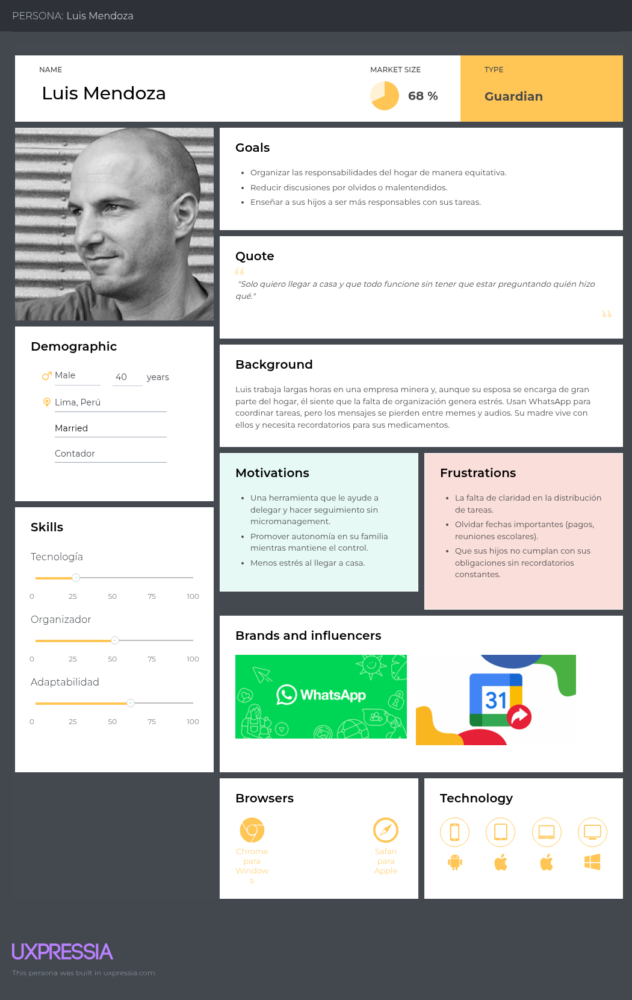
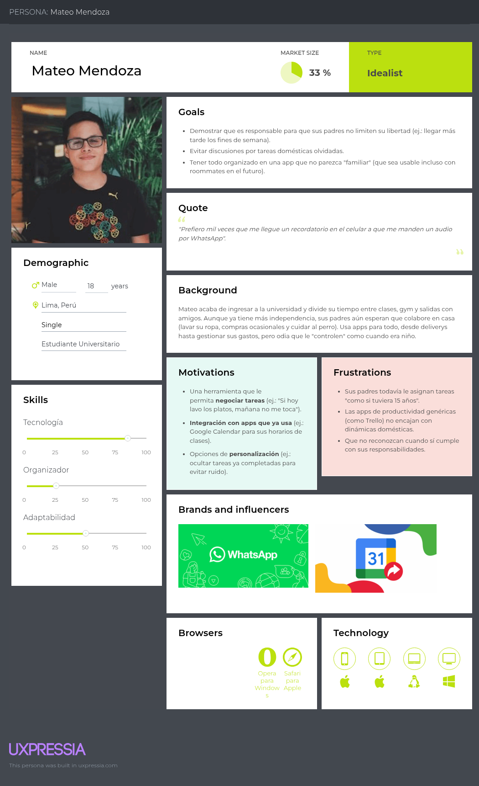
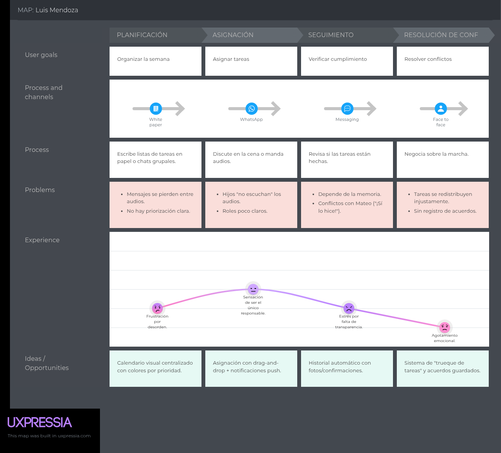
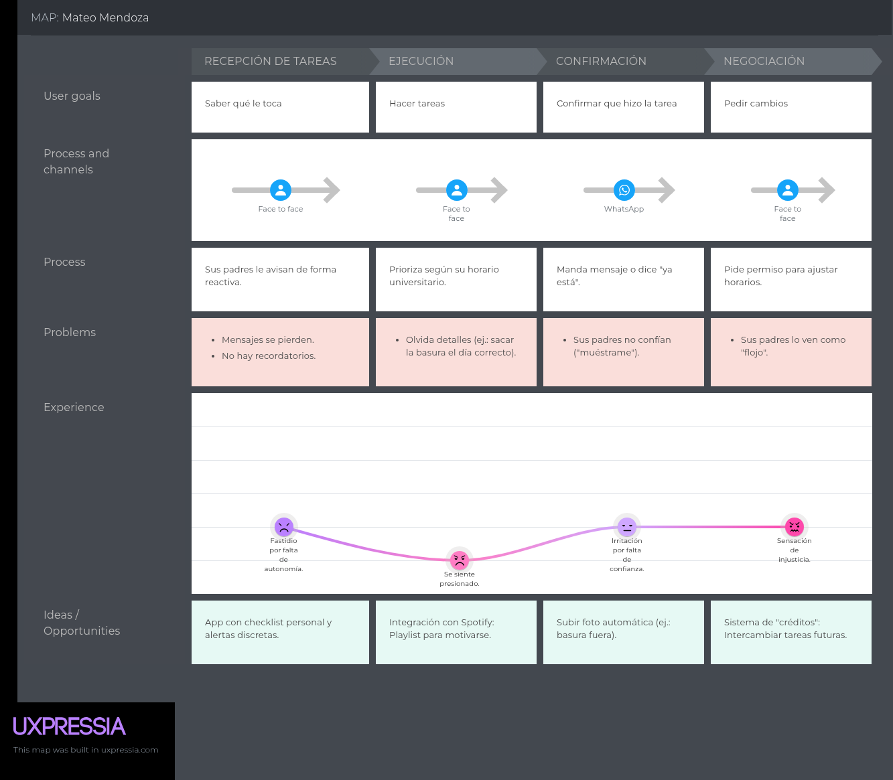
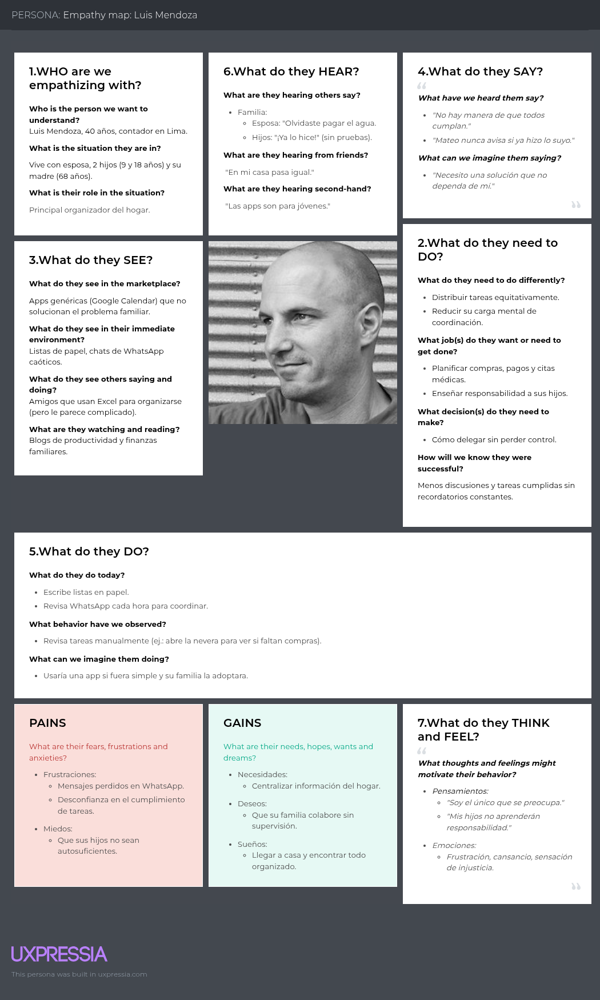
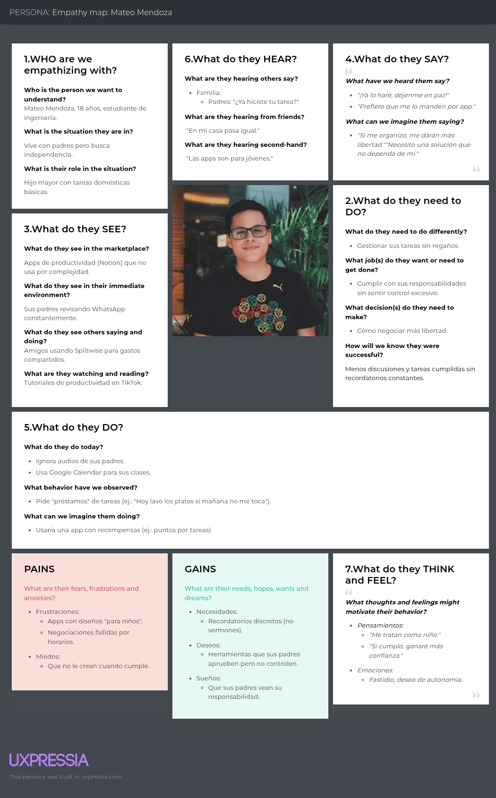

# Universidad Peruana de Ciencias Aplicadas

### **CURSO:** Aplicaciones para Dispositivos Moviles

### **NRC**: 358

### **Profesor:** Eduardo Martin Reyes Rodriguez

### **Ingeniería de software**

## Informe de Trabajo Final

### **Nombre del startup:** NRG4

### **Nombre del producto:** SynHome

## **Integrantes**

| **Nombre**                                | **Codigo** |
| ----------------------------------------- | ---------- |
| **Alejo Cardenas Jose Antonio**           | U202122484 |
| **Astonitas Díaz Juan Diego**            | U202110237 |
| **Casas Sanchez Gabriel Alexander**       | U202220033 |
| **Pacheco Astiguetta Sebastian**          | U202110291 |
| **Pasquale Barrenechea Gianluca Santino** | U202112078 |

**Abril 2025**

## Registro de Versiones del Informe

| Versión | Fecha | Autor | Descripción de modificación |
| -------- | ----- | ----- | ----------------------------- |

## Project Report Collaboration Insights

## Contenido

- [Student Outcome](#student-outcome)
- [Objetivos SMART](#objetivos-smart)
- [Capitulo I: Presentación](#capitulo-i)
  - [1.1. Startup Profile](#11-startup-profile)
    - [1.1.1. Descripción de la Startup](#111-descripcion-de-la-startup)
    - [1.1.2. Perfiles de integrantes del equipo](#112-perfiles-de-integrantes-del-equipo)
  - [1.2. Solution Profile](#12-solution-profile)
    - [1.2.1. Antecedentes y problemática](#121-antecedentes-y-problematica)
    - [1.2.2. Lean UX Process](#122-lean-ux-process)
      - [1.2.2.1. Lean UX Problem Statements](#1221-lean-ux-problem-statements)
      - [1.2.2.2. Lean UX Assumptions](#1222-lean-ux-assumptions)
      - [1.2.2.3. Lean UX Hypothesis Statements](#1223-lean-ux-hypothesis-statements)
      - [1.2.2.4. Lean UX Canvas](#1224-lean-ux-canvas)
  - [1.3. Segmentos Objetivo](#13-segmentos-objetivo)
- [Capítulo II: Requirements Elicitation & Analysis](#capitulo-ii)
  - [2.1. Competidores](#21-competidores)
    - [2.1.1. Análisis competitivo ](#211-analisis-competitivo)
    - [2.1.2. Estrategias y tácticas frente a competidores](#212-estrategias-y-tacticas-frente-a-competidores)
  - [2.2. Entrevistas](#22-entrevistas)
    - [2.2.1. Diseño de entrevistas ](#221-diseno-de-entrevistas)
    - [2.2.2. Registro de entrevistas](#222-registro-de-entrevistas)
    - [2.2.3. Análisis de entrevistas](#223-analisis-de-entrevistas)
  - [2.3. Needfinding](#23-needfinding)
    - [2.3.1. User Personas](#231-user-personas)
    - [2.3.2. User Task Matrix](#232-user-task-matrix)
    - [2.3.3. User Journey Mapping](#233-user-journey-mapping)
    - [2.3.4. Empathy Mapping](#234-empathy-mapping)
    - [2.3.5. As-is Scenario Mapping](#235-as-is-scenario-mapping)
  - [2.4. Ubiquitous Language](#24-ubiquitous-language)
- [Capítulo III: Requirements specification](#capitulo-iii)
  - [3.1. To-Be Scenario Mapping](#251-to-be-scenario-mapping)
  - [3.2. User Stories](#252-user-stories)
  - [3.3. Impact Mapping](#253-impact-mapping)
  - [3.4. Product Backlog](#254-product-backlog)
- [Capítulo IV: Solution Software Design](#capitulo-iv)
  - [4.1. Strategic-Level Domain-Driven Design](#41-strategic-level-domain-driven-design)
    - [4.1.1. EventStorming](#411-eventstorming)
      - [4.1.1.1. Candidate Context Discovery](#4111-candidate-context-discovery)
      - [4.1.1.2. Domain Message Flows Modeling](#4112-domain-message-flows-modeling)
      - [4.1.1.3. Bounded Context Canvases](#4113-bounded-context-canvases)
    - [4.1.2. Context Mapping](#412-context-mapping)
    - [4.1.3. Software Architecture](#413-software-architecture)
      - [4.1.3.1. Software Architecture Context Level Diagrams](#4131-software-architecture-context-level-diagrams)
      - [4.1.3.2. Software Architecture Container Level Diagrams](#4132-software-architecture-container-level-diagrams)
      - [4.1.3.3. Software Architecture Deployment Diagrams](#4133-software-architecture-deployment-diagrams)
  - [4.2. Tactical-Level Domain-Driven Design](#42-tactical-level-domain-driven-design)
    - [4.2.1. Bounded Context:](#421-bounded-context)
      - [4.2.1.1. Domain Layer](#4211-domain-layer)
      - [4.2.1.2. Interface Layer](#4212-interface-layer)
      - [4.2.1.3. Application Layer](#4213-application-layer)
      - [4.2.1.4. Infrastructure Layer](#4214-infrastructure-layer)
      - [4.2.1.5. Bounded Context Software Architecture Component Level Diagrams](#4215-bounded-context-software-architecture-component-level-diagrams)
      - [4.2.1.6. Bounded Context Software Architecture Code Level Diagrams](#4216-bounded-context-software-architecture-code-level-diagrams)
        - [4.2.1.6.1. Bounded Context Domain Layer Class Diagrams](#42161-bounded-context-domain-layer-class-diagrams)
        - [4.2.1.6.2. Bounded Context Database Design Diagram](#42162-bounded-context-database-design-diagram)
- [Capítulo V: Solution UI/UX Design](#capitulo-v)
  - [5.1. Product Design](#51-product-design)
    - [5.1.1. Style Guidelines](#511-style-guidelines)
      - [5.1.1.1. General Style Guidelines](#5111-general-style-guidelines)
    - [5.1.2. Information Architecture](#512-information-architecture)
      - [5.1.2.1. Organization Systems](#5121-organization-systems)
      - [5.1.2.2. Labeling Systems](#5122-labeling-systems)
      - [5.1.2.3. SEO Tags and Meta Tags](#5123-seo-tags-and-meta-tags)
      - [5.1.2.4. Searching Systems](#5124-searching-systems)
      - [5.1.2.5. Navigation Systems](#5125-navigation-systems)
    - [5.1.3. Landing Page UI Design](#513-landing-page-ui-design)
      - [5.1.3.1. Landing Page Wireframe](#5131-landing-page-wireframe)
      - [5.1.3.2. Landing Page Mock-up](#5132-landing-page-mock-up)
    - [5.1.4. Mobile Applications UX/UI Design](#514-mobile-applications-ux-ui-design)
      - [5.1.4.1. Mobile Applications Wireframes](#5141-mobile-applications-wireframes)
      - [5.1.4.2. Mobile Applications Wireflow Diagrams](#5142-mobile-applications-wireflow-diagrams)
      - [5.1.4.3. Mobile Applications Mock-ups](#5143-mobile-applications-mock-ups)
      - [5.1.4.4. Mobile Applications User Flow Diagrams](#5144-mobile-applications-user-flow-diagrams)
      - [5.1.4.5. Mobile Applications Prototyping](#5145-mobile-applications-prototyping)
- [Capítulo VI: Product Implementation, Validation & Deployment](#capitulo-vi)
  - [6.1. Software Configuration Management](#61-software-configuration-management)
    - [6.1.1. Software Development Environment Configuration](#611-software-development-environment-configuration)
    - [6.1.2. Source Code Management](#612-source-code-management)
    - [6.1.3. Source Code Style Guide & Conventions](#613-source-code-style-guide--conventions)
    - [6.1.4. Software Deployment Configuration](#614-software-deployment-configuration)
  - [6.2. Landing Page & Mobile Application Implementation](#62-landing-page--mobile-application-implementation)
    - [6.2.1. Sprint 1](#621-sprint-1)
      - [6.2.1.1. Sprint Planning 1](#6211-sprint-planning-1)
      - [6.2.1.2. Sprint Backlog 1](#6212-sprint-backlog-1)
      - [6.2.1.3. Development Evidence for Sprint Review](#6213-development-evidence-for-sprint-review)
      - [6.2.1.4. Testing Suite Evidence for Sprint Review](#6214-testing-suite-evidence-for-sprint-review)
      - [6.2.1.5. Execution Evidence for Sprint Review](#6215-execution-evidence-for-sprint-review)
      - [6.2.1.6. Services Documentation Evidence for Sprint Review](#6216-services-documentation-evidence-for-sprint-review)
      - [6.2.1.7. Software Deployment Evidence for Sprint Review](#6217-software-deployment-evidence-for-sprint-review)
      - [6.2.1.8. Team Collaboration Insights during Sprint](#6218-team-collaboration-insights-during-sprint)
  - [6.3. Validation Interviews](#63-validation-interviews)
    - [6.3.1. Diseño de entrevistas](#631-diseno-de-entrevistas)
    - [6.3.2. Registro de entrevistas](#632-registro-de-entrevistas)
    - [6.3.3. Evaluaciones según heurísticas](#633-evaluaciones-segun-heuristicas)
  - [6.4. Video About-the-Product](#64-video-about-the-product)
- [Conclusiones](#conclusiones)
- [Bibliografía](#bibliografía)
- [Anexos](#anexos)

## Student Outcome

## Objetivos SMART

## Capitulo I

### 1.1. Startup Profile

#### 1.1.1. Descripción de la Startup

#### 1.1.2. Perfiles de integrantes del equipo

### 1.2. Solution Profile

#### 1.2.1. Antecedentes y problemática

#### 1.2.2. Lean UX Process

##### 1.2.2.1. Lean UX Problem Statements

##### 1.2.2.2. Lean UX Assumptions

##### 1.2.2.3. Lean UX Hypothesis Statements

##### 1.2.2.4. Lean UX Canvas

### 1.3. Segmentos Objetivo

## Capítulo II: Requirements Elicitation & Analysis

### 2.1. Competidores

En esta sección, se presenta un análisis de los principales competidores de nuestra startup, centrado en aquellos que operan con modelos de negocio digitales similares o que, aunque no sean idénticos, ofrecen productos o servicios que se superponen parcialmente con los de SynHome. Evaluamos tanto competidores directos, que se encuentran en el mismo segmento de mercado, como competidores indirectos, que abordan áreas relacionadas como el uso de calendarios, horarios, sistemas de recompensas,etc .

**1. Asana**

**Descripción:**

Asana es una herramienta de gestión de proyectos que permite a los equipos organizar tareas, asignar responsabilidades y seguir el progreso de los proyectos.**Ofrece múltiples vistas, como listas, tableros Kanban y calendarios, facilitando la personalización según las necesidades del equipo.

**Características principales:**

* **Proyectos y tareas** organizados en listas, tableros Kanban, calendarios y cronogramas.
* **Subtareas y dependencias** para definir pasos y secuencias de trabajo.
* **Colaboración**: asignación de tareas, comentarios, archivos adjuntos.
* **Notificaciones y recordatorios** por correo y en app.
* **Informes y seguimiento** de progreso (gráficas, porcentaje completado).
* **Integraciones** con Slack, Google Drive, Microsoft Teams, etc.
* **App móvil** intuitiva, con acceso a tareas, calendario y colaboración.

---

**2. FamilyWall**

**Descripción:**

FamilyWall es una plataforma familiar digital que integra varias funciones en un solo espacio. Su diseño visual y amigable la hace ideal para familias con hijos de diferentes edades.

**Principales características:**

* **Calendario familiar compartido** y sincronización con Google/Outlook.
* **Ubicación en tiempo real** (ideal para saber dónde están los hijos).
* **Listas de tareas y compras** colaborativas.
* **Mensajería privada o grupal**.
* **Galería multimedia compartida** (fotos y videos familiares).

---

**3. ClickUp**

**Descripción:**

ClickUp es una plataforma todo-en-uno que ofrece funciones de gestión de tareas, documentos, objetivos y más.**Es conocida por su alta personalización y adaptabilidad a diferentes flujos de trabajo.

**Características principales:**

* **Jerarquía flexible**: espacios, carpetas, listas, tareas y subtareas.
* **Vistas múltiples**: lista, tablero, calendario, Gantt, cronología, workload.
* **Seguimiento de tiempo** incluido (sin integraciones externas).
* **Docs internos**, notas y wikis colaborativos.
* **Gestión de metas y OKRs** (objectives and key results).
* **Automatizaciones personalizadas**.
* **Comentarios con menciones**, edición colaborativa.
* **Plantillas reutilizables** para tareas o proyectos.
* **App móvil** potente, aunque puede ser compleja para usuarios nuevos.

---

**4. Monday.com**

**Descripción:**

Monday.com proporciona una interfaz visual para planificar, rastrear y colaborar en proyectos.**Ofrece integraciones con diversas herramientas y es apreciada por su facilidad de uso y escalabilidad.

**Características principales:**

* **Tablas visuales** personalizables para tareas, flujos, y procesos.
* **Elementos configurables**: estado, fecha, texto, números, personas, etiquetas.
* **Automatizaciones fáciles** (si sucede X, entonces haz Y).
* **Vistas de calendario, cronograma, Kanban y workload**.
* **Colaboración por columnas** con comentarios y archivos.
* **Integraciones** con Gmail, Outlook, Zoom, Google Drive, etc.
* **Búsqueda y filtros** potentes.
* **App móvil** clara, amigable y funcional.

#### 2.1.1. Análisis competitivo<table>

<table> 
  <tr>
    <th colspan="6"> Competitive Analysis Landscape </th>
  </tr>
  <tr>
    <td colspan="2" rowspan="2">¿Por qué llevar acabo este análisis? </td>
    <td colspan="4"> Pregunta </td>
  </tr>
  <tr>
    <td colspan="4"> Deberiamos llevar a cabo este analisis para conocer el entorno, la competencia, tomar decisiones de desarrollo  y construir nuestra propuesta de valor.  </td>
  </tr>
  <tr>
    <td colspan="2"> Productos </td>
    <td style="text-align: center;">  
SynHub
   </td>
    <td style="text-align: center;"> 
Asana
   </td>
    <td style="text-align: center;"> 
FamilyWall
   </td>
    <td style="text-align: center;"> 
ClickUp
   </td>
  </tr>
  <tr>
    <td rowspan="2">Perfil</td>
    <td>Overview</td>
    <td> SynHub es una plataforma digital colaborativa diseñada para facilitar la organización y gestión de actividades de grupos o equipos de trabajo de cualquier tipo: laborales, académicos, sociales. </td>
    <td> Plataforma de gestión de proyectos y tareas diseñada para ayudar a los equipos a organizar, rastrear y gestionar su trabajo. Ofrece diversas vistas como listas, tableros Kanban y calendarios para facilitar la planificación y el seguimiento de proyectos.</td>
    <td> FamilyWall plataforma de gestión familiar diseñada para ayudar a las familias a organizar su vida diaria. Ofrece funciones para coordinar calendarios, tareas, mensajes, fotos y más. </td>
    <td> ClickUp es una plataforma todo-en-uno que ofrece herramientas para la gestión de tareas, documentos, objetivos y más, con un alto grado de personalización para adaptarse a diferentes flujos de trabajo. </td>
  </tr>
  <tr>
    <td>Ventaja competitiva ¿Qué valor ofrece a los clientes? </td>
    <td> Potencia la corresponsabilidad con funciones como seguimiento de cumplimiento, historial de tareas y visualización de carga de trabajo. </td>
    <td> Asana destaca por su interfaz intuitiva y facilidad de uso, permitiendo a los equipos adaptarse rápidamente a la plataforma. Su capacidad para integrarse con numerosas herramientas de terceros amplía su funcionalidad y la hace versátil para diferentes tipos de equipos. </td>
    <td> Ayuda a mejorar la comunicación familiar mediante el chat y las actualizaciones compartidas. </td>
    <td> Su capacidad de personalización y la amplia variedad de funciones integradas en una sola plataforma la hacen atractiva para equipos que buscan consolidar múltiples herramientas en una. </td>
  </tr>
  <tr>
    <td rowspan="2">Perfil de Marketing</td>
    <td> Mercado Objetivo </td>
    <td> Grupos académicos o universitarios (estudiantes, equipos de proyecto, docentes), familias que buscan distribuir y asignar tareas del hogar y equipos que buscan una herramienta flexible, económica y con curva de aprendizaje baja. </td>
    <td> Empresas de todos los tamaños que buscan una solución eficiente para la gestión de proyectos y tareas, desde startups hasta grandes corporaciones. </td>
    <td> Familias que buscan una plataforma unificada para coordinar actividades y compartir momentos. </td>
    <td> Equipos y empresas de diversos tamaños que buscan una solución integral para la gestión de proyectos y tareas, especialmente aquellos que requieren alta personalización. </td>
  </tr>
  <tr>
    <td> Estrategias de Marketing </td>
    <td> Pruebas gratuitas y versiones premium: Ofrecer una versión gratuita básica y luego incentivar la migración a la versión premium con funciones avanzadas. </td>
    <td> Asana utiliza contenido educativo, como guías y webinars, para atraer y educar a su audiencia. Además, ofrece una versión gratuita con funcionalidades básicas para captar usuarios que luego pueden optar por planes premium. </td>
    <td> Ofrecen pruebas gratuitas para fomentar la adopción. </td>
    <td> ClickUp se centra en destacar su versatilidad y capacidad todo-en-uno. Utiliza contenido educativo, testimonios de clientes y comparativas con otras herramientas para demostrar su valor. </td>
  </tr>
<td rowspan="3">Perfil de Producto</td>
    <td> Productos & Servicios </td>
    <td> Gestión de tareas familiares(responsabilidades a cada miembro del hogar), horario y calendario compartido (visible para todos los miembros), sistema de recompensas (motivación para los miembros más jóvenes de la familia). </td>
    <td> Gestión de tareas y proyectos, Vistas personalizadas: lista, tablero, calendario, Integraciones con herramientas como Slack, Google Drive y Microsoft Teams, Informes y seguimiento del progreso. </td>
    <td> Calendario compartido, listas de compras y tareas, mensajería privada, compartición de fotosy planificación de eventos familiares. </td>
    <td> Gestión de tareas y proyectos con múltiples vistas, Documentos y wikis colaborativos, Seguimiento del tiempo integrado y Automatizaciones personalizadas. </td>
  </tr>
  <tr>
    <td> Precios & Costos</td>
    <td> Plan Gratuito y Plan Premium – $6.99/usuario/mes </td>
    <td> Gratis: Funciones básicas para equipos pequeños y Premium: Mensual $13.49 y Anual $10.99 c/m . </td>
    <td> Premium por $4.99/mes o $29.99/año con características avanzadas. </td>
    <td> Gratis: Funciones básicas para equipos pequeños y Unlimited: Mensual $9 y Anual $10.99 c/m . </td>
  </tr>
  <tr>
    <td> Canales de distribución </td>
    <td> App móvil (Android / iOS) </td>
    <td> Disponible en plataforma web y aplicaciones móviles para iOS y Android. </td>
    <td> App Store y Google Play Store. </td>
    <td> Disponible en plataforma web y aplicaciones móviles para iOS y Android. </td>
  </tr>
<td rowspan="5">Análisis SWOT</td>
<tr>
    <td> Fortalezas </td>
    <td> Versatilidad para distintos tipos de equipos y contextos. </td>
    <td> Interfaz intuitiva y fácil de usar. </td>
    <td> Funciones completas para gestionar la familia en un solo lugar. </td>
    <td> Alta personalización y flexibilidad en flujos de trabajo. </td>
  </tr>
<tr>
    <td> Debilidades</td>
    <td> Marca nueva: carece de reconocimiento y reputación. </td>
    <td> Limitaciones en la personalización de flujos de trabajo complejos. </td>
    <td> La versión gratuita tiene restricciones significativas. </td>
    <td> Curva de aprendizaje pronunciada debido a la cantidad de funciones. </td>
  </tr>
<tr>
    <td> Oportunidades</td>
    <td> Penetrar en mercados que no están siendo bien servidos por soluciones complejas. </td>
    <td> Expansión en mercados internacionales emergentes. </td>
    <td> Expansión en la gestión de actividades educativas. </td>
    <td> Expansión en sectores específicos que requieren soluciones personalizadas. </td>
  </tr>
<tr>
    <td> Amenazas</td>
    <td> Grandes plataformas podrían lanzar versiones más económicas para captar a este nicho. </td>
    <td> Competencia creciente en el sector de herramientas de gestión de proyectos. </td>
    <td> La falta de integraciones con otras plataformas populares como Google Calendar. </td>
    <td> Competencia con herramientas especializadas que pueden ofrecer soluciones más simples. </td>
  </tr>
</table>

#### 2.1.2. Estrategias y tácticas frente a competidores

**1. Estrategia de Diferenciación por Simplicidad y Usabilidad**

**Objetivo:** Posicionar a SynHub como la opción más intuitiva, fácil de usar y accesible para todo tipo de grupos (no solo empresas).

**Tácticas:**

* Diseñar una **interfaz limpia y visual**, con navegación amigable incluso para usuarios sin experiencia en apps de gestión.
* Implementar un **proceso de onboarding rápido** (menos de 2 minutos para crear un grupo y asignar tareas).
* Ofrecer **tutoriales interactivos**, ayuda contextual y videos cortos integrados en la app.
* En comparación con Asana y ClickUp, enfatizar: *“No necesitas ser experto para organizarte bien”*.

**2. Estrategia de Enfoque en Nichos Desatendidos**

**Objetivo:** Atacar segmentos específicos como equipos académicos, voluntarios, universitarios, comunidades o grupos familiares avanzados.

**Tácticas:**

* Crear plantillas y funciones específicas para grupos no empresariales (ej: calendario de clases, tareas compartidas, roles para miembros del hogar, etc.).
* FamilyWall cubre familias, pero SynHub puede expandirse hacia **"equipos híbridos": familia + trabajo + estudio**.

**3. Estrategia de Humanización y Cercanía de Marca**

**Objetivo:** Ganarse la confianza de usuarios por medio de comunicación cercana, soporte cálido y experiencia de usuario emocionalmente positiva.

**Tácticas:**

* Ofrecer un **soporte al cliente rápido y empático**, especialmente en etapas iniciales.
* Utilizar un **lenguaje humano y accesible** en toda la plataforma (evitar tecnicismos).
* A diferencia de Asana y ClickUp, donde la marca es más corporativa, **SynHub puede mostrarse como una plataforma "hecha por y para personas reales"**.

**4. Estrategia de Precio Accesible y Transparente**

**Objetivo:** Atraer a usuarios que buscan funcionalidades potentes sin pagar precios empresariales.

**Tácticas:**

* Diseñar una estructura de precios clara, con un **plan gratuito funcional** y un **plan premium económico** (más barato que ClickUp o Asana).
* Ofrecer descuentos especiales para grupos educativos o sin fines de lucro.
* Incluir funcionalidades importantes sin obligar al usuario a escalar de plan por todo.

### 2.2. Entrevistas

En esta sección del informe se realizará el diseño, registro y análisis de las entrevistas de nuestros segmentos objetivos.

#### 2.2.1. Diseño de entrevistas

**1. Entrevista para el Coordinador o Líder de Grupo**

* Preguntas principales:

1.¿Podrías contarme un poco sobre ti? (edad, ocupación, lugar de residencia, estado civil)

2.¿A qué tipo de grupo o equipos perteneces o lideras actualmente?

3.¿Cuál es tu rol dentro de ese grupo?

* -Preguntas complementarias:

4.¿Con qué frecuencia se reúnen o interactúan?

5.Cuántas personas conforman el grupo o equipo que lideras?

6.¿Qué herramientas o plataformas digitales utilizas para coordinar al equipo?

7.¿Sueles tener problemas con la puntualidad, comunicación o cumplimiento?

8.¿Qué dispositivos usas más frecuentemente para organizarte (móvil, laptop, tablet)?

9.¿Usas redes sociales, apps colaborativas o agendas digitales?

10.¿Qué valoras más en una herramienta para organizar a tu equipo?

**2. Entrevista para el Miembro del Equipo o Grupo**

* Preguntas principales:

1.¿Podrías contarme un poco sobre ti? (edad, ocupación, lugar de residencia, estado civil)

2.¿A qué tipo de grupo o equipo perteneces actualmente?

3.¿Cuál es tu rol dentro del grupo? (por ejemplo: participante, colaborador, voluntario)

* Preguntas complementarias:

4.¿Qué tipo de tareas realizas habitualmente?

5.¿Qué herramientas o plataformas digitales utilizas para conocer tus actividades en el equipo?

6.¿Cómo te enteras de tus responsabilidades dentro del grupo?

7.¿Qué cosas te molestan o dificultan al trabajar en grupo?

8.¿Qué tipo de apps o plataformas te gustan más? (Ej: fáciles de usar, visuales, rápidas)

9.¿Usas más el celular o la computadora para tus tareas diarias?

10.¿Qué tipo de apps o plataformas te gustan más? (Ej: fáciles de usar, visuales, rápidas)

#### 2.2.2. Registro de entrevistas

#### 2.2.3. Análisis de entrevistas

### 2.3. Needfinding

#### 2.3.1. User Personas

En esta sección, mostraremos los perfiles de los usuarios que hemos definido para nuestro producto. Estos perfiles nos ayudaran a entender mejor las necesidades y expectativas de nuestros usuarios.

**1. User Persona: Coordinador de equipos**

**2. User Persona: Miembro de equipo**

#### 2.3.2. User Task Matrix

**1. Segmento 1: Coordinadores o Líderes de Grupo**

<table cellpadding="8" cellspacing="0">
  <thead>
    <tr>
      <th colspan="3">Coordinador o Líder de Grupo</th>
    </tr>
    <tr>
      <th>Tarea</th>
      <th>Frecuencia</th>
      <th>Severidad</th>
    </tr>
  </thead>
  <tbody>
    <tr>
      <td>Seleccion de miembros y objetivo</td>
      <td>Alta</td>
      <td>Medio</td>
    </tr>
    <tr>
      <td>Creacion de grupos y horarios</td>
      <td>Baja</td>
      <td>Alta</td>
    </tr>
    <tr>
      <td>Coordina reuniones por distintos medios</td>
      <td>Media</td>
      <td>Media</td>
    </tr>
    <tr>
      <td>Asigna tareas a los miembros del grupo</td>
      <td>Alta</td>
      <td>Alta</td>
    </tr>
    <tr>
      <td>Supervisar y actualizar avances de los miembros</td>
      <td>Alta</td>
      <td>Alta</td>
    </tr>
    <tr>
      <td>Recolectar informacion dispersa de todos los miembros</td>
      <td>Alta</td>
      <td>Alta</td>
    </tr>
    <tr>
      <td>Identificar mejoras apartir de las concluciones finales</td>
      <td>Media</td>
      <td>Baja</td>
    </tr>
  </tbody>
</table>

**2. Segmento 2: Miembros del Equipo o Grupo**

<table cellpadding="8" cellspacing="0">
  <thead>
    <tr>
      <th colspan="3">Miembro del Equipo o Grupo</th>
    </tr>
    <tr>
      <th>Tarea</th>
      <th>Frecuencia</th>
      <th>Severidad</th>
    </tr>
  </thead>
  <tbody>
    <tr>
      <td>Revisar los miembros y objetivo del grupo</td>
      <td>Baja</td>
      <td>Media</td>
    </tr>
    <tr>
      <td>Revisar horarios y organización del grupo</td>
      <td>Alta</td>
      <td>Alta</td>
    </tr>
    <tr>
      <td>Asistir a reuniones coordinadas por el líder</td>
      <td>Media</td>
      <td>Alta</td>
    </tr>
    <tr>
      <td>Realizar tareas asignadas según cronograma</td>
      <td>Alta</td>
      <td>Alta</td>
    </tr>
    <tr>
      <td>Actualizar al líder sobre el avance de sus tareas</td>
      <td>Alta</td>
      <td>Alta</td>
    </tr>
    <tr>
      <td>Compartir información y hallazgos con el lider</td>
      <td>Media</td>
      <td>Media</td>
    </tr>
    <tr>
      <td>Reflexionar sobre mejoras personales o del grupo</td>
      <td>Baja</td>
      <td>Media</td>
    </tr>
  </tbody>
</table>

#### 2.3.3. User Journey Mapping

En esta sección, se presenta el mapa de viaje del usuario, que ilustra las etapas y experiencias de los usuarios al interactuar con nuestro producto. Este mapa nos ayudará a identificar oportunidades de mejora y a comprender mejor las necesidades de nuestros usuarios.

**1. User Journey: Coordinador de equipos**

**2. User Journey: Miembro de equipo**

#### 2.3.4. Empathy Mapping

En esta sección, se presenta el mapa de empatía, que nos ayudará a comprender mejor las emociones, pensamientos y necesidades de nuestros usuarios. Este mapa es una herramienta valiosa para identificar oportunidades de mejora en la experiencia del usuario.

**1. Empathy Map: Coordinador de equipos**

**2. Empathy Map: Miembro de equipo**

#### 2.3.5. As-is Scenario Mapping

**1. Segmento 1: Coordinadores o Líderes de Grupo**

**2. Segmento 2: Miembros del Equipo o Grupo**

### 2.4. Ubiquitous Language

<table cellpadding="8" cellspacing="0">
  <tr>
    <th colspan="3">📘 Ubiquitous Language</th>
  </tr>
  <tr>
    <th style="text-align: left;">Término (en inglés)</th>
    <th style="text-align: left;">Término (en español)</th>
    <th style="text-align: left;">Definición (en español)</th>
  </tr>
  <tr>
    <td>Task</td>
    <td>Tarea</td>
    <td>Acción específica asignada a un miembro del grupo para ser completada en un periodo.</td>
  </tr>
  <tr>
    <td>Group</td>
    <td>Grupo</td>
    <td>Conjunto de personas que colaboran en actividades comunes dentro de SynHub.</td>
  </tr>
  <tr>
    <td>Responsibility</td>
    <td>Responsabilidad</td>
    <td>Obligación asumida por un miembro del grupo respecto a una o varias tareas asignadas.</td>
  </tr>
  <tr>
    <td>Task History</td>
    <td>Historial de tareas</td>
    <td>Registro cronológico de tareas realizadas, canceladas o pendientes.</td>
  </tr>
  <tr>
    <td>Shared Calendar</td>
    <td>Calendario compartido</td>
    <td>Herramienta visual que muestra los eventos, plazos y tareas de todos los miembros.</td>
  </tr>
  <tr>
    <td>Workload View</td>
    <td>Visualización de carga</td>
    <td>Representación gráfica del volumen de tareas por miembro, útil para balancear el trabajo.</td>
  </tr>
  <tr>
    <td>Reward System</td>
    <td>Sistema de recompensas</td>
    <td>Mecanismo para motivar el cumplimiento de tareas mediante premios o reconocimientos.</td>
  </tr>
  <tr>
    <td>Notification</td>
    <td>Notificación</td>
    <td>Aviso que informa a los usuarios sobre actualizaciones, nuevas tareas o recordatorios.</td>
  </tr>
  <tr>
    <td>Role</td>
    <td>Rol</td>
    <td>Función asignada dentro del grupo (como líder, miembro, colaborador).</td>
  </tr>
  <tr>
    <td>Subtask</td>
    <td>Subtarea</td>
    <td>Tarea secundaria dentro de una tarea principal que ayuda a dividir el trabajo.</td>
  </tr>
  <tr>
    <td>Task Status</td>
    <td>Estado de tarea</td>
    <td>Situación actual de una tarea (ej. pendiente, en progreso, completada, cancelada).</td>
  </tr>
  <tr>
    <td>Member</td>
    <td>Miembro</td>
    <td>Usuario que forma parte de un grupo dentro de la aplicación SynHub.</td>
  </tr>
</table>

## Capítulo III: Requirements specification

### 3.1. To-Be Scenario Mapping

**1. Segmento 1: Coordinadores o Líderes de Grupo**

**2. Segmento 2: Miembros del Equipo o Grupo**

### 3.2. User Stories

### 3.3. Impact Mapping

### 3.4. Product Backlog

## Capítulo IV: Solution Software Design

### 4.1. Strategic-Level Domain-Driven Design

#### 4.1.1. EventStorming

##### 4.1.1.1. Candidate Context Discovery

##### 4.1.1.2. Domain Message Flows Modeling

##### 4.1.1.3. Bounded Context Canvases

#### 4.1.2. Context Mapping

#### 4.1.3. Software Architecture

##### 4.1.3.1. Software Architecture Context Level Diagrams

##### 4.1.3.2. Software Architecture Container Level Diagrams

##### 4.1.3.3. Software Architecture Deployment Diagrams

### 4.2. Tactical-Level Domain-Driven Design

#### 4.2.1. Bounded Context:

##### 4.2.1.1. Domain Layer

##### 4.2.1.2. Interface Layer

##### 4.2.1.3. Application Layer

##### 4.2.1.4. Infrastructure Layer

##### 4.2.1.5. Bounded Context Software Architecture Component Level Diagrams

##### 4.2.1.6. Bounded Context Software Architecture Code Level Diagrams

###### 4.2.1.6.1. Bounded Context Domain Layer Class Diagrams

###### 4.2.1.6.2. Bounded Context Database Design Diagram

## Capítulo V: Solution UI/UX Design

### 5.1. Product Design

#### 5.1.1. Style Guidelines

##### 5.1.1.1. General Style Guidelines

#### 5.1.2. Information Architecture

##### 5.1.2.1. Organization Systems

##### 5.1.2.2. Labeling Systems

##### 5.1.2.3. SEO Tags and Meta Tags

##### 5.1.2.4. Searching Systems

##### 5.1.2.5. Navigation Systems

#### 5.1.3. Landing Page UI Design

##### 5.1.3.1. Landing Page Wireframe

##### 5.1.3.2. Landing Page Mock-up

#### 5.1.4. Mobile Applications UX/UI Design

##### 5.1.4.1. Mobile Applications Wireframes

##### 5.1.4.2. Mobile Applications Wireflow Diagrams

##### 5.1.4.3. Mobile Applications Mock-ups

##### 5.1.4.4. Mobile Applications User Flow Diagrams

##### 5.1.4.5. Mobile Applications Prototyping

## Capítulo VI: Product Implementation, Validation & Deployment

### 6.1. Software Configuration Management

#### 6.1.1. Software Development Environment Configuration

#### 6.1.2. Source Code Management

#### 6.1.3. Source Code Style Guide & Conventions

#### 6.1.4. Software Deployment Configuration

### 6.2. Landing Page & Mobile Application Implementation

#### 6.2.1. Sprint 1

##### 6.2.1.1. Sprint Planning 1

##### 6.2.1.2. Sprint Backlog 1

##### 6.2.1.3. Development Evidence for Sprint Review

##### 6.2.1.4. Testing Suite Evidence for Sprint Review

##### 6.2.1.5. Execution Evidence for Sprint Review

##### 6.2.1.6. Services Documentation Evidence for Sprint Review

##### 6.2.1.7. Software Deployment Evidence for Sprint Review

##### 6.2.1.8. Team Collaboration Insights during Sprint

### 6.3. Validation Interviews

#### 6.3.1. Diseño de entrevistas

#### 6.3.2. Registro de entrevistas

#### 6.3.3. Evaluaciones según heurísticas

### 6.4. Video About-the-Product

## Conclusiones

## Bibliografía

## Anexos
