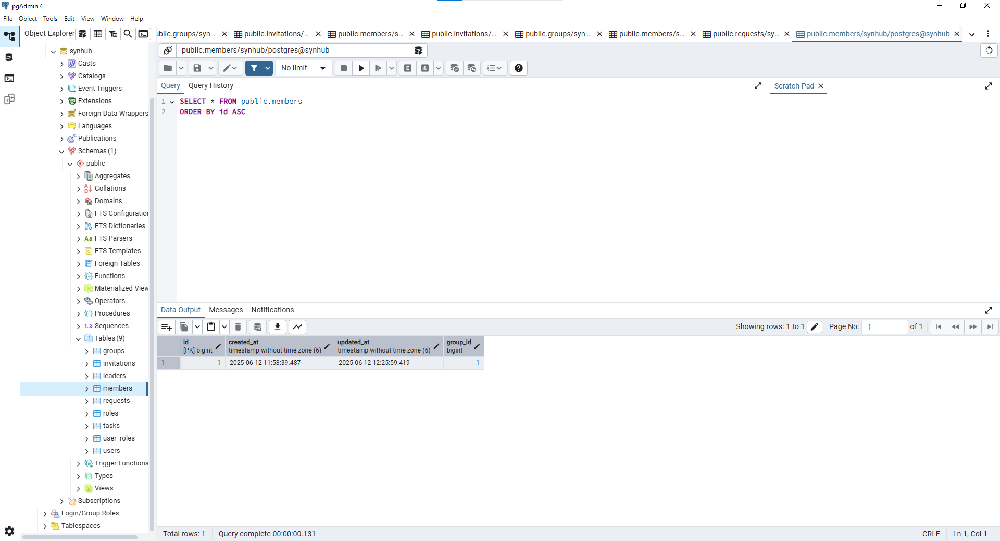
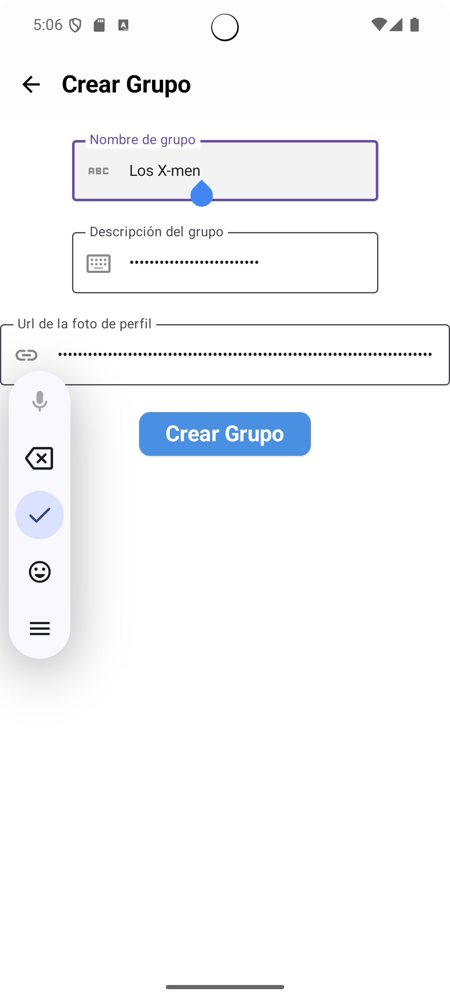
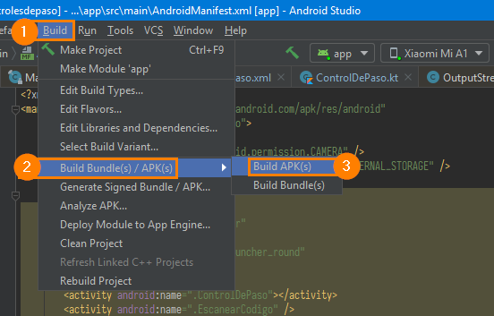
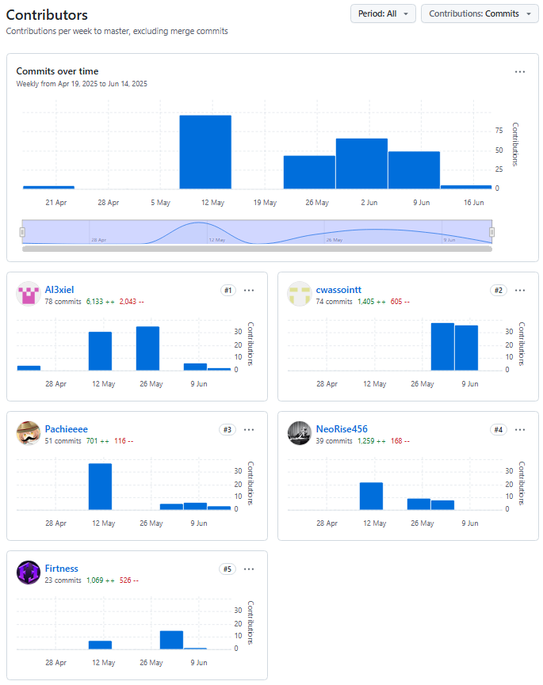
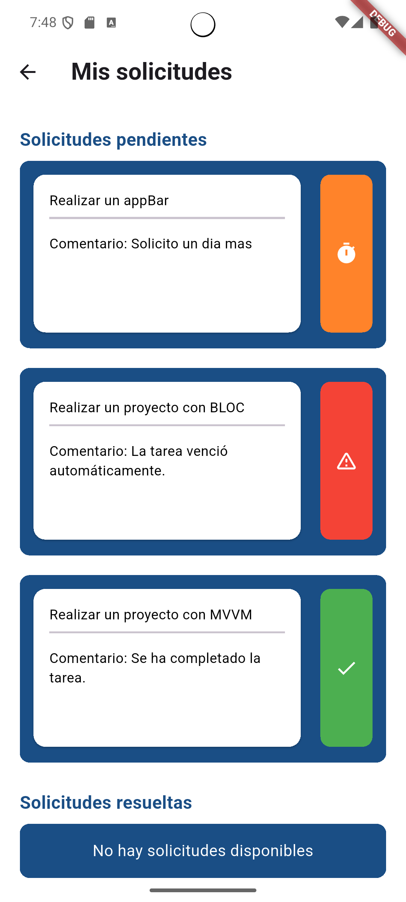
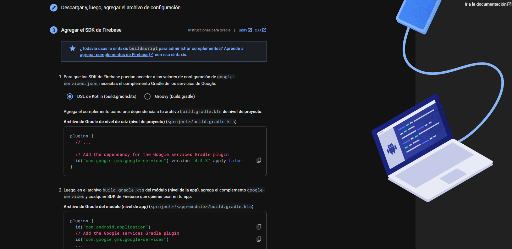
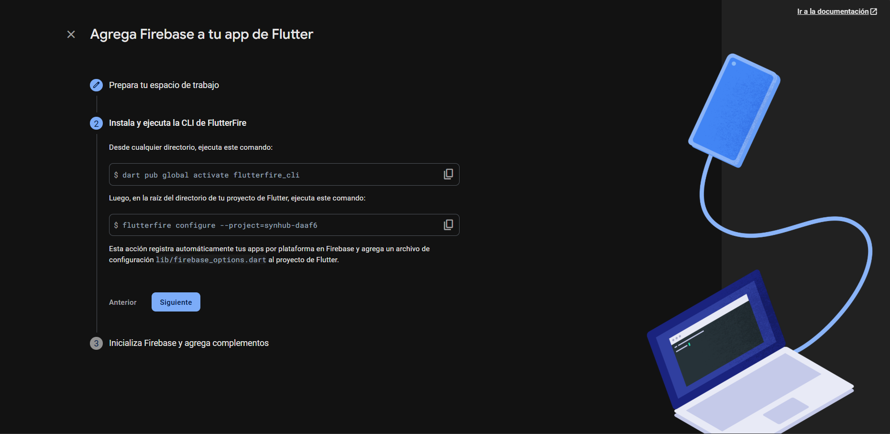
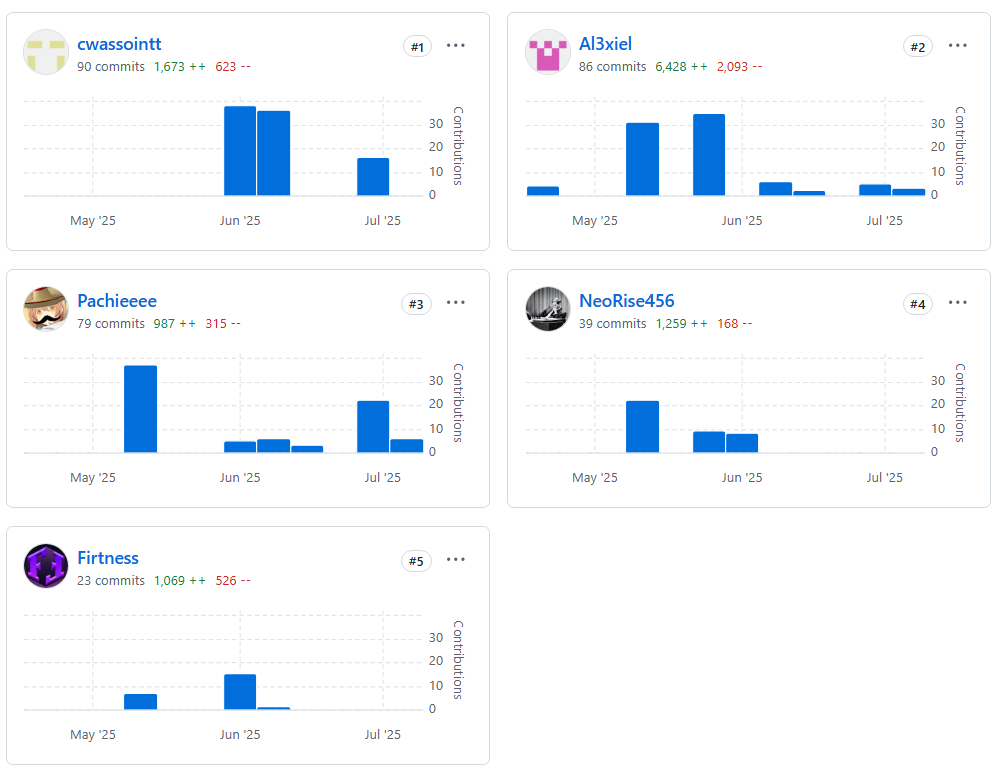

##### 6.2.1.6. Services Documentation Evidence for Sprint Review

Esta tabla presenta la documentación de los servicios implementados como evidencia para la revisión del sprint. Detalla los endpoints disponibles, sus métodos HTTP, descripciones breves de su funcionalidad y los parámetros requeridos, organizados por categorías como *Groups*, *Members*, *Tasks* y *Member Tasks*.

<table>
    <tr>
        <th colspan="1"> Tag </th>
        <th colspan="1"> Verbo http</th>
        <th colspan="1"> Endpoint </th>
        <th colspan="1"> Summary </th>
        <th colspan="1"> Description </th>
        <th colspan="1"> OperationId </th>
    </tr>
    <tr>
        <td colspan="1"> Groups </td>
        <td colspan="1"> GET </td>
        <td colspan="1"> /api/v1/group/{id} </td>
        <td colspan="1"> Get group by id </td>
        <td colspan="1"> Retrieve detailed information about a specific group by its ID </td>
        <td colspan="1"> getGroupById </td>
    </tr>
    <tr>
        <td colspan="1"> Parameters </td>
        <td colspan="2"> id </td>
        <td colspan="1"> Request body </td>
        <td colspan="2"> no </td>
    </tr>
    <tr>
        <td colspan="1"> Groups </td>
        <td colspan="1"> GET </td>
        <td colspan="1"> /api/v1/group/user/{userId} </td>
        <td colspan="1"> Get all user groups </td>
        <td colspan="1"> Retrieve all groups associated with a specific user </td>
        <td colspan="1"> getAllUserGroups </td>
    </tr>
    <tr>
        <td colspan="1"> Parameters </td>
        <td colspan="2"> userId </td>
        <td colspan="1"> Request body </td>
        <td colspan="2"> no </td>
    </tr>
    <tr>
        <td colspan="1"> Groups </td>
        <td colspan="1"> POST </td>
        <td colspan="1"> /api/v1/group </td>
        <td colspan="1"> Register new group </td>
        <td colspan="1"> Create a new group in the system </td>
        <td colspan="1"> registerGroup </td>
    </tr>
    <tr>
        <td colspan="1"> Parameters </td>
        <td colspan="2"> no </td>
        <td colspan="1"> Request body </td>
        <td colspan="2"> si </td>
    </tr>
    <tr>
        <td colspan="1"> Groups </td>
        <td colspan="1"> POST </td>
        <td colspan="1"> /api/v1/group/{groupId}/member/{userId} </td>
        <td colspan="1"> Add member to group </td>
        <td colspan="1"> Associate a user as a member of a specific group </td>
        <td colspan="1"> AddMemberToGroup </td>
    </tr>
    <tr>
        <td colspan="1"> Parameters </td>
        <td colspan="2"> groupId, userId </td>
        <td colspan="1"> Request body </td>
        <td colspan="2"> no </td>
    </tr>
    <tr>
        <td colspan="1"> Groups </td>
        <td colspan="1"> PUT </td>
        <td colspan="1"> /api/v1/group/{id} </td>
        <td colspan="1"> Update group </td>
        <td colspan="1"> Modify information of an existing group </td>
        <td colspan="1"> updateGroup </td>
    </tr>
    <tr>
        <td colspan="1"> Parameters </td>
        <td colspan="2"> id </td>
        <td colspan="1"> Request body </td>
        <td colspan="2"> si </td>
    </tr>
    <tr>
        <td colspan="1"> Groups </td>
        <td colspan="1"> DELETE </td>
        <td colspan="1"> /api/v1/group/{id} </td>
        <td colspan="1"> Delete group </td>
        <td colspan="1"> Remove a group from the system </td>
        <td colspan="1"> deleteGroup </td>
    </tr>
    <tr>
        <td colspan="1"> Parameters </td>
        <td colspan="2"> id </td>
        <td colspan="1"> Request body </td>
        <td colspan="2"> no </td>
    </tr>
    <tr>
        <td colspan="1"> Member Tasks </td>
        <td colspan="1"> GET </td>
        <td colspan="1"> /api/v1/{memberId}/tasks </td>
        <td colspan="1"> Get all tasks by member id </td>
        <td colspan="1"> Retrieve all tasks assigned to a specific member </td>
        <td colspan="1"> getAllTasksByMemberId </td>
    </tr>
    <tr>
        <td colspan="1"> Parameters </td>
        <td colspan="2"> memberId </td>
        <td colspan="1"> Request body </td>
        <td colspan="2"> no </td>
    </tr>
    <tr>
        <td colspan="1"> Member Tasks </td>
        <td colspan="1"> POST </td>
        <td colspan="1"> /api/v1/{memberId}/tasks </td>
        <td colspan="1"> Create new task </td>
        <td colspan="1"> Assign a new task to a specific member </td>
        <td colspan="1"> createNewTask </td>
    </tr>
    <tr>
        <td colspan="1"> Parameters </td>
        <td colspan="2"> memberId </td>
        <td colspan="1"> Request body </td>
        <td colspan="2"> si </td>
    </tr>
    <tr>
        <td colspan="1"> Members </td>
        <td colspan="1"> GET </td>
        <td colspan="1"> /api/v1/members </td>
        <td colspan="1"> Get all members </td>
        <td colspan="1"> Retrieve all members registered in the system </td>
        <td colspan="1"> getAllMembers </td>
    </tr>
    <tr>
        <td colspan="1"> Parameters </td>
        <td colspan="2"> no </td>
        <td colspan="1"> Request body </td>
        <td colspan="2"> no </td>
    </tr>
    <tr>
        <td colspan="1"> Members </td>
        <td colspan="1"> POST </td>
        <td colspan="1"> /api/v1/members </td>
        <td colspan="1"> Create new member </td>
        <td colspan="1"> Register a new member in the system </td>
        <td colspan="1"> createNewMember </td>
    </tr>
    <tr>
        <td colspan="1"> Parameters </td>
        <td colspan="2"> no </td>
        <td colspan="1"> Request body </td>
        <td colspan="2"> si </td>
    </tr>
    <tr>
        <td colspan="1"> Members </td>
        <td colspan="1"> GET </td>
        <td colspan="1"> /api/v1/members/{memberId} </td>
        <td colspan="1"> Get member by id </td>
        <td colspan="1"> Retrieve detailed information about a specific member </td>
        <td colspan="1"> getMemberById </td>
    </tr>
    <tr>
        <td colspan="1"> Parameters </td>
        <td colspan="2"> memberId </td>
        <td colspan="1"> Request body </td>
        <td colspan="2"> no </td>
    </tr>
    <tr>
        <td colspan="1"> Tasks </td>
        <td colspan="1"> GET </td>
        <td colspan="1"> /api/v1/tasks/{taskId} </td>
        <td colspan="1"> Get task by id </td>
        <td colspan="1"> Retrieve detailed information about a specific task </td>
        <td colspan="1"> getTaskById </td>
    </tr>
    <tr>
        <td colspan="1"> Parameters </td>
        <td colspan="2"> taskId </td>
        <td colspan="1"> Request body </td>
        <td colspan="2"> no </td>
    </tr>
    <tr>
        <td colspan="1"> Tasks </td>
        <td colspan="1"> PUT </td>
        <td colspan="1"> /api/v1/tasks/{taskId} </td>
        <td colspan="1"> Update task </td>
        <td colspan="1"> Modify information of an existing task </td>
        <td colspan="1"> updateTask </td>
    </tr>
    <tr>
        <td colspan="1"> Parameters </td>
        <td colspan="2"> taskId </td>
        <td colspan="1"> Request body </td>
        <td colspan="2"> si </td>
    </tr>
    <tr>
        <td colspan="1"> Tasks </td>
        <td colspan="1"> DELETE </td>
        <td colspan="1"> /api/v1/tasks/{taskId} </td>
        <td colspan="1"> Delete task by id </td>
        <td colspan="1"> Remove a task from the system </td>
        <td colspan="1"> deleteTaskById </td>
    </tr>
    <tr>
        <td colspan="1"> Parameters </td>
        <td colspan="2"> taskId </td>
        <td colspan="1"> Request body </td>
        <td colspan="2"> no </td>
    </tr>
    <tr>
        <td colspan="1"> Tasks </td>
        <td colspan="1"> PUT </td>
        <td colspan="1"> /api/v1/tasks/{taskId}/status/{status} </td>
        <td colspan="1"> Update task status </td>
        <td colspan="1"> Change the status of an existing task </td>
        <td colspan="1"> updateTaskStatus </td>
    </tr>
    <tr>
        <td colspan="1"> Parameters </td>
        <td colspan="2"> taskId, status </td>
        <td colspan="1"> Request body </td>
        <td colspan="2"> no </td>
    </tr>
    <tr>
        <td colspan="1"> Tasks </td>
        <td colspan="1"> GET </td>
        <td colspan="1"> /api/v1/tasks </td>
        <td colspan="1"> Get all tasks </td>
        <td colspan="1"> Retrieve all tasks in the system </td>
        <td colspan="1"> getAllTasks </td>
    </tr>
    <tr>
        <td colspan="1"> Parameters </td>
        <td colspan="2"> no </td>
        <td colspan="1"> Request body </td>
        <td colspan="2"> no </td>
    </tr>
    <tr>
        <td colspan="1"> Tasks </td>
        <td colspan="1"> GET </td>
        <td colspan="1"> /api/v1/tasks/status/{status} </td>
        <td colspan="1"> Get all tasks by status </td>
        <td colspan="1"> Retrieve all tasks filtered by a specific status </td>
        <td colspan="1"> getAllTasksByStatus </td>
    </tr>
    <tr>
        <td colspan="1"> Parameters </td>
        <td colspan="2"> status </td>
        <td colspan="1"> Request body </td>
        <td colspan="2"> no </td>
    </tr>
    <tr>
        <td colspan="1"> Notifications </td>
        <td colspan="1"> POST </td>
        <td colspan="1"> /api/notifications/send </td>
        <td colspan="1"> Send notification </td>
        <td colspan="1"> Create and send a new notification to a user </td>
        <td colspan="1"> sendNotification </td>
    </tr>
    <tr>
        <td colspan="1"> Parameters </td>
        <td colspan="2"> no </td>
        <td colspan="1"> Request body </td>
        <td colspan="2"> si </td>
    </tr>
    <tr>
        <td colspan="1"> Notifications </td>
        <td colspan="1"> POST </td>
        <td colspan="1"> /api/notifications/mark-as-read/{notificationId} </td>
        <td colspan="1"> Mark notification as read </td>
        <td colspan="1"> Update the read status of a specific notification </td>
        <td colspan="1"> markAsRead </td>
    </tr>
    <tr>
        <td colspan="1"> Parameters </td>
        <td colspan="2"> notificationId </td>
        <td colspan="1"> Request body </td>
        <td colspan="2"> no </td>
    </tr>
    <tr>
        <td colspan="1"> Notifications </td>
        <td colspan="1"> GET </td>
        <td colspan="1"> /api/notifications/user/{userId} </td>
        <td colspan="1"> Get user notifications </td>
        <td colspan="1"> Retrieve all notifications for a specific user </td>
        <td colspan="1"> getUserNotifications </td>
    </tr>
    <tr>
        <td colspan="1"> Parameters </td>
        <td colspan="2"> userId </td>
        <td colspan="1"> Request body </td>
        <td colspan="2"> no </td>
    </tr>
    <tr>
        <td colspan="1"> Notifications </td>
        <td colspan="1"> GET </td>
        <td colspan="1"> /api/notifications/user/{userId}/unread </td>
        <td colspan="1"> Get user unread notifications </td>
        <td colspan="1"> Retrieve all unread notifications for a specific user </td>
        <td colspan="1"> getUserUnreadNotifications </td>
    </tr>
    <tr>
        <td colspan="1"> Parameters </td>
        <td colspan="2"> userId </td>
        <td colspan="1"> Request body </td>
        <td colspan="2"> no </td>
    </tr>
    <tr>
        <td colspan="1"> Analytics </td>
        <td colspan="1"> POST </td>
        <td colspan="1"> /api/reports/generate/{userId} </td>
        <td colspan="1"> Generate report </td>
        <td colspan="1"> Create a new analytics report for a specific user </td>
        <td colspan="1"> generateReport </td>
    </tr>
    <tr>
        <td colspan="1"> Parameters </td>
        <td colspan="2"> userId </td>
        <td colspan="1"> Request body </td>
        <td colspan="2"> si </td>
    </tr>
    <tr>
        <td colspan="1"> Analytics </td>
        <td colspan="1"> GET </td>
        <td colspan="1"> /api/reports/user/{userId} </td>
        <td colspan="1"> Get user reports </td>
        <td colspan="1"> Retrieve all generated reports for a specific user </td>
        <td colspan="1"> getUserReports </td>
    </tr>
    <tr>
        <td colspan="1"> Parameters </td>
        <td colspan="2"> userId </td>
        <td colspan="1"> Request body </td>
        <td colspan="2"> no </td>
    </tr>
    <tr>
        <td colspan="1"> Requests </td>
        <td colspan="1"> PUT </td>
        <td colspan="1"> /api/v1/request/{requestId}/status </td>
        <td colspan="1"> Update request status </td>
        <td colspan="1"> Change the status of an existing request </td>
        <td colspan="1"> updateRequestStatus </td>
    </tr>
    <tr>
        <td colspan="1"> Parameters </td>
        <td colspan="2"> requestId </td>
        <td colspan="1"> Request body </td>
        <td colspan="2"> si </td>
    </tr>
    <tr>
        <td colspan="1"> Requests </td>
        <td colspan="1"> POST </td>
        <td colspan="1"> /api/v1/request </td>
        <td colspan="1"> Create request </td>
        <td colspan="1"> Create a new request in the system </td>
        <td colspan="1"> createRequest </td>
    </tr>
    <tr>
        <td colspan="1"> Parameters </td>
        <td colspan="2"> no </td>
        <td colspan="1"> Request body </td>
        <td colspan="2"> si </td>
    </tr>
    <tr>
        <td colspan="1"> Requests </td>
        <td colspan="1"> GET </td>
        <td colspan="1"> /api/v1/request/{requestId} </td>
        <td colspan="1"> Get request by id </td>
        <td colspan="1"> Retrieve detailed information about a specific request </td>
        <td colspan="1"> getRequestById </td>
    </tr>
    <tr>
        <td colspan="1"> Parameters </td>
        <td colspan="2"> requestId </td>
        <td colspan="1"> Request body </td>
        <td colspan="2"> no </td>
    </tr>
</table>

##### 6.2.1.7. Software Deployment Evidence for Sprint Review

**Landing Page**
Para hacer el deployment de la aplicacion web se utilizó render, una plataforma que permite hacer el deployment de aplicaciones de forma sencilla y rápida.
Enlace de la landing page:[https://synhub-landing.onrender.com/](https://synhub-landing.onrender.com/ "https://synhub-landing.onrender.com/")


**Backend**
Para hacer el deployment de la aplicacion web se utilizó render, una plataforma que permite hacer el deployment de aplicaciones de forma sencilla y rápida.
Enlace del frontend: [https://synhub-backend.onrender.com/swagger-ui/index.html#/](https://synhub-backend.onrender.com/swagger-ui/index.html#/ "https://synhub-backend.onrender.com/swagger-ui/index.html#/")


##### 6.2.1.8. Team Collaboration Insights during Sprint

Para este sprint se desarrollaron 3 productos siendo estos: landing page, web application y web services. Para la landing page hubo un solo encargado debido a que ya se encontraba en la etapa final de su desarrollo. Para lode más productos todo los integrantes participaron. La distribución de commit fue la siguiente:

**Landing Page**


**Distribución de commits de commits:**

- Juan Diego Astonitas Díaz: 17 commits.

**Mobile App**


**Distribución de commits de commits:**

- Juan Diego Astonitas Díaz: 5 commits.
- Gabriel Alexander Casas Sanchez: 9 commits.
- Gianluca Santino Pasquale Barrenechea: 2 commits.
- Alejo Cardenas Jose Antonio: 6 commits.
- Pacheco Astiguetta Sebastian: 3 commits.

**Backend**


**Distribución de commits de commits:**

- Juan Diego Astonitas Díaz: 22 commits.
- Gabriel Alexander Casas Sanchez: 31 commits.
- Gianluca Santino Pasquale Barrenechea: 60 commits.
- Alejo Cardenas Jose Antonio: 7 commits.
- Pacheco Astiguetta Sebastian: 39 commits.

### 6.2.1. Sprint 2

#### 6.2.2.1. Sprint Planning 2.

<table>
  <tr>
    <td colspan="1"><strong>Sprint #</strong></td>
    <td colspan="1">2</td>
  </tr>
  <tr>
    <td colspan="2"><strong>Sprint Planning Background</strong></td>
  </tr>
  <tr>
    <td colspan="1"><strong>Date</strong></td>
    <td colspan="1">2025-09-06</td>
  </tr>
  <tr>
    <td colspan="1"><strong>Time</strong></td>
    <td colspan="1">15:00 PM</td>
  </tr>
  <tr>
    <td colspan="1"><strong>Location</strong></td>
    <td colspan="1">Discord</td>
  </tr>
  <tr>
    <td colspan="1"><strong>Prepared by</strong></td>
    <td colspan="1">Gabriel Casas</td>
  </tr>
  <tr>
    <td colspan="1"><strong>Attendees (to planning meeting)</strong></td>
    <td colspan="1">Juan Astonitas, Jose Alejo, Gabriel Casas, Gianluca Pasquale, Sebastian Pacheco</td>
  </tr>
  <tr>
    <td colspan="1"><strong>Sprint n – 1 Review Summary</strong></td>
    <td colspan="1">Se actualizo la landing page implementada con next.js, el front del mobile en flutter y el backend en spring boot JAVA</td>
  </tr>
  <tr>
    <td colspan="1"><strong>Sprint n – 1 Retrospective Summary</strong></td>
    <td colspan="1">Distribuir mejor los artefactos asignados a cada miembro deacuerdo a sus capacidades</td>
  </tr>
  <tr>
    <td colspan="2"><strong>Sprint Goal & User Stories</strong></td>
  </tr>
  <tr>
    <td colspan="1"><strong>Sprint 2 Goal</strong></td>
    <td colspan="1">Nuestro enfoque está en garantizar que SynHub alcance hitos clave para sus distintos usuarios: finalizando la landing page (orientada a nuevos usuarios), avanzando el backend al 70-80% (para desarrolladores) y lanzando la primera versión de la app móvil (para líderes e integrantes de equipo). Creemos que esto permitirá una experiencia integral, donde los nuevos usuarios comprendan el valor de la plataforma, los desarrolladores tengan bases técnicas sólidas, y los equipos internos empiecen a operar con herramientas funcionales. Esto se confirmará cuando: la landing page esté publicada sin errores y con alta conversión, el backend tenga el 80% de sus endpoints críticos probados y documentados, y la app móvil (v1.0) permita gestionar tareas básicas y haya sido validada por líderes piloto.</td>
  </tr>
  <tr>
    <td colspan="1"><strong>Sprint 2 Velocity</strong></td>
    <td colspan="1">Para este sprint nuestro equipo puende aceptar hasta 60 story points</td>
  </tr>
  <tr>
    <td colspan="1"><strong>Sum of Story Points</strong></td>
    <td colspan="1">La suma de story point atendidos es de 57 story point.</td>
  </tr>
</table>

#### 6.2.2.2. Sprint Backlog 2.

<table>
  <tr>
    <td colspan="1"><strong>Sprint #</strong></td>
    <td colspan="7"><strong>Sprint 2</strong></td>
  </tr>
  <tr>
    <td colspan="2"><strong>User Story</strong></td>
    <td colspan="6"><strong>Work-Item/task</strong></td>
  </tr>
  <tr>
    <td colspan="1"><strong>Id</strong></td>
    <td colspan="1"><strong>Title</strong></td>
    <td colspan="1"><strong>Id</strong></td>
    <td colspan="1"><strong>Title</strong></td>
    <td colspan="1"><strong>Description</strong></td>
    <td colspan="1"><strong>Estimation(Hrs)</strong></td>
    <td colspan="1"><strong>Assigned To</strong></td>
    <td colspan="1"><strong>Status</strong></td>
  </tr>
  <tr>
    <td colspan="1">TS-027</td>
    <td colspan="1">Loguearse en el app móvil</td>
    <td colspan="1">T001</td>
    <td colspan="1">Recibir credenciales, valide usuario y contraseña, y devuelva token JWT y rol del usuario</td>
    <td colspan="1">Crear endpoint POST /authentication/sign-up  .</td>
    <td colspan="1">1</td>
    <td colspan="1">Alex Casas</td>
    <td colspan="1">Done</td>
  </tr>
<tr>
    <td colspan="1">TS-027</td>
    <td colspan="1">Loguearse en el app móvil</td>
    <td colspan="1">T002</td>
    <td colspan="1">Recibir credenciales, valide usuario y contraseña, y devuelva token JWT y rol del usuario</td>
    <td colspan="1">Crear endpoint POST /authentication/sign-in  .</td>
    <td colspan="1">1</td>
    <td colspan="1">Alex Casas</td>
    <td colspan="1">Done</td>
  </tr>
<tr>
    <td colspan="1">TS-027</td>
    <td colspan="1">Loguearse en el app móvil</td>
    <td colspan="1">T003</td>
    <td colspan="1">Login </td>
    <td colspan="1">Valida rol miembro/lider  .</td>
    <td colspan="1">1</td>
    <td colspan="1">Alex Casas</td>
    <td colspan="1">Done</td>
  </tr>
  <tr>
    <td colspan="1">TS-028</td>
    <td colspan="1">Actualizar contraseña</td>
    <td colspan="1">T004</td>
    <td colspan="1">Update</td>
    <td colspan="1">Cambiar contraseña de usuario</td>
    <td colspan="1">0.5</td>
    <td colspan="1">Jose Alejo</td>
    <td colspan="1">Done</td>
  </tr>
  <tr>
    <td colspan="1">TS-029</td>
    <td colspan="1">Crear usuarios</td>
    <td colspan="1">T005</td>
    <td colspan="1">Creacion de usuario</td>
    <td colspan="1">Creacion de un usuario con rol dinamico</td>
    <td colspan="1">1</td>
    <td colspan="1">Alex Casas</td>
    <td colspan="1">Done</td>
  </tr>
<tr>
    <td colspan="1">TS-029</td>
    <td colspan="1">Crear usuarios</td>
    <td colspan="1">T006</td>
    <td colspan="1">Devolver un lider por codigo de usuario</td>
    <td colspan="1">Crear el endpoint GET /leaders/{userId}</td>
    <td colspan="1">1</td>
    <td colspan="1">Alex Casas</td>
    <td colspan="1">Done</td>
  </tr>
<tr>
    <td colspan="1">TS-029</td>
    <td colspan="1">Crear usuarios</td>
    <td colspan="1">T007</td>
    <td colspan="1">Crear un lider</td>
    <td colspan="1">Crear un lider mediante un POST</td>
    <td colspan="1">1</td>
    <td colspan="1">Alex Casas</td>
    <td colspan="1">Done</td>
  </tr>
<tr>
    <td colspan="1">TS-029</td>
    <td colspan="1">Crear usuarios</td>
    <td colspan="1">T008</td>
    <td colspan="1">Obtener la informacion de un usuario</td>
    <td colspan="1">Obtener la informacion de un usuario mediante un GET</td>
    <td colspan="1">1</td>
    <td colspan="1">Alex Casas</td>
    <td colspan="1">Done</td>
  </tr>
  <tr>
    <td colspan="1">TS-030</td>
    <td colspan="1">Editar usuario</td>
    <td colspan="1">T009</td>
    <td colspan="1">Editar informacion de un usuario</td>
    <td colspan="1">Editar informacion de un usuario mediante un PUT</td>
    <td colspan="1">1</td>
    <td colspan="1">Jose Alejo</td>
    <td colspan="1">Done</td>
  </tr>
<tr>
    <td colspan="1">TS-030</td>
    <td colspan="1">Editar usuario</td>
    <td colspan="1">T010</td>
    <td colspan="1">Obtener un usuario</td>
    <td colspan="1">Crear el endpoint GET /users/{userId} que obtenga el user por userId</td>
    <td colspan="1">1</td>
    <td colspan="1">Jose Alejo</td>
    <td colspan="1">Done</td>
  </tr>
  <tr>
    <td colspan="1">TS-031</td>
    <td colspan="1">Crear grupo</td>
    <td colspan="1">T011</td>
    <td colspan="1">Crear un grupo con nombre y descripcion validos</td>
    <td colspan="1">Crear endpoint POST leaders/{leaderId}/group</td>
    <td colspan="1">2</td>
    <td colspan="1">Alex Casas</td>
    <td colspan="1">Done</td>
  </tr>
  <tr>
    <td colspan="1">TS-032</td>
    <td colspan="1">Buscar grupo</td>
    <td colspan="1">T012</td>
    <td colspan="1">Buscar un grupo por su codigo</td>
    <td colspan="1">Crear endpoint GET leaders/{leaderId}/group</td>
    <td colspan="1">1</td>
    <td colspan="1">Juan Astonitas</td>
    <td colspan="1">Done</td>
  </tr>
<tr>
    <td colspan="1">TS-032</td>
    <td colspan="1">Buscar grupo</td>
    <td colspan="1">T013</td>
    <td colspan="1">Obtener todas las tasks del grupo por su id</td>
    <td colspan="1">Crear el endpoint GET groups/{groupId}/tasks</td>
    <td colspan="1">1</td>
    <td colspan="1">Juan Astonitas</td>
    <td colspan="1">Done</td>
  </tr>
<tr>
    <td colspan="1">TS-032</td>
    <td colspan="1">Buscar grupo</td>
    <td colspan="1">T014</td>
    <td colspan="1">Obtener todos los miembros del grupo por su codigo</td>
    <td colspan="1">Crear el endpoint GET groups/{groupId}/members</td>
    <td colspan="1">1</td>
    <td colspan="1">Juan Astonitas</td>
    <td colspan="1">Done</td>
  </tr>
<tr>
    <td colspan="1">TS-032</td>
    <td colspan="1">Buscar grupo</td>
    <td colspan="1">T015</td>
    <td colspan="1">Buscar grupo por su codigo</td>
    <td colspan="1">Crear el endpoint GET groups/search</td>
    <td colspan="1">1</td>
    <td colspan="1">Juan Astonitas</td>
    <td colspan="1">Done</td>
  </tr>
  <tr>
    <td colspan="1">TS-033</td>
    <td colspan="1">Actualizar grupo</td>
    <td colspan="1">T016</td>
    <td colspan="1">Eliminar un grupo</td>
    <td colspan="1">Crear endpoint DELETE leaders/{leaderId}/group</td>
    <td colspan="1">2.5</td>
    <td colspan="1">Alex Casas</td>
    <td colspan="1">To-do</td>
  </tr>
<tr>
    <td colspan="1">TS-033</td>
    <td colspan="1">Actualizar grupo</td>
    <td colspan="1">T017</td>
    <td colspan="1">Eliminar un miembro de un grupo por codigo de miembro</td>
    <td colspan="1">Crear endpoint DELETE leaders/{leaderId}/group/members/{memberId}</td>
    <td colspan="1">2.5</td>
    <td colspan="1">Alex Casas</td>
    <td colspan="1">To-do</td>
  </tr>
  <tr>
    <td colspan="1">TS-034</td>
    <td colspan="1">Obtener grupo de miembro o lider</td>
    <td colspan="1">T018</td>
    <td colspan="1">Obtener el grupo por codigo de miembro</td>
    <td colspan="1">Crear endpoint GET groups/members/{memberId}</td>
    <td colspan="1">2</td>
    <td colspan="1">Alex Casas</td>
    <td colspan="1">Done</td>
  </tr>
<tr>
    <td colspan="1">TS-034</td>
    <td colspan="1">Obtener grupo de miembro o lider</td>
    <td colspan="1">T019</td>
    <td colspan="1">Crear createNewTask</td>
    <td colspan="1">Crear endpoint groups/members/{leaderId}</td>
    <td colspan="1">2</td>
    <td colspan="1">Alex Casas</td>
    <td colspan="1">Done</td>
  </tr>
<tr>
    <td colspan="1">TS-035</td>
    <td colspan="1">Enviar solicitud de union a grupo</td>
    <td colspan="1">T020</td>
    <td colspan="1">Permitir al miembro solicitar unirse a un grupo</td>
    <td colspan="1">Crear endpoint POST /invitations</td>
    <td colspan="1">1</td>
    <td colspan="1">Alex Casas</td>
    <td colspan="1">Done</td>
  </tr>
<tr>
    <td colspan="1">TS-036</td>
    <td colspan="1">Aceptar solicitud de union</td>
    <td colspan="1">T021</td>
    <td colspan="1">Permitir aceptar o rechazar una solicitud existente y añadir al usuario al grupo</td>
    <td colspan="1">Crear endpoint PATCH /leaders/{leaderId}/invitations/{invitationId}</td>
    <td colspan="1">1</td>
    <td colspan="1">Juan Astonitas</td>
    <td colspan="1">Done</td>
  </tr>
<tr>
    <td colspan="1">TS-037</td>
    <td colspan="1">Eliminar solicitud</td>
    <td colspan="1">T022</td>
    <td colspan="1">Cancelar una solicitud pendiente</td>
    <td colspan="1">Crear endpoint DELETE /invitations/member/{memberId}</td>
    <td colspan="1">1.5</td>
    <td colspan="1">Juan Astonitas</td>
    <td colspan="1">Done</td>
  </tr>
<tr>
    <td colspan="1">TS-038</td>
    <td colspan="1">Obtener solicitudes de grupo</td>
    <td colspan="1">T023</td>
    <td colspan="1">Listar solicitudes enviadas a un grupo</td>
    <td colspan="1">Crear endpoint de Task GET /api/v1/tasks/{taskId}</td>
    <td colspan="1">1.5</td>
    <td colspan="1">Juan Astonitas</td>
    <td colspan="1">Done</td>
  </tr>
<tr>
    <td colspan="1">TS-038</td>
    <td colspan="1">Obtener solicitudes de grupo</td>
    <td colspan="1">T024</td>
    <td colspan="1">Obtener las solicitudes y/o validaciones de un integrante</td>
    <td colspan="1">Obtenerlas mediante un endpoint GET</td>
    <td colspan="1">1.5</td>
    <td colspan="1">Juan Astonitas</td>
    <td colspan="1">Done</td>
  </tr>
<tr>
    <td colspan="1">TS-039</td>
    <td colspan="1">Filtrar tareas por estado</td>
    <td colspan="1">T025</td>
    <td colspan="1">Filtrar tareas por el estado deseado</td>
    <td colspan="1">Crear endpoint GET /tasks/status/{status}</td>
    <td colspan="1">2</td>
    <td colspan="1">Jose Alejo</td>
    <td colspan="1">Done</td>
  </tr>
<tr>
    <td colspan="1">TS-040</td>
    <td colspan="1">Agregar comentario a tarea</td>
    <td colspan="1">T026</td>
    <td colspan="1">Enviar comentario asignado a una tarea</td>
    <td colspan="1">Enviar comentario asignado a una tarea mediante un POST</td>
    <td colspan="1">1</td>
    <td colspan="1">Jose Alejo</td>
    <td colspan="1">Done</td>
  </tr>
<tr>
    <td colspan="1">TS-040</td>
    <td colspan="1">Agregar comentario a tarea</td>
    <td colspan="1">T027</td>
    <td colspan="1">Obtener una tarea existente</td>
    <td colspan="1">Crear endpoint GET tasks/{taskId}</td>
    <td colspan="1">1</td>
    <td colspan="1">Jose Alejo</td>
    <td colspan="1">Done</td>
  </tr>
<tr>
    <td colspan="1">TS-040</td>
    <td colspan="1">Agregar comentario a tarea</td>
    <td colspan="1">T028</td>
    <td colspan="1">Actualizar una tarea existente</td>
    <td colspan="1">Crear endpoint PUT /tasks/{taskId}</td>
    <td colspan="1">1</td>
    <td colspan="1">Jose Alejo</td>
    <td colspan="1">Done</td>
  </tr>
<tr>
    <td colspan="1">TS-040</td>
    <td colspan="1">Agregar comentario a tarea</td>
    <td colspan="1">T029</td>
    <td colspan="1">Eliminar una tarea existente</td>
    <td colspan="1">Crear endpoint DELETE /tasks/{taskId}</td>
    <td colspan="1">1</td>
    <td colspan="1">Jose Alejo</td>
    <td colspan="1">Done</td>
  </tr>
<tr>
    <td colspan="1">TS-040</td>
    <td colspan="1">Agregar comentario a tarea</td>
    <td colspan="1">T030</td>
    <td colspan="1">Actualizar el status de una tarea existente</td>
    <td colspan="1">Crear endpoint PUT /tasks/{tasksId}/status/{status}</td>
    <td colspan="1">1</td>
    <td colspan="1">Jose Alejo</td>
    <td colspan="1">Done</td>
  </tr>
<tr>
    <td colspan="1">TS-040</td>
    <td colspan="1">Agregar comentario a tarea</td>
    <td colspan="1">T031</td>
    <td colspan="1">Agregar comentario a una tarea</td>
    <td colspan="1">Agregar comentario a una tarea mediante el metodo POST</td>
    <td colspan="1">1</td>
    <td colspan="1">Jose Alejo</td>
    <td colspan="1">Done</td>
  </tr>
<tr>
    <td colspan="1">TS-041</td>
    <td colspan="1">Consultar tareas de un integrante</td>
    <td colspan="1">T032</td>
    <td colspan="1">Crear una nueva task</td>
    <td colspan="1">Crear endpoint POST /members/{memberId}/tasks</td>
    <td colspan="1">1.5</td>
    <td colspan="1">Gianluca Pasquale</td>
    <td colspan="1">Done</td>
  </tr>
<tr>
    <td colspan="1">TS-041</td>
    <td colspan="1">Consultar tareas de un integrante</td>
    <td colspan="1">T033</td>
    <td colspan="1">Obtener los datos para elaborar una metrica</td>
    <td colspan="1">Obtener los datos deseados mediante un GET</td>
    <td colspan="1">1.5</td>
    <td colspan="1">Gianluca Pasquale</td>
    <td colspan="1">Done</td>
  </tr>
<tr>
    <td colspan="1">TS-041</td>
    <td colspan="1">Consultar tareas de un integrante</td>
    <td colspan="1">T034</td>
    <td colspan="1">Obtener informacion para construir las metricas de un suuario</td>
    <td colspan="1">Obtener la informacion del usuario mediante un GET</td>
    <td colspan="1">1.5</td>
    <td colspan="1">Gianluca Pasquale</td>
    <td colspan="1">Done</td>
  </tr>
<tr>
    <td colspan="1">TS-042</td>
    <td colspan="1">Aceptar validacion de tarea completada</td>
    <td colspan="1">T035</td>
    <td colspan="1">Aceptar la validacion</td>
    <td colspan="1">Aceptar la validacion mediante el endpoint PUT</td>
    <td colspan="1">0.5</td>
    <td colspan="1">Sebastian Pacheco</td>
    <td colspan="1">Done</td>
  </tr>
<tr>
    <td colspan="1">TS-043</td>
    <td colspan="1">Validacion automatica de tarea vencida</td>
    <td colspan="1">T036</td>
    <td colspan="1">Enviar solicitudes de validacion</td>
    <td colspan="1">Enviar solicitudes de validacion de manera automatica y manual</td>
    <td colspan="1">1.5</td>
    <td colspan="1">Sebastian Pacheco</td>
    <td colspan="1">Done</td>
  </tr>
<tr>
    <td colspan="1">TS-044</td>
    <td colspan="1">Cambio de estado de solicitud manual</td>
    <td colspan="1">T037</td>
    <td colspan="1">Enviar solicitudes de validacion</td>
    <td colspan="1">Enviar solicitudes de validacion de manera automatica y manual</td>
    <td colspan="1">3.5</td>
    <td colspan="1">Sebastian Pacheco</td>
    <td colspan="1">Done</td>
  </tr>
<tr>
    <td colspan="1">TS-045</td>
    <td colspan="1">Eliminacion de solicitud del sistema</td>
    <td colspan="1">T038</td>
    <td colspan="1">Enviar solicitudes de validacion</td>
    <td colspan="1">Enviar solicitudes de validacion de manera automatica y manual</td>
    <td colspan="1">0.5</td>
    <td colspan="1">Sebastian Pacheco</td>
    <td colspan="1">Done</td>
  </tr>
<tr>
    <td colspan="1">TS-046</td>
    <td colspan="1">Aceptar una solicitud</td>
    <td colspan="1">T039</td>
    <td colspan="1">Enviar solicitudes de validacion</td>
    <td colspan="1">Enviar solicitudes de validacion de manera automatica y manual </td>
    <td colspan="1">0.5</td>
    <td colspan="1">Sebastian Pacheco</td>
    <td colspan="1">Done</td>
  </tr>
<tr>
    <td colspan="1">TS-047</td>
    <td colspan="1">Eliminar solicitud tras aceptacion</td>
    <td colspan="1">T040</td>
    <td colspan="1">Aceptar la validacion</td>
    <td colspan="1">Aceptar la validacion mediante el endpoint PUT</td>
    <td colspan="1">2.5</td>
    <td colspan="1">Sebastian Pacheco</td>
    <td colspan="1">Done</td>
  </tr>
<tr>
    <td colspan="1">TS-048</td>
    <td colspan="1">Modificar tarea tras aceptacion de solicitud</td>
    <td colspan="1">T041</td>
    <td colspan="1">Aceptar la validacion</td>
    <td colspan="1">Aceptar la validacion mediante el endpoint PUT</td>
    <td colspan="1">1.5</td>
    <td colspan="1">Sebastian Pacheco</td>
    <td colspan="1">Done</td>
  </tr>
<tr>
    <td colspan="1">TS-049</td>
    <td colspan="1">Actualizar tarea completada</td>
    <td colspan="1">T042</td>
    <td colspan="1">Aceptar la validacion</td>
    <td colspan="1">Aceptar la validacion mediante el endpoint PUT</td>
    <td colspan="1">1.5</td>
    <td colspan="1">Sebastian Pacheco</td>
    <td colspan="1">Done</td>
  </tr>
<tr>
    <td colspan="1">TS-050</td>
    <td colspan="1">Eliminar solicitud tras tarea completada</td>
    <td colspan="1">T043</td>
    <td colspan="1">Aceptar la validacion</td>
    <td colspan="1">Aceptar la validacion mediante el endpoint PUT</td>
    <td colspan="1">3</td>
    <td colspan="1">Sebastian Pacheco</td>
    <td colspan="1">Done</td>
  </tr>
<tr>
    <td colspan="1">TS-051</td>
    <td colspan="1">Actualizar tarea completada con rechazo</td>
    <td colspan="1">T044</td>
    <td colspan="1">Denegar la validacion</td>
    <td colspan="1">Denegar la validacion mediante el endpoint PUT</td>
    <td colspan="1">1</td>
    <td colspan="1">Sebastian Pacheco</td>
    <td colspan="1">Done</td>
  </tr>
<tr>
    <td colspan="1">TS-052</td>
    <td colspan="1">Eliminar solicitud tras rechazo de tarea completada</td>
    <td colspan="1">T045</td>
    <td colspan="1">Denegar la validacion</td>
    <td colspan="1">Denegar la validacion mediante el endpoint PUT</td>
    <td colspan="1">2</td>
    <td colspan="1">Sebastian Pacheco</td>
    <td colspan="1">Done</td>
  </tr>
<tr>
    <td colspan="1">TS-053</td>
    <td colspan="1">Actualizar tarea vencida</td>
    <td colspan="1">T046</td>
    <td colspan="1">Denegar la validacion</td>
    <td colspan="1">Denegar la validacion mediante el endpoint PUT</td>
    <td colspan="1">2</td>
    <td colspan="1">Sebastian Pacheco</td>
    <td colspan="1">Done</td>
  </tr>
<tr>
    <td colspan="1">TS-054</td>
    <td colspan="1">Eliminar solicitud tras tarea vencida</td>
    <td colspan="1">T047</td>
    <td colspan="1">Denegar la validacion</td>
    <td colspan="1">Denegar la validacion mediante el endpoint PUT</td>
    <td colspan="1">2</td>
    <td colspan="1">Sebastian Pacheco</td>
    <td colspan="1">Done</td>
  </tr>
</table>

#### 6.2.2.3. Development Evidence for Sprint Review.

En esta sección se presentan los commits realizados en el repositorio de landing,backend y frontend durante el sprint 1.

**Commits realizados en el repositorio de la Landing Page durante el sprint 2:**

<table>
<tr>
    <th>Repository</th>
    <th>Branch</th>
    <th>Commit Id</th>
    <th>Commit Message</th>
    <th>Commit Message Body</th>
    <th>Committed on (Date)</th>
  </tr>
<tr>
    <th>synhub-landing</th>
    <th>master</th>
    <th>84646b987e151215f972384b7875ba04c5e4e9c5</th>
    <th>chore: setup project.</th>
    <th>chore: setup project.</th>
    <th>Jun 13 2025</th>
  </tr>
</table>


**Commits realizados en el repositorio del Frontend durante el sprint 2:**

<table>
<tr>
    <th>Repository</th>
    <th>Branch</th>
    <th>Commit Id</th>
    <th>Commit Message</th>
    <th>Commit Message Body</th>
    <th>Committed on (Date)</th>
  </tr>
  <tr>
    <th>synhub-mobile-app</th>
    <th>develop</th>
    <th>91e3b95e9e933b0b6a97c151e6bc8ca6b30a94e0</th>
    <th>feat(icon): added app icon.</th>
    <th>feat(icon): added app icon.</th>
    <th>Jun 3 2025</th>
  </tr>
<tr>
    <th>synhub-mobile-app</th>
    <th>develop</th>
    <th>6c999f2226bae5760db559bbdf4b9086ee7c099e</th>
    <th>feat(tasks): fixed tasks view and added image url support.</th>
    <th>feat(tasks): fixed tasks view and added image url support.</th>
    <th>Jun 4 2025</th>
  </tr>
<tr>
    <th>synhub-mobile-app</th>
    <th>develop</th>
    <th>2497f628169c9ef1136055daddb41a05f5262480</th>
    <th>feat(tasks): added task detail view.</th>
    <th>feat(tasks): added task detail view.</th>
    <th>Jun 4 2025</th>
  </tr>
<tr>
    <th>synhub-mobile-app</th>
    <th>develop</th>
    <th>44906eb04e4b9fbcd6d0f9d88660d310545e4642</th>
    <th>feat(tasks): added button for task creation and enhanced editing screen with improved layout and functionality.</th>
    <th>feat(tasks): added button for task creation and enhanced editing screen with improved layout and functionality.</th>
    <th>Jun 4 2025</th>
  </tr>
<tr>
    <th>synhub-mobile-app</th>
    <th>develop</th>
    <th>b997213903d88884f069211d5dd4eee5bfbaf998</th>
    <th>feat(members): implement members screen with dynamic member list and navigation updates and deleted invite members view.</th>
    <th>feat(members): implement members screen with dynamic member list and navigation updates and deleted invite members view.</th>
    <th>Jun 5 2025</th>
  </tr>
<tr>
    <th>synhub-mobile-app</th>
    <th>develop</th>
    <th>5689f766e2f05d66c8f1c81dad958a9a57289563</th>
    <th>feat(group): add group screen with member list and navigation for invitations.</th>
    <th>feat(group): add group screen with member list and navigation for invitations.</th>
    <th>Jun 5 2025</th>
  </tr>
<tr>
    <th>synhub-mobile-app</th>
    <th>develop</th>
    <th>f0e92c75e6771ee6214176d1c6382fb3f220fcdd</th>
    <th>Merge pull request #8 from NRG-4/feat/tasks</th>
    <th>Merge pull request #8 from NRG-4/feat/tasks</th>
    <th>Jun 5 2025</th>
  </tr>
<tr>
    <th>synhub-mobile-app</th>
    <th>develop</th>
    <th>2b0c3fa414cde773f326a193ffbc6f8f115cbf99</th>
    <th>feat(retrofit): added api connection support.</th>
    <th>feat(retrofit): added api connection support.</th>
    <th>Jun 6 2025</th>
  </tr>
<tr>
    <th>synhub-mobile-app</th>
    <th>develop</th>
    <th>92814aa30fd189d03f9712a8440d4bd5832e2430</th>
    <th>feat(login): implement leader details retrieval and reset login state functionality.</th>
    <th>feat(login): implement leader details retrieval and reset login state functionality.</th>
    <th>Jun 6 2025</th>
  </tr>
<tr>
    <th>synhub-mobile-app</th>
    <th>develop</th>
    <th>9fbbb2a6e7a03fee472a9d3581819aead212869e</th>
    <th>fix: delete miss implemented drawer.</th>
    <th>fix: delete miss implemented drawer.</th>
    <th>Jun 6 2025</th>
  </tr>
<tr>
    <th>synhub-mobile-app</th>
    <th>develop</th>
    <th>1044a8faa4fa2f4b107cd1621abdf2b6a819a12f</th>
    <th>feat(home): implement leader details fetching and update slide menu</th>
    <th>feat(home): implement leader details fetching and update slide menu</th>
    <th>Jun 6 2025</th>
  </tr>
<tr>
    <th>synhub-mobile-app</th>
    <th>develop</th>
    <th>a7f863b8d104c738aae7e36ba4fab56ffbd2c27d</th>
    <th>feat(group): implement group and member fetching with ViewModel integration</th>
    <th>feat(group): implement group and member fetching with ViewModel integration</th>
    <th>Jun 6 2025</th>
  </tr>
<tr>
    <th>synhub-mobile-app</th>
    <th>develop</th>
    <th>4e2a72c92901cfbf49433e46783819981e6d3189</th>
    <th>feat(tasks): add task fetching functionality and integrate with ViewModel</th>
    <th>feat(tasks): add task fetching functionality and integrate with ViewModel</th>
    <th>Jun 7 2025</th>
  </tr>
<tr>
    <th>synhub-mobile-app</th>
    <th>develop</th>
    <th>76ba2c036f4c578efdbb710d12dc41cfd6bec4b9</th>
    <th>feat(tasks): implement task fetching by ID and updated TaskDetail screen.</th>
    <th>feat(tasks): implement task fetching by ID and updated TaskDetail screen.</th>
    <th>Jun 7 2025</th>
  </tr>
<tr>
    <th>synhub-mobile-app</th>
    <th>develop</th>
    <th>735540cd9c51f53c2ec7692b2ca1487d72b2a023</th>
    <th>feat(tasks): integrate task fetching in EditTask screen and update due date display</th>
    <th>feat(tasks): integrate task fetching in EditTask screen and update due date display</th>
    <th>Jun 7 2025</th>
  </tr>
<tr>
    <th>synhub-mobile-app</th>
    <th>develop</th>
    <th>33cea7188585c4dd735ea88138625e21355c8860</th>
    <th>feat(members): implement member fetching and next task integration with ViewModel</th>
    <th>feat(members): implement member fetching and next task integration with ViewModel</th>
    <th>Jun 7 2025</th>
  </tr>
<tr>
    <th>synhub-mobile-app</th>
    <th>develop</th>
    <th>c7f9ea7d79dc8e6a42abf393abcc2bf3bc474174</th>
    <th>feat(member-details): add MemberDetails screen with task fetching and display</th>
    <th>feat(member-details): add MemberDetails screen with task fetching and display</th>
    <th>Jun 7 2025</th>
  </tr>
<tr>
    <th>synhub-mobile-app</th>
    <th>develop</th>
    <th>2be1cb93821d8e5f7176e3e763e74cdab9f368a0</th>
    <th>feat(member-details): add MemberDetails screen with task fetching and display</th>
    <th>feat(member-details): add MemberDetails screen with task fetching and display</th>
    <th>Jun 7 2025</th>
  </tr>
<tr>
    <th>synhub-mobile-app</th>
    <th>develop</th>
    <th>e4626804fcdead49bdf98c8f77c77b0f3b5389ad</th>
    <th>Merge remote-tracking branch 'origin/feat/retrofit' into feat/retrofit</th>
    <th>Merge remote-tracking branch 'origin/feat/retrofit' into feat/retrofit</th>
    <th>Jun 7 2025</th>
  </tr>
<tr>
    <th>synhub-mobile-app</th>
    <th>develop</th>
    <th>51a6932bf0b4684e9402868bf9cc2482337096a4</th>
    <th>Merge pull request #9 from NRG-4/feat/retrofit</th>
    <th>Merge pull request #9 from NRG-4/feat/retrofit</th>
    <th>Jun 7 2025</th>
  </tr>
<tr>
    <th>synhub-mobile-app</th>
    <th>develop</th>
    <th>0a372a124e3fad05a1ec9a053e53405fa6f25109</th>
    <th>feat(invitations): add InvitationResponse data model and web service integration</th>
    <th>feat(invitations): add InvitationResponse data model and web service integration</th>
    <th>Jun 7 2025</th>
  </tr>
<tr>
    <th>synhub-mobile-app</th>
    <th>develop</th>
    <th>7530f3c7896d2b2854d9735529e1258339f0906b</th>
    <th>feat(invitations): implement InvitationViewModel for fetching group invitations</th>
    <th>feat(invitations): implement InvitationViewModel for fetching group invitations</th>
    <th>Jun 7 2025</th>
  </tr>
<tr>
    <th>synhub-mobile-app</th>
    <th>develop</th>
    <th>a48e285420ab91044b3ded473528b8be19931f37</th>
    <th>feat(invitations): create Invitations screen for displaying and managing group invitations</th>
    <th>feat(invitations): create Invitations screen for displaying and managing group invitations</th>
    <th>Jun 7 2025</th>
  </tr>
<tr>
    <th>synhub-mobile-app</th>
    <th>develop</th>
    <th>659b17c621788eda815f3b308d5dfa931aea0d12</th>
    <th>feat(home): enhance HomeScreen to display group members, tasks, and invitations</th>
    <th>feat(home): enhance HomeScreen to display group members, tasks, and invitations</th>
    <th>Jun 8 2025</th>
  </tr>
<tr>
    <th>synhub-mobile-app</th>
    <th>develop</th>
    <th>c9394de82a3364abae0545652d7697c2d5b939a1</th>
    <th>fix: fixed missing padding</th>
    <th>fix: fixed missing padding</th>
    <th>Jun 8 2025</th>
  </tr>
<tr>
    <th>synhub-mobile-app</th>
    <th>develop</th>
    <th>bd10507937120e139502f6f729dabe4a78eb285a</th>
    <th>feat(register): implement user registration and login flow with view models.</th>
    <th>feat(register): implement user registration and login flow with view models.</th>
    <th>Jun 8 2025</th>
  </tr>
<tr>
    <th>synhub-mobile-app</th>
    <th>develop</th>
    <th>f2f02f9a0ab9629e83463223db9b6f54a1346b8c</th>
    <th>Merge pull request #10 from NRG-4/feat/invitations</th>
    <th>Merge pull request #10 from NRG-4/feat/invitations</th>
    <th>Jun 8 2025</th>
  </tr>
<tr>
    <th>synhub-mobile-app</th>
    <th>develop</th>
    <th>b846ffbd4bab9389863a2697e9fea90f708b5242</th>
    <th>feat(navigation): update navigation to Home screen from multiple top bars</th>
    <th>feat(navigation): update navigation to Home screen from multiple top bars</th>
    <th>Jun 8 2025</th>
  </tr>
<tr>
    <th>synhub-mobile-app</th>
    <th>develop</th>
    <th>bc25beac4b4e4f8b165b20405622d132c7ecc473</th>
    <th>feat(group): added api connection support for create group screen.</th>
    <th>feat(group): added api connection support for create group screen.</th>
    <th>Jun 8 2025</th>
  </tr>
<tr>
    <th>synhub-mobile-app</th>
    <th>develop</th>
    <th>4896d55c1ea44f978455673f988205478f2cac17</th>
    <th>feat(invitations): implement invitation processing and update UI on action</th>
    <th>feat(invitations): implement invitation processing and update UI on action</th>
    <th>Jun 8 2025</th>
  </tr>
<tr>
    <th>synhub-mobile-app</th>
    <th>develop</th>
    <th>9f5f5ca9c1c51ca7133fb3bcd55b948db96bf933</th>
    <th>feat(group): implement group member deletion functionality and update UI accordingly</th>
    <th>feat(group): implement group member deletion functionality and update UI accordingly</th>
    <th>Jun 8 2025</th>
  </tr>
<tr>
    <th>synhub-mobile-app</th>
    <th>develop</th>
    <th>61d803336802afcef7a2fe9d5470af7b1c542a90</th>
    <th>feat(tasks): implement task creation with member selection and due date picker</th>
    <th>feat(tasks): implement task creation with member selection and due date picker</th>
    <th>Jun 8 2025</th>
  </tr>
<tr>
    <th>synhub-mobile-app</th>
    <th>develop</th>
    <th>ed336b78f745cc0d7b09ae98849588a8c8e7cb37</th>
    <th>feat(edit-task): enhance task editing with member selection and due date picker</th>
    <th>feat(edit-task): enhance task editing with member selection and due date picker</th>
    <th>Jun 8 2025</th>
  </tr>
<tr>
    <th>synhub-mobile-app</th>
    <th>develop</th>
    <th>b1fb205d8f586e27f662ee92a99638fa2971184d</th>
    <th>feat(tasks): implement task deletion functionality with API integration</th>
    <th>feat(tasks): implement task deletion functionality with API integration</th>
    <th>Jun 9 2025</th>
  </tr>
<tr>
    <th>synhub-mobile-app</th>
    <th>develop</th>
    <th>7dbb74956edd0219f0bb9e6abf37d986d649bc02</th>
    <th>feat(edit-task): implement task update functionality with API integration</th>
    <th>feat(edit-task): implement task update functionality with API integration</th>
    <th>Jun 9 2025</th>
  </tr>
<tr>
    <th>synhub-mobile-app</th>
    <th>develop</th>
    <th>644428a527faa8b0a628ef04722c287995723b29</th>
    <th>feat(auth): add token reset functionality and update navigation in SlideMenu</th>
    <th>feat(auth): add token reset functionality and update navigation in SlideMenu</th>
    <th>Jun 9 2025</th>
  </tr>
<tr>
    <th>synhub-mobile-app</th>
    <th>develop</th>
    <th>413161c5b67d43f53785e9ccce07001d5668ca39</th>
    <th>feat(group): refactor Group and MemberDetails components to use ViewModel directly</th>
    <th>feat(group): refactor Group and MemberDetails components to use ViewModel directly</th>
    <th>Jun 9 2025</th>
  </tr>
<tr>
    <th>synhub-mobile-app</th>
    <th>develop</th>
    <th>f3b5a9e1ce1d8671ab3483d256cde8985db8e95d</th>
    <th>fix(task): added default value for dropdown menu for EditTask screen.</th>
    <th>fix(task): added default value for dropdown menu for EditTask screen.</th>
    <th>Jun 9 2025</th>
  </tr>
<tr>
    <th>synhub-mobile-app</th>
    <th>develop</th>
    <th>6360081db3028e9de25ad54e320f40abd3324e3b</th>
    <th>Merge pull request #11 from NRG-4/feat/retrofit</th>
    <th>Merge pull request #11 from NRG-4/feat/retrofit</th>
    <th>Jun 9 2025</th>
  </tr>
<tr>
  <th>synhub-mobile-app</th>
  <th>develop</th>
  <th>ebc3da31daa16c734f02df080d86df1e266a0809</th>
  <th>feat(analytics): refactor new files to match project structure.</th>
  <th>feat(analytics): refactor new files to match project structure.</th>
  <th>Jun 11 2025</th>
</tr>
<tr>
  <th>synhub-mobile-app</th>
  <th>develop</th>
  <th>2feeb4200d83b901dbe941c271f749d65c69928a</th>
  <th>feat(analytics): refactor new files to match project structure.</th>
  <th>feat(analytics): refactor new files to match project structure.</th>
  <th>Jun 11 2025</th>
</tr>
<tr>
  <th>synhub-mobile-app</th>
  <th>develop</th>
  <th>b3c35892ec0e7c01ae241a2a943ce0594d4c3e58</th>
  <th>feat(analytics): refactor files to match project structure.</th>
  <th>feat(analytics): refactor files to match project structure.</th>
  <th>Jun 11 2025</th>
</tr>
<tr>
  <th>synhub-mobile-app</th>
  <th>develop</th>
  <th>dc5efb0204bda5fa52b50b82760fcc7695d96326</th>
  <th>feat(analytics): create AnalyticsWebService for network operations in AnalyticsWebService.kt</th>
  <th>feat(analytics): create AnalyticsWebService for network operations in AnalyticsWebService.kt</th>
  <th>Jun 11 2025</th>
</tr>
<tr>
  <th>synhub-mobile-app</th>
  <th>develop</th>
  <th>2440ad4e21f6e11359d447c3e598c80599fc2be0</th>
  <th>feat(analytics): add AnalyticsResponse API interface in AnalyticsResponse.kt</th>
  <th>feat(analytics): add AnalyticsResponse API interface in AnalyticsResponse.kt</th>
  <th>Jun 11 2025</th>
</tr>
<tr>
  <th>synhub-mobile-app</th>
  <th>develop</th>
  <th>17f0b150417d81d8f854f8d4529a1b2712db9cef</th>
  <th>feat(analytics): implement Analytics&Reports screen logic in Analytics&Reports.kt</th>
  <th>feat(analytics): implement Analytics&Reports screen logic in Analytics&Reports.kt</th>
  <th>Jun 11 2025</th>
</tr>
<tr>
  <th>synhub-mobile-app</th>
  <th>develop</th>
  <th>0fcaa2351bcfec8530ba168c35e641f3d3e9120d</th>
  <th>feat(analytics): define analytics data models in AnalyticsModels.kt</th>
  <th>feat(analytics): define analytics data models in AnalyticsModels.kt</th>
  <th>Jun 11 2025</th>
</tr>
<tr>
  <th>synhub-mobile-app</th>
  <th>develop</th>
  <th>3596affd8e42e37b57069a81cc0eb99841614f47</th>
  <th>feat(analytics): add AnalyticsApi interface in AnalyticsApi.kt</th>
  <th>feat(analytics): add AnalyticsApi interface in AnalyticsApi.kt</th>
  <th>Jun 11 2025</th>
</tr>
<tr>
  <th>synhub-mobile-app</th>
  <th>develop</th>
  <th>53da399790dc0e92939889d382e12f51e0f729ba</th>
  <th>feat(analytics): obsolete AnalyticsDetail.kt with new changes</th>
  <th>feat(analytics): obsolete AnalyticsDetail.kt with new changes</th>
  <th>Jun 12 2025</th>
</tr>
<tr>
  <th>synhub-mobile-app</th>
  <th>develop</th>
  <th>828bfacff7fb786fc6d1794c8930410f913784dc</th>
  <th>feat(analytics): implement new core functions in Analytics.kt</th>
  <th>feat(analytics): implement new core functions in Analytics.kt</th>
  <th>Jun 12 2025</th>
</tr>
<tr>
  <th>synhub-mobile-app</th>
  <th>develop</th>
  <th>6982479d5cac942b9a05aa21503e9c3b284f3e49</th>
  <th>Merge remote-tracking branch 'origin/feat/analytics' into feat/analytics</th>
  <th>Merge remote-tracking branch 'origin/feat/analytics' into feat/analytics</th>
  <th>Jun 12 2025</th>
</tr>
<tr>
  <th>synhub-mobile-app</th>
  <th>develop</th>
  <th>6c51ea9298b2e0fd69c0189c837bd588ff7349f2</th>
  <th>feat(analytics): add function to obtain user token.</th>
  <th>feat(analytics): add function to obtain user token.</th>
  <th>Jun 12 2025</th>
</tr>
<tr>
  <th>synhub-mobile-app</th>
  <th>develop</th>
  <th>21baffd8e170c7d3d2459b18e5cc2611bba55fab</th>
  <th>feat(analytics): refactor new files to match project structure.</th>
  <th>feat(analytics): refactor new files to match project structure.</th>
  <th>Jun 12 2025</th>
</tr>
<tr>
  <th>synhub-mobile-app</th>
  <th>develop</th>
  <th>586b8bbd4b8f8f62a0bbb005a5081694dab84170</th>
  <th>feat(analytics): refactor new files to match project structure.</th>
  <th>feat(analytics): refactor new files to match project structure.</th>
  <th>Jun 12 2025</th>
</tr>
<tr>
  <th>synhub-mobile-app</th>
  <th>develop</th>
  <th>80a38ebfd590e82bc8c1ce9f0870382d3f214f0e</th>
  <th>feat(analytics): refactor files to match project structure.</th>
  <th>feat(analytics): refactor files to match project structure.</th>
  <th>Jun 12 2025</th>
</tr>
<tr>
  <th>synhub-mobile-app</th>
  <th>develop</th>
  <th>6eb8c7d5b13de16a2597e9f68a6418891509d7ab</th>
  <th>feat(analytics): create AnalyticsWebService for network operations in AnalyticsWebService.kt</th>
  <th>feat(analytics): create AnalyticsWebService for network operations in AnalyticsWebService.kt</th>
  <th>Jun 12 2025</th>
</tr>
<tr>
  <th>synhub-mobile-app</th>
  <th>develop</th>
  <th>3ac7352694183e48cf1b4c36974ec4eed2cb506a</th>
  <th>feat(analytics): add AnalyticsResponse API interface in AnalyticsResponse.kt</th>
  <th>feat(analytics): add AnalyticsResponse API interface in AnalyticsResponse.kt</th>
  <th>Jun 12 2025</th>
</tr>
<tr>
  <th>synhub-mobile-app</th>
  <th>develop</th>
  <th>52003fc3fa0ee62406983a541856b883992b000d</th>
  <th>feat(analytics): implement Analytics&Reports screen logic in Analytics&Reports.kt</th>
  <th>feat(analytics): implement Analytics&Reports screen logic in Analytics&Reports.kt</th>
  <th>Jun 12 2025</th>
</tr>
<tr>
  <th>synhub-mobile-app</th>
  <th>develop</th>
  <th>516743a88c4174f6a5c7ed6713944cd2437526a4</th>
  <th>feat(analytics): define analytics data models in AnalyticsModels.kt</th>
  <th>feat(analytics): define analytics data models in AnalyticsModels.kt</th>
  <th>Jun 12 2025</th>
</tr>
<tr>
  <th>synhub-mobile-app</th>
  <th>develop</th>
  <th>581be8e97346a6d2b18b789bc310beb323882bc8</th>
  <th>feat(analytics): add AnalyticsApi interface in AnalyticsApi.kt</th>
  <th>feat(analytics): add AnalyticsApi interface in AnalyticsApi.kt</th>
  <th>Jun 12 2025</th>
</tr>
<tr>
  <th>synhub-mobile-app</th>
  <th>develop</th>
  <th>86788aab5d3ebc4ec378ffa691d4719520924d30</th>
  <th>chore(manifest): update permissions and activities</th>
  <th>chore(manifest): update permissions and activities</th>
  <th>Jun 12 2025</th>
</tr>
<tr>
  <th>synhub-mobile-app</th>
  <th>develop</th>
  <th>9516a3ade928b728a0cec855dc704934bbef9ab5</th>
  <th>chore(analytics): remove MockAnalyticsData.kt mock data file</th>
  <th>chore(analytics): remove MockAnalyticsData.kt mock data file</th>
  <th>Jun 12 2025</th>
</tr>
<tr>
  <th>synhub-mobile-app</th>
  <th>develop</th>
  <th>f53b3ace9aeeb42fd58ca8b5d26a4058fa6fdd43</th>
  <th>feat(analytics): add Analytics&Reports screen logic in</th>
  <th>feat(analytics): add Analytics&Reports screen logic in</th>
  <th>Jun 12 2025</th>
</tr>
<tr>
  <th>synhub-mobile-app</th>
  <th>develop</th>
  <th>7d67e3bab8c4d93e6792998298f4c17d2049dc8b</th>
  <th>feat(analytics): add function to obtain user token.</th>
  <th>feat(analytics): add function to obtain user token.</th>
  <th>Jun 12 2025</th>
</tr>
<tr>
  <th>synhub-mobile-app</th>
  <th>develop</th>
  <th>26edc993f0067f9cd549a165e35826de9bc58358</th>
  <th>feat(tasks): increase max height for member, task, and invitation lists in Home.kt</th>
  <th>feat(tasks): increase max height for member, task, and invitation lists in Home.kt</th>
  <th>Jun 12 2025</th>
</tr>
<tr>
  <th>synhub-mobile-app</th>
  <th>develop</th>
  <th>c2725e9635281921ba76446d2f7e48e69a38a153</th>
  <th>refactor(analytics): update AnalyticsWebService with new endpoints or method signatures</th>
  <th>refactor(analytics): update AnalyticsWebService with new endpoints or method signatures</th>
  <th>Jun 12 2025</th>
</tr>
<tr>
  <th>synhub-mobile-app</th>
  <th>develop</th>
  <th>736ab02877c1f5b21cb421f9b9b22526bb3fb075</th>
  <th>feat(analytics): implement or enhance AnalyticsViewModel for analytics state management</th>
  <th>feat(analytics): implement or enhance AnalyticsViewModel for analytics state management</th>
  <th>Jun 12 2025</th>
</tr>
<tr>
  <th>synhub-mobile-app</th>
  <th>develop</th>
  <th>2725a15d48a3cce4e65b9093fd9b3b1ac3f10110</th>
  <th>feat(analytics): add or update AnalyticsResponse DTO in AnalyticsResponse.kt</th>
  <th>feat(analytics): add or update AnalyticsResponse DTO in AnalyticsResponse.kt</th>
  <th>Jun 12 2025</th>
</tr>
<tr>
  <th>synhub-mobile-app</th>
  <th>develop</th>
  <th>03ba854110d98f50cff938589a39e89a7d01fc65</th>
  <th>feat(analytics): update Analytics.kt with new UI logic and API integration</th>
  <th>feat(analytics): update Analytics.kt with new UI logic and API integration</th>
  <th>Jun 12 2025</th>
</tr>
<tr>
  <th>synhub-mobile-app</th>
  <th>develop</th>
  <th>a42c9417adfb18e7635a8dd12a27db5db2ef6c53</th>
  <th>chore: update AndroidManifest.xml configuration</th>
  <th>chore: update AndroidManifest.xml configuration</th>
  <th>Jun 12 2025</th>
</tr>
<tr>
  <th>synhub-mobile-app</th>
  <th>develop</th>
  <th>2921ba360f5543ba440eaeb52a37978c05d7d20a</th>
  <th>feat(analytics): implement AnalyticsViewModel for managing analytics state and API calls</th>
  <th>feat(analytics): implement AnalyticsViewModel for managing analytics state and API calls</th>
  <th>Jun 12 2025</th>
</tr>
<tr>
  <th>synhub-mobile-app</th>
  <th>develop</th>
  <th>67fe26f8633091503b931dac1da0389793fc250b</th>
  <th>feat(network): configure Retrofit client in RetrofitClient.kt</th>
  <th>feat(network): configure Retrofit client in RetrofitClient.kt</th>
  <th>Jun 12 2025</th>
</tr>
<tr>
  <th>synhub-mobile-app</th>
  <th>develop</th>
  <th>6f96f242c2908a99ecb8677cdb689a8b1e270bb2</th>
  <th>feat(navigation): add navigation logic in Navigator.kt</th>
  <th>feat(navigation): add navigation logic in Navigator.kt</th>
  <th>Jun 12 2025</th>
</tr>
<tr>
  <th>synhub-mobile-app</th>
  <th>develop</th>
  <th>89e54a89fb16a17ccb36e2e20a2d6f5fb92e07b2</th>
  <th>refactor(analytics): update API endpoints in AnalyticsWebService.kt</th>
  <th>refactor(analytics): update API endpoints in AnalyticsWebService.kt</th>
  <th>Jun 12 2025</th>
</tr>
<tr>
  <th>synhub-mobile-app</th>
  <th>develop</th>
  <th>fa208341a639df37c2d173af355d06f2ec831709</th>
  <th>feat(web-service): add request endpoints to the web service to match current endpoints in the API.</th>
  <th>feat(web-service): add request endpoints to the web service to match current endpoints in the API.</th>
  <th>Jun 13 2025</th>
</tr>
<tr>
  <th>synhub-mobile-app</th>
  <th>develop</th>
  <th>9cca8b899b1a8450ca1d516b150d4e3e0871415a</th>
  <th>fix(requests): fix request views to make usage of the API and implement partial functionality.</th>
  <th>fix(requests): fix request views to make usage of the API and implement partial functionality.</th>
  <th>Jun 13 2025</th>
</tr>
<tr>
  <th>synhub-mobile-app</th>
  <th>develop</th>
  <th>b458e4b8889e810b86be576564ac03dcf5d4e183</th>
  <th>fix(view-model): fix request view model and to properly include all endpoints related to the bounded context.</th>
  <th>fix(view-model): fix request view model and to properly include all endpoints related to the bounded context.</th>
  <th>Jun 13 2025</th>
</tr>
<tr>
  <th>synhub-mobile-app</th>
  <th>develop</th>
  <th>67c2c8068391108017380982b2a3928e7bf3360d</th>
  <th>fix(navigator): fix request navigation paths.</th>
  <th>fix(navigator): fix request navigation paths.</th>
  <th>Jun 13 2025</th>
</tr>
<tr>
  <th>synhub-mobile-app</th>
  <th>develop</th>
  <th>c7d70aec8af175305158a0e277d8b41cad3d9a82</th>
  <th>feat(analytics): update getTaskTimePassed endpoint to use memberId instead of taskId.</th>
  <th>feat(analytics): update getTaskTimePassed endpoint to use memberId instead of taskId.</th>
  <th>Jun 13 2025</th>
</tr>
<tr>
  <th>synhub-mobile-app</th>
  <th>develop</th>
  <th>592f219d0bcf19bae74b6197dc7fad93e4e3cb43</th>
  <th>feat(analytics): simplify AnalyticsViewModel by removing group and member API calls.</th>
  <th>feat(analytics): simplify AnalyticsViewModel by removing group and member API calls.</th>
  <th>Jun 13 2025</th>
</tr>
<tr>
  <th>synhub-mobile-app</th>
  <th>develop</th>
  <th>be1b099c1fc2c9b7e7321e7c7ab4a123deb9f882</th>
  <th>feat(analytics): add rescheduledMemberIds field to AnalyticsResponse DTO.</th>
  <th>feat(analytics): add rescheduledMemberIds field to AnalyticsResponse DTO.</th>
  <th>Jun 13 2025</th>
</tr>
<tr>
  <th>synhub-mobile-app</th>
  <th>develop</th>
  <th>964c46b83472d2bf6a24c3de633d6aa6537c10a4</th>
  <th>feat(analytics): enhance Analytics sections with member data and loading states.</th>
  <th>feat(analytics): enhance Analytics sections with member data and loading states.</th>
  <th>Jun 13 2025</th>
</tr>
<tr>
  <th>synhub-mobile-app</th>
  <th>develop</th>
  <th>d47e815c3ab626f829bcd18eb56b2f36e8346765</th>
  <th>fix(view-model): add task usage for data fetching and incorporate to screen.</th>
  <th>fix(view-model): add task usage for data fetching and incorporate to screen.</th>
  <th>Jun 14 2025</th>
</tr>
<tr>
  <th>synhub-mobile-app</th>
  <th>develop</th>
  <th>fc5947c4e239e69a98156139a51ef2ca75ff8306</th>
  <th>chore(view-model): code cleanup.</th>
  <th>chore(view-model): code cleanup.</th>
  <th>Jun 14 2025</th>
</tr>
<tr>
  <th>synhub-mobile-app</th>
  <th>develop</th>
  <th>dfb3bbcf65d5886c7b27aea7cc97ba774ffab871</th>
  <th>fix(requests): add task usage to obtain important data.</th>
  <th>fix(requests): add task usage to obtain important data.</th>
  <th>Jun 14 2025</th>
</tr>
<tr>
  <th>synhub-mobile-app</th>
  <th>develop</th>
  <th>ed203138a613b0428f6be616c95dedf3bd85edb7</th>
  <th>fix(requests): fix navigation leading to another screen.</th>
  <th>fix(requests): fix navigation leading to another screen.</th>
  <th>Jun 14 2025</th>
</tr>
<tr>
  <th>synhub-mobile-app</th>
  <th>develop</th>
  <th>8639605aed4bfc69a742980529997d717632f014</th>
  <th>fix(navigator): fix admin request screen to redirect to the correct screen.</th>
  <th>fix(navigator): fix admin request screen to redirect to the correct screen.</th>
  <th>Jun 14 2025</th>
</tr>
<tr>
  <th>synhub-mobile-app</th>
  <th>develop</th>
  <th>89fffa5e2b7ddcf03f91bb35f2f52a05872fcc0b</th>
  <th>merge: Merge pull request #14 from NRG-4/feat/analytics</th>
  <th>merge: Merge pull request #14 from NRG-4/feat/analytics</th>
  <th>Jun 16 2025</th>
</tr>
<tr>
  <th>synhub-mobile-app</th>
  <th>develop</th>
  <th>fe65ef9f638ff469c61e63e448ec22ec80d0186b</th>
  <th>merge: Merge pull request #13 from NRG-4/feat/requests</th>
  <th>merge: Merge pull request #13 from NRG-4/feat/requests</th>
  <th>Jun 16 2025</th>
</tr>
<tr>
  <th>synhub-mobile-app</th>
  <th>develop</th>
  <th>37c6fc5effb6f4fc130f0bc0e719e7fecc7e9e32</th>
  <th>fix(requests): fix the conditional to correctly show the button on specific conditions.</th>
  <th>fix(requests): fix the conditional to correctly show the button on specific conditions.</th>
  <th>Jun 16 2025</th>
</tr>
<tr>
  <th>synhub-mobile-app</th>
  <th>develop</th>
  <th>e426b8fdfe28a4cdb59586f0b6ced873703032ad</th>
  <th>fix(requests): add functionality to data displayed in the screen and a few tweaks to design.</th>
  <th>fix(requests): add functionality to data displayed in the screen and a few tweaks to design.</th>
  <th>Jun 16 2025</th>
</tr>
<tr>
  <th>synhub-mobile-app</th>
  <th>develop</th>
  <th>8c60b6be62f6bbd0605a3db55bee0926cc91b7b5</th>
  <th>merge: Merge pull request #12 from NRG-4/feat/requests</th>
  <th>merge: Merge pull request #12 from NRG-4/feat/requests</th>
  <th>Jun 16 2025</th>
</tr>
<tr>
  <th>synhub-mobile-app</th>
  <th>develop</th>
  <th>1ebc63f59d8dbe2fb8d160ef63a820201a72ebf4</th>
  <th>merge: Merge branch 'develop' into feat/requests</th>
  <th>merge: Merge branch 'develop' into feat/requests</th>
  <th>Jun 16 2025</th>
</tr>
<tr>
  <th>synhub-mobile-app</th>
  <th>develop</th>
  <th>35d370e301517617d9ced1f7054c482aedd050bc</th>
  <th>fix(requests): add functionality to data displayed in the screen.</th>
  <th>fix(requests): add functionality to data displayed in the screen.</th>
  <th>Jun 16 2025</th>
</tr>
<tr>
  <th>synhub-mobile-app</th>
  <th>develop</th>
  <th>e9255ab1f8bb86139793f49dd9b6f43c4e3310a0</th>
  <th>fix(home): update navigation in slide menu.</th>
  <th>fix(home): update navigation in slide menu.</th>
  <th>Jun 16 2025</th>
</tr>
<tr>
  <th>synhub-mobile-app</th>
  <th>develop</th>
  <th>f5b6a0940896d73c5d3f4db65353cd8b6a1cb529</th>
  <th>chore(view-model): code cleanup.</th>
  <th>chore(view-model): code cleanup.</th>
  <th>Jun 16 2025</th>
</tr>
<tr>
  <th>synhub-mobile-app</th>
  <th>develop</th>
  <th>a5871b984523302b55a9e8d228a7a171d0bf0e7c</th>
  <th>fix(navigator): update the navigator screens related to requests.</th>
  <th>fix(navigator): update the navigator screens related to requests.</th>
  <th>Jun 16 2025</th>
</tr>
<tr>
  <th>synhub-mobile-app</th>
  <th>develop</th>
  <th>54d20fe2865917385d5f98769c96e783b4643067</th>
  <th>feat(requests): add a requests screen for the member.</th>
  <th>feat(requests): add a requests screen for the member.</th>
  <th>Jun 16 2025</th>
</tr>
<tr>
  <th>synhub-mobile-app</th>
  <th>develop</th>
  <th>cdb4a063e97b9d4be34ec9aaba59fb7406bb9706</th>
  <th>fix(requests): add icons for the status box indicator.</th>
  <th>fix(requests): add icons for the status box indicator.</th>
  <th>Jun 16 2025</th>
</tr>
</table>


**Commits realizados en el repositorio del Backend durante el sprint 2:**

<table>
<tr>
    <th>Repository</th>
    <th>Branch</th>
    <th>Commit Id</th>
    <th>Commit Message</th>
    <th>Commit Message Body</th>
    <th>Committed on (Date)</th>
  </tr>
<tr>
    <th>synhub-backend</th>
    <th>develop</th>
    <th>014b0c9cb2c67c075528350a6e5b5e478ffa9dfc</th>
    <th>chore(dependencies): added dependencies and configuration for jwt implementation.</th>
    <th>chore(dependencies): added dependencies and configuration for jwt implementation.</th>
    <th>May 28 2025</th>
  </tr>
<tr>
    <th>synhub-backend</th>
    <th>develop</th>
    <th>b085ebf82c72494d64f0040be051b8d6acf268db</th>
    <th>feat(entities): added entities, aggregates and value objects to implement jwt.</th>
    <th>feat(entities): added entities, aggregates and value objects to implement jwt.</th>
    <th>May 28 2025</th>
  </tr>
<tr>
    <th>synhub-backend</th>
    <th>develop</th>
    <th>e23d9721e9afcd2867027fba45d681e71a05fb58</th>
    <th>feat(queries): added queries to work with users and roles.</th>
    <th>feat(queries): added queries to work with users and roles.</th>
    <th>May 28 2025</th>
  </tr>
<tr>
    <th>synhub-backend</th>
    <th>develop</th>
    <th>9942c129c7beee126a9ca97f2a9802ca44858360</th>
    <th>feat(commands): added commands to support jwt.</th>
    <th>feat(commands): added commands to support jwt.</th>
    <th>May 28 2025</th>
  </tr>
<tr>
    <th>synhub-backend</th>
    <th>develop</th>
    <th>e55625df4bb6540a7189a7e1fdb029417e92149f</th>
    <th>feat(services): added services for roles and users.</th>
    <th>feat(services): added services for roles and users.</th>
    <th>May 28 2025</th>
  </tr>
<tr>
    <th>synhub-backend</th>
    <th>develop</th>
    <th>08184d2fb922703a7843e2a00ae6015a102e757f</th>
    <th>feat(repositories): added repositories for roles and users.</th>
    <th>feat(repositories): added repositories for roles and users.</th>
    <th>May 28 2025</th>
  </tr>
<tr>
    <th>synhub-backend</th>
    <th>develop</th>
    <th>d2c0265b77636be6e91ce5231e93e186d81b843c</th>
    <th>feat(services): added hashing and token services.</th>
    <th>feat(services): added hashing and token services.</th>
    <th>May 28 2025</th>
  </tr>
<tr>
    <th>synhub-backend</th>
    <th>develop</th>
    <th>11713a93d38de8e87d749af6ef2906b67275cede</th>
    <th>feat(implementation): added hashing and token services implementation.</th>
    <th>feat(implementation): added hashing and token services implementation.</th>
    <th>May 28 2025</th>
  </tr>
<tr>
    <th>synhub-backend</th>
    <th>develop</th>
    <th>11c8aa2cb7cc4542f1d3f68c27f2316f8ccfa533</th>
    <th>feat(implementation): added role and users' services implementation.</th>
    <th>feat(implementation): added role and users' services implementation.</th>
    <th>May 28 2025</th>
  </tr>
<tr>
    <th>synhub-backend</th>
    <th>develop</th>
    <th>bf67c2b3ea353632acbba7d46621f48c6feec801</th>
    <th>feat(jwt): authorization layer.</th>
    <th>feat(jwt): authorization layer.</th>
    <th>May 28 2025</th>
  </tr>
<tr>
    <th>synhub-backend</th>
    <th>develop</th>
    <th>a006121d463c8a109eaae9d963292d53f4b95141</th>
    <th>feat(jwt): added resources.</th>
    <th>feat(jwt): added resources.</th>
    <th>May 28 2025</th>
  </tr>
<tr>
    <th>synhub-backend</th>
    <th>develop</th>
    <th>4c0c6ea93c194d68745e8b83e275e0dcc0f7ea8f</th>
    <th>feat(jwt): added aseemblers.</th>
    <th>feat(jwt): added aseemblers.</th>
    <th>May 28 2025</th>
  </tr>
<tr>
    <th>synhub-backend</th>
    <th>develop</th>
    <th>b28eb1b047ab0f871e343fe9dae73cf20f277b24</th>
    <th>feat(jwt): added roles event constructor.</th>
    <th>feat(jwt): added roles event constructor.</th>
    <th>May 28 2025</th>
  </tr>
<tr>
    <th>synhub-backend</th>
    <th>develop</th>
    <th>527d28c100bb3c7d312aa95bd23ecc52a8afcefe</th>
    <th>feat(jwt): added controllers.</th>
    <th>feat(jwt): added controllers.</th>
    <th>May 28 2025</th>
  </tr>
<tr>
    <th>synhub-backend</th>
    <th>develop</th>
    <th>9075b5357dd07a586444a92155d60f88ebe59eba</th>
    <th>feat(acl): added iam acl.</th>
    <th>feat(acl): added iam acl.</th>
    <th>May 28 2025</th>
  </tr>
<tr>
    <th>synhub-backend</th>
    <th>develop</th>
    <th>adc5e0a15e3d50614550b92a989be6f6d17b4b2f</th>
    <th>feat(open-api): added open api configuration.</th>
    <th>feat(open-api): added open api configuration.</th>
    <th>May 28 2025</th>
  </tr>
<tr>
    <th>synhub-backend</th>
    <th>develop</th>
    <th>a07ab355732951fc845204a1086ae71be07b9164</th>
    <th>feat(entities): added missing atributes.</th>
    <th>feat(entities): added missing atributes.</th>
    <th>May 28 2025</th>
  </tr>
<tr>
    <th>synhub-backend</th>
    <th>develop</th>
    <th>f1bfe21a7c8f0aabb3f5710f5c76aa57fc71e45c</th>
    <th>fix(entities): fixed attributes for members and leaders.</th>
    <th>fix(entities): fixed attributes for members and leaders.</th>
    <th>May 28 2025</th>
  </tr>
<tr>
    <th>synhub-backend</th>
    <th>develop</th>
    <th>9ee8824d00df20cfab8f52f269a64198890c7199</th>
    <th>fix(acl): added acl for members.</th>
    <th>fix(acl): added acl for members.</th>
    <th>May 28 2025</th>
  </tr>
<tr>
    <th>synhub-backend</th>
    <th>develop</th>
    <th>3777fa526693ffad4b6fe96a858b4143d7b6b23a</th>
    <th>fix(acl): added acl for leaders.</th>
    <th>fix(acl): added acl for leaders.</th>
    <th>May 28 2025</th>
  </tr>
<tr>
    <th>synhub-backend</th>
    <th>develop</th>
    <th>e5c07fd8e7d8123b88325162c1b82e591f0d36cc</th>
    <th>fix: fixed indexation</th>
    <th>fix: fixed indexation</th>
    <th>May 28 2025</th>
  </tr>
<tr>
    <th>synhub-backend</th>
    <th>develop</th>
    <th>3fb8b012166e03d9adfdbff882f30956a1567503</th>
    <th>feat(acl): implemented acl to iam bounded context.</th>
    <th>feat(acl): implemented acl to iam bounded context.</th>
    <th>May 28 2025</th>
  </tr>
<tr>
    <th>synhub-backend</th>
    <th>develop</th>
    <th>b442e9751a0e163db514193280a0dd1fb2be77fc</th>
    <th>fix: added missing annotations.</th>
    <th>fix: added missing annotations.</th>
    <th>May 28 2025</th>
  </tr>
<tr>
    <th>synhub-backend</th>
    <th>develop</th>
    <th>eda94725ccffb77979c439af5aac49bc71dd72da</th>
    <th>feat(iam): added commands to assign roles.</th>
    <th>feat(iam): added commands to assign roles.</th>
    <th>May 28 2025</th>
  </tr>
<tr>
    <th>synhub-backend</th>
    <th>develop</th>
    <th>985cd4abbeef8f037fec5dc56b4bb0eb19e602ae</th>
    <th>feat(iam): added implementation to build roles.</th>
    <th>feat(iam): added implementation to build roles.</th>
    <th>May 28 2025</th>
  </tr>
<tr>
    <th>synhub-backend</th>
    <th>develop</th>
    <th>9dd5cdcef02a2b87dd0e8a7dc47d73e20c6f1a81</th>
    <th>feat(iam): added resources.</th>
    <th>feat(iam): added resources.</th>
    <th>May 28 2025</th>
  </tr>
<tr>
    <th>synhub-backend</th>
    <th>develop</th>
    <th>cd1e03a1d5c0b8422b145054bd4e7398f90f08d7</th>
    <th>feat(iam): added assemblers.</th>
    <th>feat(iam): added assemblers.</th>
    <th>May 28 2025</th>
  </tr>
<tr>
    <th>synhub-backend</th>
    <th>develop</th>
    <th>27dca3fc49591bd4a956675031bf7eb14a84566f</th>
    <th>feat(iam): added controller for assign roles.</th>
    <th>feat(iam): added controller for assign roles.</th>
    <th>May 28 2025</th>
  </tr>
<tr>
    <th>synhub-backend</th>
    <th>develop</th>
    <th>fd00d88c4321a3a1f6da2b70e3301bbabf3767a6</th>
    <th>feat(iam): added controller for assign rolesnew queries.</th>
    <th>feat(iam): added controller for assign rolesnew queries.</th>
    <th>May 30 2025</th>
  </tr>
<tr>
    <th>synhub-backend</th>
    <th>develop</th>
    <th>02e6ed78193ff5cb5be6e145e7b6103a7dbabe27</th>
    <th>feat(iam): added acl implementation.</th>
    <th>feat(iam): added acl implementation.</th>
    <th>May 30 2025</th>
  </tr>
<tr>
    <th>synhub-backend</th>
    <th>develop</th>
    <th>e852a78c80cde5fc2e46ff27fa65ca1ade88d758</th>
    <th>feat(iam): implemented iam acl.</th>
    <th>feat(iam): implemented iam acl.</th>
    <th>May 30 2025</th>
  </tr>
<tr>
    <th>synhub-backend</th>
    <th>develop</th>
    <th>81d67c06d91f34138aefadfd74848ca08db9355d</th>
    <th>feat(iam): implemented iam into task bounded context.</th>
    <th>feat(iam): implemented iam into task bounded context.</th>
    <th>May 30 2025</th>
  </tr>
<tr>
    <th>synhub-backend</th>
    <th>develop</th>
    <th>6c42248d8566008a3a596d5859041c9a6024d70f</th>
    <th>fix(iam): fixed member and leader fetching by userId.</th>
    <th>fix(iam): fixed member and leader fetching by userId.</th>
    <th>May 30 2025</th>
  </tr>
<tr>
    <th>synhub-backend</th>
    <th>develop</th>
    <th>4536b3694d11bdcd78199262c6d65995ff1db2d7</th>
    <th>fix: fixed bounded context name.</th>
    <th>fix: fixed bounded context name.</th>
    <th>May 30 2025</th>
  </tr>
<tr>
    <th>synhub-backend</th>
    <th>develop</th>
    <th>30658a8e6eca2b79e4f5aaa7a1e65778396ab7da</th>
    <th>fix: fixed group endpoint to match iam implementation.</th>
    <th>fix: fixed group endpoint to match iam implementation.</th>
    <th>May 30 2025</th>
  </tr>
<tr>
    <th>synhub-backend</th>
    <th>develop</th>
    <th>2f3c861a85cd568d299edeebf8b2616fb29f1141</th>
    <th>Merge pull request #7 from NRG-4/feat/iam</th>
    <th>Merge pull request #7 from NRG-4/feat/iam</th>
    <th>May 30 2025</th>
  </tr>
<tr>
    <th>synhub-backend</th>
    <th>develop</th>
    <th>f6cb5c7feef26a8d75f77991ff917232512aa3b8</th>
    <th>fix(invitations): added query service implementation.</th>
    <th>fix(invitations): added query service implementation.</th>
    <th>May 31 2025</th>
  </tr>
<tr>
    <th>synhub-backend</th>
    <th>develop</th>
    <th>b5d7d3b0470b43ee21d475dfd94cb2957d092656</th>
    <th>fix(invitations): added repository.</th>
    <th>fix(invitations): added repository.</th>
    <th>May 31 2025</th>
  </tr>
<tr>
    <th>synhub-backend</th>
    <th>develop</th>
    <th>efe60fa476cbd497a49da91572cb49bac03bf422</th>
    <th>fix(invitations): added missing parameters.</th>
    <th>fix(invitations): added missing parameters.</th>
    <th>May 31 2025</th>
  </tr>
<tr>
    <th>synhub-backend</th>
    <th>develop</th>
    <th>2e3e4044c9b606abd3a58dcfd61b70e873fa1446</th>
    <th>feat(invitations): added invitation entity.</th>
    <th>feat(invitations): added invitation entity.</th>
    <th>May 31 2025</th>
  </tr>
<tr>
    <th>synhub-backend</th>
    <th>develop</th>
    <th>a75d5ca6c4540be6bed73d92119a4fc9227b8924</th>
    <th>feat(invitations): added invitations commands and queries interfaces.</th>
    <th>feat(invitations): added invitations commands and queries interfaces.</th>
    <th>May 31 2025</th>
  </tr>
<tr>
    <th>synhub-backend</th>
    <th>develop</th>
    <th>39127654e8fcaceeea9d99c626b483b8aaecb879</th>
    <th>feat(invitations): added invitations commands.</th>
    <th>feat(invitations): added invitations commands.</th>
    <th>May 31 2025</th>
  </tr>
<tr>
    <th>synhub-backend</th>
    <th>develop</th>
    <th>bd4d93ed254933d9508cdb628fa3bb5b1d112eb7</th>
    <th>feat(invitations): added invitations queries.</th>
    <th>feat(invitations): added invitations queries.</th>
    <th>May 31 2025</th>
  </tr>
<tr>
    <th>synhub-backend</th>
    <th>develop</th>
    <th>27ec797fa34d8296238dd48640a29da31d3b76e1</th>
    <th>feat(groups): added find by code endpoint.</th>
    <th>feat(groups): added find by code endpoint.</th>
    <th>May 31 2025</th>
  </tr>
<tr>
    <th>synhub-backend</th>
    <th>develop</th>
    <th>b59f03a413b6e8399730d14ef21f752e7d669cd8</th>
    <th>fix(invitations): added command service implementation.</th>
    <th>fix(invitations): added command service implementation.</th>
    <th>Jun 1 2025</th>
  </tr>
<tr>
    <th>synhub-backend</th>
    <th>develop</th>
    <th>098cb18a5909a139e411f5d85c9f596b3e79bdae</th>
    <th>feat(invitations): added resources.</th>
    <th>feat(invitations): added resources.</th>
    <th>Jun 1 2025</th>
  </tr>
<tr>
    <th>synhub-backend</th>
    <th>develop</th>
    <th>ba263979fb2fde37fd53e3f578a57c01c75d45d3</th>
    <th>feat(invitations): added assemblers.</th>
    <th>feat(invitations): added assemblers.</th>
    <th>Jun 1 2025</th>
  </tr>
<tr>
    <th>synhub-backend</th>
    <th>develop</th>
    <th>cdb8beccd27bb64d236c7ad0774ec39bec6b3ac6</th>
    <th>feat(invitations): added controllers.</th>
    <th>feat(invitations): added controllers.</th>
    <th>Jun 1 2025</th>
  </tr>
<tr>
    <th>synhub-backend</th>
    <th>develop</th>
    <th>3ba97fc27f040670ea4884a0b09ec7e76b5c8f19</th>
    <th>fix(iam): fixed dynamic role designation.</th>
    <th>fix(iam): fixed dynamic role designation.</th>
    <th>Jun 1 2025</th>
  </tr>
<tr>
    <th>synhub-backend</th>
    <th>develop</th>
    <th>9a03bd56f2f5aef656e672bc2ac0053dc2061183</th>
    <th>Merge pull request #8 from NRG-4/feat/invitations</th>
    <th>Merge pull request #8 from NRG-4/feat/invitations</th>
    <th>Jun 1 2025</th>
  </tr>
<tr>
    <th>synhub-backend</th>
    <th>develop</th>
    <th>9ec2ea21776affb9a8f657330a635f07d90df1ac</th>
    <th>feat(groups): added get group by memberId endpoint.</th>
    <th>feat(groups): added get group by memberId endpoint.</th>
    <th>Jun 1 2025</th>
  </tr>
<tr>
    <th>synhub-backend</th>
    <th>develop</th>
    <th>fd32df4de8a5e77bc90b36ee209a0d6620841105</th>
    <th>feat(groups): added remove member from group command.</th>
    <th>feat(groups): added remove member from group command.</th>
    <th>Jun 1 2025</th>
  </tr>
<tr>
    <th>synhub-backend</th>
    <th>develop</th>
    <th>596eb51cf457106a88f1e1b0bb34fa2b7bdb9c32</th>
    <th>feat(groups): added fetch members by groupId.</th>
    <th>feat(groups): added fetch members by groupId.</th>
    <th>Jun 1 2025</th>
  </tr>
<tr>
    <th>synhub-backend</th>
    <th>develop</th>
    <th>f930981c4cbcf5adbde4abbf8806cceb375e22b2</th>
    <th>feat(groups): added fetch members by groupId.</th>
    <th>feat(groups): added fetch members by groupId.</th>
    <th>Jun 1 2025</th>
  </tr>
<tr>
    <th>synhub-backend</th>
    <th>develop</th>
    <th>58569eff220c868569f19056f81fd08b1bd1bcbc</th>
    <th>Merge remote-tracking branch 'origin/feat/invitations' into feat/groups</th>
    <th>Merge remote-tracking branch 'origin/feat/invitations' into feat/groups</th>
    <th>Jun 1 2025</th>
  </tr>
<tr>
    <th>synhub-backend</th>
    <th>develop</th>
    <th>e0e4c063e3dbb261eda522189fe60db2562c16aa</th>
    <th>Merge pull request #9 from NRG-4/feat/groups</th>
    <th>Merge pull request #9 from NRG-4/feat/groups</th>
    <th>Jun 1 2025</th>
  </tr>
<tr>
    <th>synhub-backend</th>
    <th>develop</th>
    <th>a8b124beeac3b9e4f04ffa9ad95f1e0d0fb5fe9e</th>
    <th>fix(tasks): fixed, added group Id and validations to the tasks endpoints.</th>
    <th>fix(tasks): fixed, added group Id and validations to the tasks endpoints.</th>
    <th>Jun 1 2025</th>
  </tr>
<tr>
    <th>synhub-backend</th>
    <th>develop</th>
    <th>b79b7899405b5708315e8024db19d1468e12f3df</th>
    <th>fix(tasks): added get all tasks by group Id.</th>
    <th>fix(tasks): added get all tasks by group Id.</th>
    <th>Jun 1 2025</th>
  </tr>
<tr>
    <th>synhub-backend</th>
    <th>develop</th>
    <th>868d2e6da4fd1d0ee826dd02b0b337d4b21320d8</th>
    <th>chore: changed secret for jwt.</th>
    <th>chore: changed secret for jwt.</th>
    <th>Jun 3 2025</th>
  </tr>
<tr>
    <th>synhub-backend</th>
    <th>develop</th>
    <th>70de621953174e81e7ae28c32c9c2e5c797a664d</th>
    <th>fix: added user-member and user-leader bidirectional relationship fro groups.</th>
    <th>fix: added user-member and user-leader bidirectional relationship fro groups.</th>
    <th>Jun 3 2025</th>
  </tr>
<tr>
    <th>synhub-backend</th>
    <th>develop</th>
    <th>134d0f38d74f4b946c65ae22cd8daa5266832d60</th>
    <th>fix: added user-member and user-leader bidirectional relationship for invitations.</th>
    <th>fix: added user-member and user-leader bidirectional relationship for invitations.</th>
    <th>Jun 4 2025</th>
  </tr>
<tr>
    <th>synhub-backend</th>
    <th>develop</th>
    <th>52e5db445701ede49e911f53c7c2fd2d0bf9d24d</th>
    <th>fix: added user-member and user-leader bidirectional relationship for tasks.</th>
    <th>fix: added user-member and user-leader bidirectional relationship for tasks.</th>
    <th>Jun 4 2025</th>
  </tr>
<tr>
    <th>synhub-backend</th>
    <th>develop</th>
    <th>ae28a7bd2ac6ccaf344f37350146282fa606940b</th>
    <th>Merge pull request #10 from NRG-4/feat/tasks</th>
    <th>Merge pull request #10 from NRG-4/feat/tasks</th>
    <th>Jun 4 2025</th>
  </tr>
<tr>
  <th>synhub-backend</th>
  <th>develop</th>
  <th>6ae5d87fb85da321d421a697e7025d8fd649a2b3</th>
  <th>fix(controllers): remove unnecessary operation from request controller.</th>
  <th>fix(controllers): remove unnecessary operation from request controller.</th>
  <th>Jun 4 2025</th>
</tr>
<tr>
  <th>synhub-backend</th>
  <th>develop</th>
  <th>c62aae780c6cff77f67070cf50229b8e97ddd353</th>
  <th>fix(controllers): fix path variable type to match method's parameters.</th>
  <th>fix(controllers): fix path variable type to match method's parameters.</th>
  <th>Jun 4 2025</th>
</tr>
<tr>
  <th>synhub-backend</th>
  <th>develop</th>
  <th>6006f406fb6cd2baf10ec1e80237890bd2e9d16f</th>
  <th>fix(controllers): update request mapping value for request controller and fix operations to parse path variables properly.</th>
  <th>fix(controllers): update request mapping value for request controller and fix operations to parse path variables properly.</th>
  <th>Jun 4 2025</th>
</tr>
<tr>
  <th>synhub-backend</th>
  <th>develop</th>
  <th>69db98b4ca47f35623ff2f644be08376dd00409b</th>
  <th>feat(metrics): introduce TaskTimePassedResource for completed task time tracking</th>
  <th>feat(metrics): introduce TaskTimePassedResource for completed task time tracking</th>
  <th>Jun 5 2025</th>
</tr>
<tr>
  <th>synhub-backend</th>
  <th>develop</th>
  <th>4d5ea0f22bbaa431692efcf106abdca09ddb1c9e</th>
  <th>feat(metrics): add TaskOverviewResource for group task overview data</th>
  <th>feat(metrics): add TaskOverviewResource for group task overview data</th>
  <th>Jun 5 2025</th>
</tr>
<tr>
  <th>synhub-backend</th>
  <th>develop</th>
  <th>314d179e092ad9760bb677621df173423d361b2e</th>
  <th>feat(metrics): implement TaskMetricsService for task-related analytics</th>
  <th>feat(metrics): implement TaskMetricsService for task-related analytics</th>
  <th>Jun 5 2025</th>
</tr>
<tr>
  <th>synhub-backend</th>
  <th>develop</th>
  <th>067229741526642ddc47ce076e14b0c7c191b847</th>
  <th>feat(metrics): add TaskDistributionResource for task distribution per member</th>
  <th>feat(metrics): add TaskDistributionResource for task distribution per member</th>
  <th>Jun 5 2025</th>
</tr>
<tr>
  <th>synhub-backend</th>
  <th>develop</th>
  <th>2eae7e35f7b0523e458e24015abf0ed54d46b26d</th>
  <th>feat(metrics): create RescheduledTasksResource for rescheduled task stats</th>
  <th>feat(metrics): create RescheduledTasksResource for rescheduled task stats</th>
  <th>Jun 5 2025</th>
</tr>
<tr>
  <th>synhub-backend</th>
  <th>develop</th>
  <th>a189318207717fd1667d513a16bb9ebcd56aff0d</th>
  <th>feat(metrics): implement MetricsController with task and group metrics endpoints</th>
  <th>feat(metrics): implement MetricsController with task and group metrics endpoints</th>
  <th>Jun 5 2025</th>
</tr>
<tr>
  <th>synhub-backend</th>
  <th>develop</th>
  <th>d7c3eb458de8c4348c601478967701eebdac97d4</th>
  <th>feat(metrics): add AvgSolutionTimeResource for leader solution time analytics</th>
  <th>feat(metrics): add AvgSolutionTimeResource for leader solution time analytics</th>
  <th>Jun 5 2025</th>
</tr>
<tr>
  <th>synhub-backend</th>
  <th>develop</th>
  <th>9d814208080b6b51f1e3283081bf58654cffcaf6</th>
  <th>feat(metrics): introduce AvgDevTimeResource for member average dev time</th>
  <th>feat(metrics): introduce AvgDevTimeResource for member average dev time</th>
  <th>Jun 5 2025</th>
</tr>
<tr>
  <th>synhub-backend</th>
  <th>develop</th>
  <th>c244dd7286940d8654c605e925749ef2cece7923</th>
  <th>feat(metrics): add AvgDevelopmentTimeResource for average development time response</th>
  <th>feat(metrics): add AvgDevelopmentTimeResource for average development time response</th>
  <th>Jun 5 2025</th>
</tr>
<tr>
  <th>synhub-backend</th>
  <th>develop</th>
  <th>096629a5fa060b4956f9a00e703c7a0931d5fd8b</th>
  <th>feat(invitation): refactor invitation handling to use authenticated user details and improve group invitation logic.</th>
  <th>feat(invitation): refactor invitation handling to use authenticated user details and improve group invitation logic.</th>
  <th>Jun 6 2025</th>
</tr>
<tr>
  <th>synhub-backend</th>
  <th>develop</th>
  <th>cd3b4cd65f5f8d1bb1ab0f56ea6f23f26155eda9</th>
  <th>feat(leader): refactor group management endpoints to use authenticated leader's username</th>
  <th>feat(leader): refactor group management endpoints to use authenticated leader's username</th>
  <th>Jun 6 2025</th>
</tr>
<tr>
  <th>synhub-backend</th>
  <th>develop</th>
  <th>73d500f0a114be23adb9dbb9c6d5a633589f3012</th>
  <th>feat(member): add endpoints to retrieve group and tasks for authenticated member</th>
  <th>feat(member): add endpoints to retrieve group and tasks for authenticated member</th>
  <th>Jun 6 2025</th>
</tr>
<tr>
  <th>synhub-backend</th>
  <th>develop</th>
  <th>50b531d7745076d613127f3aeeba3ef04d180fd3</th>
  <th>feat(auth): refactor authentication handling to use @AuthenticationPrincipal for user details</th>
  <th>feat(auth): refactor authentication handling to use @AuthenticationPrincipal for user details</th>
  <th>Jun 6 2025</th>
</tr>
<tr>
  <th>synhub-backend</th>
  <th>develop</th>
  <th>b8414ee8b7418cce2c86e6fb0b01e88d838fb909</th>
  <th>feat(auth): added tasks fetching by authenticated member.</th>
  <th>feat(auth): added tasks fetching by authenticated member.</th>
  <th>Jun 6 2025</th>
</tr>
<tr>
  <th>synhub-backend</th>
  <th>develop</th>
  <th>5b938fe1e061517324c96a98368f1524671f09ce</th>
  <th>feat(auth): integrated token to the validation and data fetch of queries for members.</th>
  <th>feat(auth): integrated token to the validation and data fetch of queries for members.</th>
  <th>Jun 6 2025</th>
</tr>
<tr>
  <th>synhub-backend</th>
  <th>develop</th>
  <th>c8e8e6223c7e94c1a48e8a41b621e02eb4a9cf2b</th>
  <th>feat(auth): integrated token to the validation and data fetch of queries for leaders.</th>
  <th>feat(auth): integrated token to the validation and data fetch of queries for leaders.</th>
  <th>Jun 6 2025</th>
</tr>
<tr>
  <th>synhub-backend</th>
  <th>develop</th>
  <th>b7537c70ab6903bb8b4294e5365a3c1aae27a294</th>
  <th>feat(member): add endpoint to retrieve member details by ID and include ID in member resources</th>
  <th>feat(member): add endpoint to retrieve member details by ID and include ID in member resources</th>
  <th>Jun 7 2025</th>
</tr>
<tr>
  <th>synhub-backend</th>
  <th>develop</th>
  <th>f770d920d0c52311b0fb4903b979e82b794faece</th>
  <th>feat(group): enhance group member and task retrieval by authenticated leader.</th>
  <th>feat(group): enhance group member and task retrieval by authenticated leader.</th>
  <th>Jun 7 2025</th>
</tr>
<tr>
  <th>synhub-backend</th>
  <th>develop</th>
  <th>32657d11b3952c74632c86b7df60aac3369ab953</th>
  <th>feat(task): implement command to delete tasks by member ID and update task retrieval method</th>
  <th>feat(task): implement command to delete tasks by member ID and update task retrieval method</th>
  <th>Jun 9 2025</th>
</tr>
<tr>
  <th>synhub-backend</th>
  <th>develop</th>
  <th>630369d4fd75ecbc63de11bf6a07fd7dd8405757</th>
  <th>feat(task): implement command to delete tasks by member ID and update task retrieval method</th>
  <th>feat(task): implement command to delete tasks by member ID and update task retrieval method</th>
  <th>Jun 9 2025</th>
</tr>
<tr>
  <th>synhub-backend</th>
  <th>develop</th>
  <th>d818612c25e2b016fcbbf62586ad5ea64c48f07c</th>
  <th>fix(invitation): rename memberId to id in InvitationMemberResource and update imgUrl column length in User</th>
  <th>fix(invitation): rename memberId to id in InvitationMemberResource and update imgUrl column length in User</th>
  <th>Jun 9 2025</th>
</tr>
<tr>
  <th>synhub-backend</th>
  <th>develop</th>
  <th>7bf16b2ee5d4f1b9af3e110ec5ed56cfd14025ba</th>
  <th>feat(group): integrate ExternalTasksService for task deletion by member ID in LeaderGroupController</th>
  <th>feat(group): integrate ExternalTasksService for task deletion by member ID in LeaderGroupController</th>
  <th>Jun 9 2025</th>
</tr>
<tr>
  <th>synhub-backend</th>
  <th>develop</th>
  <th>9442770e9d459c343a6d571d9e4ac3ff6572a6cd</th>
  <th>feat(task): add ExternalTasksService to handle task deletion by member ID</th>
  <th>feat(task): add ExternalTasksService to handle task deletion by member ID</th>
  <th>Jun 9 2025</th>
</tr>
<tr>
  <th>synhub-backend</th>
  <th>develop</th>
  <th>dd4cb426780e93913f1590e2e19dbff362cfaea0</th>
  <th>Merge pull request #11 from NRG-4/feat/tasks</th>
  <th>Merge pull request #11 from NRG-4/feat/tasks</th>
  <th>Jun 10 2025</th>
</tr>
<tr>
  <th>synhub-backend</th>
  <th>develop</th>
  <th>b91ba0d9179ae0bc15b3aedaec59560b9a3e3884</th>
  <th>feat: implement TaskMetricsService for task-related analytics</th>
  <th>feat(metrics): implement TaskMetricsService for task-related analytics</th>
  <th>Jun 12 2025</th>
</tr>
<tr>
  <th>synhub-backend</th>
  <th>develop</th>
  <th>409b65c1015b103a133360f0f8425de3a7de8b92</th>
  <th>feat: implement TaskMetricsServiceImpl for task metrics logic</th>
  <th>feat(metrics): implement TaskMetricsServiceImpl for task metrics logic</th>
  <th>Jun 12 2025</th>
</tr>
<tr>
  <th>synhub-backend</th>
  <th>develop</th>
  <th>3009bf6eac6c9188c2f5819202be07413efa984f</th>
  <th>feat: add TaskOverviewResource for group task overview data</th>
  <th>feat(metrics): add TaskOverviewResource for group task overview data</th>
  <th>Jun 12 2025</th>
</tr>
<tr>
  <th>synhub-backend</th>
  <th>develop</th>
  <th>4776a27ac9b1f06a1c6e2276b79a02355e15ad67</th>
  <th>chore: remove obsolete GroupMetricsController and GroupQueryController files</th>
  <th>chore(metrics): remove obsolete GroupMetricsController and GroupQueryController files</th>
  <th>Jun 12 2025</th>
</tr>
<tr>
  <th>synhub-backend</th>
  <th>develop</th>
  <th>efce02d866417269da46f5322392dacdea489b2f</th>
  <th>feat: define GroupMetrics aggregate for group analytics domain</th>
  <th>feat(metrics): define GroupMetrics aggregate for group analytics domain</th>
  <th>Jun 12 2025</th>
</tr>
<tr>
  <th>synhub-backend</th>
  <th>develop</th>
  <th>f9e60e6cb479afdaea1c922bd512344192f453a4</th>
  <th>feat: add AvgSolutionTimeResource for leader solution time analytics</th>
  <th>feat(metrics): add AvgSolutionTimeResource for leader solution time analytics</th>
  <th>Jun 12 2025</th>
</tr>
<tr>
  <th>synhub-backend</th>
  <th>develop</th>
  <th>6212a8735e2d991e3c9cffffc1a2753a9edd9b41</th>
  <th>feat: introduce AvgDevTimeResource for member average dev time</th>
  <th>feat(metrics): introduce AvgDevTimeResource for member average dev time</th>
  <th>Jun 12 2025</th>
</tr>
<tr>
  <th>synhub-backend</th>
  <th>develop</th>
  <th>d8016169667a55269d27f1f81fe0850ac0198030</th>
  <th>feat: add AvgDevelopmentTimeResource for average development time response</th>
  <th>feat(metrics): add AvgDevelopmentTimeResource for average development time response</th>
  <th>Jun 12 2025</th>
</tr>
<tr>
  <th>synhub-backend</th>
  <th>develop</th>
  <th>640a5eba6557570d69d59c224dec3b84771a836e</th>
  <th>feat: add AvgCompletionTimeResource for average task completion analytics</th>
  <th>feat(metrics): add AvgCompletionTimeResource for average task completion analytics</th>
  <th>Jun 12 2025</th>
</tr>
<tr>
  <th>synhub-backend</th>
  <th>develop</th>
  <th>45592d7f39af4d731ddb2ac0db095970d982a0b7</th>
  <th>Merge remote-tracking branch 'origin/feat/report' into feat/report</th>
  <th>Merge remote-tracking branch 'origin/feat/report' into feat/report</th>
  <th>Jun 12 2025</th>
</tr>
<tr>
  <th>synhub-backend</th>
  <th>develop</th>
  <th>0354db01e96657fa580cf5ec6dd1997461b107af</th>
  <th>fix: add a missing path variable for the request creation operation.</th>
  <th>fix(controllers): add a missing path variable for the request creation operation.</th>
  <th>Jun 12 2025</th>
</tr>
<tr>
  <th>synhub-backend</th>
  <th>develop</th>
  <th>1b1b473f76781b28710d28e8798d20bfa9e3f9c6</th>
  <th>fix: change create request resource to adapt to path variable.</th>
  <th>fix(resources): change create request resource to adapt to path variable.</th>
  <th>Jun 12 2025</th>
</tr>
<tr>
  <th>synhub-backend</th>
  <th>develop</th>
  <th>8a4e3c9fbc8357fb39b16e8d5d5159757d38f625</th>
  <th>feat: introduce TaskTimePassedResource for completed task time tracking</th>
  <th>feat(metrics): introduce TaskTimePassedResource for completed task time tracking</th>
  <th>Jun 12 2025</th>
</tr>
<tr>
  <th>synhub-backend</th>
  <th>develop</th>
  <th>a0816b6c3e6eb4939eee16b394803ca176865bab</th>
  <th>feat: add TaskOverviewResource for group task overview data</th>
  <th>feat(metrics): add TaskOverviewResource for group task overview data</th>
  <th>Jun 12 2025</th>
</tr>
<tr>
  <th>synhub-backend</th>
  <th>develop</th>
  <th>74f1ba89a4a87b1f37a38a48ca9aedf3293ac440</th>
  <th>feat: implement TaskMetricsService for task-related analytics</th>
  <th>feat(metrics): implement TaskMetricsService for task-related analytics</th>
  <th>Jun 12 2025</th>
</tr>
<tr>
  <th>synhub-backend</th>
  <th>develop</th>
  <th>c2bc286796d376ebfe15da528fc279e5cd694246</th>
  <th>feat: add TaskDistributionResource for task distribution per member</th>
  <th>feat(metrics): add TaskDistributionResource for task distribution per member</th>
  <th>Jun 12 2025</th>
</tr>
<tr>
  <th>synhub-backend</th>
  <th>develop</th>
  <th>5d992ed2e857089d73bea3a6e995c610d1bf632d</th>
  <th>feat: create RescheduledTasksResource for rescheduled task stats</th>
  <th>feat(metrics): create RescheduledTasksResource for rescheduled task stats</th>
  <th>Jun 12 2025</th>
</tr>
<tr>
  <th>synhub-backend</th>
  <th>develop</th>
  <th>4b19babd2521fdc5503929b6ae8dee97bd3ff5b7</th>
  <th>feat: implement MetricsController with task and group metrics endpoints</th>
  <th>feat(metrics): implement MetricsController with task and group metrics endpoints</th>
  <th>Jun 12 2025</th>
</tr>
<tr>
  <th>synhub-backend</th>
  <th>develop</th>
  <th>d05bd0b6179ab03ddb97e13bea970949371c2ea4</th>
  <th>feat: add AvgSolutionTimeResource for leader solution time analytics</th>
  <th>feat(metrics): add AvgSolutionTimeResource for leader solution time analytics</th>
  <th>Jun 12 2025</th>
</tr>
<tr>
  <th>synhub-backend</th>
  <th>develop</th>
  <th>4fc9cf2e7ead68916ff81235c2cdca9d54c63a50</th>
  <th>feat: introduce AvgDevTimeResource for member average dev time</th>
  <th>feat(metrics): introduce AvgDevTimeResource for member average dev time</th>
  <th>Jun 12 2025</th>
</tr>
<tr>
  <th>synhub-backend</th>
  <th>develop</th>
  <th>00069c8c189959377d5e0e2869bc16d33ceb48a6</th>
  <th>feat: add AvgDevelopmentTimeResource for average development time response</th>
  <th>feat(metrics): add AvgDevelopmentTimeResource for average development time response</th>
  <th>Jun 12 2025</th>
</tr>
<tr>
  <th>synhub-backend</th>
  <th>develop</th>
  <th>a391b38618c782382526904334a75682316da770</th>
  <th>feat: add MetricsController for analytics and group metrics endpoints</th>
  <th>feat(metrics): add MetricsController for analytics and group metrics endpoints</th>
  <th>Jun 12 2025</th>
</tr>
<tr>
  <th>synhub-backend</th>
  <th>develop</th>
  <th>7f8e223478949c2b9429259121834690c39e3e3d</th>
  <th>feat: add GroupsClient for external group service communication</th>
  <th>feat(groups): add GroupsClient for external group service communication</th>
  <th>Jun 12 2025</th>
</tr>
<tr>
  <th>synhub-backend</th>
  <th>develop</th>
  <th>65d629f24f171b0079bfcdfecf520275484d3526</th>
  <th>feat: implement GroupQueryServiceImpl for group queries</th>
  <th>feat(groups): implement GroupQueryServiceImpl for group queries</th>
  <th>Jun 12 2025</th>
</tr>
<tr>
  <th>synhub-backend</th>
  <th>develop</th>
  <th>2c1bd28b90558732820308c3b84db657f4175e9d</th>
  <th>feat: define GroupQueryService interface</th>
  <th>feat(groups): define GroupQueryService interface</th>
  <th>Jun 12 2025</th>
</tr>
<tr>
  <th>synhub-backend</th>
  <th>develop</th>
  <th>1c24f775dacd6a5da899681dffb6565a1500a618</th>
  <th>feat: add GroupQueryController for group query endpoints</th>
  <th>feat(groups): add GroupQueryController for group query endpoints</th>
  <th>Jun 12 2025</th>
</tr>
<tr>
  <th>synhub-backend</th>
  <th>develop</th>
  <th>c7e1337a2ccad98c6d77bb0c5c3b48537a456db3</th>
  <th>feat: implement GroupMetricsService for business logic</th>
  <th>feat(metrics): implement GroupMetricsService for business logic</th>
  <th>Jun 12 2025</th>
</tr>
<tr>
  <th>synhub-backend</th>
  <th>develop</th>
  <th>366a08ce4a59abecc2c0d164b0ab947c76c044c5</th>
  <th>feat: create GroupMetricsRepository interface for persistence</th>
  <th>feat(metrics): create GroupMetricsRepository interface for persistence</th>
  <th>Jun 12 2025</th>
</tr>
<tr>
  <th>synhub-backend</th>
  <th>develop</th>
  <th>5e43662441f05c009a28ace6e1d68b1ee50727fc</th>
  <th>feat: add GroupMetricsController for group metrics endpoints</th>
  <th>feat(metrics): add GroupMetricsController for group metrics endpoints</th>
  <th>Jun 12 2025</th>
</tr>
<tr>
  <th>synhub-backend</th>
  <th>develop</th>
  <th>5a70ad4542dc5af8d51837962f7a1c41c6fbed6e</th>
  <th>feat: introduce GroupMetrics domain model</th>
  <th>feat(metrics): introduce GroupMetrics domain model</th>
  <th>Jun 12 2025</th>
</tr>
<tr>
  <th>synhub-backend</th>
  <th>develop</th>
  <th>fbc08870e94eb6d082040f25b3154a9727e2a1ee</th>
  <th>feat: add GetGroupByIdQuery record for group queries</th>
  <th>feat(groups): add GetGroupByIdQuery record for group queries</th>
  <th>Jun 12 2025</th>
</tr>
<tr>
  <th>synhub-backend</th>
  <th>develop</th>
  <th>ce6732e09457e334b9f129c0adc7b9f96bee3705</th>
  <th>Merge pull request #12 from NRG-4/feat/request</th>
  <th>Merge pull request #12 from NRG-4/feat/request</th>
  <th>Jun 12 2025</th>
</tr>
<tr>
  <th>synhub-backend</th>
  <th>develop</th>
  <th>a7f2f3d595d23fcb465657540b010c025d615699</th>
  <th>feat: rename TaskMetricsService to TaskMetricsQueryService and update method signatures</th>
  <th>feat(metrics): rename TaskMetricsService to TaskMetricsQueryService and update method signatures</th>
  <th>Jun 12 2025</th>
</tr>
<tr>
  <th>synhub-backend</th>
  <th>develop</th>
  <th>fb4cc4c5e0c7ce3387f62583258ea3fb753a24b6</th>
  <th>chore: remove obsolete GroupMetricsService and GroupMetricsServiceImpl</th>
  <th>chore(metrics): remove obsolete GroupMetricsService and GroupMetricsServiceImpl</th>
  <th>Jun 12 2025</th>
</tr>
<tr>
  <th>synhub-backend</th>
  <th>develop</th>
  <th>3f68851dc36179d5f46133031dd24a9b868ea5b8</th>
  <th>feat: update variable in MetricsController, TaskMetricsService, TaskMetricsServiceImpl, and TaskTimePassedResource</th>
  <th>feat(metrics): update variable in MetricsController, TaskMetricsService, TaskMetricsServiceImpl, and TaskTimePassedResource</th>
  <th>Jun 12 2025</th>
</tr>
<tr>
  <th>synhub-backend</th>
  <th>develop</th>
  <th>ed86072ae8a006474c111d66102921e8f2424f6b</th>
  <th>feat: create GetTaskTimePassedQuery for member task duration</th>
  <th>feat(metrics): create GetTaskTimePassedQuery for member task duration</th>
  <th>Jun 12 2025</th>
</tr>
<tr>
  <th>synhub-backend</th>
  <th>develop</th>
  <th>48399fe6f5d239de53aaa2f91c2e0610a8fc27a4</th>
  <th>feat: add GetTaskOverviewQuery for group task overview</th>
  <th>feat(metrics): add GetTaskOverviewQuery for group task overview</th>
  <th>Jun 12 2025</th>
</tr>
<tr>
  <th>synhub-backend</th>
  <th>develop</th>
  <th>455462975082d68614948ade430f82924738d0ba</th>
  <th>feat: introduce GetTaskDistributionQuery for task assignment stats</th>
  <th>feat(metrics): introduce GetTaskDistributionQuery for task assignment stats</th>
  <th>Jun 12 2025</th>
</tr>
<tr>
  <th>synhub-backend</th>
  <th>develop</th>
  <th>0027bf223505028293671a879a6b4be1fdd2e5f6</th>
  <th>feat: implement GetRescheduledTasksQuery for rescheduled tasks metric</th>
  <th>feat(metrics): implement GetRescheduledTasksQuery for rescheduled tasks metric</th>
  <th>Jun 12 2025</th>
</tr>
<tr>
  <th>synhub-backend</th>
  <th>develop</th>
  <th>d2b641650ce55ebd12555b5eee5960fd617df2ff</th>
  <th>feat: add GetAvgCompletionTimeQuery for average task completion time</th>
  <th>feat(metrics): add GetAvgCompletionTimeQuery for average task completion time</th>
  <th>Jun 12 2025</th>
</tr>
<tr>
  <th>synhub-backend</th>
  <th>develop</th>
  <th>b2b43d5d0f324bbfc7d1ab02f75af7cb35263007</th>
  <th>chore: remove unused resources</th>
  <th>chore(metrics): remove unused resources</th>
  <th>Jun 12 2025</th>
</tr>
<tr>
  <th>synhub-backend</th>
  <th>develop</th>
  <th>817cd0b33fff8780991d3d34cb93f16379087107</th>
  <th>refactor: minor naming improvements</th>
  <th>refactor(metrics): minor naming improvements</th>
  <th>Jun 12 2025</th>
</tr>
<tr>
  <th>synhub-backend</th>
  <th>develop</th>
  <th>e9c36d0601ba336af1556c58e9be83ad69b1a217</th>
  <th>feat: update TaskMetricsServiceImpl for task metrics logic</th>
  <th>feat(metrics): update TaskMetricsServiceImpl for task metrics logic</th>
  <th>Jun 12 2025</th>
</tr>
<tr>
  <th>synhub-backend</th>
  <th>develop</th>
  <th>b928262a6bca4dd438800fa92da58ebd5c8e4126</th>
  <th>feat: update TaskMetricsService interface for task analytics</th>
  <th>feat(metrics): update TaskMetricsService interface for task analytics</th>
  <th>Jun 12 2025</th>
</tr>
<tr>
  <th>synhub-backend</th>
  <th>develop</th>
  <th>7a392c9647a6b8d7f689a554b38e183d9c2535a9</th>
  <th>feat: update MetricsController for exposing metrics endpoints</th>
  <th>feat(metrics): update MetricsController for exposing metrics endpoints</th>
  <th>Jun 12 2025</th>
</tr>
<tr>
  <th>synhub-backend</th>
  <th>develop</th>
  <th>aade996eb8a3bd17913c5195351cf095c05da3f8</th>
  <th>feat: add MemberTaskInfo record for task-member mapping</th>
  <th>feat(metrics): add MemberTaskInfo record for task-member mapping</th>
  <th>Jun 12 2025</th>
</tr>
<tr>
  <th>synhub-backend</th>
  <th>develop</th>
  <th>6c57eac32ae689f8ab817af65ed6ca57a9e9f8f0</th>
  <th>chore: remove unused AvgDevTimeResource and TaskMemberInfo records</th>
  <th>chore(metrics): remove unused AvgDevTimeResource and TaskMemberInfo records</th>
  <th>Jun 12 2025</th>
</tr>
<tr>
  <th>synhub-backend</th>
  <th>develop</th>
  <th>72da82a1d7c31422f00cde7f37c9d5752a805d35</th>
  <th>refactor: convert resource classes to records for concise data representation</th>
  <th>refactor(metrics): convert resource classes to records for concise data representation</th>
  <th>Jun 12 2025</th>
</tr>
<tr>
  <th>synhub-backend</th>
  <th>develop</th>
  <th>59ef40b2c07e482331acd3efec85fa7720a11a74</th>
  <th>feat: create GroupMetricsRepository for group metrics persistence</th>
  <th>feat(metrics): create GroupMetricsRepository for group metrics persistence</th>
  <th>Jun 12 2025</th>
</tr>
<tr>
  <th>synhub-backend</th>
  <th>develop</th>
  <th>785515a1d77cad4bbc236083300fed8efbb9b997</th>
  <th>feat: define GroupMetricsService interface for group analytics</th>
  <th>feat(metrics): define GroupMetricsService interface for group analytics</th>
  <th>Jun 12 2025</th>
</tr>
<tr>
  <th>synhub-backend</th>
  <th>develop</th>
  <th>33cae5c86ed2723193e39be6a56c4b58c71be39d</th>
  <th>feat: implement GroupMetricsServiceImpl for group metrics logic</th>
  <th>feat(metrics): implement GroupMetricsServiceImpl for group metrics logic</th>
  <th>Jun 12 2025</th>
</tr>
<tr>
  <th>synhub-backend</th>
  <th>develop</th>
  <th>9447b1a0b8c2517b5220c77d6b21773fad4d7911</th>
  <th>feat: implement GroupsClient for external group service integration</th>
  <th>feat(groups): implement GroupsClient for external group service integration</th>
  <th>Jun 12 2025</th>
</tr>
<tr>
  <th>synhub-backend</th>
  <th>develop</th>
  <th>1e768e23daf581c7d35aa0d4d62266327658d6bc</th>
  <th>feat: implement MetricsController with task and group metrics endpoints</th>
  <th>feat(metrics): implement MetricsController with task and group metrics endpoints</th>
  <th>Jun 12 2025</th>
</tr>
<tr>
  <th>synhub-backend</th>
  <th>develop</th>
  <th>74e6c71b280670d511e9cc71c7b2d49e0991a91e</th>
  <th>feat: create RescheduledTasksResource for rescheduled task stats</th>
  <th>feat(metrics): create RescheduledTasksResource for rescheduled task stats</th>
  <th>Jun 12 2025</th>
</tr>
<tr>
  <th>synhub-backend</th>
  <th>develop</th>
  <th>32a8cc377e0a6d10bfb54ac8bb3c11e41073f784</th>
  <th>feat: add TaskDistributionResource for task distribution per member</th>
  <th>feat(metrics): add TaskDistributionResource for task distribution per member</th>
  <th>Jun 12 2025</th>
</tr>
<tr>
  <th>synhub-backend</th>
  <th>develop</th>
  <th>576744922cffa3b86b55ee8aa6e810f3c7e44852</th>
  <th>feat: introduce TaskMemberInfo record for task-member mapping</th>
  <th>feat(metrics): introduce TaskMemberInfo record for task-member mapping</th>
  <th>Jun 12 2025</th>
</tr>
<tr>
  <th>synhub-backend</th>
  <th>develop</th>
  <th>7cb93373212a5e0ea1dbf2f005c78304a5630c2f</th>
  <th>feat: add delete request by task id operation to the controller</th>
  <th>feat(controllers): add delete request by task id operation to the controller.</th>
  <th>Jun 13 2025</th>
</tr>
<tr>
  <th>synhub-backend</th>
  <th>develop</th>
  <th>1197ad1d391ddc1ffcaa3fec6b73debc48eb3b78</th>
  <th>feat: add delete request command operation handling</th>
  <th>feat(services): add delete request command operation handling.</th>
  <th>Jun 13 2025</th>
</tr>
<tr>
  <th>synhub-backend</th>
  <th>develop</th>
  <th>93fd8e7e2c2ac932bba93fe576b3d560226e04c1</th>
  <th>feat: add group request controller</th>
  <th>feat(controllers): add group request controller.</th>
  <th>Jun 13 2025</th>
</tr>
<tr>
  <th>synhub-backend</th>
  <th>develop</th>
  <th>5f7a4b47db98cab78239cc87efc20460dbbe63d5</th>
  <th>feat: add delete request command</th>
  <th>feat(commands): add delete request command.</th>
  <th>Jun 13 2025</th>
</tr>
<tr>
  <th>synhub-backend</th>
  <th>develop</th>
  <th>3588bc82258ca13d6527f77ec9d685490de2cccf</th>
  <th>feat: add rescheduledMemberIds to RescheduledTasksResource and update related methods</th>
  <th>feat(metrics): add rescheduledMemberIds to RescheduledTasksResource and update related methods</th>
  <th>Jun 13 2025</th>
</tr>
<tr>
  <th>synhub-backend</th>
  <th>develop</th>
  <th>9397892d120468cc45988876b4d4574bb942ca28</th>
  <th>feat: extract group ID retrieval logic into separate method in MetricsController</th>
  <th>feat(metrics): refactor MetricsController to extract group ID retrieval logic into a separate method</th>
  <th>Jun 13 2025</th>
</tr>
<tr>
  <th>synhub-backend</th>
  <th>develop</th>
  <th>46b828bf7479e8616bc27da4df38949753b5d235</th>
  <th>feat: calculate average time passed for member tasks in TaskMetricsQueryServiceImpl</th>
  <th>feat(metrics): update TaskMetricsQueryServiceImpl to calculate average time passed for member tasks</th>
  <th>Jun 13 2025</th>
</tr>
<tr>
  <th>synhub-backend</th>
  <th>develop</th>
  <th>f625d637351f2fc2211f3189d578eb7994c31605</th>
  <th>feat: refactor MetricsController to use TaskMetricsQueryService and streamline response</th>
  <th>feat(metrics): refactor MetricsController to use TaskMetricsQueryService and streamline response handling</th>
  <th>Jun 13 2025</th>
</tr>
<tr>
  <th>synhub-backend</th>
  <th>develop</th>
  <th>0c3a0fa4ac817c81ef753665bd835e5c5333303e</th>
  <th>feat: add endpoint to retrieve invitation by member</th>
  <th>feat(invitation): add endpoint to retrieve invitation by member</th>
  <th>Jun 14 2025</th>
</tr>
<tr>
  <th>synhub-backend</th>
  <th>develop</th>
  <th>7a2238f9bbcfa82fce49b5f4292689b9d3145271</th>
  <th>merge: integrate feature report branch into develop</th>
  <th>Merge pull request #14 from NRG-4/feat/report</th>
  <th>Jun 16 2025</th>
</tr>
<tr>
  <th>synhub-backend</th>
  <th>develop</th>
  <th>c4bcea49b2564645bdb0d8bdfd83b862bf7d00c1</th>
  <th>merge: integrate fix for request endpoint into develop</th>
  <th>Merge pull request #13 from NRG-4/fix/request</th>
  <th>Jun 16 2025</th>
</tr>
</table>

#### 6.2.2.4. Testing Suite Evidence for Sprint Review.

**Testing para endpoint Authentication:**

Cuando un usuario se registra en la aplicación Synhub, accede a un formulario donde ingresa datos como nombre, correo y contraseña. Al enviar la información, el sistema valida los datos, encripta la contraseña por seguridad y guarda el nuevo usuario en la base de datos. Opcionalmente, se puede enviar un correo de verificación para confirmar la identidad. Una vez completado este proceso, el usuario queda registrado y puede iniciar sesión.


Durante el inicio de sesión, el usuario ingresa su correo y contraseña. El backend verifica si el usuario existe y si la contraseña ingresada coincide con la almacenada (previamente encriptada). Si las credenciales son válidas, se genera un token JWT (o similar) que se envía al cliente. Este token permite al usuario acceder a las funcionalidades protegidas de Synhub durante su sesión.


Proceso mediante el Backend:


**Testing para endpoint Invitations:**

En el primer caso, un grupo en Synhub se encuentra sin miembros. Un usuario interesado envía una solicitud para unirse al grupo. El líder del grupo revisa la solicitud y, tras evaluarla, decide aceptarla. Al ser aprobada, el sistema agrega automáticamente al usuario como miembro activo del grupo, convirtiéndose en el primer integrante oficial. A partir de ese momento, el usuario puede participar en las actividades del grupo según los permisos definidos.





En el segundo caso, el grupo también está vacío, sin ningún miembro registrado. Un usuario envía una solicitud de ingreso, pero al revisarla, el líder del grupo decide rechazarla. Como resultado, la solicitud es descartada y el usuario no es añadido al grupo. El grupo permanece sin miembros, y el usuario no podrá acceder a sus funciones ni contenido a menos que envíe otra solicitud y esta sea aceptada en el futuro.


Proceso mediante el Backend:


**Testing para endpoint Member:**

Cuando un usuario desea participar en Synhub como miembro, primero debe registrarse en la aplicación completando un formulario con sus datos personales como nombre, correo y contraseña. Al enviar la información, el sistema valida los datos, encripta la contraseña por seguridad y guarda al nuevo usuario en la base de datos. Una vez registrado e iniciado sesión, el usuario con rol de miembro puede explorar los grupos disponibles y enviar solicitudes para unirse a los que le interesen. Si un líder de grupo aprueba la solicitud, el usuario se convierte en miembro activo, con acceso al contenido y actividades del grupo según los permisos asignados. Si la solicitud es rechazada, no podrá unirse ni interactuar con ese grupo hasta ser aceptado en una futura solicitud.


Proceso mediante el Backend:


**Testing para endpoint Roles:**

En la aplicación Synhub existen tres roles predefinidos almacenados en la base de datos: ROLE_USER, ROLE_LEADER y ROLE_MEMBER. El rol ROLE_USER representa a cualquier usuario registrado que aún no ha sido asignado a un grupo o función específica dentro de la plataforma. El rol ROLE_LEADER corresponde a usuarios que crean y gestionan grupos, teniendo la capacidad de aceptar o rechazar solicitudes de otros usuarios para unirse. Por último, el rol ROLE_MEMBER se asigna a usuarios que han sido aceptados en un grupo y pueden participar en sus actividades y acceder al contenido compartido según los permisos establecidos. Estos roles definen el nivel de acceso y las acciones que cada usuario puede realizar dentro de Synhub.


Proceso mediante el Backend:


**Testing para endpoint Groups:**

En Synhub, un usuario con rol de líder puede crear grupos proporcionando un nombre, una descripción y una URL para la imagen representativa del grupo, estableciendo así un espacio organizado para la colaboración. Además, el líder tiene la autoridad para gestionar la membresía del grupo, incluyendo la capacidad de eliminar miembros cuando sea necesario para mantener la dinámica y seguridad del equipo. También puede eliminar por completo el grupo, lo que elimina todas sus actividades y miembros asociados, permitiendo así un control total sobre la administración y estructura de los grupos dentro de la plataforma.





Con el grupo ya creado, un miembro asignado podemos realizar las acciones de eliminar miembro y eliminar el grupo.


Proceso mediante el Backend:


**Testing para endpoint Leaders:**

Cuando un usuario desea participar en Synhub como líder, primero debe registrarse en la aplicación completando un formulario con sus datos personales como nombre, correo y contraseña. Al enviar la información, el sistema valida los datos, encripta la contraseña por seguridad y guarda al nuevo usuario en la base de datos. Una vez registrado e iniciado sesión, el usuario con rol de líder puede crear y gestionar grupos dentro de la plataforma. Además, tiene la autoridad para revisar, aceptar o rechazar las solicitudes de otros usuarios que desean unirse a sus grupos, administrando así la composición y actividad de cada grupo según las necesidades y reglas establecidas.


Proceso mediante el Backend:


**Testing para endpoint Task:**

En Synhub, un usuario con rol de líder tiene la capacidad de gestionar las tareas del grupo, incluyendo la opción de editar los detalles de una tarea existente para actualizar su información o ajustar su alcance. Además, el líder puede eliminar tareas que ya no sean necesarias, asegurando que la lista de actividades esté siempre actualizada y relevante para el equipo. Estas funciones permiten al líder mantener un control efectivo sobre las responsabilidades y el flujo de trabajo del grupo.


Proceso mediante el Backend:


**Testing para endpoint Users:**

Cuando un usuario desea utilizar Synhub, primero debe registrarse en la aplicación completando un formulario con sus datos personales, como nombre, correo y contraseña. Al enviar la información, el sistema valida los datos, encripta la contraseña por seguridad y guarda al nuevo usuario en la base de datos. Una vez registrado e iniciado sesión, el usuario puede interactuar con la plataforma según el rol que se le haya asignado, ya sea como usuario general, miembro de un grupo o líder encargado de gestionar grupos y sus solicitudes. Cada rol determina el nivel de acceso y las acciones que el usuario puede realizar dentro de Synhub.


Proceso mediante el Backend:


**Testing para endpoint Task Member:**

En Synhub, un usuario con rol de líder puede crear tareas asignadas a los miembros del grupo, facilitando la organización y seguimiento de actividades. Además, es posible obtener la tarea más próxima a vencer para gestionar prioridades y asegurar el cumplimiento a tiempo. También se puede buscar una tarea específica por su ID dentro del conjunto de tareas asignadas a un miembro, permitiendo un acceso rápido y preciso a la información necesaria para el seguimiento y control del progreso.


Proceso mediante el Backend:


#### 6.2.2.5. Execution Evidence for Sprint Review.

En esta sección se presentan las evidencias de la ejecución de la aplicación para el sprint 2.
En esta sección, presentamos una recopilación visual y detallada de los avances logrados durante el sprint. A través de imágenes y un video demostrativo, podrás apreciar los resultados concretos de nuestro trabajo y comprender mejor cómo hemos dado forma a las funcionalidades del producto.


#### 6.2.2.6. Services Documentation Evidence for Sprint Review.

Esta tabla presenta la documentación de los servicios implementados como evidencia para la revisión del sprint. Detalla los endpoints disponibles, sus métodos HTTP, descripciones breves de su funcionalidad y los parámetros requeridos, organizados por categorías como *Groups*, *Members*, *Tasks* y *Member Tasks*.

<table>
  <tr>
    <th>Tag</th>
    <th>Verbo http</th>
    <th>Endpoint</th>
    <th>Summary</th>
    <th>Description</th>
    <th>OperationId</th>
  </tr>
  <tr>
    <td>Request</td>
    <td>PUT</td>
    <td>/api/v1/requests/{requestId}/status</td>
    <td>Update</td>
    <td>Update the status of a request</td>
    <td>requests_updateStatus</td>
  </tr>
  <tr>
    <td colspan="1">Parameters</td>
    <td colspan="2">{requestId}</td>
    <td colspan="1">Request body</td>
    <td colspan="2">no</td>
  </tr>
  <tr>
    <td>Request</td>
    <td>POST</td>
    <td>/api/v1/requests</td>
    <td>Create</td>
    <td>Create a new request</td>
    <td>requests_create</td>
  </tr>
  <tr>
    <td colspan="1">Parameters</td>
    <td colspan="2">–</td>
    <td colspan="1">Request body</td>
    <td colspan="2">yes</td>
  </tr>
  <tr>
    <td>Request</td>
    <td>GET</td>
    <td>/api/v1/requests/{requestId}</td>
    <td>Retrieve</td>
    <td>Get request by ID</td>
    <td>requests_requestId</td>
  </tr>
  <tr>
    <td colspan="1">Parameters</td>
    <td colspan="2">{requestId}</td>
    <td colspan="1">Request body</td>
    <td colspan="2">no</td>
  </tr>
  <tr>
    <td>Authentication</td>
    <td>POST</td>
    <td>/api/v1/authentication/sign-up</td>
    <td>Sign up</td>
    <td>Register a new user</td>
    <td>auth_signUp</td>
  </tr>
  <tr>
    <td colspan="1">Parameters</td>
    <td colspan="2">–</td>
    <td colspan="1">Request body</td>
    <td colspan="2">yes</td>
  </tr>
  <tr>
    <td>Authentication</td>
    <td>POST</td>
    <td>/api/v1/authentication/sign-in</td>
    <td>Sign in</td>
    <td>Authenticate a user</td>
    <td>auth_signIn</td>
  </tr>
  <tr>
    <td colspan="1">Parameters</td>
    <td colspan="2">–</td>
    <td colspan="1">Request body</td>
    <td colspan="2">yes</td>
  </tr>
  <tr>
    <td>Invitations</td>
    <td>POST</td>
    <td>/api/v1/invitations/groups/{groupId}</td>
    <td>Create</td>
    <td>Create a new invitation</td>
    <td>invites_create</td>
  </tr>
  <tr>
    <td colspan="1">Parameters</td>
    <td colspan="2">{groupId}</td>
    <td colspan="1">Request body</td>
    <td colspan="2">yes</td>
  </tr>
  <tr>
    <td>Invitations</td>
    <td>PATCH</td>
    <td>/api/v1/group/invitations/{invitationId}</td>
    <td>Update</td>
    <td>Accept or decline an invitation</td>
    <td>invites_patch</td>
  </tr>
  <tr>
    <td colspan="1">Parameters</td>
    <td colspan="2">{invitationId}</td>
    <td colspan="1">Request body</td>
    <td colspan="2">yes</td>
  </tr>
  <tr>
    <td>Invitations</td>
    <td>GET</td>
    <td>/api/v1/invitations/group</td>
    <td>List</td>
    <td>Get all invitations for a group</td>
    <td>invites_list</td>
  </tr>
  <tr>
    <td colspan="1">Parameters</td>
    <td colspan="2">–</td>
    <td colspan="1">Request body</td>
    <td colspan="2">no</td>
  </tr>
  <tr>
    <td>Invitations</td>
    <td>DELETE</td>
    <td>/api/v1/invitations/member</td>
    <td>Delete</td>
    <td>Cancel an invitation</td>
    <td>invites_delete</td>
  </tr>
  <tr>
    <td colspan="1">Parameters</td>
    <td colspan="2">–</td>
    <td colspan="1">Request body</td>
    <td colspan="2">no</td>
  </tr>
<tr>
  <td>Member</td>
  <td>GET</td>
  <td>/api/v1/member/tasks</td>
  <td>List</td>
  <td>Get all tasks by authenticated member</td>
  <td>member_tasks</td>
</tr>
<tr>
  <td colspan="1">Parameters</td>
  <td colspan="2">–</td>
  <td colspan="1">Request body</td>
  <td colspan="2">no</td>
</tr>
<tr>
  <td>Member</td>
  <td>GET</td>
  <td>/api/v1/member/group</td>
  <td>Get</td>
  <td>Get group by member authenticated</td>
  <td>member_group</td>
</tr>
<tr>
  <td colspan="1">Parameters</td>
  <td colspan="2">–</td>
  <td colspan="1">Request body</td>
  <td colspan="2">no</td>
</tr>
<tr>
  <td>Member</td>
  <td>GET</td>
  <td>/api/v1/member/details</td>
  <td>Get</td>
  <td>Get member details by authentication</td>
  <td>member_details_auth</td>
</tr>
<tr>
  <td colspan="1">Parameters</td>
  <td colspan="2">–</td>
  <td colspan="1">Request body</td>
  <td colspan="2">no</td>
</tr>
<tr>
  <td>Member</td>
  <td>GET</td>
  <td>/api/v1/member/details/{memberId}</td>
  <td>Get</td>
  <td>Get member details by member ID</td>
  <td>member_details_by_id</td>
</tr>
<tr>
  <td colspan="1">Parameters</td>
  <td colspan="2">{memberId}</td>
  <td colspan="1">Request body</td>
  <td colspan="2">no</td>
</tr>
<tr>
  <td>Roles</td>
  <td>GET</td>
  <td>/api/v1/roles</td>
  <td>List</td>
  <td>List all roles</td>
  <td>roles_list</td>
</tr>
<tr>
  <td colspan="1">Parameters</td>
  <td colspan="2">–</td>
  <td colspan="1">Request body</td>
  <td colspan="2">no</td>
</tr>
<tr>
  <td>Groups</td>
  <td>GET</td>
  <td>/api/v1/leader/group</td>
  <td>Get</td>
  <td>Get a group by ID</td>
  <td>groups_get_by_id</td>
</tr>
<tr>
  <td colspan="1">Parameters</td>
  <td colspan="2">–</td>
  <td colspan="1">Request body</td>
  <td colspan="2">no</td>
</tr>
<tr>
  <td>Groups</td>
  <td>PUT</td>
  <td>/api/v1/leader/group</td>
  <td>Update</td>
  <td>Update a group</td>
  <td>groups_update</td>
</tr>
<tr>
  <td colspan="1">Parameters</td>
  <td colspan="2">–</td>
  <td colspan="1">Request body</td>
  <td colspan="2">yes</td>
</tr>
<tr>
  <td>Groups</td>
  <td>POST</td>
  <td>/api/v1/leader/group</td>
  <td>Create</td>
  <td>Create a new group</td>
  <td>groups_create</td>
</tr>
<tr>
  <td colspan="1">Parameters</td>
  <td colspan="2">–</td>
  <td colspan="1">Request body</td>
  <td colspan="2">yes</td>
</tr>
<tr>
  <td>Groups</td>
  <td>DELETE</td>
  <td>/api/v1/leader/group</td>
  <td>Delete</td>
  <td>Delete a group</td>
  <td>groups_delete</td>
</tr>
<tr>
  <td colspan="1">Parameters</td>
  <td colspan="2">–</td>
  <td colspan="1">Request body</td>
  <td colspan="2">no</td>
</tr>
<tr>
  <td>Groups</td>
  <td>GET</td>
  <td>/api/v1/groups/tasks</td>
  <td>List</td>
  <td>Get all tasks by group ID</td>
  <td>groups_tasks_by_id</td>
</tr>
<tr>
  <td colspan="1">Parameters</td>
  <td colspan="2">–</td>
  <td colspan="1">Request body</td>
  <td colspan="2">no</td>
</tr>
<tr>
  <td>Groups</td>
  <td>GET</td>
  <td>/api/v1/groups/search</td>
  <td>Search</td>
  <td>Search for a group by code</td>
  <td>groups_search</td>
</tr>
<tr>
  <td colspan="1">Parameters</td>
  <td colspan="2">–</td>
  <td colspan="1">Request body</td>
  <td colspan="2">no</td>
</tr>
<tr>
  <td>Groups</td>
  <td>GET</td>
  <td>/api/v1/groups/members</td>
  <td>List</td>
  <td>Get all group members</td>
  <td>groups_members</td>
</tr>
<tr>
  <td colspan="1">Parameters</td>
  <td colspan="2">–</td>
  <td colspan="1">Request body</td>
  <td colspan="2">no</td>
</tr>
<tr>
  <td>Groups</td>
  <td>DELETE</td>
  <td>/api/v1/leader/group/members/{memberId}</td>
  <td>Delete</td>
  <td>Remove a member from the group</td>
  <td>groups_remove_member</td>
</tr>
<tr>
  <td colspan="1">Parameters</td>
  <td colspan="2">{memberId}</td>
  <td colspan="1">Request body</td>
  <td colspan="2">no</td>
</tr>
<tr>
  <td>Leaders</td>
  <td>GET</td>
  <td>/api/v1/leader/details</td>
  <td>Get</td>
  <td>Get leader details by authentication</td>
  <td>leaders_details</td>
</tr>
<tr>
  <td colspan="1">Parameters</td>
  <td colspan="2">–</td>
  <td colspan="1">Request body</td>
  <td colspan="2">no</td>
</tr>
<tr>
  <td>Task</td>
  <td>GET</td>
  <td>/api/v1/tasks/{taskId}</td>
  <td>Get</td>
  <td>Get a task by id</td>
  <td>tasks_get_by_id</td>
</tr>
<tr>
  <td colspan="1">Parameters</td>
  <td colspan="2">{taskId}</td>
  <td colspan="1">Request body</td>
  <td colspan="2">no</td>
</tr>
<tr>
  <td>Task</td>
  <td>PUT</td>
  <td>/api/v1/tasks/{taskId}</td>
  <td>Update</td>
  <td>Update task</td>
  <td>tasks_update</td>
</tr>
<tr>
  <td colspan="1">Parameters</td>
  <td colspan="2">{taskId}</td>
  <td colspan="1">Request body</td>
  <td colspan="2">yes</td>
</tr>
<tr>
  <td>Task</td>
  <td>DELETE</td>
  <td>/api/v1/tasks/{taskId}</td>
  <td>Delete</td>
  <td>Delete a task by id</td>
  <td>tasks_delete</td>
</tr>
<tr>
  <td colspan="1">Parameters</td>
  <td colspan="2">{taskId}</td>
  <td colspan="1">Request body</td>
  <td colspan="2">no</td>
</tr>
<tr>
  <td>Task</td>
  <td>PUT</td>
  <td>/api/v1/tasks/{taskId}/status/{status}</td>
  <td>Update</td>
  <td>Update task status</td>
  <td>tasks_update_status</td>
</tr>
<tr>
  <td colspan="1">Parameters</td>
  <td colspan="2">{taskId}, {status}</td>
  <td colspan="1">Request body</td>
  <td colspan="2">no</td>
</tr>
<tr>
  <td>Task</td>
  <td>GET</td>
  <td>/api/v1/tasks/status/{status}</td>
  <td>List</td>
  <td>Get all tasks by status</td>
  <td>tasks_by_status</td>
</tr>
<tr>
  <td colspan="1">Parameters</td>
  <td colspan="2">{status}</td>
  <td colspan="1">Request body</td>
  <td colspan="2">no</td>
</tr>
<tr>
  <td>Users</td>
  <td>GET</td>
  <td>/api/v1/users</td>
  <td>List</td>
  <td>List all users</td>
  <td>users_list</td>
</tr>
<tr>
  <td colspan="1">Parameters</td>
  <td colspan="2">–</td>
  <td colspan="1">Request body</td>
  <td colspan="2">no</td>
</tr>
<tr>
  <td>Users</td>
  <td>GET</td>
  <td>/api/v1/users/{userId}</td>
  <td>Get</td>
  <td>Get user by ID</td>
  <td>users_by_id</td>
</tr>
<tr>
  <td colspan="1">Parameters</td>
  <td colspan="2">{userId}</td>
  <td colspan="1">Request body</td>
  <td colspan="2">no</td>
</tr>
<tr>
  <td>Tasks Member</td>
  <td>GET</td>
  <td>/api/v1/members/{memberId}/tasks</td>
  <td>List</td>
  <td>Get all tasks by member ID</td>
  <td>tasks_member_list</td>
</tr>
<tr>
  <td colspan="1">Parameters</td>
  <td colspan="2">{memberId}</td>
  <td colspan="1">Request body</td>
  <td colspan="2">no</td>
</tr>
<tr>
  <td>Tasks Member</td>
  <td>POST</td>
  <td>/api/v1/members/{memberId}/tasks</td>
  <td>Create</td>
  <td>Create a new task</td>
  <td>tasks_member_create</td>
</tr>
<tr>
  <td colspan="1">Parameters</td>
  <td colspan="2">{memberId}</td>
  <td colspan="1">Request body</td>
  <td colspan="2">yes</td>
</tr>
<tr>
  <td>Tasks Member</td>
  <td>GET</td>
  <td>/api/v1/members/{memberId}/tasks/next</td>
  <td>Get</td>
  <td>Get the next task by member ID</td>
  <td>tasks_member_next</td>
</tr>
<tr>
  <td colspan="1">Parameters</td>
  <td colspan="2">{memberId}</td>
  <td colspan="1">Request body</td>
  <td colspan="2">no</td>
</tr>
</table>

#### 6.2.2.7. Software Deployment Evidence for Sprint Review.

**Landing Page**
Para hacer el deployment de la aplicacion web se utilizó render, una plataforma que permite hacer el deployment de aplicaciones de forma sencilla y rápida.
Enlace de la landing page:[https://synhub-landing.onrender.com/](https://synhub-landing.onrender.com/ "https://synhub-landing.onrender.com/")


**Backend**
Para hacer el deployment de la aplicacion web se utilizó render, una plataforma que permite hacer el deployment de aplicaciones de forma sencilla y rápida.
Enlace del backend: [https://synhub-backend.onrender.com/swagger-ui/index.html#/](https://synhub-backend.onrender.com/swagger-ui/index.html#/ "https://synhub-backend.onrender.com/swagger-ui/index.html#/")


**Frontend**
Durante el desarrollo, se podrá generar un *build personal* de la aplicación en formato APK, el cual podrá ser instalado directamente en un dispositivo Android mediante conexión USB a una PC o laptop. Esta forma de instalación es útil para realizar pruebas locales sin necesidad de subir la app a una tienda oficial. Solo se requiere tener activada la opción de "Depuración por USB" en el dispositivo y usar herramientas como Android Studio o ADB (*Android Debug Bridge*) para transferir e instalar el archivo APK.



#### 6.2.2.8. Team Collaboration Insights during Sprint.

Para este sprint se desarrollaron 2 productos siendo estos: web application y web services. Para la landing page hubo un solo encargado debido a q ya se encontraba en la etapa final de su desarrollo. Para lode más productos todo los integrantes participaron. La distribución de commit fue la siguiente:

**Android Native Development**


**Distribucion de commits:**

* Alejo Cardenas Jose Antonio (Firtness): 17 commits
* Astonitas Díaz Juan Diego (NeoRise456): 11 commits
* Casas Sanchez Gabriel Alexander (Al3xiel): 24 commits
* Pacheco Astiguetta Sebastian (Pachieeee): 39 commits
* Pasquale Barrenechea Gianluca Santino (cwassointt): 41 commits

**Flutter Development**


**Distribucion de commits:**

* Alejo Cardenas Jose Antonio (Firtness): 2 commits
* Astonitas Díaz Juan Diego (NeoRise456): 1 commits
* Casas Sanchez Gabriel Alexander (Al3xiel): 41 commits

**Backend**




**Distribucion de commits:**

* Alejo Cardenas Jose Antonio (Firtness): 23 commits
* Astonitas Díaz Juan Diego (NeoRise456): 39 commits
* Casas Sanchez Gabriel Alexander (Al3xiel): 78 commits
* Pacheco Astiguetta Sebastian (Pachieeee): 51 commits
* Pasquale Barrenechea Gianluca Santino (cwassointt): 74 commits

### 6.2.3. Sprint 3 
#### 6.2.3.1. Sprint Planning 3.

<table>
  <tr>
    <td colspan="1"><strong>Sprint #</strong></td>
    <td colspan="1">3</td>
  </tr>
  <tr>
    <td colspan="2"><strong>Sprint Planning Background</strong></td>
  </tr>
  <tr>
    <td colspan="1"><strong>Date</strong></td>
    <td colspan="1">2025-05-07</td>
  </tr>
  <tr>
    <td colspan="1"><strong>Time</strong></td>
    <td colspan="1">23:00 PM</td>
  </tr>
  <tr>
    <td colspan="1"><strong>Location</strong></td>
    <td colspan="1">Discord</td>
  </tr>
  <tr>
    <td colspan="1"><strong>Prepared by</strong></td>
    <td colspan="1">Gabriel Casas</td>
  </tr>
  <tr>
    <td colspan="1"><strong>Attendees (to planning meeting)</strong></td>
    <td colspan="1">Juan Astonitas, Jose Alejo, Gabriel Casas, Gianluca Pasquale, Sebastian Pacheco</td>
  </tr>
  <tr>
    <td colspan="1"><strong>Sprint n – 2 Review Summary</strong></td>
    <td colspan="1">Se actualizo la landing page implementada con next.js con el video-about-the-product y el video-about-the-team, el front del mobile en flutter y el backend en spring boot JAVA</td>
  </tr>
  <tr>
    <td colspan="1"><strong>Sprint n – 2 Retrospective Summary</strong></td>
    <td colspan="1">Continuar con la misma distribucion de tareas y encargos, ya que fue muy efectivo el sprint anterior</td>
  </tr>
  <tr>
    <td colspan="2"><strong>Sprint Goal & User Stories</strong></td>
  </tr>
  <tr>
    <td colspan="1"><strong>Sprint 3 Goal</strong></td>
    <td colspan="1">Nuestro enfoque está en garantizar que SynHub alcance hitos clave para sus distintos usuarios: considerando la landing page ya finalizada, avanzando el backend al 100% y lanzando la ultima versión de la app móvil (para líderes e integrantes de equipo). Creemos que esto permitirá una experiencia integral e intuitiva, donde los nuevos usuarios comprendan el valor de la plataforma, los desarrolladores tengan bases técnicas sólidas, y los equipos internos empiecen a operar con herramientas funcionales. Esto se confirmará cuando: la landing page esté publicada sin errores y con alta conversión, el backend tenga el 100% de sus endpoints críticos probados y documentados, y la app móvil (v2.0) permita gestionar todas las tareas y haya sido validada por líderes de manera que cubra todas sus espectativas.</td>
  </tr>
  <tr>
    <td colspan="1"><strong>Sprint 3 Velocity</strong></td>
    <td colspan="1">Para este sprint nuestro equipo puende aceptar hasta 80 story points</td>
  </tr>
  <tr>
    <td colspan="1"><strong>Sum of Story Points</strong></td>
    <td colspan="1">La suma de story point atendidos es de 75 story point.</td>
  </tr>
</table>

#### 6.2.3.2. Sprint Backlog 3.

<table>
  <thead>
    <tr>
      <th>Sprint #</th>
      <th colspan="7">Sprint 3</th>
    </tr>
    <tr>
      <th colspan="2">User Story</th>
      <th colspan="6">Work-Item/task</th>
    </tr>
    <tr>
      <th>Id</th>
      <th>Title</th>
      <th>Id</th>
      <th>Title</th>
      <th>Description</th>
      <th>Estimation (Hrs)</th>
      <th>Assigned To</th>
      <th>Status</th>
    </tr>
  </thead>
  <tbody>
    <tr><td>US-001</td><td>Creación de grupo</td><td>T001</td><td>Mejora estetica de la pantalla creación grupo</td><td>Mejora estetica del formulario nombre, descripción, imagen y guardar grupo en Flutter.</td><td>3</td><td>Jose Alejo</td><td>Done</td></tr>
    <tr><td>US-002</td><td>Envío de invitaciones</td><td>T002</td><td>Mejora estetica al invitar miembros</td><td>Mejora estetica del UI para seleccionar usuarios y enviar invitación.</td><td>2</td><td>Alex Casas</td><td>Done</td></tr>
    <tr><td>US-003</td><td>Eliminación de grupo</td><td>T003</td><td>Mejora estetica del dialog para confirmar eliminación grupo</td><td>Mejora estetica del modal de confirmación y reasignación de tareas si aplica.</td><td>3</td><td>Juan Astonitas</td><td>Done</td></tr>
    <tr><td>US-004</td><td>Creación de tareas</td><td>T004</td><td>Pantalla creación tarea</td><td>Formulario título, descripción, responsable y validación.</td><td>3</td><td>Gianluca Pasquale</td><td>Done</td></tr>
    <tr><td>US-005</td><td>Asignación de tareas</td><td>T005</td><td>Asignar tarea</td><td>UI para asignar/reasignar y notificar miembros.</td><td>2</td><td>Sebastian Pacheco</td><td>Done</td></tr>
    <tr><td>US-006</td><td>Eliminación de tareas</td><td>T006</td><td>Eliminar tarea</td><td>Swipe/delete con confirmación extra para tareas completadas.</td><td>2</td><td>Alex Casas</td><td>Done</td></tr>
    <tr><td>US-007</td><td>Actualización de estado</td><td>T007</td><td>Actualizar estado</td><td>Botón para marcar completada o cancelada, motivo opcional.</td><td>2</td><td>Sebastian Pacheco</td><td>Done</td></tr>
    <tr><td>US-008</td><td>Reprogramación de tareas</td><td>T008</td><td>Modificar fecha límite</td><td>Selector de fecha editable y ver historial de cambios.</td><td>2</td><td>Gianluca Pasquale</td><td>Done</td></tr>
    <tr><td>US-009</td><td>Notificaciones in-app</td><td>T009</td><td>Mostrar notificaciones</td><td>Campana, badge y lista de notificaciones en Flutter.</td><td>3</td><td>Juan Astonitas</td><td>Done</td></tr>
    <tr><td>US-010</td><td>Preferencias notificación</td><td>T010</td><td>Preferencias notificación</td><td>Configuración granular por grupo y tipos de evento.</td><td>2</td><td>Alex Casas</td><td>Done</td></tr>
    <tr><td>US-011</td><td>Gráfico distribución tareas</td><td>T011</td><td>Gráfico pastel tareas</td><td>Integrar gráfico pastel dinámico con filtros.</td><td>3</td><td>Sebastian Pacheco</td><td>Done</td></tr>
    <tr><td>US-012</td><td>Gráfico estados tareas</td><td>T012</td><td>Gráfico barras estados</td><td>Gráfico de barras de estados.</td><td>3</td><td>Alex Casas</td><td>Done</td></tr>
    <tr><td>US-013</td><td>Reporte reprogramaciones</td><td>T013</td><td>Gráfico líneas reprogramaciones</td><td>Gráfico línea con tooltip de motivos.</td><td>3</td><td>Alex Casas</td><td>Done</td></tr>
    <tr><td>US-014</td><td>Reporte productividad</td><td>T014</td><td>Reporte individual</td><td>Vista con métricas de tareas completadas y comparativas.</td><td>2</td><td>Jose Alejo</td><td>Done</td></tr>
    <tr><td>US-015</td><td>Solicitud aprobación tarea</td><td>T015</td><td>Enviar a validación</td><td>Botón para enviar tarea a revisión.</td><td>2</td><td>Juan Astonitas</td><td>Done</td></tr>
    <tr><td>US-016</td><td>Validación de tareas</td><td>T016</td><td>Validar tarea</td><td>UI para aprobar/rechazar tarea.</td><td>2</td><td>Alex Casas</td><td>Done</td></tr>
    <tr><td>US-017</td><td>Solicitud extensión plazo</td><td>T017</td><td>Solicitar extensión</td><td>Pantalla para pedir nueva fecha con motivo y esperar aprobación.</td><td>1</td><td>Gianluca Pasquale</td><td>Done</td></tr>
    <tr><td>US-018</td><td>Histórico validaciones</td><td>T018</td><td>Historial validaciones</td><td>Vista para consultar aprobaciones/rechazos con filtro por miembro.</td><td>2</td><td>Jose Alejo</td><td>Done</td></tr>
    <tr><td>US-019</td><td>Notificación cambio estado</td><td>T019</td><td>Alertar cambio estado</td><td>Mostrar alerta cuando aprueban/rechazan solicitud.</td><td>1</td><td>Alex Casas</td><td>Done</td></tr>
    <tr><td>US-020</td><td>Visualizar miembros</td><td>T020</td><td>Lista y detalle miembros</td><td>Pantalla con lista de miembros, roles y tareas asignadas.</td><td>2</td><td>Gianluca Pasquale</td><td>Done</td></tr>
    <tr><td>US-021</td><td>Editar info grupo</td><td>T021</td><td>Mejora estetica del dialog para editar grupo</td><td>Mejora estetica del formulario para editar nombre, descripción, imagen del grupo.</td><td>1</td><td>Jose Alejo</td><td>Done</td></tr>
    <tr><td>US-022</td><td>Visualizar tareas asignadas</td><td>T022</td><td>Lista tareas asignadas</td><td>Pantalla de lista de tareas asignadas con detalles y estado.</td><td>1</td><td>Juan Astonitas</td><td>Done</td></tr>
    <tr><td>US-023</td><td>Comentario en tareas</td><td>T023</td><td>Comentar tareas</td><td>Hilo de comentarios y notificación a líder.</td><td>2</td><td>Alex Casas</td><td>Done</td></tr>
    <tr><td>US-024</td><td>Configurar preferencias notificación</td><td>T024</td><td>Pantalla preferencias</td><td>Seleccionar tipos de alerta y opción desactivar todas.</td><td>1</td><td>Juan Astonitas</td><td>Done</td></tr>
    <tr><td>US-025</td><td>Resumen semanal actividad</td><td>T025</td><td>Vista resumen semanal</td><td>Mostrar tareas completadas/pendientes .</td><td>2</td><td>Jose Alejo</td><td>Done</td></tr>
    <tr><td>US-026</td><td>Carga trabajo miembro</td><td>T026</td><td>Gráfico carga trabajo</td><td>Gráfico barras por miembro.</td><td>2</td><td>Juan Astonitas</td><td>Done</td></tr>
    <tr><td>US-027</td><td>Reporte cumplimiento plazos</td><td>T027</td><td>Reporte plazos</td><td>Mostrar porcentaje tareas a tiempo con filtro por periodo.</td><td>2</td><td>Jose Alejo</td><td>Done</td></tr>
    <tr><td>US-028</td><td>Revisión comentarios tareas</td><td>T028</td><td>Ver/responder comentarios</td><td>Permitir líder leer/responder comentarios.</td><td>2</td><td>Sebastian Pacheco</td><td>Done</td></tr>
    <tr><td>US-029</td><td>Confirmación eliminación tarea</td><td>T029</td><td>Confirmar eliminar</td><td>Diálogo de confirmación antes de borrar tarea.</td><td>1</td><td>Sebastian Pacheco</td><td>Done</td></tr>
  </tbody>
</table>

#### 6.2.3.3. Development Evidence for Sprint Review.

**Commits realizados en el repositorio de la Landing Page durante el sprint 3:**

<table>
  <thead>
  <tr>
    <th>Repository</th>
    <th>Branch</th>
    <th>Commit Id</th>
    <th>Commit Message</th>
    <th>Commit Message Body</th>
    <th>Committed on (Date)</th>
  </tr>
  </thead>
  <tbody>
    <tr>
      <td>synhub-landing</td>
      <td>master</td>
      <td>690e99afbab468d3e31a7409aa68d2b74135f1f6</td>
      <td>Merge pull request #2 from NRG-4/develop</td>
      <td>Merge pull request #2 from NRG-4/develop</td>
      <td>Jun 18 2025</td>
    </tr>
    <tr>
      <td>synhub-landing</td>
      <td>master</td>
      <td>79d94fc2b202fb00d66587519ede0f5dbcdb8079</td>
      <td>feat: add videos section to showcase project in action</td>
      <td>feat: add videos section to showcase project in action</td>
      <td>Jun 18 2025</td>
    </tr>
    <tr>
      <td>synhub-landing</td>
      <td>master</td>
      <td>c2fd252e5fc116fdbc54a6244a23dc111065c0d9</td>
      <td>fix: remove hash from section IDs for proper linking</td>
      <td>fix: remove hash from section IDs for proper linking</td>
      <td>Jun 18 2025</td>
    </tr>
  </tbody>
</table>

**Commits realizados en el repositorio del Frontend-Android durante el sprint 3:**

<table>
  <thead>
    <tr>
      <th>Repository</th>
      <th>Branch</th>
      <th>Commit Id</th>
      <th>Commit Message</th>
      <th>Commit Message Body</th>
      <th>Committed on (Date)</th>
    </tr>
  </thead>
  <tbody>
    <tr>
      <td>synhub-mobile-app</td>
      <td>develop</td>
      <td>46ef11d9285ea03f1b8277598f97fafdab651c85</td>
      <td>feat(strings): update app name to 'SynHub for Leaders'</td>
      <td>feat(strings): update app name to 'SynHub for Leaders'</td>
      <td>Jul 8 2025</td>
    </tr>
    <tr>
      <td>synhub-mobile-app</td>
      <td>develop</td>
      <td>7591192175c81ebdca16429d2d3d8fb908e6751b</td>
      <td>feat(firebase): integrate Firebase services and update Retrofit base URL</td>
      <td>feat(firebase): integrate Firebase services and update Retrofit base URL</td>
      <td>Jul 8 2025</td>
    </tr>
    <tr>
      <td>synhub-mobile-app</td>
      <td>fix/requests-validations</td>
      <td>dd329385d790355a98c7f5fba5680a872629234c</td>
      <td>Merge pull request #17 from NRG-4/fix/requests-validations</td>
      <td>Merge pull request #17 from NRG-4/fix/requests-validations</td>
      <td>Jul 8 2025</td>
    </tr>
    <tr>
      <td>synhub-mobile-app</td>
      <td>develop</td>
      <td>c85176b29037dbb2286f44289944a2ac5723e7a1</td>
      <td>fix(navigation): update Validation and EditRequestTask routes to include requestId parameter.</td>
      <td>fix(navigation): update Validation and EditRequestTask routes to include requestId parameter.</td>
      <td>Jul 8 2025</td>
    </tr>
    <tr>
      <td>synhub-mobile-app</td>
      <td>develop</td>
      <td>4107f43c93206ac5891c53409912abd8f4ec8a25</td>
      <td>fix(views): add requestId parameter to EditRequestTask and ValidationView, update navigation and request handling.</td>
      <td>fix(views): add requestId parameter to EditRequestTask and ValidationView, update navigation and request handling.</td>
      <td>Jul 8 2025</td>
    </tr>
    <tr>
      <td>synhub-mobile-app</td>
      <td>develop</td>
      <td>d9e12e7cf62c8a7c354b95df2be25967857876bb</td>
      <td>fix(viewmodel): update request methods to include requestId parameter.</td>
      <td>fix(viewmodel): update request methods to include requestId parameter.</td>
      <td>Jul 8 2025</td>
    </tr>
    <tr>
      <td>synhub-mobile-app</td>
      <td>develop</td>
      <td>f0cb6075ea31a1ce868fdd712237de86cbd1c9d7</td>
      <td>fix(web-service): update request endpoints.</td>
      <td>fix(web-service): update request endpoints.</td>
      <td>Jul 8 2025</td>
    </tr>
    <tr>
      <td>synhub-mobile-app</td>
      <td>fix/requests-validations</td>
      <td>f953ba83b8a3df3cf32396dcf9c943ff93db6970</td>
      <td>Merge remote-tracking branch 'origin/fix/requests-validations' into fix/requests-validations</td>
      <td>Merge remote-tracking branch 'origin/fix/requests-validations' into fix/requests-validations</td>
      <td>Jul 7 2025</td>
    </tr>
    <tr>
      <td>synhub-mobile-app</td>
      <td>develop</td>
      <td>f6fdae46a886af37b2144b16687cb15b4ba0b8a9</td>
      <td>fix(views): adjust layout of request cards in GroupRequestList for better responsiveness.</td>
      <td>fix(views): adjust layout of request cards in GroupRequestList for better responsiveness.</td>
      <td>Jul 7 2025</td>
    </tr>
    <tr>
      <td>synhub-mobile-app</td>
      <td>develop</td>
      <td>cfffc48d2bed3c556b4a32a0ff6e69f64a7ed8ce</td>
      <td>fix(views): update request description display in GroupRequestList and ValidationView.</td>
      <td>fix(views): update request description display in GroupRequestList and ValidationView.</td>
      <td>Jul 7 2025</td>
    </tr>
    <tr>
      <td>synhub-mobile-app</td>
      <td>develop</td>
      <td>d63142349d851d14e1ebf76a2fa5a9d935b6fe1b</td>
      <td>feat(home): implement request fetching and display in home view.</td>
      <td>feat(home): implement request fetching and display in home view.</td>
      <td>Jul 7 2025</td>
    </tr>
    <tr>
      <td>synhub-mobile-app</td>
      <td>develop</td>
      <td>52d1b55e35fed0932bd01822a9ad7dd0709a71e8</td>
      <td>feat(views): update date formatting methods to handle UTC and local time.</td>
      <td>feat(views): update date formatting methods to handle UTC and local time.</td>
      <td>Jul 7 2025</td>
    </tr>
    <tr>
      <td>synhub-mobile-app</td>
      <td>develop</td>
      <td>ad795c675761ec51c88c9975a388e4005088231d</td>
      <td>feat(views): added UTC formatting functionality, profile picture display and a component when there are no requests.</td>
      <td>feat(views): added UTC formatting functionality, profile picture display and a component when there are no requests.</td>
      <td>Jul 7 2025</td>
    </tr>
    <tr>
      <td>synhub-mobile-app</td>
      <td>develop</td>
      <td>b4dbf7dd6eac6d13bb4862c1401dbaecc15ed482</td>
      <td>feat(views): added task edit screen for request navigation.</td>
      <td>feat(views): added task edit screen for request navigation.</td>
      <td>Jul 7 2025</td>
    </tr>
    <tr>
      <td>synhub-mobile-app</td>
      <td>develop</td>
      <td>17cc251ccc61239314f4fbc2d67554a23292a202</td>
      <td>chore(view-models): remove unused functions.</td>
      <td>chore(view-models): remove unused functions.</td>
      <td>Jul 7 2025</td>
    </tr>
    <tr>
      <td>synhub-mobile-app</td>
      <td>develop</td>
      <td>9c72aaa0bded1cf90bd18b9d17a68d37f4aae7f8</td>
      <td>chore: delete unused files.</td>
      <td>chore: delete unused files.</td>
      <td>Jul 7 2025</td>
    </tr>
    <tr>
      <td>synhub-mobile-app</td>
      <td>develop</td>
      <td>aa337b29813241c1c532ce80ddadc371a36cfa75</td>
      <td>chore(view-models): remove temporary function not needed anymore.</td>
      <td>chore(view-models): remove temporary function not needed anymore.</td>
      <td>Jul 7 2025</td>
    </tr>
    <tr>
      <td>synhub-mobile-app</td>
      <td>develop</td>
      <td>a0564a681dd7f39ca4d04847db57ce49c3c90d09</td>
      <td>chore(navigator): remove unused screens.</td>
      <td>chore(navigator): remove unused screens.</td>
      <td>Jul 7 2025</td>
    </tr>
    <tr>
      <td>synhub-mobile-app</td>
      <td>develop</td>
      <td>d997e193b897393c86e8b662cbeb8c35dd9e3b09</td>
      <td>fix(views): remove task objects and adapt the values to use request's task instead.</td>
      <td>fix(views): remove task objects and adapt the values to use request's task instead.</td>
      <td>Jul 7 2025</td>
    </tr>
    <tr>
      <td>synhub-mobile-app</td>
      <td>develop</td>
      <td>3ecb16b8611f3f6064ee12ab59f4641fc289cbfa</td>
      <td>chore(web-service): remove unused method.</td>
      <td>chore(web-service): remove unused method.</td>
      <td>Jul 7 2025</td>
    </tr>
    <tr>
      <td>synhub-mobile-app</td>
      <td>develop</td>
      <td>d1b19d85b2569de4790ea9e0acb2e88a6a7f1e67</td>
      <td>fix(dto): replace task id with an appropriate object to match response, and remove member id.</td>
      <td>fix(dto): replace task id with an appropriate object to match response, and remove member id.</td>
      <td>Jul 7 2025</td>
    </tr>
    <tr>
      <td>synhub-mobile-app</td>
      <td>develop</td>
      <td>04a630d6211b672d66501e653b779ff232393d44</td>
      <td>refactor(tasks): remove redundant button UI code from MemberDetails and Tasks</td>
      <td>refactor(tasks): remove redundant button UI code from MemberDetails and Tasks</td>
      <td>Jul 6 2025</td>
    </tr>
    <tr>
      <td>synhub-mobile-app</td>
      <td>develop</td>
      <td>c53a1f98813c225b4ebec4426e637245d1a2c66c</td>
      <td>fix(views): adjust layout of request cards in GroupRequestList for better responsiveness.</td>
      <td>fix(views): adjust layout of request cards in GroupRequestList for better responsiveness.</td>
      <td>Jul 6 2025</td>
    </tr>
    <tr>
      <td>synhub-mobile-app</td>
      <td>develop</td>
      <td>e798b8f6fc6bb4bab07dc0d8481b3a98a68fa0bf</td>
      <td>fix(views): update request description display in GroupRequestList and ValidationView.</td>
      <td>fix(views): update request description display in GroupRequestList and ValidationView.</td>
      <td>Jul 5 2025</td>
    </tr>
    <tr>
      <td>synhub-mobile-app</td>
      <td>develop</td>
      <td>8b1a4eb28deb03cc3911aea5693a56df034c794c</td>
      <td>feat(home): implement request fetching and display in home view.</td>
      <td>feat(home): implement request fetching and display in home view.</td>
      <td>Jul 5 2025</td>
    </tr>
    <tr>
      <td>synhub-mobile-app</td>
      <td>fix/requests-validations</td>
      <td>f0c441aaee2c37fca0679a504b3a6b0d79cdc0f3</td>
      <td>Merge remote-tracking branch 'origin/fix/requests-validations' into fix/requests-validations</td>
      <td>Merge remote-tracking branch 'origin/fix/requests-validations' into fix/requests-validations</td>
      <td>Jul 5 2025</td>
    </tr>
    <tr>
      <td>synhub-mobile-app</td>
      <td>develop</td>
      <td>85d748716a1a217578db305fc7ac33267f158bf1</td>
      <td>feat(views): update date formatting methods to handle UTC and local time.</td>
      <td>feat(views): update date formatting methods to handle UTC and local time.</td>
      <td>Jul 5 2025</td>
    </tr>
    <tr>
      <td>synhub-mobile-app</td>
      <td>develop</td>
      <td>14ea74da9e0b097e49b4d89f6bbe313bf994996b</td>
      <td>feat(views): added UTC formatting functionality, profile picture display and a component when there are no requests.</td>
      <td>feat(views): added UTC formatting functionality, profile picture display and a component when there are no requests.</td>
      <td>Jul 5 2025</td>
    </tr>
    <tr>
      <td>synhub-mobile-app</td>
      <td>develop</td>
      <td>51b5e1ff7527250d8268c63c77af1c0a4f024882</td>
      <td>feat(views): added task edit screen for request navigation.</td>
      <td>feat(views): added task edit screen for request navigation.</td>
      <td>Jul 5 2025</td>
    </tr>
    <tr>
      <td>synhub-mobile-app</td>
      <td>develop</td>
      <td>2b888c0750fd62562732e626880c5381612015f1</td>
      <td>chore(view-models): remove unused functions.</td>
      <td>chore(view-models): remove unused functions.</td>
      <td>Jul 5 2025</td>
    </tr>
    <tr>
      <td>synhub-mobile-app</td>
      <td>develop</td>
      <td>4f428e334e6f2a5e467e54bb4ed3596c2c0088b4</td>
      <td>chore: delete unused files.</td>
      <td>chore: delete unused files.</td>
      <td>Jul 5 2025</td>
    </tr>
    <tr>
      <td>synhub-mobile-app</td>
      <td>develop</td>
      <td>9798374173194dfdfa10565e67eda7d6ac05521e</td>
      <td>chore(view-models): remove temporary function not needed anymore.</td>
      <td>chore(view-models): remove temporary function not needed anymore.</td>
      <td>Jul 5 2025</td>
    </tr>
    <tr>
      <td>synhub-mobile-app</td>
      <td>develop</td>
      <td>366c5d1d6940e72ef6b9fed71a3118e4f3a96ebc</td>
      <td>chore(navigator): remove unused screens.</td>
      <td>chore(navigator): remove unused screens.</td>
      <td>Jul 5 2025</td>
    </tr>
    <tr>
      <td>synhub-mobile-app</td>
      <td>develop</td>
      <td>f6cd2d0837c120dff05bd8d401cdfb40056eecc5</td>
      <td>fix(views): remove task objects and adapt the values to use request's task instead.</td>
      <td>fix(views): remove task objects and adapt the values to use request's task instead.</td>
      <td>Jul 5 2025</td>
    </tr>
    <tr>
      <td>synhub-mobile-app</td>
      <td>develop</td>
      <td>ef14f229dfc5d33b68af5f7a019e13a8483315d7</td>
      <td>chore(web-service): remove unused method.</td>
      <td>chore(web-service): remove unused method.</td>
      <td>Jul 5 2025</td>
    </tr>
    <tr>
      <td>synhub-mobile-app</td>
      <td>develop</td>
      <td>8a4f74da74b46a8d1d0cfb19877a37947821fe8f</td>
      <td>fix(dto): replace task id with an appropriate object to match response, and remove member id.</td>
      <td>fix(dto): replace task id with an appropriate object to match response, and remove member id.</td>
      <td>Jul 5 2025</td>
    </tr>
    <tr>
      <td>synhub-mobile-app</td>
      <td>develop</td>
      <td>a3883170e34d3ed2d830df27e0e0fd4e1f3fee86</td>
      <td>feat(analytics): change background color to white for improved visibility</td>
      <td>feat(analytics): change background color to white for improved visibility</td>
      <td>Jul 4 2025</td>
    </tr>
    <tr>
      <td>synhub-mobile-app</td>
      <td>develop</td>
      <td>1633b06664102e5ae2ac77e983cbbb3756c1e153</td>
      <td>feat(views): added task edit screen for request navigation.</td>
      <td>feat(views): added task edit screen for request navigation.</td>
      <td>Jul 4 2025</td>
    </tr>
    <tr>
      <td>synhub-mobile-app</td>
      <td>develop</td>
      <td>3501fe13e7c448a1d33fc9ec43c0c2d32a58a554</td>
      <td>chore(view-models): remove unused functions.</td>
      <td>chore(view-models): remove unused functions.</td>
      <td>Jul 4 2025</td>
    </tr>
    <tr>
      <td>synhub-mobile-app</td>
      <td>develop</td>
      <td>7dc1e16b1888fcdbe1850000c650ed73a03a01fb</td>
      <td>chore: delete unused files.</td>
      <td>chore: delete unused files.</td>
      <td>Jul 4 2025</td>
    </tr>
    <tr>
      <td>synhub-mobile-app</td>
      <td>develop</td>
      <td>7bb2af8cddae0c03d92de66310e79cd55a3930c3</td>
      <td>chore(view-models): remove temporary function not needed anymore.</td>
      <td>chore(view-models): remove temporary function not needed anymore.</td>
      <td>Jul 4 2025</td>
    </tr>
    <tr>
      <td>synhub-mobile-app</td>
      <td>develop</td>
      <td>28feda7924f4a76e4c19334ea9e75205449a2e0b</td>
      <td>chore(navigator): remove unused screens.</td>
      <td>chore(navigator): remove unused screens.</td>
      <td>Jul 4 2025</td>
    </tr>
    <tr>
      <td>synhub-mobile-app</td>
      <td>develop</td>
      <td>f4fbb22c25dc29693bd09d34acebc64593513bc9</td>
      <td>fix(views): remove task objects and adapt the values to use request's task instead.</td>
      <td>fix(views): remove task objects and adapt the values to use request's task instead.</td>
      <td>Jul 4 2025</td>
    </tr>
    <tr>
      <td>synhub-mobile-app</td>
      <td>develop</td>
      <td>c5120fd20a6e445d4f34f0d0f34bd82cd2895755</td>
      <td>chore(web-service): remove unused method.</td>
      <td>chore(web-service): remove unused method.</td>
      <td>Jul 4 2025</td>
    </tr>
    <tr>
      <td>synhub-mobile-app</td>
      <td>develop</td>
      <td>992bbb9dc7e64c6884f12f8f1ba58fdbf4c5a191</td>
      <td>fix(retrofit): update base URL for local development environment</td>
      <td>fix(retrofit): update base URL for local development environment</td>
      <td>Jul 4 2025</td>
    </tr>
    <tr>
      <td>synhub-mobile-app</td>
      <td>develop</td>
      <td>992bbb9dc7e64c6884f12f8f1ba58fdbf4c5a191</td>
      <td>feat(analytics): update color scheme for improved UI consistency</td>
      <td>feat(analytics): update color scheme for improved UI consistency</td>
      <td>Jul 4 2025</td>
    </tr>
    <tr>
      <td>synhub-mobile-app</td>
      <td>develop</td>
      <td>e362b115686a20dbdb4b5a496ec93bcaeecbf768</td>
      <td>feat(tasks): add status field to tasks and enhance task display with status-based color coding</td>
      <td>feat(tasks): add status field to tasks and enhance task display with status-based color coding</td>
      <td>Jul 2 2025</td>
    </tr>
    <tr>
      <td>synhub-mobile-app</td>
      <td>develop</td>
      <td>731a79cacca749d13e82de4cf22d964c7b6588a0</td>
      <td>feat(date): update date formatting to include time for improved clarity</td>
      <td>feat(date): update date formatting to include time for improved clarity</td>
      <td>Jul 1 2025</td>
    </tr>
    <tr>
      <td>synhub-mobile-app</td>
      <td>develop</td>
      <td>8c9db46a37f13ddd8abdfbf351a295c4ef181f24</td>
      <td>feat(tasks): enhance date handling to support ZonedDateTime for improved accuracy</td>
      <td>feat(tasks): enhance date handling to support ZonedDateTime for improved accuracy</td>
      <td>Jul 1 2025</td>
    </tr>
    <tr>
      <td>synhub-mobile-app</td>
      <td>develop</td>
      <td>88907ee78be17f49b383b1099126f6b07033f2ee</td>
      <td>feat(layout): add spacing between items for improved visual separation</td>
      <td>feat(layout): add spacing between items for improved visual separation</td>
      <td>Jul 1 2025</td>
    </tr>
    <tr>
      <td>synhub-mobile-app</td>
      <td>develop</td>
      <td>cdfeca65b3a756e12ae907e109aa9a5bfb29eaa6</td>
      <td>feat(help): add help dialog to provide task and member information</td>
      <td>feat(help): add help dialog to provide task and member information</td>
      <td>Jun 30 2025</td>
    </tr>
    <tr>
      <td>synhub-mobile-app</td>
      <td>develop</td>
      <td>d0e6a589d0bb0e36f5b365b26a9953872484f4cc</td>
      <td>feat(member): add confirmation dialog for deleting group members</td>
      <td>feat(member): add confirmation dialog for deleting group members</td>
      <td>Jun 30 2025</td>
    </tr>
    <tr>
      <td>synhub-mobile-app</td>
      <td>develop</td>
      <td>4168f0b449f6a676dbd1d5c37f6c6628860cdf02</td>
      <td>feat(tasks): add confirmation dialog for deleting tasks</td>
      <td>feat(tasks): add confirmation dialog for deleting tasks</td>
      <td>Jun 30 2025</td>
    </tr>
    <tr>
      <td>synhub-mobile-app</td>
      <td>develop</td>
      <td>96c24a145638ed39a2902e29ff049b78b3809cad</td>
      <td>feat(login): add error dialog for login failures</td>
      <td>feat(login): add error dialog for login failures</td>
      <td>Jun 30 2025</td>
    </tr>
    <tr>
      <td>synhub-mobile-app</td>
      <td>develop</td>
      <td>f9889f71615219b558b64520f8f3643852b8401a</td>
      <td>feat(Group): add confirmation dialog for deleting group members</td>
      <td>feat(Group): add confirmation dialog for deleting group members</td>
      <td>Jun 30 2025</td>
    </tr>
    <tr>
      <td>synhub-mobile-app</td>
      <td>develop</td>
      <td>95b554d9ba5d6636c97f22461b6ed7882d6b867d</td>
      <td>fix(tasks): improve date handling to parse and format created and due dates as local dates</td>
      <td>fix(tasks): improve date handling to parse and format created and due dates as local dates</td>
      <td>Jun 23 2025</td>
    </tr>
    <tr>
      <td>synhub-mobile-app</td>
      <td>develop</td>
      <td>181c0d619bfb23c91fd1bb13d9f87d4e5bba9f3e</td>
      <td>fix(tasks): update date handling to interpret milliseconds as UTC and improve date parsing</td>
      <td>fix(tasks): update date handling to interpret milliseconds as UTC and improve date parsing</td>
      <td>Jun 23 2025</td>
    </tr>
    <tr>
      <td>synhub-mobile-app</td>
      <td>develop</td>
      <td>f52b443616269f323fbe4a79aacb18f7f9574537</td>
      <td>fix(tasks): update due date handling to always send UTC time.</td>
      <td>fix(tasks): update due date handling to always send UTC time.</td>
      <td>Jun 23 2025</td>
    </tr>
    <tr>
      <td>synhub-mobile-app</td>
      <td>develop</td>
      <td>7c70eef8eda01b89eac79fa468e40fb7778648fa</td>
      <td>fix(task): update due date handling to use UTC format</td>
      <td>fix(task): update due date handling to use UTC format</td>
      <td>Jun 17 2025</td>
    </tr>
    <tr>
      <td>synhub-mobile-app</td>
      <td>develop</td>
      <td>6da055398a339f32db23cd42748d5b36b62d4564</td>
      <td>fix(CreateGroup, Register): restore visual transformation for password fields</td>
      <td>fix(CreateGroup, Register): restore visual transformation for password fields</td>
      <td>Jun 17 2025</td>
    </tr>
    <tr>
      <td>synhub-mobile-app</td>
      <td>develop</td>
      <td>18f43223f25570c0f619358cef8b9371201ae917</td>
      <td>fix(RetrofitClient): update base URL to use the production server</td>
      <td>fix(RetrofitClient): update base URL to use the production server</td>
      <td>Jun 17 2025</td>
    </tr>
    <tr>
      <td>synhub-mobile-app</td>
      <td>develop</td>
      <td>f9a4980ad4a94513ea1cf31e7c485765432b3204</td>
      <td>Merge pull request #16 from NRG-4/develop</td>
      <td>Merge pull request #16 from NRG-4/develop</td>
      <td>Jun 17 2025</td>
    </tr>
    <tr>
      <td>synhub-mobile-app</td>
      <td>develop</td>
      <td>566e7406112be7a24e44300b3d6e0682e1454a31</td>
      <td>Merge pull request #15 from NRG-4/feat/requests</td>
      <td>Merge pull request #15 from NRG-4/feat/requests</td>
      <td>Jun 17 2025</td>
    </tr>
    <tr>
      <td>synhub-mobile-app</td>
      <td>develop</td>
      <td>cbf3d1be68a3b46980b01ad165de0d9fbe81d758</td>
      <td>fix(web-service): fix update request status parameters to match provided values.</td>
      <td>fix(web-service): fix update request status parameters to match provided values.</td>
      <td>Jun 17 2025</td>
    </tr>
    <tr>
      <td>synhub-mobile-app</td>
      <td>develop</td>
      <td>91fb493fe414606edb4cb45ade74a512d616b922</td>
      <td>fix(requests): fix update request status parameters to match provided values.</td>
      <td>fix(requests): fix update request status parameters to match provided values.</td>
      <td>Jun 17 2025</td>
    </tr>
    <tr>
      <td>synhub-mobile-app</td>
      <td>develop</td>
      <td>0b496ef1951e0fbd153b0ebedfc9968ae9240145</td>
      <td>fix(requests): fix button functionality regarding status update and navigation.</td>
      <td>fix(requests): fix button functionality regarding status update and navigation.</td>
      <td>Jun 17 2025</td>
    </tr>
    <tr>
      <td>synhub-mobile-app</td>
      <td>develop</td>
      <td>f3fef8c34f4c1b68dea5555045eaf1e42bef687c</td>
      <td>Merge remote-tracking branch 'origin/feat/requests' into feat/requests</td>
      <td>Merge remote-tracking branch 'origin/feat/requests' into feat/requests</td>
      <td>Jun 17 2025</td>
    </tr>
    <tr>
      <td>synhub-mobile-app</td>
      <td>develop</td>
      <td>69f63008dcf57b0cceb59e911f5d551c445997a2</td>
      <td>fix(requests): fix conditionals for buttons and their colours, and add a deny button for modification requests.</td>
      <td>fix(requests): fix conditionals for buttons and their colours, and add a deny button for modification requests.</td>
      <td>Jun 17 2025</td>
    </tr>
    <tr>
      <td>synhub-mobile-app</td>
      <td>develop</td>
      <td>d69bf331aa3b26f3ea3ed6e4e5b7d54a71fd4a9a</td>
      <td>feat(tasks): add temporary task mapping to correct request view issue.</td>
      <td>feat(tasks): add temporary task mapping to correct request view issue.</td>
      <td>Jun 17 2025</td>
    </tr>
    <tr>
      <td>synhub-mobile-app</td>
      <td>develop</td>
      <td>e4768ccfd60084886732ab98b8ce5a80ffbdc665</td>
      <td>feat(tasks): add update task status service.</td>
      <td>feat(tasks): add update task status service.</td>
      <td>Jun 17 2025</td>
    </tr>
    <tr>
      <td>synhub-mobile-app</td>
      <td>develop</td>
      <td>b52947f5c4cb0c346832f48c058d97013c87f138</td>
      <td>fix(requests): fix request listing to the correct conditions and icons.</td>
      <td>fix(requests): fix request listing to the correct conditions and icons.</td>
      <td>Jun 17 2025</td>
    </tr>
    <tr>
      <td>synhub-mobile-app</td>
      <td>develop</td>
      <td>9de0ea74f66db414cc5c4eb110a5092d21ba4c55</td>
      <td>fix(requests): fix conditionals for buttons and their colours, and add a deny button for modification requests.</td>
      <td>fix(requests): fix conditionals for buttons and their colours, and add a deny button for modification requests.</td>
      <td>Jun 17 2025</td>
    </tr>
    <tr>
      <td>synhub-mobile-app</td>
      <td>develop</td>
      <td>add0e49c35cfc481fd25155264bc3115e3ecc624</td>
      <td>feat(tasks): add temporary task mapping to correct request view issue.</td>
      <td>feat(tasks): add temporary task mapping to correct request view issue.</td>
      <td>Jun 17 2025</td>
    </tr>
  </tbody>
</table>

**Commits realizados en el repositorio del Frontend-Flutter durante el sprint 3:**

<table>
  <thead>
    <tr>
      <th>Repository</th>
      <th>Branch</th>
      <th>Commit Id</th>
      <th>Commit Message</th>
      <th>Commit Message Body</th>
      <th>Committed on (Date)</th>
    </tr>
  </thead>
  <tbody>
    <tr>
      <td>synhub-frontend</td>
      <td>develop</td>
      <td>eeca47e91ca9f749ce7cd3e1af158bc4061d9dd9</td>
      <td>fix(project): update asset catalog compiler settings for AppIcon</td>
      <td>fix(project): update asset catalog compiler settings for AppIcon</td>
      <td>Jul 8 2025</td>
    </tr>
    <tr>
      <td>synhub-frontend</td>
      <td>develop</td>
      <td>91a8847674071488d9362066ca3e8833f31ba23e</td>
      <td>feat: update AndroidManifest and Gradle files for FlutterFire integration and permissions</td>
      <td>feat: update AndroidManifest and Gradle files for FlutterFire integration and permissions</td>
      <td>Jul 8 2025</td>
    </tr>
    <tr>
      <td>synhub-frontend</td>
      <td>develop</td>
      <td>e269bfa4cd27c0dcbe16f5b7df38bdcabbfece57</td>
      <td>Merge pull request #8 from NRG-4/feat/requests</td>
      <td>Merge pull request #8 from NRG-4/feat/requests</td>
      <td>Jul 8 2025</td>
    </tr>
    <tr>
      <td>synhub-frontend</td>
      <td>develop</td>
      <td>73ca108bf05b81ee6901bc076d02ee2c430d7e96</td>
      <td>Merge remote-tracking branch 'origin/feat/requests' into feat/requests</td>
      <td>Merge remote-tracking branch 'origin/feat/requests' into feat/requests</td>
      <td>Jul 8 2025</td>
    </tr>
    <tr>
      <td>synhub-frontend</td>
      <td>develop</td>
      <td>4cc97e29c23a88d4a90cac2c85ce4af596df42d0</td>
      <td>feat(request): add method to update task status in task service</td>
      <td>feat(request): add method to update task status in task service</td>
      <td>Jul 8 2025</td>
    </tr>
    <tr>
      <td>synhub-frontend</td>
      <td>develop</td>
      <td>3a3f7be84ccf8ad37c7b2093a30b193fe489e153</td>
      <td>feat(request): enhance task detail and tasks screen with request creation functionality.</td>
      <td>feat(request): enhance task detail and tasks screen with request creation functionality.</td>
      <td>Jul 8 2025</td>
    </tr>
    <tr>
      <td>synhub-frontend</td>
      <td>develop</td>
      <td>81605953f947cd2c1aa03745ef247f2cc39f9b3c</td>
      <td>feat(request): add event and handler for updating task status in BLoC.</td>
      <td>feat(request): add event and handler for updating task status in BLoC.</td>
      <td>Jul 8 2025</td>
    </tr>
    <tr>
      <td>synhub-frontend</td>
      <td>develop</td>
      <td>e330877efcf24a4c16f746ae3be0a1ee6ca0f369</td>
      <td>feat(request): update request service methods to handle new requests.</td>
      <td>feat(request): update request service methods to handle new requests.</td>
      <td>Jul 8 2025</td>
    </tr>
    <tr>
      <td>synhub-frontend</td>
      <td>develop</td>
      <td>2d0f849ab16732f9c74d873c2b86850921d5929f</td>
      <td>feat(request): add requestType field to Request model.</td>
      <td>feat(request): add requestType field to Request model.</td>
      <td>Jul 8 2025</td>
    </tr>
    <tr>
      <td>synhub-frontend</td>
      <td>develop</td>
      <td>27a0026ce2b790febb105dae7cd10422773a4a2e</td>
      <td>feat(request): implement request loading and creation events in BLoC.</td>
      <td>feat(request): implement request loading and creation events in BLoC.</td>
      <td>Jul 8 2025</td>
    </tr>
    <tr>
      <td>synhub-frontend</td>
      <td>develop</td>
      <td>d6b8259e6f0ff67709b676182051f3a71005d0a9</td>
      <td>feat(request): add CreateRequestScreen for task request submission.</td>
      <td>feat(request): add CreateRequestScreen for task request submission.</td>
      <td>Jul 8 2025</td>
    </tr>
    <tr>
      <td>synhub-frontend</td>
      <td>develop</td>
      <td>6e994404ef172de9f9853a9033dc3e1a4dc45422</td>
      <td>feat(request): update requests screen title style with new color.</td>
      <td>feat(request): update requests screen title style with new color.</td>
      <td>Jul 8 2025</td>
    </tr>
    <tr>
      <td>synhub-frontend</td>
      <td>develop</td>
      <td>46d6b2f70113a0aa767e85a5f4ab173c22e330c3</td>
      <td>feat(request): enhance requests screen with loading states and request categorization.</td>
      <td>feat(request): enhance requests screen with loading states and request categorization.</td>
      <td>Jul 8 2025</td>
    </tr>
    <tr>
      <td>synhub-frontend</td>
      <td>develop</td>
      <td>7418d3bf1e80407ef1d8d28d91863d47c4c35b01</td>
      <td>feat(request): add BLoC provider for request handling in main.</td>
      <td>feat(request): add BLoC provider for request handling in main.</td>
      <td>Jul 8 2025</td>
    </tr>
    <tr>
      <td>synhub-frontend</td>
      <td>develop</td>
      <td>ee650d36bd4d830b2534c89eb93922672375977d</td>
      <td>refactor(home): update navigation and labels for requests screen.</td>
      <td>refactor(home): update navigation and labels for requests screen.</td>
      <td>Jul 8 2025</td>
    </tr>
    <tr>
      <td>synhub-frontend</td>
      <td>develop</td>
      <td>6bcd7bf19833082f96e5704f18c4acbf4627c661</td>
      <td>refactor(request): rename RequestAndValidationsScreen to RequestsScreen and update initialization.</td>
      <td>refactor(request): rename RequestAndValidationsScreen to RequestsScreen and update initialization.</td>
      <td>Jul 8 2025</td>
    </tr>
    <tr>
      <td>synhub-frontend</td>
      <td>develop</td>
      <td>8e987e959bc625a495879a880aa82e5c51025ac8</td>
      <td>feat(request): add BLoC for request handling with events and states.</td>
      <td>feat(request): add BLoC for request handling with events and states.</td>
      <td>Jul 8 2025</td>
    </tr>
    <tr>
      <td>synhub-frontend</td>
      <td>develop</td>
      <td>092cbccb2c8873d487dafd158ff41b564af98702</td>
      <td>feat(request): implement request service.</td>
      <td>feat(request): implement request service.</td>
      <td>Jul 8 2025</td>
    </tr>
    <tr>
      <td>synhub-frontend</td>
      <td>develop</td>
      <td>173298a1ebd02beb3d2ffc47e465f29d158eee63</td>
      <td>feat(request): add request model.</td>
      <td>feat(request): add request model.</td>
      <td>Jul 8 2025</td>
    </tr>
    <tr>
      <td>synhub-frontend</td>
      <td>develop</td>
      <td>72098c4abbcbeed2ec08814cd7875672784381b7</td>
      <td>Merge pull request #7 from NRG-4/feat/metrics</td>
      <td>Merge pull request #7 from NRG-4/feat/metrics</td>
      <td>Jul 6 2025</td>
    </tr>
    <tr>
      <td>synhub-frontend</td>
      <td>develop</td>
      <td>d41606c443f2b69d6a781fe86dd592dc091d2619</td>
      <td>feat(request): update requests screen title style with new color.</td>
      <td>feat(request): update requests screen title style with new color.</td>
      <td>Jul 6 2025</td>
    </tr>
    <tr>
      <td>synhub-frontend</td>
      <td>develop</td>
      <td>a2e7cedc7fdd5e43116daa916e1c215778365a19</td>
      <td>feat(request): enhance requests screen with loading states and request categorization.</td>
      <td>feat(request): enhance requests screen with loading states and request categorization.</td>
      <td>Jul 6 2025</td>
    </tr>
    <tr>
      <td>synhub-frontend</td>
      <td>develop</td>
      <td>301233cdc909e1e04de96e944ecb9384e5bf3537</td>
      <td>feat(request): add BLoC provider for request handling in main.</td>
      <td>feat(request): add BLoC provider for request handling in main.</td>
      <td>Jul 5 2025</td>
    </tr>
    <tr>
      <td>synhub-frontend</td>
      <td>develop</td>
      <td>a5d3832efbe5b72c260e159a28b5dbf8ecc57323</td>
      <td>refactor(home): update navigation and labels for requests screen.</td>
      <td>refactor(home): update navigation and labels for requests screen.</td>
      <td>Jul 5 2025</td>
    </tr>
    <tr>
      <td>synhub-frontend</td>
      <td>develop</td>
      <td>1a5f03011af7abbbcf648f5eec08f5884d4a3290</td>
      <td>refactor(request): rename RequestAndValidationsScreen to RequestsScreen and update initialization.</td>
      <td>refactor(request): rename RequestAndValidationsScreen to RequestsScreen and update initialization.</td>
      <td>Jul 5 2025</td>
    </tr>
    <tr>
      <td>synhub-frontend</td>
      <td>develop</td>
      <td>e995d189205e0957feed138561fa61303d431935</td>
      <td>feat(request): add BLoC for request handling with events and states.</td>
      <td>feat(request): add BLoC for request handling with events and states.</td>
      <td>Jul 5 2025</td>
    </tr>
    <tr>
      <td>synhub-frontend</td>
      <td>develop</td>
      <td>89eee45816e64b19277a2c3eba94c11951c588d3</td>
      <td>feat(request): implement request service.</td>
      <td>feat(request): implement request service.</td>
      <td>Jul 5 2025</td>
    </tr>
    <tr>
      <td>synhub-frontend</td>
      <td>develop</td>
      <td>1db3efccb075e77ca9f1fdd5e413ba6d6a3e6d94</td>
      <td>feat(request): add request model.</td>
      <td>feat(request): add request model.</td>
      <td>Jul 5 2025</td>
    </tr>
    <tr>
      <td>synhub-frontend</td>
      <td>develop</td>
      <td>223352986199aef60cd3b542a7d40d5e0f4a4ad9</td>
      <td>chore(statistics_service): remove trailing whitespace for code cleanliness</td>
      <td>chore(statistics_service): remove trailing whitespace for code cleanliness</td>
      <td>Jul 4 2025</td>
    </tr>
    <tr>
      <td>synhub-frontend</td>
      <td>develop</td>
      <td>79cf4a1adb94a219bb786e645efcc809a62b2533</td>
      <td>feat(statistics): enhance task statistics display and improve layout for better readability</td>
      <td>feat(statistics): enhance task statistics display and improve layout for better readability</td>
      <td>Jul 4 2025</td>
    </tr>
    <tr>
      <td>synhub-frontend</td>
      <td>develop</td>
      <td>5fbc13ca5ac758cb05c0d1555d0f2150e341c167</td>
      <td>feat(statistics): add 'done' field to TaskOverview for enhanced task tracking</td>
      <td>feat(statistics): add 'done' field to TaskOverview for enhanced task tracking</td>
      <td>Jul 4 2025</td>
    </tr>
    <tr>
      <td>synhub-frontend</td>
      <td>develop</td>
      <td>cbe81e61d769bfff17eef6401dfa6a3fffa0c88b</td>
      <td>feat(metrics): add metrics summary to home screen with loading state management</td>
      <td>feat(metrics): add metrics summary to home screen with loading state management</td>
      <td>Jul 4 2025</td>
    </tr>
    <tr>
      <td>synhub-frontend</td>
      <td>develop</td>
      <td>63950cb69f8bc582b9c17287b0fefcf0e569cfa8</td>
      <td>fix(home): update import path for statistics screen</td>
      <td>fix(home): update import path for statistics screen</td>
      <td>Jul 4 2025</td>
    </tr>
    <tr>
      <td>synhub-frontend</td>
      <td>develop</td>
      <td>13f5e33d82c4873d1eca7d7597669152de4b1320</td>
      <td>Merge pull request #6 from NRG-4/feat/metrics</td>
      <td>Merge pull request #6 from NRG-4/feat/metrics</td>
      <td>Jul 4 2025</td>
    </tr>
    <tr>
      <td>synhub-frontend</td>
      <td>develop</td>
      <td>a5f96349b16a9f2b1fc09ab4424425bcd4d24245</td>
      <td>Merge branch 'develop' into feat/metrics</td>
      <td>Merge branch 'develop' into feat/metrics</td>
      <td>Jul 4 2025</td>
    </tr>
    <tr>
      <td>synhub-frontend</td>
      <td>develop</td>
      <td>31036c2deb192306a18bd358c30c43ee817bb968</td>
      <td>feat(invitation): update invitation handling with improved UI and error management</td>
      <td>feat(invitation): update invitation handling with improved UI and error management</td>
      <td>Jul 3 2025</td>
    </tr>
    <tr>
      <td>synhub-frontend</td>
      <td>develop</td>
      <td>92975508c5af8efbe56d75b2c686bdbd7a2e218d</td>
      <td>feat(task): enhance task display with improved layout, date formatting, and dynamic status color indicators</td>
      <td>feat(task): enhance task display with improved layout, date formatting, and dynamic status color indicators</td>
      <td>Jul 3 2025</td>
    </tr>
    <tr>
      <td>synhub-frontend</td>
      <td>develop</td>
      <td>b28ad3f1997f9b6bb4528eb0335fada82e9e5ab2</td>
      <td>feat(statistics): add StatisticsState class for managing statistics states</td>
      <td>feat(statistics): add StatisticsState class for managing statistics states</td>
      <td>Jul 3 2025</td>
    </tr>
    <tr>
      <td>synhub-frontend</td>
      <td>develop</td>
      <td>366c522e12159395a9f6c4521b0b023b1c1818b6</td>
      <td>feat(statistics): add StatisticsService for fetching member statistics</td>
      <td>feat(statistics): add StatisticsService for fetching member statistics</td>
      <td>Jul 3 2025</td>
    </tr>
    <tr>
      <td>synhub-frontend</td>
      <td>develop</td>
      <td>b1d5ac684d4822e4536ca46b0a2cb9acf733fb31</td>
      <td>feat(statistics): add StatisticsScreen for displaying member performance metrics</td>
      <td>feat(statistics): add StatisticsScreen for displaying member performance metrics</td>
      <td>Jul 3 2025</td>
    </tr>
    <tr>
      <td>synhub-frontend</td>
      <td>develop</td>
      <td>b349a18d6368d0a6c369e4342203e8197121980e</td>
      <td>feat(statistics): add StatisticsEvent class for member statistics loading</td>
      <td>feat(statistics): add StatisticsEvent class for member statistics loading</td>
      <td>Jul 3 2025</td>
    </tr>
    <tr>
      <td>synhub-frontend</td>
      <td>develop</td>
      <td>9f3465efc65f5973b7d039e08b3e44734dbc9a55</td>
      <td>feat(member): implement loading next task functionality with state management</td>
      <td>feat(member): implement loading next task functionality with state management</td>
      <td>Jul 3 2025</td>
    </tr>
    <tr>
      <td>synhub-frontend</td>
      <td>develop</td>
      <td>f8ad128c2208cf4c3da27420c11de64705315550</td>
      <td>feat(statistics): implement StatisticsBloc for managing member statistics</td>
      <td>feat(statistics): implement StatisticsBloc for managing member statistics</td>
      <td>Jul 3 2025</td>
    </tr>
    <tr>
      <td>synhub-frontend</td>
      <td>develop</td>
      <td>3af159ef77fd6f4ae8bc841b04fe3ab76fcc85f3</td>
      <td>feat(statistics): add classes for task overview, distribution, and member statistics</td>
      <td>feat(statistics): add classes for task overview, distribution, and member statistics</td>
      <td>Jul 3 2025</td>
    </tr>
    <tr>
      <td>synhub-frontend</td>
      <td>develop</td>
      <td>40b99c03693cfe2766bfef46ddbcbfb03e8b4004</td>
      <td>feat(home): update navigation to pass member details to StatisticsScreen</td>
      <td>feat(home): update navigation to pass member details to StatisticsScreen</td>
      <td>Jul 3 2025</td>
    </tr>
    <tr>
      <td>synhub-frontend</td>
      <td>develop</td>
      <td>c259ac8b817848ebdc6ecd457e5a55029904dd42</td>
      <td>feat(group): implement leave group functionality with confirmation dialog and state management</td>
      <td>feat(group): implement leave group functionality with confirmation dialog and state management</td>
      <td>Jul 3 2025</td>
    </tr>
    <tr>
      <td>synhub-frontend</td>
      <td>develop</td>
      <td>cb955adda281db0bd4a51c4f202201a5f42e2115</td>
      <td>feat(tasks): enhance task display with color-coded status indicators and improved section organization</td>
      <td>feat(tasks): enhance task display with color-coded status indicators and improved section organization</td>
      <td>Jul 3 2025</td>
    </tr>
    <tr>
      <td>synhub-frontend</td>
      <td>develop</td>
      <td>e8f89f5740773d0c907a6863f08d163e54608bef</td>
      <td>feat(tasks): rename tasks.dart to task_screen.dart and update import path</td>
      <td>feat(tasks): rename tasks.dart to task_screen.dart and update import path</td>
      <td>Jul 1 2025</td>
    </tr>
    <tr>
      <td>synhub-frontend</td>
      <td>develop</td>
      <td>3402f9d9c843bcc1dd0b80cf4a182de80d03225d</td>
      <td>feat(task): update progress calculation to use seconds instead of days</td>
      <td>feat(task): update progress calculation to use seconds instead of days</td>
      <td>Jul 1 2025</td>
    </tr>
    <tr>
      <td>synhub-frontend</td>
      <td>develop</td>
      <td>93b132fcbb7279bf29497b86c802526d0b71a93f</td>
      <td>feat(task): update date formatting to include time in task details</td>
      <td>feat(task): update date formatting to include time in task details</td>
      <td>Jul 1 2025</td>
    </tr>
    <tr>
      <td>synhub-frontend</td>
      <td>develop</td>
      <td>dd21f744eab26dba68b5e07c5cecc95ebc71f938</td>
      <td>feat(login): update label and hint text for username input field</td>
      <td>feat(login): update label and hint text for username input field</td>
      <td>Jun 30 2025</td>
    </tr>
    <tr>
      <td>synhub-frontend</td>
      <td>develop</td>
      <td>1e4175e43a30cee682e34648566fb4f2f3e62b36</td>
      <td>feat(tasks): add help button to TaskScreen with task details and progress indicators</td>
      <td>feat(tasks): add help button to TaskScreen with task details and progress indicators</td>
      <td>Jun 30 2025</td>
    </tr>
    <tr>
      <td>synhub-frontend</td>
      <td>develop</td>
      <td>996bad1fc7fc0d14783943b4afe60e0309abb351</td>
      <td>feat(group): update GroupScreen to use ListView for member display and adjust member details</td>
      <td>feat(group): update GroupScreen to use ListView for member display and adjust member details</td>
      <td>Jun 30 2025</td>
    </tr>
    <tr>
      <td>synhub-frontend</td>
      <td>develop</td>
      <td>d48caeb86c8692f62424e10e55a88e558e06e370</td>
      <td>feat(group): enhance GroupScreen with dynamic app bar title and member list display</td>
      <td>feat(group): enhance GroupScreen with dynamic app bar title and member list display</td>
      <td>Jun 30 2025</td>
    </tr>
    <tr>
      <td>synhub-frontend</td>
      <td>develop</td>
      <td>ff253f58c409d6a8b784a1b9a882380d86438e8f</td>
      <td>feat(group): implement GroupScreen to display member group details</td>
      <td>feat(group): implement GroupScreen to display member group details</td>
      <td>Jun 30 2025</td>
    </tr>
    <tr>
      <td>synhub-frontend</td>
      <td>develop</td>
      <td>23526b99ff470e9ba6038f4554ad7f2cee8ea34d</td>
      <td>feat(group): add event handler for loading member group data</td>
      <td>feat(group): add event handler for loading member group data</td>
      <td>Jun 30 2025</td>
    </tr>
    <tr>
      <td>synhub-frontend</td>
      <td>develop</td>
      <td>beb9a395917ef6db2bed9ac38a7fd7805a3b3d0e</td>
      <td>feat(group): add MemberGroupLoaded state to represent loaded member group data</td>
      <td>feat(group): add MemberGroupLoaded state to represent loaded member group data</td>
      <td>Jun 30 2025</td>
    </tr>
    <tr>
      <td>synhub-frontend</td>
      <td>develop</td>
      <td>f0d919ec575664dbc479878924b444192be6f403</td>
      <td>feat(group): add LoadMemberGroupEvent class to handle loading member group events</td>
      <td>feat(group): add LoadMemberGroupEvent class to handle loading member group events</td>
      <td>Jun 30 2025</td>
    </tr>
    <tr>
      <td>synhub-frontend</td>
      <td>develop</td>
      <td>3401b781f991322566d67a628cb71fc6834cf341</td>
      <td>feat(group): add method to fetch member group details from API</td>
      <td>feat(group): add method to fetch member group details from API</td>
      <td>Jun 30 2025</td>
    </tr>
    <tr>
      <td>synhub-frontend</td>
      <td>develop</td>
      <td>0c0d6226331dfdc750b3d1cc6447b437e2a6270f</td>
      <td>feat(group): add members list to Group model and create Member model</td>
      <td>feat(group): add members list to Group model and create Member model</td>
      <td>Jun 30 2025</td>
    </tr>
    <tr>
      <td>synhub-frontend</td>
      <td>develop</td>
      <td>6ff1bc79832d9643e5a41a7babedd1c9fe854ab0</td>
      <td>fix(home): update import path for group screen</td>
      <td>fix(home): update import path for group screen</td>
      <td>Jun 30 2025</td>
    </tr>
    <tr>
      <td>synhub-frontend</td>
      <td>develop</td>
      <td>e6f69d943bc1dc84d56e5643e3624e65109a0324</td>
      <td>feat(task): add buttons for submitting comments and marking tasks as completed in TaskDetail screen</td>
      <td>feat(task): add buttons for submitting comments and marking tasks as completed in TaskDetail screen</td>
      <td>Jun 29 2025</td>
    </tr>
    <tr>
      <td>synhub-frontend</td>
      <td>develop</td>
      <td>8426907d4e80c3476318b4305fc731c226d03f1b</td>
      <td>feat(task): add TaskDetail screen for displaying task details and progress</td>
      <td>feat(task): add TaskDetail screen for displaying task details and progress</td>
      <td>Jun 29 2025</td>
    </tr>
    <tr>
      <td>synhub-frontend</td>
      <td>develop</td>
      <td>3c46b2e9fb71568a692f84eb5cad0a080d98c00f</td>
      <td>feat(task): integrate TaskBloc and MemberBloc into the main application and enhance TasksScreen with task loading and display functionality</td>
      <td>feat(task): integrate TaskBloc and MemberBloc into the main application and enhance TasksScreen with task loading and display functionality</td>
      <td>Jun 29 2025</td>
    </tr>
    <tr>
      <td>synhub-frontend</td>
      <td>develop</td>
      <td>91f73d0bdc3e4c90c0d805a0102b0cb531d55c57</td>
      <td>feat(task): implement TaskBloc for managing task-related events and states</td>
      <td>feat(task): implement TaskBloc for managing task-related events and states</td>
      <td>Jun 29 2025</td>
    </tr>
    <tr>
      <td>synhub-frontend</td>
      <td>develop</td>
      <td>5c84396107e099cbb529c5586f665fa3ff00dc14</td>
      <td>feat(task): add TaskState classes for managing task-related states</td>
      <td>feat(task): add TaskState classes for managing task-related states</td>
      <td>Jun 29 2025</td>
    </tr>
    <tr>
      <td>synhub-frontend</td>
      <td>develop</td>
      <td>e3850c25199d7978d212d893f1014bc8b9931822</td>
      <td>feat(task): add TaskEvent class and events for loading member tasks and task details</td>
      <td>feat(task): add TaskEvent class and events for loading member tasks and task details</td>
      <td>Jun 29 2025</td>
    </tr>
    <tr>
      <td>synhub-frontend</td>
      <td>develop</td>
      <td>9e4cacba84c6685d436f4bc9b652f15fa86b463c</td>
      <td>feat(task): implement TaskService for fetching member tasks and task details</td>
      <td>feat(task): implement TaskService for fetching member tasks and task details</td>
      <td>Jun 29 2025</td>
    </tr>
    <tr>
      <td>synhub-frontend</td>
      <td>develop</td>
      <td>62d319cd9c86c64578a51cb80b09fa0022cf9865</td>
      <td>feat(task): add Task model with JSON serialization</td>
      <td>feat(task): add Task model with JSON serialization</td>
      <td>Jun 29 2025</td>
    </tr>
    <tr>
      <td>synhub-frontend</td>
      <td>develop</td>
      <td>d9cfb6a57b0e8a01db92d3bc71384e98bd0b825e</td>
      <td>feat(dependencies): add intl package version 0.18.1 to pubspec.yaml</td>
      <td>feat(dependencies): add intl package version 0.18.1 to pubspec.yaml</td>
      <td>Jun 29 2025</td>
    </tr>
    <tr>
      <td>synhub-frontend</td>
      <td>develop</td>
      <td>192780b61e8d4ca80ae24e6ee4085ce2ad181c12</td>
      <td>fix(home): fixed navigation label for statistics to analytics and reports</td>
      <td>fix(home): fixed navigation label for statistics to analytics and reports</td>
      <td>Jun 29 2025</td>
    </tr>
    <tr>
      <td>synhub-frontend</td>
      <td>develop</td>
      <td>a15592a9cb956d9f3b3bb1772bde716386fc6f9f</td>
      <td>feat(ui): standardize background color for group, home, request & validations, and statistics screens</td>
      <td>feat(ui): standardize background color for group, home, request & validations, and statistics screens</td>
      <td>Jun 29 2025</td>
    </tr>
    <tr>
      <td>synhub-frontend</td>
      <td>develop</td>
      <td>a49b56ef956b905f8e6931d89a5e8bdc837b9edb</td>
      <td>Merge pull request #5 from NRG-4/develop</td>
      <td>Merge pull request #5 from NRG-4/develop</td>
      <td>Jun 17 2025</td>
    </tr>
  </tbody>
</table>


**Commits realizados en el repositorio del Backend durante el sprint 3:**

<table>
  <thead>
    <tr>
      <th>Repository</th>
      <th>Branch</th>
      <th>Commit Id</th>
      <th>Commit Message</th>
      <th>Commit Message Body</th>
      <th>Committed on (Date)</th>
    </tr>
  </thead>
  <tbody>
    <tr>
      <td>synhub-backend</td>
      <td>develop</td>
      <td>ac10b76434dd17de0eb857125254fd78e8bc3463</td>
      <td>Merge pull request #20 from NRG-4/develop</td>
      <td>Merge pull request #20 from NRG-4/develop</td>
      <td>Jul 8 2025</td>
    </tr>
    <tr>
      <td>synhub-backend</td>
      <td>develop</td>
      <td>2ea5ecd5f49ebb6c514ab6e970f99714e7c1b142</td>
      <td>Merge pull request #19 from NRG-4/fix/requests</td>
      <td>Merge pull request #19 from NRG-4/fix/requests</td>
      <td>Jul 8 2025</td>
    </tr>
    <tr>
      <td>synhub-backend</td>
      <td>develop</td>
      <td>b7e325df4617a0c93d8c815c9827163bb89eeee2</td>
      <td>fix(controllers): update request queries to handle multiple requests by taskId and adjust API endpoints accordingly.</td>
      <td>fix(controllers): update request queries to handle multiple requests by taskId and adjust API endpoints accordingly.</td>
      <td>Jul 8 2025</td>
    </tr>
    <tr>
      <td>synhub-backend</td>
      <td>develop</td>
      <td>609a725f7cf0fac080b783d52c22873e9dbb673e</td>
      <td>fix(requests): add deletion command and rename query.</td>
      <td>fix(requests): add deletion command and rename query.</td>
      <td>Jul 8 2025</td>
    </tr>
    <tr>
      <td>synhub-backend</td>
      <td>develop</td>
      <td>84ee0bd421e46543aa59fd67bb4149cb1c43fe91</td>
      <td>fix(requests): integrate RequestCommandService into TaskStatusScheduler for automatic request creation on task expiration.</td>
      <td>fix(requests): integrate RequestCommandService into TaskStatusScheduler for automatic request creation on task expiration.</td>
      <td>Jul 8 2025</td>
    </tr>
    <tr>
      <td>synhub-backend</td>
      <td>develop</td>
      <td>b341504c9b4e46db655e3d55aec3ba53b2be7e0d</td>
      <td>fix(requests): update RequestRepository to return a list of requests by taskId and add deleteByTaskId method.</td>
      <td>fix(requests): update RequestRepository to return a list of requests by taskId and add deleteByTaskId method.</td>
      <td>Jul 8 2025</td>
    </tr>
    <tr>
      <td>synhub-backend</td>
      <td>develop</td>
      <td>1288742571feef7fb2a7f5f01c727c25012d6d3e</td>
      <td>fix(requests): change relationship from OneToOne to ManyToOne for task association.</td>
      <td>fix(requests): change relationship from OneToOne to ManyToOne for task association.</td>
      <td>Jul 8 2025</td>
    </tr>
    <tr>
      <td>synhub-backend</td>
      <td>develop</td>
      <td>0f0d59ec78869fcfabbd26e5927ca5f64a527034</td>
      <td>feat(requests): add additional command handling and update query service.</td>
      <td>feat(requests): add additional command handling and update query service.</td>
      <td>Jul 8 2025</td>
    </tr>
    <tr>
      <td>synhub-backend</td>
      <td>develop</td>
      <td>79ac62fcd074673b786bf81de4fe1f97653eab09</td>
      <td>chore: added enviroment variables</td>
      <td>chore: added enviroment variables</td>
      <td>Jul 7 2025</td>
    </tr>
    <tr>
      <td>synhub-backend</td>
      <td>develop</td>
      <td>7fa8bd4aa5f38f1b52ada4bd2659f2a8c78e7008</td>
      <td>Merge pull request #18 from NRG-4/develop</td>
      <td>Merge pull request #18 from NRG-4/develop</td>
      <td>Jul 7 2025</td>
    </tr>
    <tr>
      <td>synhub-backend</td>
      <td>develop</td>
      <td>bd003f486abeac24087a0db662a6cdbb413df523</td>
      <td>Merge remote-tracking branch 'origin/fix/requests' into fix/requests</td>
      <td>Merge remote-tracking branch 'origin/fix/requests' into fix/requests</td>
      <td>Jul 7 2025</td>
    </tr>
    <tr>
      <td>synhub-backend</td>
      <td>develop</td>
      <td>02e4f1905396d6bae13269dcc634ffbad3a45d8a</td>
      <td>chore(services): request command service implementation code cleanup.</td>
      <td>chore(services): request command service implementation code cleanup.</td>
      <td>Jul 7 2025</td>
    </tr>
    <tr>
      <td>synhub-backend</td>
      <td>develop</td>
      <td>17a953b6b7eedd2494e4f944075cde7af1606e12</td>
      <td>chore(controllers): request controller code cleanup.</td>
      <td>chore(controllers): request controller code cleanup.</td>
      <td>Jul 7 2025</td>
    </tr>
    <tr>
      <td>synhub-backend</td>
      <td>develop</td>
      <td>8847214a8f6e7cacf89cbeedac0e040194da379c</td>
      <td>chore(services): remove commented line.</td>
      <td>chore(services): remove commented line.</td>
      <td>Jul 7 2025</td>
    </tr>
    <tr>
      <td>synhub-backend</td>
      <td>develop</td>
      <td>5fbcf4ef1b6697dee5fd2feed3e350bd8b7de79a</td>
      <td>fix(requests-bounded-context): remove all instances of member id from requests, as they're embedded in task included in the request.</td>
      <td>fix(requests-bounded-context): remove all instances of member id from requests, as they're embedded in task included in the request.</td>
      <td>Jul 7 2025</td>
    </tr>
    <tr>
      <td>synhub-backend</td>
      <td>develop</td>
      <td>c001c99cd185c65862df51f563555bbc44426d84</td>
      <td>feat(context-facade): add get task by id method for external usage.</td>
      <td>feat(context-facade): add get task by id method for external usage.</td>
      <td>Jul 7 2025</td>
    </tr>
    <tr>
      <td>synhub-backend</td>
      <td>develop</td>
      <td>4b5dfd670f287c882e5bc5b02b6a1f178e5a862f</td>
      <td>fix(resources): change task variable type getter for requests.</td>
      <td>fix(resources): change task variable type getter for requests.</td>
      <td>Jul 7 2025</td>
    </tr>
    <tr>
      <td>synhub-backend</td>
      <td>develop</td>
      <td>943d98056c7fc86f62ce1139408763114966b23e</td>
      <td>fix(services): imlement task context facade to get the task object.</td>
      <td>fix(services): imlement task context facade to get the task object.</td>
      <td>Jul 7 2025</td>
    </tr>
    <tr>
      <td>synhub-backend</td>
      <td>develop</td>
      <td>4dad3b9a2baf93754a7db9639094688805f82218</td>
      <td>fix(domain): change request's task id to task object.</td>
      <td>fix(domain): change request's task id to task object.</td>
      <td>Jul 7 2025</td>
    </tr>
    <tr>
      <td>synhub-backend</td>
      <td>develop</td>
      <td>a2b59a93ff2cf23dda965de997e7bc8bc16d4456</td>
      <td>Merge pull request #17 from NRG-4/feat/metrics</td>
      <td>Merge pull request #17 from NRG-4/feat/metrics</td>
      <td>Jul 6 2025</td>
    </tr>
    <tr>
      <td>synhub-backend</td>
      <td>feat/metrics</td>
      <td>41f3db07736bed6c5235f708538999da554e41d4</td>
      <td>feat(metrics): update rescheduled tasks calculations to sum total rearranged times</td>
      <td>feat(metrics): update rescheduled tasks calculations to sum total rearranged times</td>
      <td>Jul 4 2025</td>
    </tr>
    <tr>
      <td>synhub-backend</td>
      <td>feat/metrics</td>
      <td>ca847054a93ee5150f9dd77341c5f7a1bbca6aca</td>
      <td>Merge remote-tracking branch 'origin/feat/metrics' into feat/metrics</td>
      <td>Merge remote-tracking branch 'origin/feat/metrics' into feat/metrics</td>
      <td>Jul 4 2025</td>
    </tr>
    <tr>
      <td>synhub-backend</td>
      <td>feat/metrics</td>
      <td>19b5e5def7b6048f5bbff5ee73c509da1b9eeecc</td>
      <td>feat(metrics): update task status filter from COMPLETED to DONE in metrics queries</td>
      <td>feat(metrics): update task status filter from COMPLETED to DONE in metrics queries</td>
      <td>Jul 4 2025</td>
    </tr>
    <tr>
      <td>synhub-backend</td>
      <td>feat/metrics</td>
      <td>45365e42c741812bcfebd6dd8df7940cea87f795</td>
      <td>feat(metrics): implement query handlers for member task overview, distribution, rescheduled tasks, and average completion time</td>
      <td>feat(metrics): implement query handlers for member task overview, distribution, rescheduled tasks, and average completion time</td>
      <td>Jul 4 2025</td>
    </tr>
    <tr>
      <td>synhub-backend</td>
      <td>feat/metrics</td>
      <td>fc66347b8d6182e0d03ad07cb89f6a6b8426e5b0</td>
      <td>feat(metrics): add query handlers for member task overview, distribution, rescheduled tasks, and average completion time</td>
      <td>feat(metrics): add query handlers for member task overview, distribution, rescheduled tasks, and average completion time</td>
      <td>Jul 4 2025</td>
    </tr>
    <tr>
      <td>synhub-backend</td>
      <td>feat/metrics</td>
      <td>64a01f47c8313590a10846056eeb7654f0ac2028</td>
      <td>feat(metrics): add endpoints for member task overview, distribution, rescheduled tasks, and average completion time retrieval</td>
      <td>feat(metrics): add endpoints for member task overview, distribution, rescheduled tasks, and average completion time retrieval</td>
      <td>Jul 4 2025</td>
    </tr>
    <tr>
      <td>synhub-backend</td>
      <td>feat/metrics</td>
      <td>11390525b5a0a7a71ea7acddd06fcbcfdb06381c</td>
      <td>feat(metrics): add GetTaskOverviewForMemberQuery record for member task overview retrieval</td>
      <td>feat(metrics): add GetTaskOverviewForMemberQuery record for member task overview retrieval</td>
      <td>Jul 4 2025</td>
    </tr>
    <tr>
      <td>synhub-backend</td>
      <td>feat/metrics</td>
      <td>34d8ec6f99091c492b45868e12f31c409c0c9fef</td>
      <td>feat(metrics): add GetTaskDistributionForMemberQuery record for member task distribution retrieval</td>
      <td>feat(metrics): add GetTaskDistributionForMemberQuery record for member task distribution retrieval</td>
      <td>Jul 4 2025</td>
    </tr>
    <tr>
      <td>synhub-backend</td>
      <td>feat/metrics</td>
      <td>5e1bc28f7e5749e40dd236cc64e7215f0463e747</td>
      <td>feat(metrics): add GetRescheduledTasksForMemberQuery record for member rescheduled tasks retrieval</td>
      <td>feat(metrics): add GetRescheduledTasksForMemberQuery record for member rescheduled tasks retrieval</td>
      <td>Jul 4 2025</td>
    </tr>
    <tr>
      <td>synhub-backend</td>
      <td>feat/metrics</td>
      <td>0eeada10cdd19d6b4b3b016a94737eac580d5b50</td>
      <td>feat(metrics): add GetAvgCompletionTimeForMemberQuery record for member completion time retrieval</td>
      <td>feat(metrics): add GetAvgCompletionTimeForMemberQuery record for member completion time retrieval</td>
      <td>Jul 4 2025</td>
    </tr>
    <tr>
      <td>synhub-backend</td>
      <td>fix/requests</td>
      <td>5aa5f707ecaa7e560a86d21ef5c14aa85b2cd7a0</td>
      <td>chore(services): request command service implementation code cleanup.</td>
      <td>chore(services): request command service implementation code cleanup.</td>
      <td>Jul 4 2025</td>
    </tr>
    <tr>
      <td>synhub-backend</td>
      <td>fix/requests</td>
      <td>3402b651ef6984ecd8383198cb215637ee84f388</td>
      <td>chore(controllers): request controller code cleanup.</td>
      <td>chore(controllers): request controller code cleanup.</td>
      <td>Jul 4 2025</td>
    </tr>
    <tr>
      <td>synhub-backend</td>
      <td>fix/requests</td>
      <td>63524f8d1eb3ed0773bda1ccd52f2ecb38d57609</td>
      <td>Merge remote-tracking branch 'origin/fix/requests' into fix/requests</td>
      <td>Merge remote-tracking branch 'origin/fix/requests' into fix/requests</td>
      <td>Jul 4 2025</td>
    </tr>
    <tr>
      <td>synhub-backend</td>
      <td>fix/requests</td>
      <td>342fdf819725c06c08feed602a82cb10a7100ee9</td>
      <td>chore(services): remove commented line.</td>
      <td>chore(services): remove commented line.</td>
      <td>Jul 4 2025</td>
    </tr>
    <tr>
      <td>synhub-backend</td>
      <td>fix/requests</td>
      <td>9b98f65f7dae531cbf498c70742b233635cfe03c</td>
      <td>fix(requests-bounded-context): remove all instances of member id from requests, as they're embedded in task included in the request.</td>
      <td>fix(requests-bounded-context): remove all instances of member id from requests, as they're embedded in task included in the request.</td>
      <td>Jul 4 2025</td>
    </tr>
    <tr>
      <td>synhub-backend</td>
      <td>fix/requests</td>
      <td>ac86926c507c5c02d7684ca9bc82985677fab6e4</td>
      <td>feat(context-facade): add get task by id method for external usage.</td>
      <td>feat(context-facade): add get task by id method for external usage.</td>
      <td>Jul 4 2025</td>
    </tr>
    <tr>
      <td>synhub-backend</td>
      <td>fix/requests</td>
      <td>e0ec9a7a6bc8175e487242c4ebf45640672b2e2d</td>
      <td>fix(resources): change task variable type getter for requests.</td>
      <td>fix(resources): change task variable type getter for requests.</td>
      <td>Jul 4 2025</td>
    </tr>
    <tr>
      <td>synhub-backend</td>
      <td>fix/requests</td>
      <td>fb47b0036b3468591486aabbe7a0717ecb8ec6e9</td>
      <td>fix(services): imlement task context facade to get the task object.</td>
      <td>fix(services): imlement task context facade to get the task object.</td>
      <td>Jul 4 2025</td>
    </tr>
    <tr>
      <td>synhub-backend</td>
      <td>fix/requests</td>
      <td>3fc03a42cadc6b8e29e41ee302b6bdb1eb692b30</td>
      <td>fix(domain): change request's task id to task object.</td>
      <td>fix(domain): change request's task id to task object.</td>
      <td>Jul 4 2025</td>
    </tr>
    <tr>
      <td>synhub-backend</td>
      <td>develop</td>
      <td>46cea413cf5499222111c60c8c1ec28d3f4ecc43</td>
      <td>feat(tasks): add endpoint to fetch the next task for authenticated members</td>
      <td>feat(tasks): add endpoint to fetch the next task for authenticated members</td>
      <td>Jul 3 2025</td>
    </tr>
    <tr>
      <td>synhub-backend</td>
      <td>fix/requests</td>
      <td>14e7c94ad8d6503893ff8baeda48a018e8f24cfc</td>
      <td>chore(services): remove commented line.</td>
      <td>chore(services): remove commented line.</td>
      <td>Jul 2 2025</td>
    </tr>
    <tr>
      <td>synhub-backend</td>
      <td>fix/requests</td>
      <td>1cb48f6f316591154056a73f2d2dca0dc449e50f</td>
      <td>fix(requests-bounded-context): remove all instances of member id from requests, as they're embedded in task included in the request.</td>
      <td>fix(requests-bounded-context): remove all instances of member id from requests, as they're embedded in task included in the request.</td>
      <td>Jul 2 2025</td>
    </tr>
    <tr>
      <td>synhub-backend</td>
      <td>feat/metrics</td>
      <td>3f90bdb36c4980d923d43b7bd3cbfab274e54f32</td>
      <td>feat(metrics): implement query handlers for member task overview, distribution, rescheduled tasks, and average completion time</td>
      <td>feat(metrics): implement query handlers for member task overview, distribution, rescheduled tasks, and average completion time</td>
      <td>Jul 1 2025</td>
    </tr>
    <tr>
      <td>synhub-backend</td>
      <td>feat/metrics</td>
      <td>1c509b4cb2892838cdccc4a9e2592db253b42d8f</td>
      <td>feat(metrics): add query handlers for member task overview, distribution, rescheduled tasks, and average completion time</td>
      <td>feat(metrics): add query handlers for member task overview, distribution, rescheduled tasks, and average completion time</td>
      <td>Jul 1 2025</td>
    </tr>
    <tr>
      <td>synhub-backend</td>
      <td>feat/metrics</td>
      <td>25e85bde97facf05fe6d2192e08936c3b8a5fe88</td>
      <td>feat(metrics): add endpoints for member task overview, distribution, rescheduled tasks, and average completion time retrieval</td>
      <td>feat(metrics): add endpoints for member task overview, distribution, rescheduled tasks, and average completion time retrieval</td>
      <td>Jul 1 2025</td>
    </tr>
    <tr>
      <td>synhub-backend</td>
      <td>feat/metrics</td>
      <td>760bf0318a7bb7973077761a302c5563e5484814</td>
      <td>feat(metrics): add GetTaskOverviewForMemberQuery record for member task overview retrieval</td>
      <td>feat(metrics): add GetTaskOverviewForMemberQuery record for member task overview retrieval</td>
      <td>Jul 1 2025</td>
    </tr>
    <tr>
      <td>synhub-backend</td>
      <td>feat/metrics</td>
      <td>da7d12d492f6e5efc087916c9a3f0336ae61f75d</td>
      <td>feat(metrics): add GetTaskDistributionForMemberQuery record for member task distribution retrieval</td>
      <td>feat(metrics): add GetTaskDistributionForMemberQuery record for member task distribution retrieval</td>
      <td>Jul 1 2025</td>
    </tr>
    <tr>
      <td>synhub-backend</td>
      <td>feat/metrics</td>
      <td>bbd98bc67ff54da5617cfead05984784a9c47f24</td>
      <td>feat(metrics): add GetRescheduledTasksForMemberQuery record for member rescheduled tasks retrieval</td>
      <td>feat(metrics): add GetRescheduledTasksForMemberQuery record for member rescheduled tasks retrieval</td>
      <td>Jul 1 2025</td>
    </tr>
    <tr>
      <td>synhub-backend</td>
      <td>feat/metrics</td>
      <td>32bee7795db961a68ba13cc8f948306b238d2926</td>
      <td>feat(metrics): add GetAvgCompletionTimeForMemberQuery record for member completion time retrieval</td>
      <td>feat(metrics): add GetAvgCompletionTimeForMemberQuery record for member completion time retrieval</td>
      <td>Jul 1 2025</td>
    </tr>
    <tr>
      <td>synhub-backend</td>
      <td>fix/requests</td>
      <td>b1a763c2dc0af863d3db0c8fd33d13b0c768bb52</td>
      <td>feat(context-facade): add get task by id method for external usage.</td>
      <td>feat(context-facade): add get task by id method for external usage.</td>
      <td>Jul 1 2025</td>
    </tr>
    <tr>
      <td>synhub-backend</td>
      <td>fix/requests</td>
      <td>23fb5ef8087ef70dcd02af6e0681c13d2e8c333a</td>
      <td>fix(resources): change task variable type getter for requests.</td>
      <td>fix(resources): change task variable type getter for requests.</td>
      <td>Jul 1 2025</td>
    </tr>
    <tr>
      <td>synhub-backend</td>
      <td>fix/requests</td>
      <td>5ff0d0f2d8645549dd38b61fd44121fffb184258</td>
      <td>fix(services): imlement task context facade to get the task object.</td>
      <td>fix(services): imlement task context facade to get the task object.</td>
      <td>Jul 1 2025</td>
    </tr>
    <tr>
      <td>synhub-backend</td>
      <td>fix/requests</td>
      <td>7a8d935257f82d01c10fe7b603ecc2f5a77788e9</td>
      <td>fix(domain): change request's task id to task object.</td>
      <td>fix(domain): change request's task id to task object.</td>
      <td>Jul 1 2025</td>
    </tr>
    <tr>
      <td>synhub-backend</td>
      <td>develop</td>
      <td>1df7c692524b2cf40068cbca561549be895cb8ab</td>
      <td>feat(group): add LeaveGroupCommand and implement leave group functionality</td>
      <td>feat(group): add LeaveGroupCommand and implement leave group functionality</td>
      <td>Jul 1 2025</td>
    </tr>
    <tr>
      <td>synhub-backend</td>
      <td>develop</td>
      <td>7d9030df811f6bebd6938f389facb3b3620ea761</td>
      <td>feat(tasks): implement scheduled task status updates and enhance task status management</td>
      <td>feat(tasks): implement scheduled task status updates and enhance task status management</td>
      <td>Jul 1 2025</td>
    </tr>
    <tr>
      <td>synhub-backend</td>
      <td>develop</td>
      <td>629ffff14e182f67fc56d2459197b8f1fc975e44</td>
      <td>feat(group): add ExtendedGroupResource and assembler for group transformation</td>
      <td>feat(group): add ExtendedGroupResource and assembler for group transformation</td>
      <td>Jun 29 2025</td>
    </tr>
    <tr>
      <td>synhub-backend</td>
      <td>develop</td>
      <td>e8697ad9ed0be9c7b876d6cf28deaddf94d898b4</td>
      <td>refactor(date): replace Date with OffsetDateTime for better time handling</td>
      <td>refactor(date): replace Date with OffsetDateTime for better time handling</td>
      <td>Jun 29 2025</td>
    </tr>
    <tr>
      <td>synhub-backend</td>
      <td>develop</td>
      <td>74013a0547cc8436a77f265a29b5ed1380fcfc2e</td>
      <td>fix(docker): change exposed port from 8090 to 8080</td>
      <td>fix(docker): change exposed port from 8090 to 8080</td>
      <td>Jun 17 2025</td>
    </tr>
    <tr>
      <td>synhub-backend</td>
      <td>develop</td>
      <td>ec5a0fc5bbe77cf1fa8ec7e594c220c19bca2d3b</td>
      <td>feat(config): externalize database and JWT configuration properties</td>
      <td>feat(config): externalize database and JWT configuration properties</td>
      <td>Jun 17 2025</td>
    </tr>
    <tr>
      <td>synhub-backend</td>
      <td>develop</td>
      <td>4fb83f3aff10e23ee315678813ebebfb18d66106</td>
      <td>Merge pull request #16 from NRG-4/develop</td>
      <td>Merge pull request #16 from NRG-4/develop</td>
      <td>Jun 17 2025</td>
    </tr>
    <tr>
      <td>synhub-backend</td>
      <td>develop</td>
      <td>8def6c882ad0e3c7377d2f5cc0a6bf553f7f1ae2</td>
      <td>Merge pull request #15 from NRG-4/fix/requests</td>
      <td>Merge pull request #15 from NRG-4/fix/requests</td>
      <td>Jun 17 2025</td>
    </tr>
  </tbody>
</table>


#### 6.2.3.4. Testing Suite Evidence for Sprint Review.

Al inicar el aplicativo tenemos el login


Nos registramos en el aplicativo mediante el Register button y completamos todos los campos obligatorios.


Al momento de registrarnos nos logeara automaticamente.


Estando ya logeados lo primero que nos solicitara es el codigo de grupo necesario para poder unirnos a un grupo y utilizar las funcionalidades.


Al buscar el grupo nos saldra un apartado mostrandonos la informacion del grupo al cual queremos unirnos.


Nos uninos al grupo que estamos buscando y esperamos que el profesor acepte nuestra solicitud de union.


En caso de que se nos rechaze la union a un grupo se mostrara un mensaje en la parte inferior para indicar lo antes mencionado.


Caso contrario el daremos sincronizar para unirnos sin problemas al grupo para empezar a usar las funcionalidades.


Al momento de seleccionar el apartado tasks podremos ver arriba a la derecha un icono de una incognita con la cual podremos ver la leyenda de los colores y su significado.


Podemos ver nuestro grupo con su codigo.


Ademas, podremos ver a otros miembros que se unan al mismo grupo.


Estando ya en el grupo y cuando se nos asignae una task podremos observar sus datos como titulo,deadline,etc. Ademas, podremos marcarla como completada o hacer un comentario solicitando mas tiempo. Como aun hay tiempo se mostrara de color verde.


Al realizar un comentario nos saldran a completar los siguientes valores en la pantalla.


Al mismo tiempo podremos ver en solicitudes el reflejo de la tarea en la cual solicitamos mas tiempo de color naranja.


Y vemos como nuestra tarea pasa a espera de validacion de color naranja.


Por otro lado si tenemos una tarea en la cual su deadline ya se ha superado se mostrara de rojo como ya vencida.


Tambien, la tendremos en solicitudes del mismo color rojo.


Podemos marcar una tarea como completada cuando la hayamos terminado, por lo tanto esta tarea pasara a ser validada.


Y quedara marcada como hecha,ya que asi lo hemos querido.


Asi mismo, la veremos como nueva solicitud.



Por ahora podemos ver que no tenemos ninguna tarea finiquitada.


Pero una vez se nos haya considerado la tarea como finiquitada podremos observar que cambia a color celeste.


Podemos ver que ninguna tarea ha sido resuelta por parte del profesor.


En el momento que se nos resuelva alguna de las solicitudes que tenemos se veran como resueltas.


Al final del testing nuestras tareas terminarian en sus correspondientes estados.


Y podemos ver que nuestro resumen de perfil ha cambiado mostrando nuevos datos.


Ya teniendo en orden con las evaluaciones de las heuristicas verificamos que al minimizar el app no se reinicie todo el aplicativo y solo se pause o entre a segundo plano.


Ya habiendo verificado que el app no se reinicia cambiando de plano proseguiremos con los UI Design Dos and Don’ts.

Un diseño que se ajuste a la pantalla de un dispositivo. Los usuarios deben ver el contenido principal sin acercarse o desplazarse horizontalmente.


Elementos de interfaz de usuario diseñados para gestos táctiles para que la interacción con su aplicación se sienta fácil y natural.


Controles que midan al menos 44 puntos x 44 puntos para que puedan ser aprovechados con precisión con un dedo.


Texto debe tener al menos 11 puntos, por lo que es legible a una distancia de visión típica sin zoom.


Amplio contraste entre el color de la fuente y el fondo para que el texto sea legible.


Mejorar la legibilidad al aumentar la altura de la línea o el espacio de las letras.


Versiones de alta resolución de todos los activos de imagen. Las imágenes que no son @2x y @3x aparecerán borrosas en la pantalla Retina.


Imágenes en su relación de aspecto prevista para evitar la distorsión.


Diseño fácil de leer que ponga los controles cerca del contenido que modifican.


Texto, las imágenes y los botones alineados para mostrar a los usuarios cómo se relaciona la información.


#### 6.2.3.5. Execution Evidence for Sprint Review.

En esta sección se presentan las evidencias de la ejecución de la aplicación para el sprint 2.
En esta sección, presentamos una recopilación visual y detallada de los avances logrados durante el sprint. A través de imágenes y un video demostrativo, podrás apreciar los resultados concretos de nuestro trabajo y comprender mejor cómo hemos dado forma a las funcionalidades del producto.


#### 6.2.3.6. Services Documentation Evidence for Sprint Review.

<table>
  <tr>
    <th>Tag</th>
    <th>Verbo http</th>
    <th>Endpoint</th>
    <th>Summary</th>
    <th>Description</th>
    <th>OperationId</th>
  </tr>
  <tr>
    <td>Request</td>
    <td>PUT</td>
    <td>/api/v1/tasks/{taskId}/requests/{requestId}/status/{status}</td>
    <td>Update</td>
    <td>Update a request status</td>
    <td>requests_update_status_by_task</td>
  </tr>
  <tr>
    <td>Parameters</td>
    <td colspan="2">{taskId}, {requestId}, {status}</td>
    <td>Request body</td>
    <td colspan="2">no</td>
  </tr>
  <tr>
    <td>Request</td>
    <td>GET</td>
    <td>/api/v1/tasks/{taskId}/requests</td>
    <td>List</td>
    <td>Get requests from a task</td>
    <td>requests_list_by_task</td>
  </tr>
  <tr>
    <td>Parameters</td>
    <td colspan="2">{taskId}</td>
    <td>Request body</td>
    <td colspan="2">no</td>
  </tr>
  <tr>
    <td>Request</td>
    <td>POST</td>
    <td>/api/v1/tasks/{taskId}/requests</td>
    <td>Create</td>
    <td>Create a new request</td>
    <td>requests_create_by_task</td>
  </tr>
  <tr>
    <td>Parameters</td>
    <td colspan="2">{taskId}</td>
    <td>Request body</td>
    <td colspan="2">yes</td>
  </tr>
  <tr>
    <td>Request</td>
    <td>GET</td>
    <td>/api/v1/tasks/{taskId}/requests/{requestId}</td>
    <td>Get</td>
    <td>Get a request by ID</td>
    <td>requests_get_by_id_by_task</td>
  </tr>
  <tr>
    <td>Parameters</td>
    <td colspan="2">{taskId}, {requestId}</td>
    <td>Request body</td>
    <td colspan="2">no</td>
  </tr>
  <tr>
    <td>Request</td>
    <td>DELETE</td>
    <td>/api/v1/tasks/{taskId}/requests/{requestId}</td>
    <td>Delete</td>
    <td>Delete a request by ID</td>
    <td>requests_delete_by_id_by_task</td>
  </tr>
  <tr>
    <td>Parameters</td>
    <td colspan="2">{taskId}, {requestId}</td>
    <td>Request body</td>
    <td colspan="2">no</td>
  </tr>
  <tr>
    <td>Group Requests</td>
    <td>GET</td>
    <td>/api/v1/member/group/requests</td>
    <td>List</td>
    <td>Get all requests from member</td>
    <td>group_requests_by_member</td>
  </tr>
  <tr>
    <td>Parameters</td>
    <td colspan="2">–</td>
    <td>Request body</td>
    <td colspan="2">no</td>
  </tr>
  <tr>
    <td>Group Requests</td>
    <td>GET</td>
    <td>/api/v1/leader/group/requests</td>
    <td>List</td>
    <td>Get all requests from a group</td>
    <td>group_requests_by_leader</td>
  </tr>
  <tr>
    <td>Parameters</td>
    <td colspan="2">–</td>
    <td>Request body</td>
    <td colspan="2">no</td>
  </tr>
  <tr>
    <td>Member</td>
    <td>GET</td>
    <td>/api/v1/member/tasks/next</td>
    <td>Get</td>
    <td>Get the next task by authenticated member</td>
    <td>member_next_task</td>
  </tr>
  <tr>
    <td>Parameters</td>
    <td colspan="2">–</td>
    <td>Request body</td>
    <td colspan="2">no</td>
  </tr>
  <tr>
    <td>Member</td>
    <td>DELETE</td>
    <td>/api/v1/member/group/leave</td>
    <td>Delete</td>
    <td>Leave group by member authenticated</td>
    <td>member_leave_group</td>
  </tr>
  <tr>
    <td>Parameters</td>
    <td colspan="2">–</td>
    <td>Request body</td>
    <td colspan="2">no</td>
  </tr>
  <tr>
    <td>Metrics</td>
    <td>GET</td>
    <td>/api/v1/metrics/tasks/rescheduled</td>
    <td>Get</td>
    <td>Get rescheduled tasks for group</td>
    <td>metrics_group_tasks_rescheduled</td>
  </tr>
  <tr>
    <td>Parameters</td>
    <td colspan="2">–</td>
    <td>Request body</td>
    <td colspan="2">no</td>
  </tr>
  <tr>
    <td>Metrics</td>
    <td>GET</td>
    <td>/api/v1/metrics/tasks/overview</td>
    <td>Get</td>
    <td>Get task overview for group</td>
    <td>metrics_group_tasks_overview</td>
  </tr>
  <tr>
    <td>Parameters</td>
    <td colspan="2">–</td>
    <td>Request body</td>
    <td colspan="2">no</td>
  </tr>
  <tr>
    <td>Metrics</td>
    <td>GET</td>
    <td>/api/v1/metrics/tasks/distribution</td>
    <td>Get</td>
    <td>Get task distribution for group</td>
    <td>metrics_group_tasks_distribution</td>
  </tr>
  <tr>
    <td>Parameters</td>
    <td colspan="2">–</td>
    <td>Request body</td>
    <td colspan="2">no</td>
  </tr>
  <tr>
    <td>Metrics</td>
    <td>GET</td>
    <td>/api/v1/metrics/tasks/avg-completion-time</td>
    <td>Get</td>
    <td>Get average completion time for group</td>
    <td>metrics_group_avg_completion_time</td>
  </tr>
  <tr>
    <td>Parameters</td>
    <td colspan="2">–</td>
    <td>Request body</td>
    <td colspan="2">no</td>
  </tr>
  <tr>
    <td>Metrics</td>
    <td>GET</td>
    <td>/api/v1/metrics/task/member/{memberId}/time-passed</td>
    <td>Get</td>
    <td>Get time passed for a member's completed task</td>
    <td>metrics_member_task_time_passed</td>
  </tr>
  <tr>
    <td>Parameters</td>
    <td colspan="2">{memberId}</td>
    <td>Request body</td>
    <td colspan="2">no</td>
  </tr>
  <tr>
    <td>Metrics</td>
    <td>GET</td>
    <td>/api/v1/metrics/member/{memberId}/tasks/rescheduled</td>
    <td>Get</td>
    <td>Get rescheduled tasks for member</td>
    <td>metrics_member_tasks_rescheduled</td>
  </tr>
  <tr>
    <td>Parameters</td>
    <td colspan="2">{memberId}</td>
    <td>Request body</td>
    <td colspan="2">no</td>
  </tr>
  <tr>
    <td>Metrics</td>
    <td>GET</td>
    <td>/api/v1/metrics/member/{memberId}/tasks/overview</td>
    <td>Get</td>
    <td>Get task overview for member</td>
    <td>metrics_member_tasks_overview</td>
  </tr>
  <tr>
    <td>Parameters</td>
    <td colspan="2">{memberId}</td>
    <td>Request body</td>
    <td colspan="2">no</td>
  </tr>
  <tr>
    <td>Metrics</td>
    <td>GET</td>
    <td>/api/v1/metrics/member/{memberId}/tasks/distribution</td>
    <td>Get</td>
    <td>Get task distribution for member</td>
    <td>metrics_member_tasks_distribution</td>
  </tr>
  <tr>
    <td>Parameters</td>
    <td colspan="2">{memberId}</td>
    <td>Request body</td>
    <td colspan="2">no</td>
  </tr>
  <tr>
    <td>Metrics</td>
    <td>GET</td>
    <td>/api/v1/metrics/member/{memberId}/tasks/avg-completion-time</td>
    <td>Get</td>
    <td>Get average completion time for member</td>
    <td>metrics_member_avg_completion_time</td>
  </tr>
  <tr>
    <td>Parameters</td>
    <td colspan="2">{memberId}</td>
    <td>Request body</td>
    <td colspan="2">no</td>
  </tr>
  <tr>
    <td>Tests</td>
    <td>POST</td>
    <td>/api/v1/tests/token</td>
    <td>Create</td>
    <td>Generate a new JWT token</td>
    <td>tests_generate_token</td>
  </tr>
  <tr>
    <td>Parameters</td>
    <td colspan="2">–</td>
    <td>Request body</td>
    <td colspan="2">no</td>
  </tr>
  <tr>
    <td>Tests</td>
    <td>GET</td>
    <td>/api/v1/tests/fetch-user</td>
    <td>Get</td>
    <td>Fetch test user</td>
    <td>tests_fetch_user</td>
  </tr>
  <tr>
    <td>Parameters</td>
    <td colspan="2">–</td>
    <td>Request body</td>
    <td colspan="2">no</td>
  </tr>
  <tr>
    <td>Tasks Member</td>
    <td>GET</td>
    <td>/api/v1/members/{memberId}/tasks/next</td>
    <td>Get</td>
    <td>Get the next task by member ID</td>
    <td>tasks_member_next</td>
  </tr>
  <tr>
    <td>Parameters</td>
    <td colspan="2">{memberId}</td>
    <td>Request body</td>
    <td colspan="2">no</td>
  </tr>
</table>


#### 6.2.3.7. Software Deployment Evidence for Sprint Review.

**Landing Page**
Para hacer el deployment de la aplicacion web se utilizó render, una plataforma que permite hacer el deployment de aplicaciones de forma sencilla y rápida.
Enlace de la landing page:[https://synhub-landing.onrender.com/](https://synhub-landing.onrender.com/ "https://synhub-landing.onrender.com/")


**Backend**
Para hacer el deployment de la aplicacion web se utilizó render, una plataforma que permite hacer el deployment de aplicaciones de forma sencilla y rápida.
Enlace del backend: [https://synhub-backend.onrender.com/swagger-ui/index.html#/](https://synhub-backend.onrender.com/swagger-ui/index.html#/ "https://synhub-backend.onrender.com/swagger-ui/index.html#/")


**Frontend**
Tanto para las versiones de flutter y android se generaron los APKs y se subieron a la plataforma de firebase distribution, para que puedan ser descargados por los usuarios de prueba.

Para poder realizar este proceso primero se debe crear un proyecto de firebase:


Una vez se a creado el proyecto se debe agregar un app y escoger el tipo de app que se desea agregar, en este caso se agregaron dos apps, una para flutter y otra para android nativo:


Para android se siguieron los siguientes pasos:





Luego de eso desde el servicio firebase distribution debe subirse el apk de la aplicación, agregar verificadores y algún comentario:


Para flutter se siguieron los siguientes pasos:





Además de esto en el proyecto flutter dentro del pubspec.yaml se debe agregar el plugin de firebase distribution:

```yaml
dev_dependencies:
  firebase_core: ^2.0.0
```

Y agregar el inicializador de firebase al app:


Luego se deben subir el/los archivo apk a firebase distribution, agregar verificadores y algún comentario. El apk se crear a partir del comando:

```bash
flutter build apk --release
```


Finalemente desde un dispositivo móvil se debe abrir el correo de verificador que se le asignó y descargar la aplicación desde firebase app distribution (se instala automáticamente desde la invitación de correo) para poder probar las aplicaciones distribuidas por firebase.

#### 6.2.3.8. Team Collaboration Insights during Sprint. 

**Android Native Development**


**Distribucion de commits:**

* Alejo Cardenas Jose Antonio (Firtness): 17 commits
* Astonitas Díaz Juan Diego (NeoRise456): 11 commits
* Casas Sanchez Gabriel Alexander (Al3xiel): 29 commits
* Pacheco Astiguetta Sebastian (Pachieeee): 39 commits
* Pasquale Barrenechea Gianluca Santino (cwassointt): 41 commits

**Flutter Development**


**Distribucion de commits:**

* Alejo Cardenas Jose Antonio (Firtness): 2 commits
* Astonitas Díaz Juan Diego (NeoRise456): 2 commits
* Casas Sanchez Gabriel Alexander (Al3xiel): 41 commits

**Backend**




**Distribucion de commits:**

* Alejo Cardenas Jose Antonio (Firtness): 23 commits
* Astonitas Díaz Juan Diego (NeoRise456): 39 commits
* Casas Sanchez Gabriel Alexander (Al3xiel): 86 commits
* Pacheco Astiguetta Sebastian (Pachieeee): 79 commits
* Pasquale Barrenechea Gianluca Santino (cwassointt): 90 commits


### 6.3. Validation Interviews

#### 6.3.1. Diseño de entrevistas

##### Objetivo de la Entrevista

Validar la usabilidad y efectividad de la landing page y la aplicación para cada uno de los segmentos de usuarios, asegurando que los flujos de usuario (user flows) sean intuitivos y satisfactorios.

##### Elementos de Validación

- **Landing Page**: Los usuarios interactuarán con la landing page para evaluar la claridad del mensaje, las llamadas a la acción (CTA), la navegación y el diseño.
- **Aplicación para líderes**: Se guiará a los usuarios a través de flujos principales, como la creación de grupos, aceptar las solicitudes de unión, creación y edición de tareas, vista de métricas de desarrollo, manejo de solicitudes y validaciones, visualización de miembros junto a la creación e inicio de sesión de usuarios.
- **Aplicación para miembros**: Se guiará a los usuarios a través de flujos principales, como la unión a grupos, la visualización de sus tareas, las solicitudes o validaciones que tiene pendiente y la visualización de sus estadísticas de desempeño.

##### User Flows a Validar

- **Landing Page**:

  - Sección de Características: Listado de las características que SynHub ofrece con respecto a la aplicación.
  - Sección About Us y Team: Misión y Visión en SynHub, y el listado del equipo de desarrolladores.
- **Aplicación Móvil para Líderes**:

  - Creación de Grupos: Facilidad para registrar un grupo en la aplicación, proporcionando un código generado para la invitación a miembros.
  - Gestión de Tareas: Visualizar, crear, modificar y eliminar tareas pertenecientes al grupo.
  - Generación de Reportes: Generar reportes y visualizar la distribución de tareas en el equipo.
  - Solicitudes y validaciones: Capacidad de gestionar y validar solicitudes respecto a tareas enviadas por los miembros.
- **Aplicación Móvil para Miembros**:

  - Unión y Visualización del Grupo: Facilidad para enviar solicitud e unirse a un grupo y ver sus integrantes.
  - Listado de Tareas: Facilidad para gestionar tareas asignadas.
  - Visualización de Solicitudes: Visualizar el estado de las solicitudes enviadas.
  - Desempeño del Miembro: Visualizar el reporte generado a partir del desempeño del miembro.

##### Formato de Registro de la Entrevista

**Landing Page**

- ¿Qué fue lo primero que pensaste o sentiste al ver la landing page?
- ¿Podrías describir con tus propias palabras qué ofrece esta plataforma?
- ¿Te quedó claro el propósito de la plataforma con solo ver el título o el eslogan principal? ¿Qué mensaje te transmite?
- ¿Qué botones o enlaces llamaron más tu atención? ¿Te quedó claro qué sucedería al hacer clic en ellos?
- ¿Te pareció fácil moverte por la página? ¿Encontraste rápidamente la información que te interesaba?
- ¿Hubo algo que no supiste dónde buscar o que no encontraste?
- ¿Hay alguna sección que eliminarías o que no te aporta valor?
- ¿Qué opinas del diseño general (colores, tipografía, imágenes, distribución)? ¿Te parece profesional y atractivo?
- ¿Cuánto tiempo te tomó entender de qué trata la plataforma? ¿Te sentiste abrumado con la información o fue clara y concisa?
- ¿Qué mejorarías en la landing page para que sea más clara, atractiva o útil para nuevos usuarios?

**Segmento Líderes**

- ¿Cómo fue tu experiencia al crear una cuenta e iniciar sesión como líder? ¿Qué tan claro te resultó este proceso?
- ¿Pudiste crear un grupo sin complicaciones? ¿Hay algo en el proceso que te pareció confuso o innecesario?
- ¿Cómo fue tu experiencia al revisar y aceptar solicitudes de miembros que querían unirse a tu grupo?
- ¿La interfaz te facilita diferenciar entre solicitudes pendientes, aceptadas o rechazadas?
- ¿Qué tan sencillo te resultó crear una tarea y asignarla a un miembro?
- ¿Pudiste editar una tarea sin dificultad? ¿Hubo algo que te hubiera gustado hacer pero no encontraste cómo?
- ¿Te fue fácil identificar qué solicitudes o validaciones requerían tu atención? ¿Cómo fue el flujo para gestionarlas?
- ¿Cómo calificarías la experiencia de visualizar a los miembros de tu grupo? ¿Qué información te resultó útil o faltante?
- ¿Entendiste fácilmente las métricas que se te presentaron sobre el desempeño del grupo y de los miembros?
- ¿Qué tan clara te pareció la estructura de la app? ¿Pudiste moverte fácilmente entre las secciones de grupo, tareas, métricas, miembros, etc.?
- ¿Crees que esta aplicación realmente te facilita liderar y coordinar a tu equipo? ¿Qué funciones destacarías como más útiles?

**Segmento Miembros**

- ¿Cómo fue tu experiencia al registrarte e iniciar sesión en la aplicación? ¿Hubo algo que te confunde o te tomará más tiempo de lo esperado?
- ¿Lograste unirte a un grupo sin ayuda? ¿Qué tan claro te resultó el proceso y los pasos necesarios?
- ¿Pudiste encontrar tus tareas fácilmente? ¿Cómo calificarías la claridad de la información mostrada en cada tarea?
- ¿Entiendes el significado de los diferentes estados o etiquetas de las tareas (por hacer, en progreso, completado, etc.)? ¿Hay algo que cambiarías para mejorar la comprensión?
- ¿Te fue claro cuando tenías una solicitud o validación pendiente? ¿Qué tan fácil fue gestionarlas?
- ¿Cómo fue tu experiencia al ver tus métricas de desempeño? ¿La información que se presenta te resulta útil o motivadora?
- ¿Qué tan fácil te pareció moverse entre secciones dentro de la app? ¿En algún momento te sentiste perdido?
- ¿Consideras que los textos, iconos y botones son claros y comprensibles? ¿Cambiarías algo en el diseño para hacerlo más intuitivo?
- ¿Crees que usarías esta aplicación regularmente como miembro de un grupo? ¿Qué aspectos te animan o desmotivan?

#### 6.3.2. Registro de entrevistas

Todas las entrevistas se encuentran en el siguiente enlace: [https://upcedupe-my.sharepoint.com/:v:/g/personal/u202220033_upc_edu_pe/ERhNubuBgupHqSMD-uHMbYMBGUnymgiSsIZ6UfO1tQaymg?nav=eyJyZWZlcnJhbEluZm8iOnsicmVmZXJyYWxBcHAiOiJTdHJlYW1XZWJBcHAiLCJyZWZlcnJhbFZpZXciOiJTaGFyZURpYWxvZy1MaW5rIiwicmVmZXJyYWxBcHBQbGF0Zm9ybSI6IldlYiIsInJlZmVycmFsTW9kZSI6InZpZXcifX0%3D&e=beHMLq](https://upcedupe-my.sharepoint.com/:v:/g/personal/u202220033_upc_edu_pe/ERhNubuBgupHqSMD-uHMbYMBGUnymgiSsIZ6UfO1tQaymg?nav=eyJyZWZlcnJhbEluZm8iOnsicmVmZXJyYWxBcHAiOiJTdHJlYW1XZWJBcHAiLCJyZWZlcnJhbFZpZXciOiJTaGFyZURpYWxvZy1MaW5rIiwicmVmZXJyYWxBcHBQbGF0Zm9ybSI6IldlYiIsInJlZmVycmFsTW9kZSI6InZpZXcifX0%3D&e=beHMLq)

A continuación se presentan los detalles clave de las entrevistas realizadas a los líderes. 


| **Entrevista 1: Coordinadores o Líderes de Grupo** |                                                                                                                                    |
|----------------------------------------------------|------------------------------------------------------------------------------------------------------------------------------------|
| Nombre de Entrevistado                             | Luis Angel Alejo Cardenas                                                                                                          |
| Edad                                               | 25                                                                                                                                 |
| Profesión                                          | Project Manager                                                                                                                    |
| Distrito                                           | San Martin de Porres                                                                                                               |
| Duración de la Entrevista                          | 19:00                                                                                                                              |
| Minuto de inicio                                   |                                                                                                                              |
| **Análisis de la Entrevista**                      |                                                                                                                                    |
| Creación de Grupos                                 | Nos comenta que la creacion de grupos fue bastante sencilla e intuitiva.                                                           |
| Gestión de Tareas                                  | Es bastante sencillo la creacion de tareas preferiria que hubiera una leyenda que explique los colores de cada estado de la tarea. |
| Generación de Reportes                             | Argumento que era la parte mas llamativa,ya que le permite mantenerse actualizado a como va el desempeño del grupo.                |
| Solicitudes y Validaciones                         | Menciona que esta bien distribuido pero añadiria el color de la solicitud o validacion de fondo para que sea mas clara la idea.    |
| Navegación General                                 | Considera que la navegacion es un poco extensa para un nuevo usuario pero tiene una curva de aprendizaje corta o sencilla.         |


<table border="1">
  <thead>
    <tr>
      <th colspan="2">Entrevista 2: Coordinadores o Líderes de Grupo</th>
    </tr>
  </thead>
  <tbody>
    <tr><td><strong>Nombre de Entrevistado</strong></td><td>Flavio Gallardo</td></tr>
    <tr><td><strong>Edad</strong></td><td>21</td></tr>
    <tr><td><strong>Profesión</strong></td><td>Coordinador de equipos universitarios</td></tr>
    <tr><td><strong>Distrito</strong></td><td>Surco</td></tr>
    <tr><td><strong>Duración de la Entrevista</strong></td><td>15:00</td></tr>
    <tr><td><strong>Minuto de inicio</strong></td><td>27:46</td></tr>
    <tr><td><strong>Análisis de la Entrevista</strong></td><td>
      Flavio mostró una actitud positiva hacia la herramienta, destacando su facilidad de uso y la utilidad de las funciones principales. Sin embargo, identificó áreas de mejora relacionadas con la claridad de ciertas métricas y la visibilidad de algunos elementos clave, lo que sugiere que la experiencia de usuario podría optimizarse para usuarios nuevos o menos experimentados.
    </td></tr>
    <tr><td>Creación de Grupos</td><td>
      Señala que fue un proceso fácil e intuitivo; valora que se genere el código automáticamente, ya que esto agiliza la incorporación de nuevos miembros. Menciona que la interfaz para crear grupos es clara y que los pasos están bien guiados, lo que reduce la posibilidad de errores. Sugiere que sería útil poder personalizar el mensaje de invitación para los nuevos integrantes.
    </td></tr>
    <tr><td>Gestión de Tareas</td><td>
      Crear y editar tareas fue sencillo, aunque le costó entender la opción de reprogramar la fecha. Considera que un tutorial breve o mensajes contextuales ayudarían a clarificar esta función. Además, destaca que la posibilidad de asignar tareas a varios miembros a la vez es muy útil, pero le gustaría poder agregar etiquetas o prioridades para organizar mejor el trabajo.
    </td></tr>
    <tr><td>Generación de Reportes</td><td>
      Le parecen útiles, pero algunas métricas no eran tan claras; sugiere incluir una explicación o ayuda. Por ejemplo, no comprendió de inmediato la diferencia entre "tareas completadas" y "tareas validadas". Recomienda incorporar íconos informativos o una sección de preguntas frecuentes accesible desde los reportes.
    </td></tr>
    <tr><td>Solicitudes y Validaciones</td><td>
      Fácil de gestionar desde la app, aunque menciona que las solicitudes rechazadas deberían ocultarse para evitar confusiones. Propone que se pueda filtrar las solicitudes por estado y recibir notificaciones más visibles cuando una solicitud requiere atención inmediata.
    </td></tr>
    <tr><td>Navegación General</td><td>
      Considera que está bien organizada en general, pero ubicar los reportes al inicio le resultó difícil. Sugiere que los reportes tengan un acceso directo desde el menú principal o que se resalten con un color distintivo. También menciona que la navegación entre secciones es fluida, pero que sería útil un buscador para acceder rápidamente a tareas o miembros.
    </td></tr>
  </tbody>
</table>
<br>


<table border="1">
  <thead>
    <tr>
      <th colspan="2">Entrevista 3: Coordinadores o Líderes de Grupo</th>
    </tr>
  </thead>
  <tbody>
    <tr><td><strong>Nombre de Entrevistado</strong></td><td>Arianna Alvarez</td></tr>
    <tr><td><strong>Edad</strong></td><td>20</td></tr>
    <tr><td><strong>Profesión</strong></td><td>Líder de grupo de investigación</td></tr>
    <tr><td><strong>Distrito</strong></td><td>Magdalena del Mar</td></tr>
    <tr><td><strong>Duración de la Entrevista</strong></td><td>00:00</td></tr>
    <tr><td><strong>Minuto de inicio</strong></td><td>30:42</td></tr>
    <tr><td><strong>Análisis de la Entrevista</strong></td><td>
      Arianna valoró la simplicidad y el enfoque visual de la plataforma, resaltando la importancia de la claridad para equipos grandes. Identificó oportunidades para mejorar la personalización y accesibilidad, especialmente para usuarios que recién se integran o que manejan múltiples proyectos simultáneamente.
    </td></tr>
    <tr><td>Creación de Grupos</td><td>
      El proceso fue claro y sin complicaciones; destaca la generación automática del código de invitación, lo que facilita la integración de nuevos miembros. Sugiere que sería útil poder ver una vista previa del grupo antes de finalizar la creación, para verificar los datos ingresados.
    </td></tr>
    <tr><td>Gestión de Tareas</td><td>
      Crear y asignar fue fácil; sugiere agregar un espacio para comentarios dentro de las tareas al editarlas, permitiendo dejar instrucciones o aclaraciones para los miembros. Considera que la opción de adjuntar archivos sería un valor agregado para el seguimiento de tareas complejas.
    </td></tr>
    <tr><td>Generación de Reportes</td><td>
      Considera que los reportes son útiles, pero que algunos términos deberían tener una explicación visible. Propone que al pasar el cursor sobre ciertos indicadores aparezca una breve descripción. Además, le gustaría poder exportar los reportes en diferentes formatos para compartirlos con otros coordinadores.
    </td></tr>
    <tr><td>Solicitudes y Validaciones</td><td>
      Flujo claro y rápido, aunque propone mejorar el contraste de colores entre los distintos estados para facilitar la identificación visual. Sugiere que los estados de las solicitudes se acompañen de íconos o etiquetas para mayor claridad.
    </td></tr>
    <tr><td>Navegación General</td><td>
      Estructura clara y con íconos intuitivos, aunque los reportes están un poco ocultos para el usuario nuevo. Recomienda que la sección de reportes tenga un acceso destacado o que se incluya en el recorrido inicial de la aplicación. También menciona que la navegación entre tareas y miembros es eficiente, pero sería útil un panel resumen en la pantalla principal.
    </td></tr>
  </tbody>
</table>
<br>


A continuación se presentan los detalles clave de las entrevistas realizadas a los miembros.


| **Entrevista 4: Miembros del Equipo o Grupo |                                                                                                                                                                                                                                                                         |
|---------------------------------------------|-------------------------------------------------------------------------------------------------------------------------------------------------------------------------------------------------------------------------------------------------------------------------|
| Nombre de Entrevistado                      | David Rivas                                                                                                                                                                                                                                                             |
| Edad                                        | 21                                                                                                                                                                                                                                                                      |
| Profesión                                   | Estudiante de Ingeniería de Software                                                                                                                                                                                                                                    |
| Distrito                                    | Jesus María                                                                                                                                                                                                                                                             |
| Duración de la Entrevista                   | 13:57                                                                                                                                                                                                                                                                   |
| Minuto de inicio                            | 14:02                                                                                                                                                                                                                                                                   |
| **Análisis de la Entrevista**               |                                                                                                                                                                                                                                                                         |
| Unión y Visualización del Grupo             | El procedimiento para unirse a un grupo es sencillo y no requiere de demasiados pasos. Inicialmente mostró confusión con respecto al código del grupo en la visualización de detalles del grupo, y sugirió agregar un subtítulo que mencione que es el código del grupo. |
| Listado de Tareas                           | Las tareas están bien organizadas y son fáciles de comprender, además de contener colores que permiten una fácil deducción del significado.                                                                                                                             |
| Visualización de Solicitudes                | La pantalla está ordenada y tiene buen diseño, pero mostró confusión con respecto a la diferencia entre las tareas y las solicitudes en un inicio.                                                                                                                      |
| Desempeño del Miembro                       | El desempeño del miembro es útil, y piensa que las variables son adecuadas, pero opina que podría haber algunas variables adicionales para considerar el reporte como completo.                                                                                         |
| Navegación General                          | La navegación es clara y concisa, indica qué acción deseas realizar y a dónde se está navegando. La disponibilidad de "shortcuts" en la pantalla principal fue una buena idea.                                                                                          |


| **Entrevista 5: Miembros del Equipo o Grupo |                                                                                                                                                                                                  |
|---------------------------------------------|--------------------------------------------------------------------------------------------------------------------------------------------------------------------------------------------------|
| Nombre de Entrevistado                      | Camila Palacios                                                                                                                                                                                  |
| Edad                                        | 21                                                                                                                                                                                               |
| Profesión                                   | Estudiante de Psicología                                                                                                                                                                         |
| Distrito                                    | Jesus María                                                                                                                                                                                      |
| Duración de la Entrevista                   |                                                                                                                                                                                                  |
| Minuto de inicio                            | 00:00                                                                                                                                                                                            |
| **Análisis de la Entrevista**               |                                                                                                                                                                                                  |
| Unión y Visualización del Grupo             | El procedimiento de unión a un grupo no ha sido confuso, y lo ve muy seguro, especialmente sabiendo que puede saber cuándo le han aceptado la invitación o no.                                   |
| Listado de Tareas                           | Las tareas están detalladas y la manera en la que se presenta es muy agradable, pero no está convencida con los colores usados en la pantalla principal siendo igual al apartado de solicitudes. |
| Visualización de Solicitudes                | El concepto de las solicitudes es muy buena, ya que los colores e íconos sirven como guía para comprender qué solicitud es.                                                                      |
| Desempeño del Miembro                       | Considera el desempeño como una parte importante del manejo de grupos, y los datos propuestos son adecuados para las métricas.                                                                   |
| Navegación General                          | La navegación es clara con respecto a los botones, no se perdió en ningún momento y los títulos presentados en cada pantalla la ponía en contexto de qué se trataba.                             |


<table border="1">
  <thead>
    <tr>
      <th colspan="2">Entrevista 6: Miembros del Equipo o Grupo</th>
    </tr>
  </thead>
  <tbody>
    <tr><td><strong>Nombre de Entrevistado</strong></td><td>Aldo Vasquez</td></tr>
    <tr><td><strong>Edad</strong></td><td>22</td></tr>
    <tr><td><strong>Profesión</strong></td><td>Estudiante universitario</td></tr>
    <tr><td><strong>Distrito</strong></td><td>Breña</td></tr>
    <tr><td><strong>Duración de la Entrevista</strong></td><td>00:00</td></tr>
    <tr><td><strong>Minuto de inicio</strong></td><td>33:13</td></tr>
    <tr><td><strong>Análisis de la Entrevista</strong></td><td>
      Aldo percibió la plataforma como una herramienta que facilita la organización personal y grupal. Destacó la motivación que generan las métricas y la autonomía que le brinda el acceso a sus tareas y pendientes, aunque identificó oportunidades para mejorar la interacción y el feedback dentro de las tareas.
    </td></tr>
    <tr><td>Listado de Tareas</td><td>
      Encontró sus tareas fácilmente; la información le pareció clara y los estados comprensibles. Sugiere que se pueda filtrar las tareas por prioridad o fecha de entrega para organizar mejor su trabajo diario.
    </td></tr>
    <tr><td>Visualización de Solicitudes y Validaciones</td><td>
      Le fue sencillo entender qué solicitudes requerían acción; valora la claridad del flujo. Propone que las notificaciones sean más personalizables, permitiendo elegir entre alertas visuales o por correo.
    </td></tr>
    <tr><td>Desempeño del Miembro</td><td>
      Las métricas le resultan motivadoras; le gustó comparar su rendimiento en el grupo. Considera que sería útil recibir sugerencias automáticas para mejorar su desempeño, basadas en su historial de tareas.
    </td></tr>
    <tr><td>Navegación General</td><td>
      Interfaz sencilla y bien organizada; solo le costó encontrar las métricas al inicio. Recomienda que las métricas estén visibles en la pantalla principal o que se pueda acceder a ellas desde un botón destacado.
    </td></tr>
    <tr><td>Diseño General</td><td>
      Considera que los textos e íconos son claros, aunque propone hacer más grandes los botones en tareas para facilitar su uso en dispositivos móviles. Sugiere también que los colores sean más contrastantes para personas con dificultades visuales.
    </td></tr>
    <tr><td>Uso Regular</td><td>
      Valora ver todo lo pendiente sin depender del líder; solo le desanima la falta de comentarios en tareas. Propone que se habilite una sección de comentarios o chat dentro de cada tarea para mejorar la comunicación y el seguimiento.
    </td></tr>
  </tbody>
</table>


#### 6.3.3. Evaluaciones según heurísticas

En esta sección se presentan las evaluaciones de usabilidad de la landing page y la aplicación mobile de servicios de coordinacion y administracion de grupos, basadas en heurísticas y principios de diseño.

**UX Heuristics & Principles Evaluation** **Usability – Inclusive Design – Information Architecture**

**Información del Proyecto**

* **Carrera:** Ingeniería de Software
* **Curso:** Aplicaciones Moviles
* **Auditor:** NRG4
* **Cliente:** NRG4
* **Site o App a Evaluar:** SynHub

**Tareas a Evaluar** El alcance de esta evaluación incluye la revisión de la usabilidad de las siguientes tareas:

**Para el Segmento Lider:**

1. **Gestión y Navegación del Grupo**: Evaluar la facilidad con la que el líder puede visualizar, navegar y gestionar la información general de su grupo.
2. **Gestión de Solicitudes y Validaciones**: Evaluar la claridad y eficacia del flujo para aceptar o rechazar solicitudes de unión, tareas o validaciones.
3. **Supervisión de Tareas del Grupo**: Evaluar si el líder puede entender con rapidez el estado de las tareas, reasignar o modificarlas fácilmente.
4. **Acceso y Visualización de Reportes/Estadísticas**: Evaluar qué tan útil y comprensible es la información sobre desempeño del grupo para la toma de decisiones.

**Para el Segmento Miembro:**

1. **Unión e Identificación del Grupo**: Evaluar qué tan claro es el proceso para unirse a un grupo y visualizar correctamente los detalles del grupo.
2. **Visualización y Gestión de Tareas**: Evaluar si las tareas son comprensibles, están bien organizadas y si los colores e iconos ayudan a la interpretación.
3. **Gestión y Revisión de Solicitudes**: Evaluar si el miembro comprende la diferencia entre tareas asignadas y solicitudes dentro del grupo.
4. **Visualización de su Desempeño Individual**: Evaluar si el miembro puede visualizar claramente su rendimiento y entender cómo está siendo evaluado.

**Escala de Severidad** Los errores serán puntuados tomando en cuenta la siguiente escala de severidad:

<table  cellspacing="0" cellpadding="8">
  <thead>
    <tr>
      <th>Nivel</th>
      <th>Descripción</th>
    </tr>
  </thead>
  <tbody>
    <tr>
      <td>1</td>
      <td>Problema superficial: puede ser fácilmente superado por el usuario o ocurre con muy poca frecuencia. No necesita ser arreglado a no ser que exista disponibilidad de tiempo.</td>
    </tr>
    <tr>
      <td>2</td>
      <td>Problema menor: puede ocurrir con más frecuencia o es más difícil de superar para el usuario. Debería tener una prioridad baja para resolverse en la próxima versión.</td>
    </tr>
    <tr>
      <td>3</td>
      <td>Problema mayor: ocurre frecuentemente o los usuarios no son capaces de resolverlo. Debería tener alta prioridad para corregirse.</td>
    </tr>
    <tr>
      <td>4</td>
      <td>Problema muy grave: error que impide al usuario continuar utilizando la herramienta. Debe corregirse antes del lanzamiento.</td>
    </tr>
  </tbody>
</table>

**Tabla Resumen** La tabla de resumen muestra los problemas identificados, su nivel de severidad y el principio heurístico o diseño violado.

<table cellspacing="0" cellpadding="8">
  <thead>
    <tr>
      <th>#</th>
      <th>Problema</th>
      <th>Escala de severidad</th>
      <th>Heurística/Principio violado</th>
      <th>Tarea evaluada</th>
    </tr>
  </thead>
  <tbody>
    <tr>
      <td>1</td>
      <td>Colores de estado de tareas sin leyenda explicativa</td>
      <td>2</td>
      <td>Consistencia y estándares</td>
      <td>Gestión de Tareas</td>
    </tr>
    <tr>
      <td>2</td>
      <td>Navegación extensa al inicio para nuevos usuarios</td>
      <td>2</td>
      <td>Minimización de carga cognitiva</td>
      <td>Navegación General</td>
    </tr>
    <tr>
      <td>3</td>
      <td>Falta de diferenciación visual entre tareas y solicitudes</td>
      <td>3</td>
      <td>Reconocer mejor que recordar</td>
      <td>Visualización de Solicitudes</td>
    </tr>
    <tr>
      <td>4</td>
      <td>Colores de solicitudes similares a otras secciones</td>
      <td>2</td>
      <td>Diseño estético y minimalista</td>
      <td>Listado de Tareas</td>
    </tr>
    <tr>
      <td>5</td>
      <td>Falta de indicación clara para identificar el código del grupo</td>
      <td>2</td>
      <td>Ayuda y documentación</td>
      <td>Unión y Visualización del Grupo</td>
    </tr>
    <tr>
      <td>6</td>
      <td>Variables de desempeño percibidas como incompletas</td>
      <td>2</td>
      <td>Visibilidad del estado del sistema</td>
      <td>Visualización de Desempeño del Miembro</td>
    </tr>
    <tr>
      <td>7</td>
      <td>Fondo de validaciones no resalta lo suficiente</td>
      <td>2</td>
      <td>Consistencia y estándares</td>
      <td>Solicitudes y Validaciones</td>
    </tr>
  </tbody>
</table>

**Descripción de Problemas**

**Problema #1: Colores de estado de tareas sin leyenda explicativa**
Tarea Evaluada: Gestión de Tareas
Recomendación: Incluir una leyenda visible que explique el significado de cada color usado en el estado de las tareas. Esto permitirá a los usuarios interpretar rápidamente el estado de avance sin ambigüedades.

**Problema #2: Navegación extensa al inicio para nuevos usuarios**
Tarea Evaluada: Navegación General
Recomendación: Simplificar el flujo de navegación para nuevos usuarios con una guía inicial o tour interactivo. Además, se pueden incorporar accesos directos para tareas comunes.

**Problema #3: Falta de diferenciación visual entre tareas y solicitudes**
Tarea Evaluada: Visualización de Solicitudes
Recomendación: Utilizar elementos visuales distintivos como íconos, colores o bordes para separar claramente las tareas de las solicitudes y evitar confusiones.

**Problema #4: Colores de solicitudes similares a otras secciones**
Tarea Evaluada: Listado de Tareas
Recomendación: Cambiar la paleta de colores para evitar redundancias visuales entre secciones. Cada tipo de información debe tener un estilo visual único y consistente.

**Problema #5: Falta de indicación clara para identificar el código del grupo**
Tarea Evaluada: Unión y Visualización del Grupo
Recomendación: Agregar un subtítulo o etiqueta junto al código del grupo que diga explícitamente "Código de Grupo" para que no haya ambigüedad sobre su función.

**Problema #6: Variables de desempeño percibidas como incompletas**
Tarea Evaluada: Visualización de Desempeño del Miembro
Recomendación: Incluir variables adicionales para enriquecer el reporte de desempeño, como tiempo de entrega, frecuencia de participación o aportes clave.

**Problema #7: Fondo de validaciones no resalta lo suficiente**
Tarea Evaluada: Solicitudes y Validaciones
Recomendación: Utilizar un fondo de color más destacado o efectos visuales (como sombreado o bordes) para resaltar mejor las validaciones y facilitar su identificación inmediata.

### 6.4.  Video About-the-Product.

| Sección                            | Descripción                                                                                                                                                                                                                                                                                                                                                                                                                                                                                                                                                                                                                                      |
|------------------------------------|--------------------------------------------------------------------------------------------------------------------------------------------------------------------------------------------------------------------------------------------------------------------------------------------------------------------------------------------------------------------------------------------------------------------------------------------------------------------------------------------------------------------------------------------------------------------------------------------------------------------------------------------------|
| **Resumen del video**              | El video presenta una introducción a la aplicación SynHub, destacando sus principales características y beneficios para la gestión de grupos. Se enfoca en cómo la app facilita la organización, asignación de tareas y seguimiento del desempeño para líderes. Se muestran ejemplos prácticos de uso, enfatizando la usabilidad y el diseño intuitivo de la interfaz.                                                                                                                                                                                                                                                                           |
| **Cuadro de video Representativo** |                                                                                                                                                                                                                                                                                                                                                                                                                                                                                                                                                                                                                      |
| **Url de video**                   | [https://upcedupe-my.sharepoint.com/:v:/g/personal/u202220033_upc_edu_pe/EbLyyJWHGzNPqSvy1jzfmOsB9b7Q1nnWZ67fQRKKAuulCA?e=AYxmiq&nav=eyJyZWZlcnJhbEluZm8iOnsicmVmZXJyYWxBcHAiOiJTdHJlYW1XZWJBcHAiLCJyZWZlcnJhbFZpZXciOiJTaGFyZURpYWxvZy1MaW5rIiwicmVmZXJyYWxBcHBQbGF0Zm9ybSI6IldlYiIsInJlZmVycmFsTW9kZSI6InZpZXcifX0%3D](https://upcedupe-my.sharepoint.com/:v:/g/personal/u202220033_upc_edu_pe/EbLyyJWHGzNPqSvy1jzfmOsB9b7Q1nnWZ67fQRKKAuulCA?e=AYxmiq&nav=eyJyZWZlcnJhbEluZm8iOnsicmVmZXJyYWxBcHAiOiJTdHJlYW1XZWJBcHAiLCJyZWZlcnJhbFZpZXciOiJTaGFyZURpYWxvZy1MaW5rIiwicmVmZXJyYWxBcHBQbGF0Zm9ybSI6IldlYiIsInJlZmVycmFsTW9kZSI6InZpZXcifX0%3D) |

## Conclusiones

**TB1**:Durante el desarrollo del TB1, el equipo demostró una sólida capacidad para integrar teoría y práctica mediante metodologías ágiles, modelado estratégico y diseño centrado en el usuario. La construcción de artefactos como Lean UX Canvas, Event Storming, Mapping y User Stories evidenció una comprensión profunda de los procesos de análisis, diseño e investigación, fortaleciendo así las competencias profesionales necesarias para abordar proyectos reales de software. Además, este proceso promovió una mentalidad de aprendizaje continuo, clave en un entorno tecnológico dinámico y en constante cambio.

**TP**: En el TP, los integrantes del equipo consolidaron y ampliaron sus conocimientos técnicos aplicando buenas prácticas en desarrollo de software, diseño de interfaces móviles, gestión del código fuente, y despliegue. La implementación de bounded contexts, wireframes, prototipos y configuraciones específicas refleja un dominio cada vez más avanzado y profesional. Esta etapa práctica confirmó la necesidad de mantenerse actualizados mediante el aprendizaje autónomo, reafirmando el valor de la autoformación en la adaptación a nuevas herramientas, lenguajes y tendencias del sector tecnológico.

**TB2**: Durante el desarrollo del TB2, el equipo consolidó sus competencias técnicas mediante la construcción de una arquitectura robusta basada en **Spring Boot** para el backend y **Kotlin** para el frontend móvil. Esta etapa destacó por la integración efectiva entre capas, el diseño e implementación de APIs RESTful, y el manejo adecuado de servicios, controladores y entidades de dominio. En el frontend, el uso de Kotlin permitió aplicar principios modernos de desarrollo móvil, asegurando una experiencia de usuario fluida y adaptada. El trabajo coordinado entre backend y frontend evidenció la madurez del equipo para desarrollar soluciones completas y escalables, reafirmando la importancia de una comunicación clara entre servicios y una implementación coherente de los requisitos funcionales y no funcionales del sistema. Este proceso fortaleció la visión integral del desarrollo de software, orientada a la calidad, mantenibilidad y evolución continua.

## Bibliografía

Khan, M. (2024, 4 septiembre). *State of Teams Report 2021 - Work Life by Atlassian*. Work Life By Atlassian. [https://www.atlassian.com/blog/state-of-teams](https://www.atlassian.com/blog/state-of-teams)

Interaction Design Foundation. (n.d.). Lean UX. [https://www.interaction-design.org/literature/topics/lean-ux](https://www.interaction-design.org/literature/topics/lean-ux)

Brandolini, A. (2013). Introducing EventStorming. [https://leanpub.com/introducing_eventstorming](https://leanpub.com/introducing_eventstorming)

Evans, E. (2004). Domain-driven design: Tackling complexity in the heart of software. Addison-Wesley Professional. [https://www.informit.com/store/domain-driven-design-tackling-complexity-in-the-heart-9780321125217](https://www.informit.com/store/domain-driven-design-tackling-complexity-in-the-heart-9780321125217)

ISO. (2019). Software and systems engineering — Software life cycle processes (ISO/IEC/IEEE 12207:2017). [https://www.iso.org/standard/63712.html](https://www.iso.org/standard/63712.html)

Nielsen Norman Group. (n.d.). User Journey Mapping. [https://www.nngroup.com/articles/journey-mapping-101/](https://www.nngroup.com/articles/journey-mapping-101/)

Sommerville, I. (2016). Software Engineering (10th ed.). Pearson Education. [https://www.pearson.com/en-us/subject-catalog/p/software-engineering/P200000005158/9780133943030](https://www.pearson.com/en-us/subject-catalog/p/software-engineering/P200000005158/9780133943030)

## Anexos
